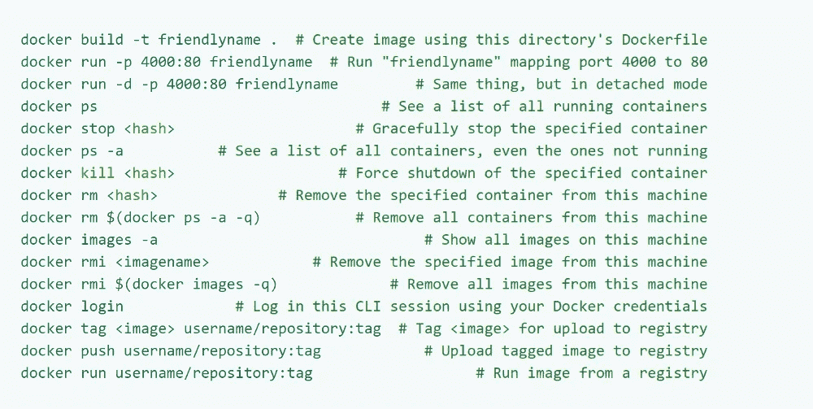

# 码头工人

> 原文：<https://medium.datadriveninvestor.com/docker-f0b8df21f003?source=collection_archive---------21----------------------->


向你致敬，所罗门·希克斯！他创造了这样一个杰作，他创办了一家公司，Docker，致力于使容器易于使用。随着 2014 年 6 月 Docker 1.0 在[的发布，引起了很大的反响。而且，这些年来，它只会增加。](https://www.zdnet.com/article/docker-1-0-brings-container-technology-to-the-enterprise/)

Docker 是一个容器管理服务。Docker 的关键词是**开发，船**和**运行**任何地方。Docker 的整个想法是帮助开发者轻松地开发应用程序，将它们装入容器中，然后可以毫无问题地部署到任何地方，这就是它更具可移植性的原因。

根据 Docker 的数据，这些年来，超过 350 万个应用程序被放置在使用 Docker 技术的容器中，超过 400 亿个容器化的应用程序被下载。现在人们可能会混淆容器和虚拟机。


过去，随着服务器处理能力及其容量的增加，裸机上的应用程序无法使用新的丰富资源。因此，虚拟机诞生了，它通过在物理服务器上运行不同的软件来模拟特定的硬件系统。虚拟机管理程序是创建和运行虚拟机的软件或硬件。

在每个虚拟机中运行一个独特的客户操作系统。具有不同操作系统的虚拟机可以在同一台物理服务器上运行，UNIX 虚拟机可以与 Linux 虚拟机并行运行，依此类推。每个虚拟机都有自己的二进制文件、库和应用程序，虚拟机的大小可能有数千兆字节。

操作系统(OS)虚拟化在过去十年中变得越来越流行，以使软件在从一个服务器环境移动到另一个环境时能够良好运行。但是容器提供了一种在单个服务器或主机操作系统上运行这些孤立系统的方法。

[](https://www.datadriveninvestor.com/2020/08/12/how-new-health-technology-makes-us-live-past-100-years/) [## 新的健康技术如何让我们活过 100 岁？数据驱动的投资者

### 不久前，我们都在看一台黑色电视，不得不带着天线跑遍整个公寓，以确保…

www.datadriveninvestor.com](https://www.datadriveninvestor.com/2020/08/12/how-new-health-technology-makes-us-live-past-100-years/) 

容器位于物理服务器及其主机操作系统(例如 Linux 或 Windows)之上。每个容器共享主机操作系统内核，通常还共享二进制文件和库。共享组件是只读的。因此，容器特别“轻”——它们的大小只有几兆字节，启动只需几秒钟，而虚拟机则需要几十亿字节和几分钟。

容器还减少了管理开销。因为它们共享一个通用的操作系统，所以只有一个操作系统需要维护，需要错误修复、补丁等等。简而言之，容器比虚拟机重量更轻，更便于携带。

虚拟机和容器在几个方面有所不同，但主要区别是容器提供了一种虚拟化操作系统的方法，以便多个工作负载/工作站可以在单个操作系统实例上运行。通过虚拟机，硬件被虚拟化以运行多个操作系统实例。容器的速度、灵活性和可移植性使它们成为另一种帮助简化软件开发的工具。

Docker 使开发人员能够轻松地将任何应用程序打包、运输和运行为一个轻量级、可移植、自给自足的容器，几乎可以在任何地方运行。现在有人可能会问，容器是怎么做到的？

容器通过允许开发人员将代码隔离到单个容器中来做到这一点。这使得修改和更新程序更加容易。正如 Docker 指出的，它也有助于大公司将大的开发项目分解成多个小的项目。

docker 有什么特点？

*   Docker 可以通过在容器上提供小版本的操作系统来减少开发规模
*   有了容器，跨不同单位的团队，比如开发、QA 和运营，跨应用程序轻松工作变得更加容易。
*   人们可以在任何地方，在任何物理和虚拟机上，甚至在云上部署 Docker 容器。
*   因为 Docker 容器非常轻量级，所以它们也是可伸缩的。

在 RHEL 7.6 中安装 docker:

1.  在此位置创建 docker . repo->/etc/yum . repos . d
2.  上述回购的内容应为:

```
[docker]
baseurl=[https://download.docker.com/linux/centos/7/x86_64/stable/](https://download.docker.com/linux/centos/7/x86_64/stable/)
gpgcheck=0
```

3.yum 安装 docker-ce - nobest

上面的命令将在您的 linux 系统中安装 docker。下面是各种命令的列表，用于检查一些不同的东西以及启动我们的 docker 系统。

1.  docker ps:这个命令用于列出系统中现有的 docker 容器。
2.  docker images:这用于找出存在的映像，这些映像属于所需的操作系统，可以使用 docker 容器安装。
3.  systemctl start docker:在 linux 系统中启动 docker 服务，之后我们可以使用上面列出的命令。
4.  docker pull ubuntu:这将从 docker 网站上拉 ubuntu OS 映像，以便在此之后，我们可以安装操作系统。
5.  rpm -q docker-ce:找出系统中安装的 docker 的版本。
6.  docker info:查找系统中安装的 docker 的详细信息。

下面我附上 2 张备忘单供你参考，你可以用它来测试一些基本的命令。



现在，我们将在本系列的下一部分深入探讨实用部分。

下次见，再见！

## 获得专家视图— [订阅 DDI 英特尔](https://datadriveninvestor.com/ddi-intel)