# 在 AWS 上整理和部署您的机器学习应用程序

> 原文：<https://medium.datadriveninvestor.com/dockerize-and-deploy-your-machine-learning-application-on-aws-e2537bd3df21?source=collection_archive---------1----------------------->

在我之前的[帖子](https://medium.com/datadriveninvestor/build-and-deploy-your-machine-learning-application-with-docker-f6ec5acdf2ff)中，我谈到了如何使用 Docker 封装你的机器学习应用程序，但不幸的是，我只能在我的机器上本地构建和部署该应用程序。在本文中，我将向您展示如何使用 AWS EC2 实例通过 AWS 将 dockerized 映像部署到云中。

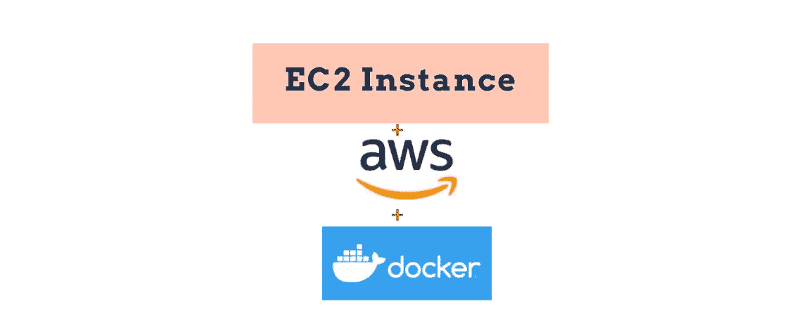

credit: Geekylane

# 将图像推送到 Docker Hub

第一步是将您的自定义映像推送到一个容器注册中心，在本例中，我将使用 Docker Hub。要使用 Docker Hub，你必须创建一个账户，你可以在这里做这个[。然后在您的终端上运行以下命令:](https://hub.docker.com/)

要检查本地的所有图像，请输入以下命令:

```
israel@israel:~$ sudo docker images
```

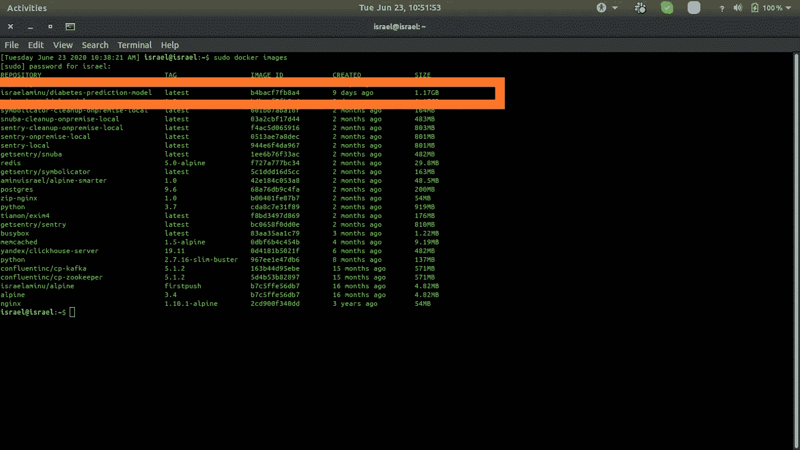

在这篇文章中，我将向 Docker Hub 推送的图片是*以色列/糖尿病预测模型。为了检查我是如何建立这个图像的，你可以在这里查看。*

[](https://www.datadriveninvestor.com/2020/02/19/cognitive-computing-a-skill-set-widely-considered-to-be-the-most-vital-manifestation-of-artificial-intelligence/) [## 认知计算——一套被广泛认为是……

### 作为它的用户，我们已经习惯了科技。这些天几乎没有什么是司空见惯的…

www.datadriveninvestor.com](https://www.datadriveninvestor.com/2020/02/19/cognitive-computing-a-skill-set-widely-considered-to-be-the-most-vital-manifestation-of-artificial-intelligence/) 

如果您是第一次这样做，您必须使用下面的命令登录 Docker Hub:

```
israel@israel:~$ sudo docker login --username=yourhubusername
```

接下来，复制该特定图像的图像 ID，并使用以下命令对其进行标记:

```
israel@israel:~$ sudo docker tag b4bacf7fb8a4 yourhubusername/model-deployment:latest
```

字母数字必须与该映像的映像 ID 相匹配，*your Hub username/model-deployment*表示您在 Docker Hub 上创建的存储库，`:latest`是标签。

然后使用您通过以下命令创建的存储库将您的映像推送到 Docker Hub:

```
israel@israel:~$ sudo docker push yourhubusername/*model-deployment*
```

您应该会看到以下输出:

```
The push refers to repository [docker.io/israelaminu/*model-deployment*]
dc29bdeebb3b: Pushed 
87397f1e0ca2: Pushed 
0b2a46dd78d7: Pushed
abe258d83872: Pushed 
21fe8a57cd01: Pushed 
0f3ecf0004ca: Pushed ...55109ad1bdfa: Pushed
46829331b1e4: Pushed 
d35c5bda4793: Pushed 
a3c1026c6bcc: Pushed
f1d420c2af1a: Pushed 
461719022993: Pushed 
latest: digest: sha256:221424ffd34434c7834504980b845889722d3aa1bed0535fe666dbae25072357 size: 3676
```

如果你去 Docker Hub，你会在你的存储库中看到你的 Docker 映像

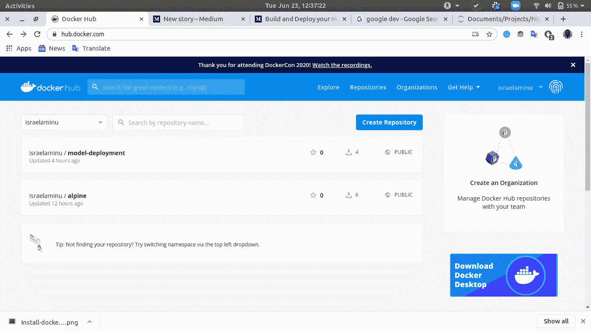

# 设置 AWS EC2 例程

登录 AWS 控制台仪表板，点击 **EC2**

滚动到启动实例并点击**启动实例**按钮

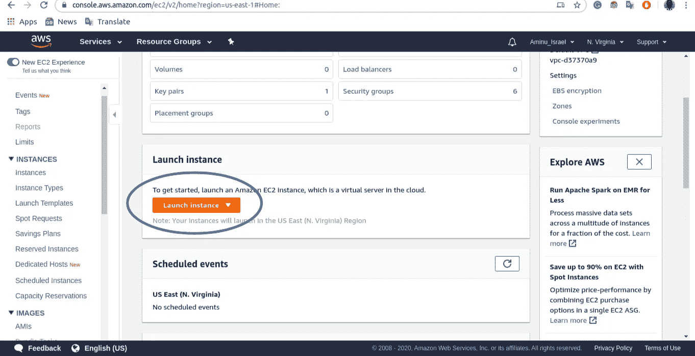

接下来，选择一个 Amazon 机器映像(AMI)，对于我的情况，我选择了**Amazon Linux AMI 2018 . 03 . 0(HVM)**，因为它具有所有的依赖项，并且是免费层，这意味着我可以以很少的成本或零成本运行实例。

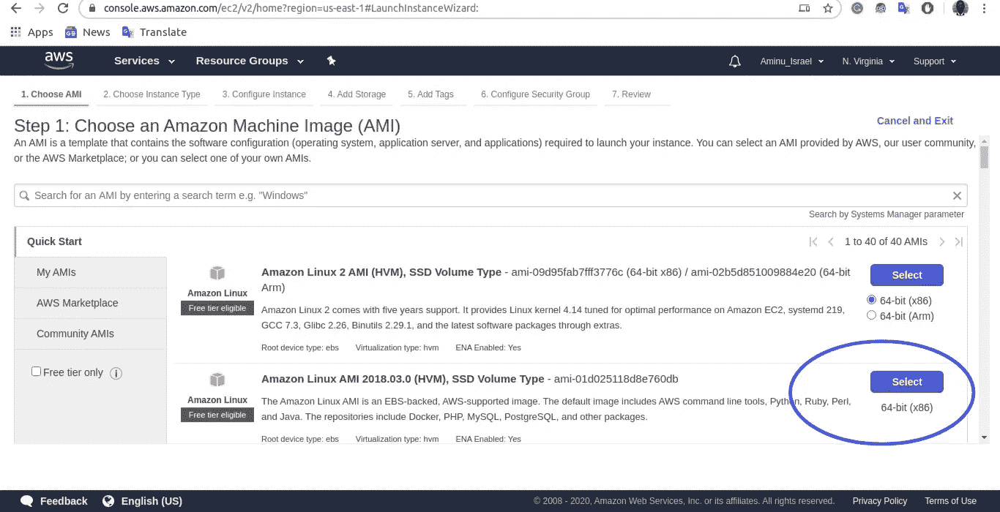

对于实例类型，我选择了通用的 t2.micro

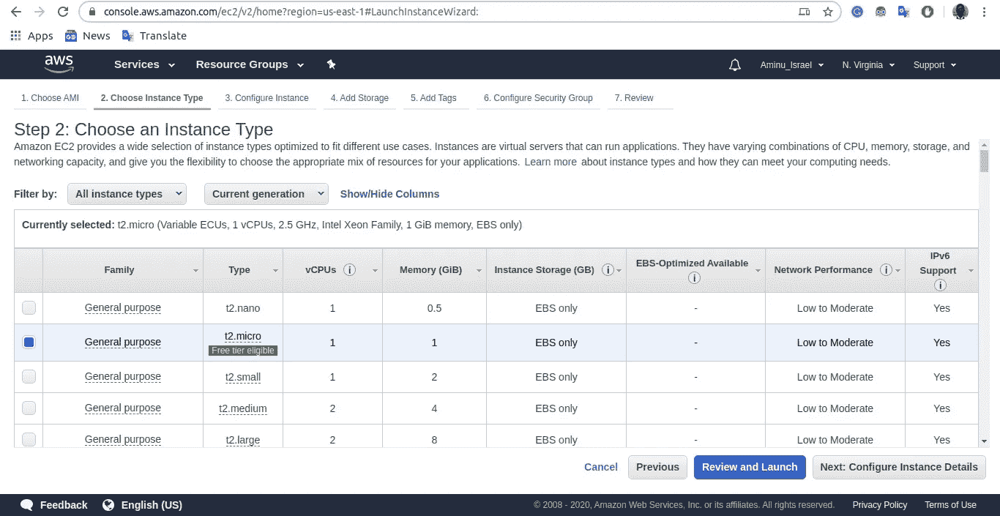

同样在配置安全组部分，我创建了一个新的安全组。SSH 允许我连接到我的机器上的实例，HTTP 将我的服务器 IP 路由到 DNS，以便我可以在任何地方访问 DNS。

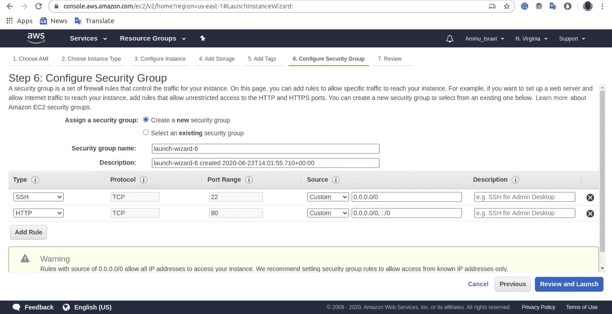

这些是我要做的配置。您也可以选择设置其他配置。

点击查看并启动。

系统将提示您创建或使用一个现有的对密钥，该密钥允许您通过 SSH 连接到本地机器上的实例。选择首选选项后，点击**启动实例**

您应该会看到下图:

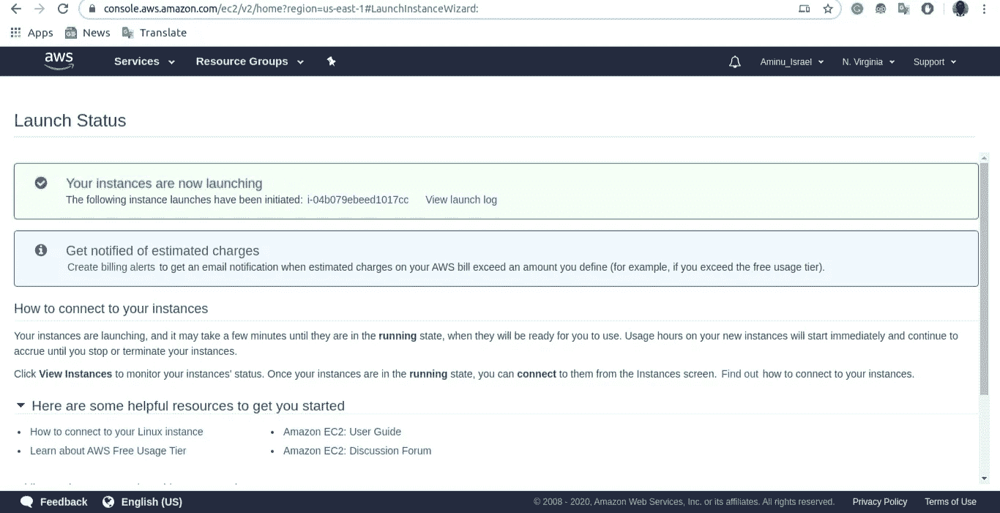

# 在 EC2 实例上运行 Docker 映像

使用下面的命令 SSH 到您机器上的 EC2 实例:

```
sudo ssh -i yourpairkey.pem [ec2-user](mailto:ec2-user@ec2-34-203-29-67.compute-1.amazonaws.com)@*my-instance-public-dns-name*
```

您将看到以下输出:

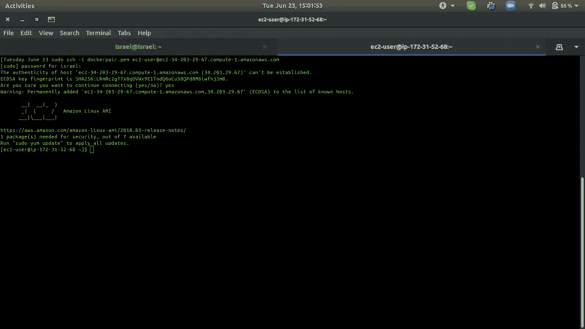

运行以下命令来更新实例包

```
[ec2-user@ip-172–31–52–68 ~]$ sudo yum update
```

安装 Docker:

```
[ec2-user@ip-172–31–52–68 ~]$ sudo yum install docker
```

安装完成后，将我们推送的 docker 映像拉至存储库。

```
[ec2-user@ip-172–31–52–68 ~]$ docker pull israelaminu/model-deployment:latest
```

您可能会遇到如下错误:

```
Cannot connect to the Docker daemon at unix:///var/run/docker.sock. Is the docker daemon running?
```

要解决这个问题，只需使用下面的命令:

```
[ec2-user@ip-172–31–52–68 ~]$ sudo service docker start
```

然后再拉图像。

您应该会看到以下输出:

```
latest: Pulling from israelaminu/model-deployment
7e2b2a5af8f6: Pull complete 
09b6f03ffac4: Pull complete 
dc3f0c679f0f: Pull complete 
fd4b47407fc3: Pull complete 
b32f6bf7d96d: Pull complete 
3940e1b57073: Pull complete 
cabba05798b6: Pull complete 
abe267d9b00c: Pull complete 
b327ce3e08b8: Pull complete 
7865c684e647: Pull complete 
29f11117a112: Pull complete 
0f5c2847ba27: Pull complete 
e36cccfef176: Pull complete 
3f1641cdd547: Pull complete 
9cbaf6cfc5c1: Pull complete 
865a221af195: Pull complete 
Digest: sha256:221424ffd34434c7834504980b845889722d3aa1bed0535fe666dbae25072357
Status: Downloaded newer image for israelaminu/diabetes-model-deployment:latest
docker.io/israelaminu/model-deployment:latest
```

通过运行以下命令确认映像已下载

```
[ec2-user@ip-172–31–52–68 ~]$ sudo docker images
```

输出:

要运行 Docker 映像，请使用以下命令:

```
[ec2-user@ip-172–31–52–68 ~]$ sudo docker run --name deploy_model -p 80:8080 israelaminu/model-deployment
```

您应该会看到以下输出:

```
Serving Flask app “app” (lazy loading)
 * Environment: production
   WARNING: This is a development server. Do not use it in a       production deployment.
 Use a production WSGI server instead.
 * Debug mode: off
 * Running on [http://0.0.0.0:8080/](http://0.0.0.0:8080/) (Press CTRL+C to quit)
```

现在，您的容器完全运行在 AWS 实例上

您可以使用实例的公共 DNS 在浏览器上测试 API，您将看到以下输出:

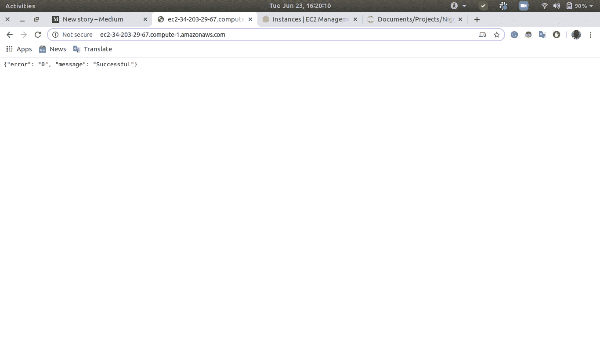

# 使用 POSTMAN 进行测试和预测

我通过传入特征和值来测试端点，以获得患者的糖尿病类型和置信度得分，它花费了 492 毫秒来返回响应，这是足够公平的。

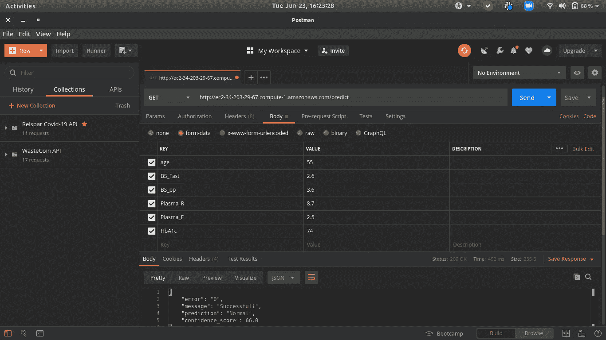

到目前为止，我们已经能够通过在 Docker 容器上运行它并在 AWS EC2 实例上托管它来部署机器学习模型。

**访问专家视图—** [**订阅 DDI 英特尔**](https://datadriveninvestor.com/ddi-intel)