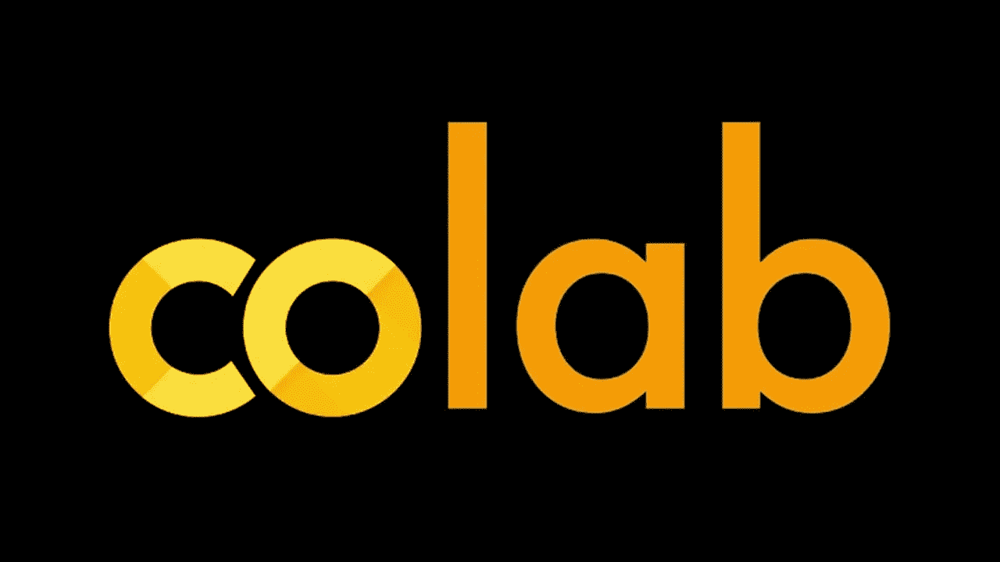
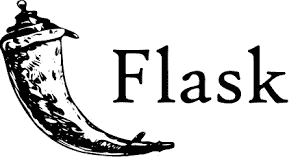
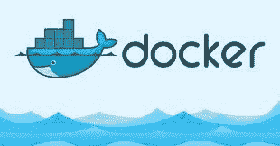
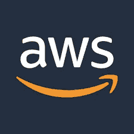

# 在 AWS EC2 上对接和托管您的 Flask Web 应用程序(Rest API)

> 原文：<https://medium.datadriveninvestor.com/dockerizing-and-hosting-your-flask-web-app-rest-api-on-aws-ec2-9f9c189bf563?source=collection_archive---------1----------------------->



# 议程:

1.  **训练和测试 DL 模型。**
2.  **创建一个烧瓶应用**
3.  **停靠**
4.  **AWS 上的主机**

# 要训练和测试 DL 模型:

1.获取数据集。上传到硬盘。

2.在 collab 上训练模型。检查精确度。检查不同笔记本的变量，例如 val_acc 和 val_accuracy。

3.用测试目录中的图片测试模型，看看它是否给出了令人满意的结果。

这里是我在 github 上的 [collab 笔记本的链接。](https://github.com/Soumi7/TFNotebooks/blob/master/TransferLYoga.ipynb)

从 Google Drive 下载保存的模型 **best1.h5** 。

将它保存在您想要测试推理逻辑的同一文件夹中。下面是我的 **tf_inference.py** 推理逻辑代码:

一旦成功运行，**使用相同的逻辑创建一个 Flask app** 。创建一个名为 **app_y.py** 的文件，在 **localhost:80** 上运行 app。

我的 github 上有完整的代码。:)

添加一个 helloworld 路径来检查它的运行。添加分类器路径以运行模型。它将一个图像作为输入，并将类名作为输出返回，这里是 yoga pose。

使用此命令在端口 80 上运行应用程序。

```
sudo python3 app_y.py
```

使用 CURL 请求检查应用程序是否正在运行。

```
curl -X POST [https://localhost:80/classifier/run](https://localhost:80/classifier/run) -F “data=[@tri2](http://twitter.com/tri2).jpg”
```

传递几个文件并检查。

在主文件夹中创建一个 docker 文件。

```
FROM python:3.6-slim
COPY ./app_y.py /deploy/
COPY ./requirements.txt /deploy/
COPY ./best1.h5 /deploy/
WORKDIR /deploy/
RUN pip3 install --no-cache-dir -r requirements.txt
EXPOSE 80
ENTRYPOINT ["python", "app_y.py"]
```

创建一个 requirements.txt 文件，添加包括系统版本在内的需求。像在 collab 笔记本内部一样检查它们:

```
python3
>>>import tensorflow as tf
>>>print(tf.__version__)
```

下面是我的 **requirements.txt** 代码:

```
jsonpickle
tensorflow==2.2.0-rc3
numpy
flask
Pillow
```

# 要获得 docker 图像



```
sudo docker build -t app_y-yoga .
```

现在，映像已经构建好，可以运行了。我们可以使用以下命令来实现这一点:

```
sudo docker run -p 80:80 app_y-yoga .
```

检查它是否运行并给出正确的输出:

```
curl -X POST [http://localhost:80/classifier/run](https://localhost:80/classifier/run) -F “data=[@tri2](http://twitter.com/tri2).jpg”
```

现在，如果你构建了一个容器，但在运行时遇到了一些问题，比如成功托管但 curl 不工作，那么删除 docker 容器。万一被拒绝，试试这个。lsof 命令给出了正在运行的进程的列表。

```
sudo systemctl daemon-reload
sudo systemctl restart docker
sudo lsof -i -P -n | grep 80
sudo kill <PID of process running on port 80>
```

# 在 AWS 上托管 docker 容器



登录 **AWS 控制台**，在搜索栏中搜索 **EC2** ，导航至 **EC2 仪表盘。**

从选项中生成一个**密钥对**，并使用以下命令更改权限:

```
chmod 400 <keyname>.pem
```

点击 **EC2 仪表盘**上的**启动实例**:

从选项列表中选择**亚马逊机器实例(AMI)** 。AMI 确定虚拟机将运行的操作系统。

我们使用 **t2.micro** 实例。

导航到**配置安全组**选项卡，添加一个**新规则** http，它自动取 80。

点击**查看并启动**。

启动图标将导致**弹出**，要求确认是否拥有密钥对。使用之前生成的密钥对的名称，并启动虚拟机。

单击查看实例。点击您的实例，复制右边下面给出的**公共 dns** 名称。

现在 **ssh** 从**本地系统** **终端**进入 **ec2 机器**，使用命令将字段 **public-dns-name** 替换为您的 **ec2 实例名**:

```
ssh -i SoumiBardhan.pem [ec2-user@](mailto:ec2-user@ec2-198-51-100-1.compute-1.amazonaws.com)**public-dns**-name
sudo amazon-linux-extras install docker
sudo service docker start
sudo usermod -a -G docker ec2-user
```

如果你从一个文件夹中上传文件，也要声明私有密钥:

```
chmod 400 <keyname>.pem
```

要将文件复制到 ec2 实例中，运行:

```
scp -i SoumiBardhan.pem file-to-copy ec2-user@**public-dns**:/home/ec2-user1
scp -i SoumiBardhan.pem app_y.py ec2-user@**public-dns**:/home/ec2-user1
scp -i SoumiBardhan.pem requirements.txt ec2-user@**public-dns**:/home/ec2-user1
scp -i SoumiBardhan.pem Dockerfile ec2-user@**public-dns**:/home/ec2-user1
scp -i SoumiBardhan.pem best1.h5 ec2-user@**public-dns**:/home/ec2-user1
```

现在，ssh 进入 Amazon VM，运行之前在系统上使用的相同 docker 命令:

```
sudo docker build -t app_y-yoga .
sudo docker run -p 80:80 app_y-yoga .
```

现在检查 curl 请求:

```
curl -X POST [ec2-user@](mailto:ec2-user@ec2-15-206-70-161.ap-socompute.amazonaws.com)**public-dns**/classifier/run -F "data=[@tri2](http://twitter.com/tri2).jpg"
```

所以 API 现在是活的。任何人都可以通过上面的 curl 请求访问它。

这里是 github 回购的[链接。如果你觉得有用，请留下一颗星。谢谢！](https://github.com/Soumi7/TransferL-Yoga-)