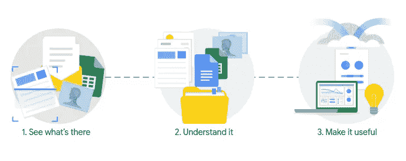
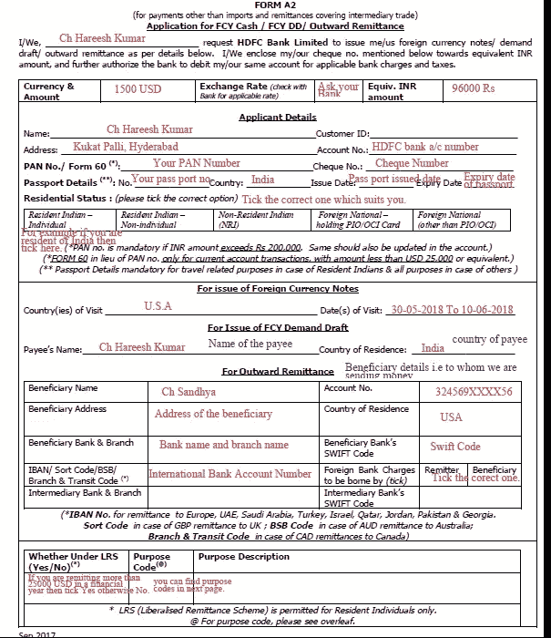
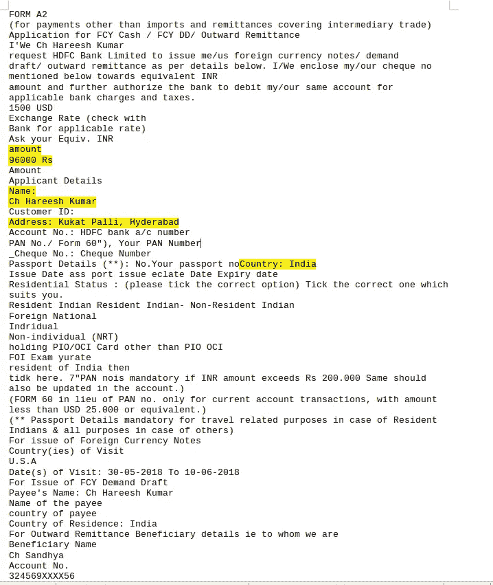
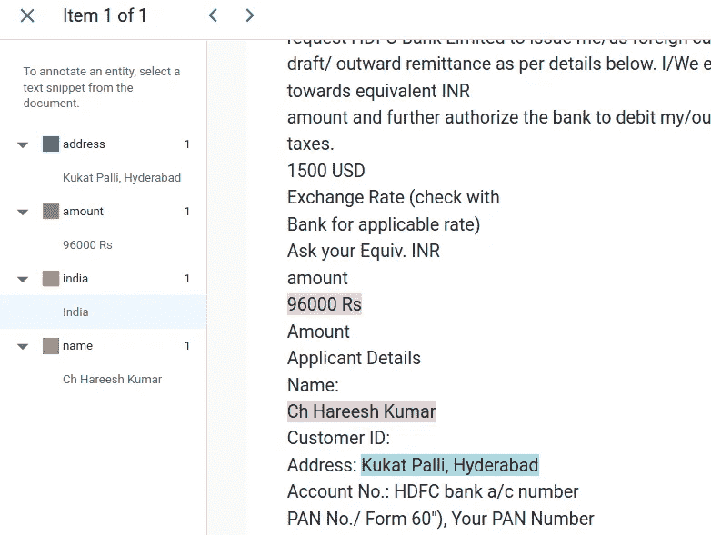
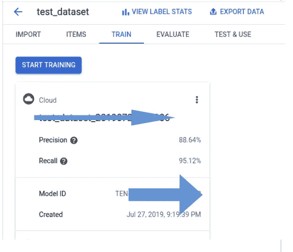
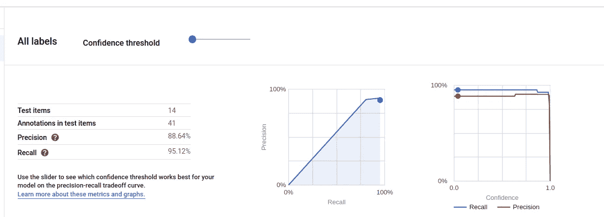

# 文档理解人工智能—谷歌云解释

> 原文：<https://medium.datadriveninvestor.com/document-understanding-ai-google-cloud-explained-193ae84cda75?source=collection_archive---------3----------------------->

嘿，伙计们，你们好。今天我将通过简单的步骤来讨论使用谷歌云的文档理解人工智能。我知道我知道你说有很多复杂性！！！。别担心，伙计们，谷歌云平台会让你的生活更轻松！！。此外，GCP 给你 300 美元免费的第一年！！！

让我们进入细节……..

贵公司是否有大量的 PDF 文件需要员工手工检查并输入数据库？

您是否希望使用人工智能自动完成这一过程，以便人工智能模型自动从文档中提取所需内容，并自动输入到您的数据库或表单中？

是啊！

你正在寻找一个可以促进你职业生涯的很酷的最后一年项目吗？

是啊！

那你就上对博客了！！！！！。跟着系列博文走就好了……

我们使用 AutoMl NLP API 从文档中提取有用的实体(文本内容)。这一系列博客文章详细讨论了以下步骤

1.使用 Google Cloud Vision API 准备您的训练数据集，并使用 Auto ML 实体提取 API 创建模型。

2.使用云函数创建数据管道，为模型生产做好准备！

我将在这篇文章中讨论第一步。所以系好你的安全带，我们要去兜风了。

**使用 Google Cloud Vision API 准备您的训练数据集，并使用 Auto ML 实体提取 API 创建模型。**

最初只需选择一个想要自动化的文档，并收集至少 150 个文档样本。

 [## 成为数据科学家所需的 8 项技能|数据驱动型投资者

### 数字吓不倒你？没有什么比一张漂亮的 excel 表更令人满意的了？你会说几种语言…

www.datadriveninvestor.com](https://www.datadriveninvestor.com/2019/02/07/8-skills-you-need-to-become-a-data-scientist/) 

然后选择您想要提取的实体，例如，您想要从该文档中提取**名称、金额、地址和国家/地区**。

现在，您将这 150 个文件传递给 Google Cloud vision API，并使用 python 代码( [code-1)生成文本文件。](https://github.com/TharunAts/Document_Understanding_AI/blob/master/code1.py)此外，您必须创建一个服务帐户来连接到 google cloud。

因此，为该文档生成的相应文本文件如下……..

现在，使用下面链接中共享的 python 助手函数( [code-2](https://github.com/TharunAts/Document_Understanding_AI/blob/master/code2.py) )将这些文件上传到 Google 云存储中

因为 AutoML API 期望 JSON 格式的输入，所以我们使用 python helper 函数将文本文件转换成 JSON 格式。

现在，您必须在 AutoML NLP 仪表板中创建一个数据集。创建仪表板后，您必须通过选择相应的存储桶来导入数据集。

现在，你可以在仪表板上看到所有的文本文件，你必须在所有 150 个文件中相应地标注姓名、金额、地址和国家，如下图所示。

一旦你完成了注释，点击仪表板上的训练按钮，模型将被自动训练。根据数据集的复杂程度，大约需要 4-5 小时。

创建模型后，您可以通过点击仪表盘中的 evaluate 来检查模型的准确性，并且可以通过使用仪表盘中显示的 Rest API 或 Python API 来使用此模型预测新数据。

***现在，通过使用该模型，您可以自动执行员工手动输入文档的繁琐任务。这个解决方案将节省宝贵的时间和金钱。***

在下一部分中，我将讨论如何使用云函数使这个模型可以投入生产，并可以在现实世界中使用。

GitHub 账号代码:【https://github.com/TharunAts/Document_Understanding_AI 

跟随@[https://www.linkedin.com/in/tharun-agaram/](https://www.linkedin.com/in/tharun-agaram/)

**参考文献:**

 [## 在线小批量文件注释|云视觉 API |谷歌云

### 在线(同步)请求-在线注释请求(图像:注释或文件:注释)立即返回…

cloud.google.com](https://cloud.google.com/vision/docs/file-small-batch)  [## 准备您的训练数据| AutoML 自然语言|谷歌云

### 要训练您的自定义模型，您需要提供要分析的文档类型的代表性样本，标记在…

cloud.google.com](https://cloud.google.com/natural-language/automl/docs/prepare)