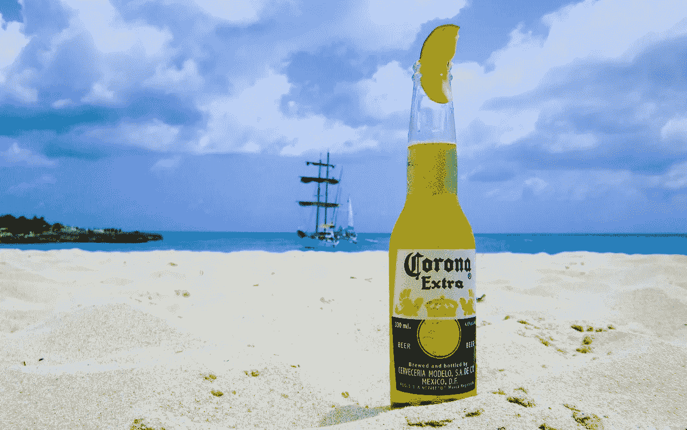
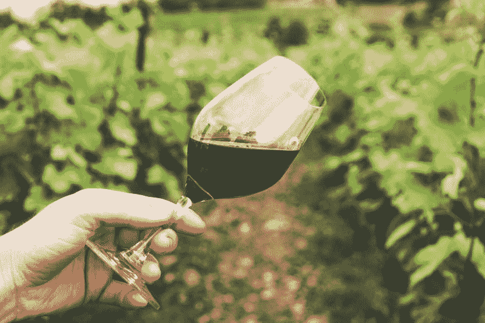
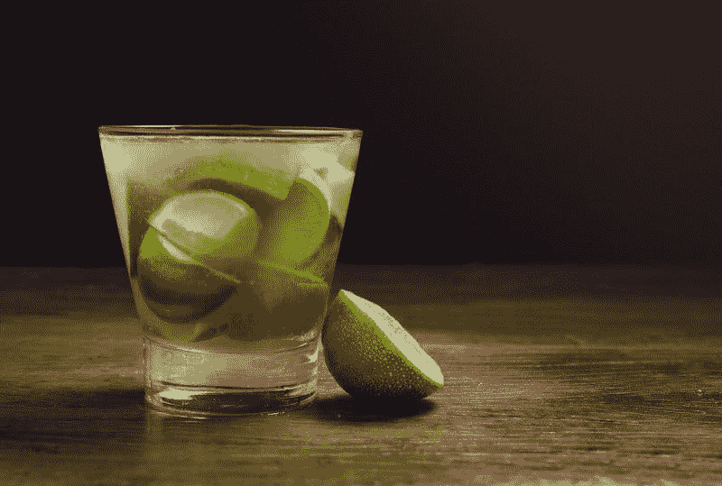
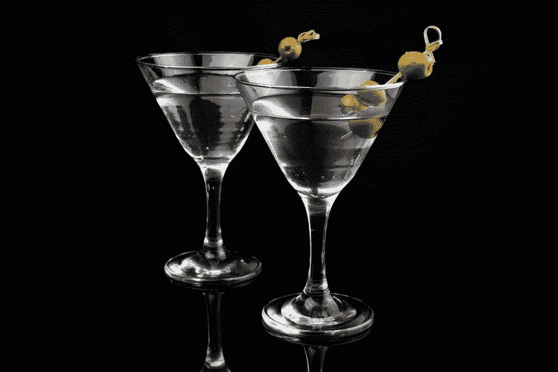
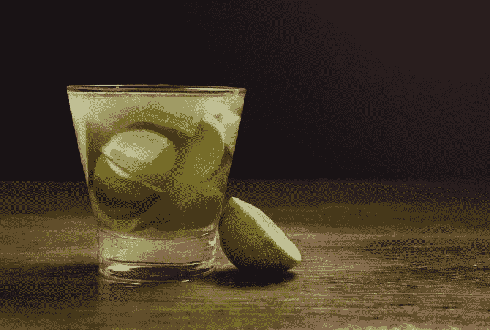
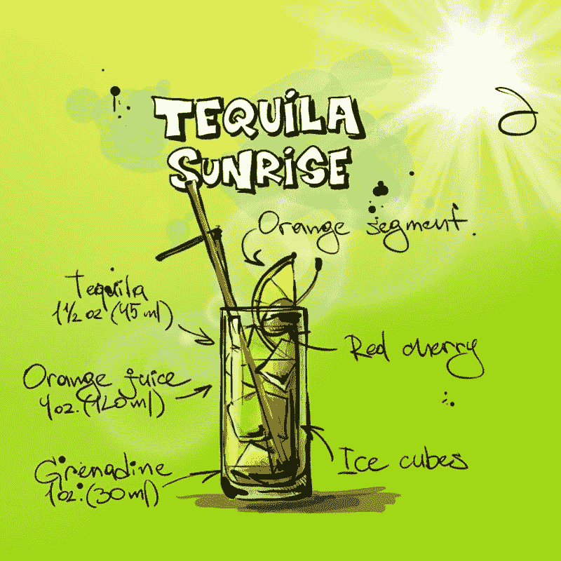
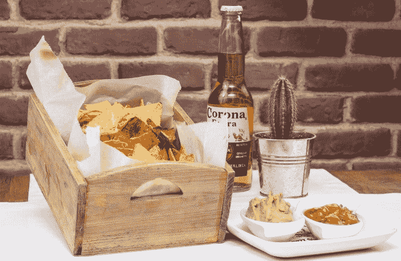

# 酒精在星座品牌赚钱吗？—市场疯人院

> 原文：<https://medium.datadriveninvestor.com/does-alcohol-make-money-at-constellation-brands-market-mad-house-a967b7ea4a80?source=collection_archive---------34----------------------->

星座品牌(纽约证券交易所:STZ) 显示酒类可能是一个不受疫情病毒影响的行业。

例如，Constellation 的季度收入从 2020 年 2 月 29 日的 19.02 亿美元增长到 2020 年 11 月 30 日的 24.38 亿美元。同样，Constellation 的季度营业收入从 2020 年 2 月 29 日的 5.451 亿美元增长至 2020 年 11 月 30 日的 7.831 亿美元。

此外，星座的季度毛利从 2020 年 2 月 29 日的 9.498 亿美元增长至 2020 年 11 月 30 日的 12.68 亿美元。有趣的是，**星座(STZ)** 的总利润、收入和营业收入都在增长，尽管收入增长在萎缩。

在截至 2020 年 2 月 29 日的季度中，星座的收入增长率为 5.88%。Stockrow 估计 Constellation 的季度收入增长率下降到[-2020 年 5 月 31 日为 6.38%，2020 年 8 月 31 日为 3.57%。然而，2020 年 11 月 30 日，季度收入增长率达到了令人印象深刻的 21.94%。](https://stockrow.com/STZ/financials/income/quarterly)

# 为什么星座品牌在疫情发展？

**星座品牌(STZ)** 显示冠状病毒有利于酒类销售。

新冠肺炎关闭了酒吧、餐馆和其他饮酒场所。然而，由于封锁，美国人对酒类消费的限制较少。

例如，一个在家喝酒的人不必担心酒后驾车。相反，你可以喝完这瓶酒，或者在家喝第二杯鸡尾酒。

此外，酒在家里更便宜。无需支付小费或酒吧费用。因此，一个通常喝一杯酒的人可以买一整瓶或六罐。

# 家庭酒精消费激增

家庭酒精消费正在蓬勃发展。*国际葡萄酒和烈酒记录* (IWSR)预测[2020 年美国网上酒类销售额将增长 80%](https://www.forbes.com/sites/chrisfurnari/2020/12/01/online-alcohol-sales-surge-amid-coronavirus-pandemic/?sh=50617e754f3a) 。IWSR 估计，美国在线酒类销售额可能从 2019 年的 30 亿美元增长到 2020 年的 56 亿美元。

注意:我认为网上酒类销售额可能会更大，因为这些数字不包括从酒吧订购的饮料。为了解释，许多美国酒吧和餐馆现在提供酒精饮料的取送服务。

此外，我认为 Constellation 的财务数据显示，美国酒类业务正从冠状病毒中复苏。2020 年 4 月，尼尔森估计[美国酒类销售需要 22%的销量增长](https://www.nielsen.com/us/en/insights/article/2020/rebalancing-the-covid-19-effect-on-alcohol-sales/)才能维持关闭酒吧带来的损失。

为了详细说明 Stockrow 的估计，Constellation Brands(STZ)[在截至 2020 年 11 月 30 日的季度中，收入增长了 21.94%](https://stockrow.com/STZ/financials/income/quarterly) 。因此，Constellation 的收入几乎以 22%的速度增长，尼尔森的专家认为这对复苏是必要的。

# 什么是星座品牌？

我认为**星座品牌(纽约证券交易所:STZ)** 已经做好了从酒精复苏中获利的准备。

例如，[星座的稳定产品包括](https://www.cbrands.com/brands):受欢迎的科罗纳啤酒、科罗纳萨尔茨、米坎波龙舌兰酒、卡萨贵族龙舌兰酒、莫德罗啤酒、时髦佛、金克劳馥葡萄酒、罗伯特蒙达维葡萄酒、鲁菲诺葡萄酒、库珀&贼葡萄酒、七月葡萄酒、黑丝绒威士忌、斯韦德卡伏特加、纳尔逊的绿石南波旁酒等等。

我认为 Constellation Brands 在从冠状病毒中获利方面处于有利地位，因为它专注于优质酒精品牌。解释一下，我认为人们会在家里购买和饮用更多的高级酒，因为他们可以在酒上花更多的钱。

此外，Constellation 的一些产品，如 SVEDKA 伏特加和龙舌兰酒，是美国人最喜欢的烈性酒。因此，星座有美国人想要的酒。此外，科罗纳是最受欢迎的啤酒之一。

# 星座品牌赚钱吗？

**Constellation(纽约证券交易所代码:STZ)** 从其业务中产生现金。例如，Constellation 报告 2020 年 11 月 30 日的季度运营现金流为 9.19 亿美元。

2020 年，Constellation 的季度运营现金流从 2020 年 2 月 29 日的 4.75 亿美元增长到 2020 年 5 月 31 日的 6.87 亿美元和 2020 年 8 月 31 日的 7.484 亿美元。然而，2020 年 11 月 30 日，Constellation 的季度期末现金流为-5170 万美元。

值得注意的是，Constellation 在 2020 年仅报告了一个正的季度末现金流，即 2020 年 5 月 31 日的 302.80 美元。相比之下，Constellation 报告 2020 年 2 月 29 日的季度末现金流为-1.23 亿美元，2020 年 8 月 31 日为-9820 万美元。

然而，Constellation 报告称，2020 年全年的季度融资现金流为负值。例如，2020 年 11 月 30 日为 7.826 亿美元。我觉得那说明星座在还债。

因此，Constellation Brands 的长期债务总额从 2020 年 2 月 29 日的 112.11 亿美元降至 2020 年 11 月 30 日的 104.16 亿美元。

# 星座品牌有什么价值

我质疑**Constellation Brands(STZ)**的价值，因为它在 2020 年 11 月 30 日只有 1.529 亿美元的现金和短期投资。

然而，星座品牌在 2020 年 11 月 30 日的总资产为 276.31 亿美元。2020 年，星座资产总额从 2020 年 2 月 29 日的 273.23 亿美元。

另一方面，我考虑**星座品牌公司** **(纽约证券交易所代码:STZ)。**高估。例如，市场先生在 2021 年 1 月 13 日支付了 224.57 美元购买星座股票。2020 年，STZ 股价从 2020 年 1 月 12 日的 216.74 美元。

我无法想象一家市值 276.31 亿美元的公司每股价值 224.57 美元。然而，星座品牌是一个优秀的分红股票。

# 星座品牌是一个优秀的收益股

例如，Constellation 将在 2021 年 2 月 23 日支付 75 英镑的股息。Dividend.com 报道星座品牌已经支付了超过一年的的 [75 股息。总体而言，2021 年 1 月 12 日，Constellation 提供了 3 美元的年化股息和 1.31%的股息收益率。](https://www.dividend.com/stocks/consumer-staples/consumer-products/beverages/stz-constellation-brands-inc/)

归根结底，我认为**星座品牌(STZ)** 是一只安全边际很高的优秀收益股。我认为星座品牌有很高的安全边际，因为对其产品酒精的需求永远存在。

此外，我认为我们生活的黑暗和疯狂的时代将增加对该产品的需求。解释一下，如果你现在没有理由喝酒，你需要做的就是浏览一下新闻。看完新闻你会伸手去拿最近的瓶子。

如果你想要一支高收益股票或一家疫情证明的消费品公司，看看星座品牌吧。

*原载于 2021 年 1 月 13 日 https://marketmadhouse.com**的* [*。*](https://marketmadhouse.com/does-alcohol-make-money-at-constellation-brands/)