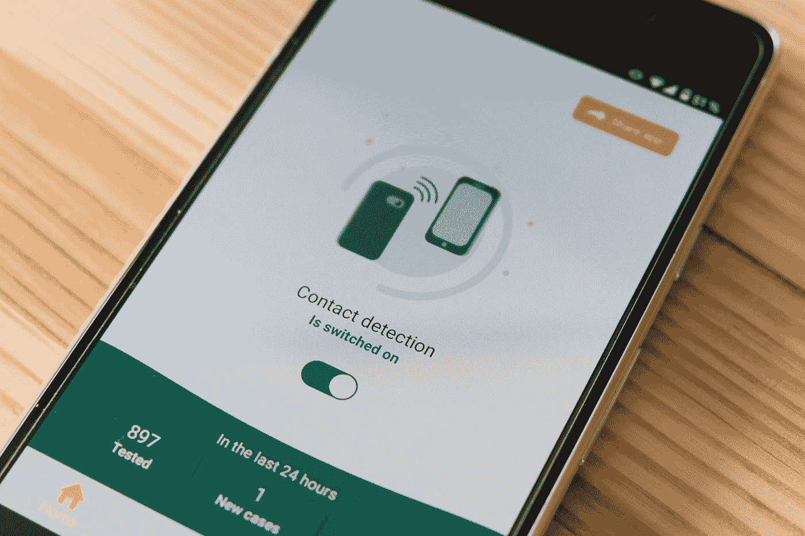
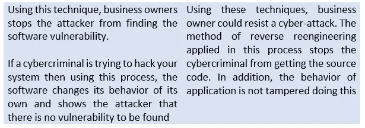

# 2020 年真的需要应用硬化吗？如果是为什么？

> 原文：<https://medium.datadriveninvestor.com/does-application-hardening-is-really-needed-in-2020-if-so-why-f6898b37bd49?source=collection_archive---------21----------------------->

Photo by [Markus Winkler](https://unsplash.com/@markuswinkler?utm_source=medium&utm_medium=referral) on [Unsplash](https://unsplash.com?utm_source=medium&utm_medium=referral)

大多数软件专业人士认为**应用强化**是软件开发过程中非常重要的一部分。当**应用加固**实施后，网络犯罪分子很难进行以下活动:

1.发现很难找到源头。

2.发现很难找到软件漏洞并用恶意代码替换它。

3.不能让应用环境有毒。

随着时间的推移，网络罪犯变得越来越聪明。表明他们正在寻找新的策略，通过暴露您的软件漏洞来窃取您的机密信息。谢天谢地，有一些解决办法来抵制它。这些解决方案被称为**应用强化**

现在**应用强化**分为两个部分，一部分称为**被动强化**，另一部分称为**主动强化**。让我们详细分析一下这两个硬化过程，以便有更好的理解。

如果您决定强化您的应用程序，那么您必须通过两个主要级别。一种称为基本强化应用，另一种称为全面强化或屏蔽。

对于不涉及敏感信息使用的低价值应用程序，在中进行基本强化。另一方面，对涉及敏感信息或高价值应用的应用进行屏蔽。

**底线**

**安全性**是一个持续的威胁，而**应用程序的强化**有助于最小化该问题。仔细阅读上面的信息会让你知道，为什么加强应用程序是必要的。