# BancorpSouth Bank 有担保马债吗？

> 原文：<https://medium.datadriveninvestor.com/does-bancorpsouth-bank-have-a-collateralized-horse-obligation-eb94b07a7c03?source=collection_archive---------0----------------------->

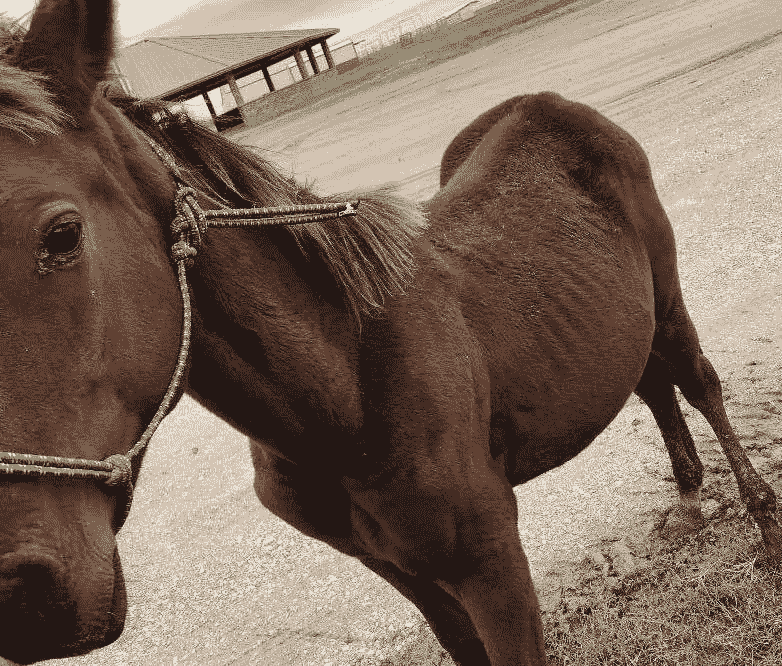

A young horse allegedly of the same herd heavily secured by BancorpSouth Bank. Source: Facebook.

## BancorpSouth Bank 的投资者有一些被视为资产的新马，据称它们正在挨饿——尽管该银行似乎在苦苦挣扎…

安科南方银行( [**纽约证券交易所:BXS**](https://finance.yahoo.com/quote/BXS/) **)** 是上周创下 52 周新低的众多上市公司之一。他们总部位于密西西比州的图珀洛，通过收购其他银行不断发展壮大，目前是美国第 84 大金融机构(就管理的资产而言)。

其中一项收购使 BXS 首次在俄克拉荷马州杜兰特市设立了一家非存款、贷款处理分支机构，该分支机构位于得克萨斯州边境以北。上周，一篇社交媒体报道浮出水面，将杜兰特分行和 BXS 最近报道的对其新资产的评估与一些非常饥饿的马联系起来。

 [## 算法交易的机器学习|数据驱动的投资者

### 当你的一个朋友在脸书上传你的新沙滩照，并且平台建议给你的脸加上标签，这是…

www.datadriveninvestor.com](https://www.datadriveninvestor.com/2019/01/30/machine-learning-for-stock-market-investing/) 

就在几英里以北，俄克拉荷马州的卡多。一名自称是牧场“杜福尔表演马”的[前雇员的女子声称，她在四年后“于 2019 年底”辞职。这名员工表示，她没有被允许妥善照顾牛群。帖子中严重营养不良的马的照片(见下图)据称是杜福尔组织拥有的。](http://www.d3quarterhorses.com/)

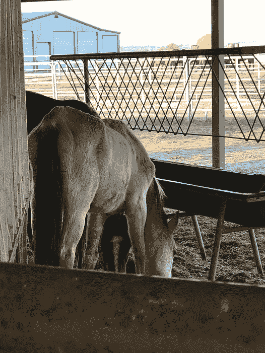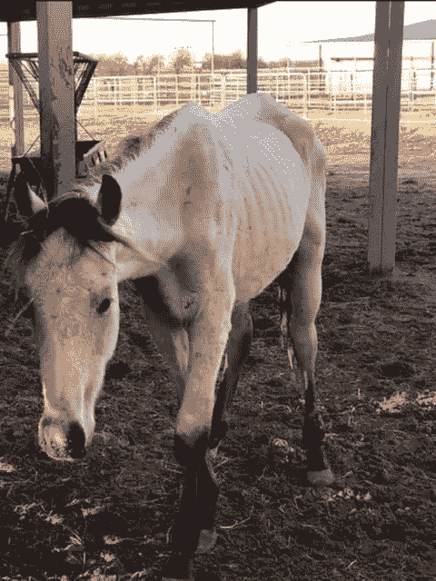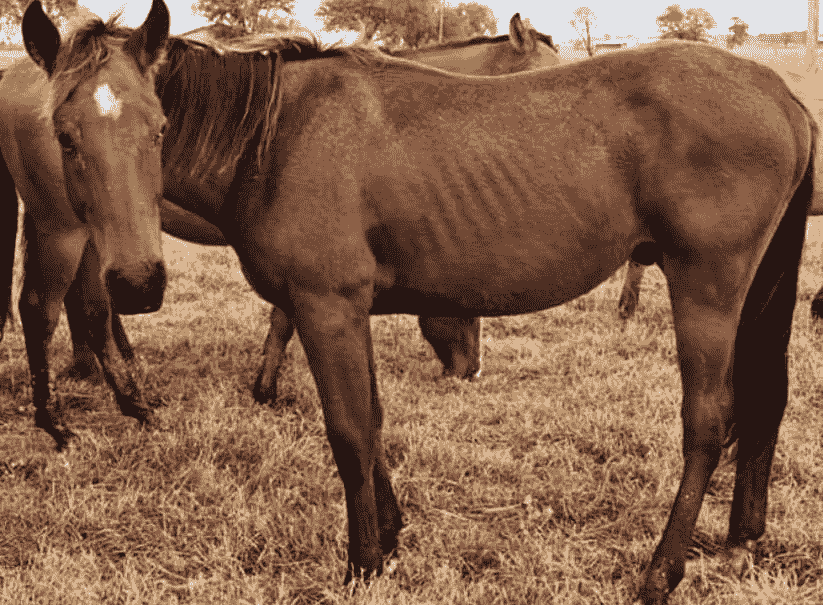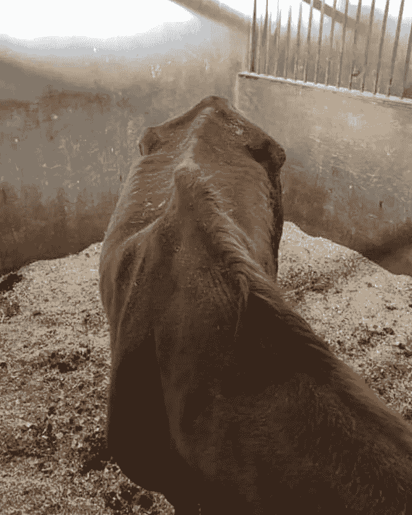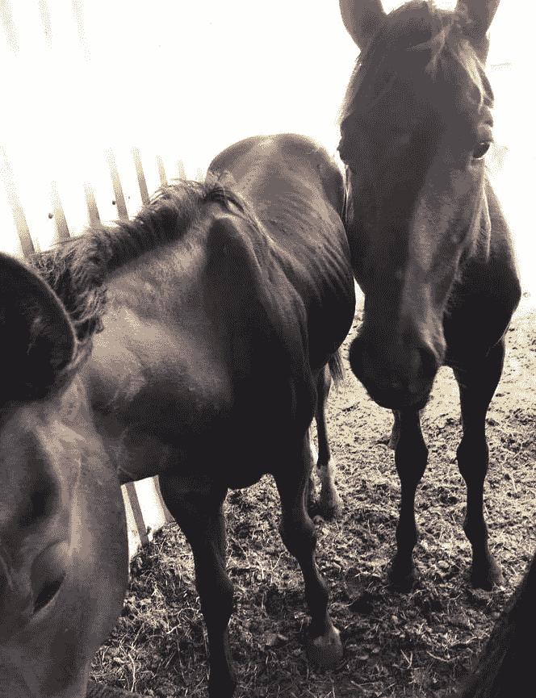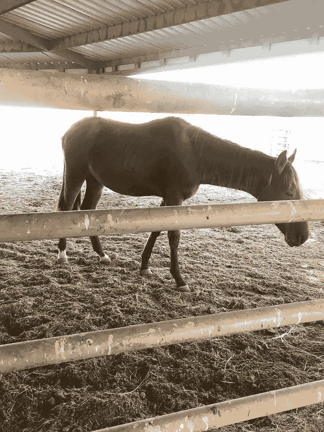

Photos of horses allegedly owned by the Dufur Ranch. Source: Facebook.

这种特殊的联系起源于去年南方银行收购德克萨斯州 Van Alstyne 的“德克萨斯明星银行”。根据 Van Alstyne 领导人的说法，“德克萨斯之星银行于 1890 年在 Van Alstyne 成立(作为 Van Alstyne 的第一家国家银行),并已扩展到包括 Collin 和 Grayson 县的七家提供全面服务的银行办事处和在 Durant 的一家贷款生产办事处，该办事处还在俄克拉荷马州南部开设了一家 BancorpSouth 门。”

UCC 向俄克拉何马州提交的文件指出，这家特定的农场确实用他们的马作为担保，从德克萨斯之星获得了三笔单独的贷款。在四份文件中(见下文)，四份相关的 UCC 文件中列出的地点显示，当时的德克萨斯之星和现在的 BXS 的杜兰特“贷款处理”分行记录了这些预付款。该农场的所有者艾伦和泰瑞·哈珀·杜福尔(一对已婚夫妇)被列为借款人。

文件上没有终止贷款的记录表明，它们也拥有并仍在偿还贷款。

杜福尔对借钱并不陌生，他曾经是杜兰特第一国民银行的行长。然而，1998 年，他两次受到美国货币监理署的制裁。根据[的法庭文件](https://caselaw.findlaw.com/ok-supreme-court/1340777.html)，“杜福尔欺诈性地诱使(一名借款人)签署协议，并(法院裁定)在她对银行的过失反诉中有利于(借款人)。”

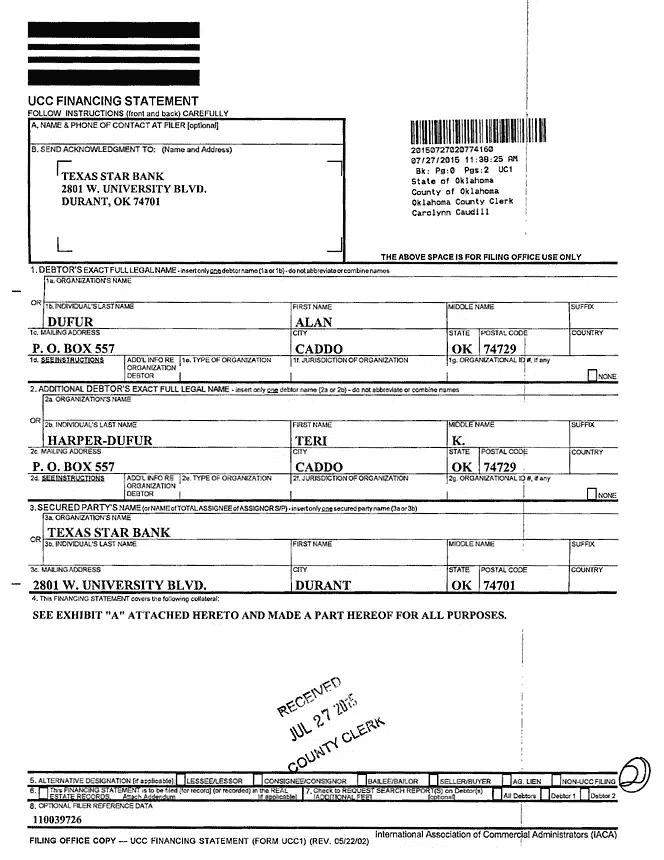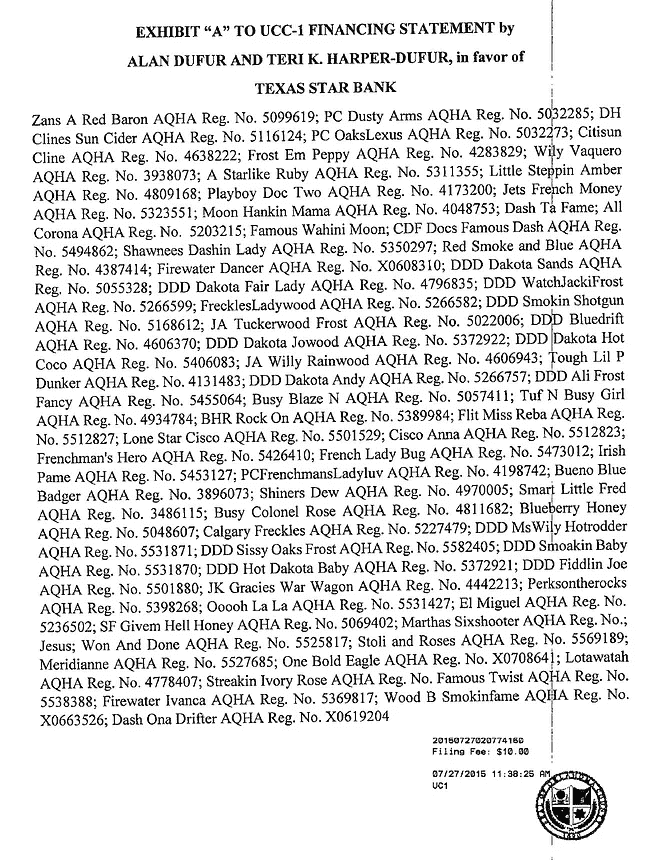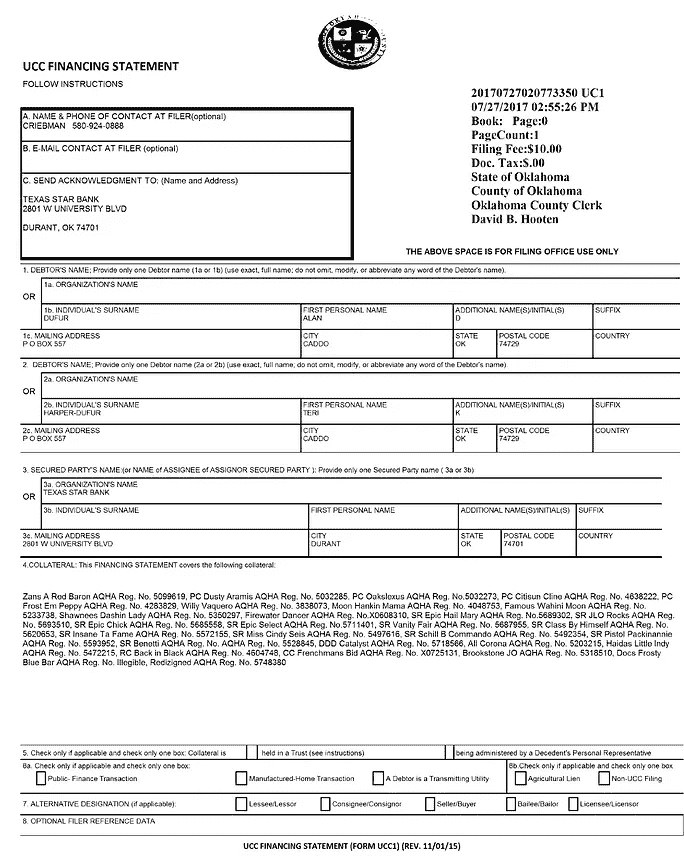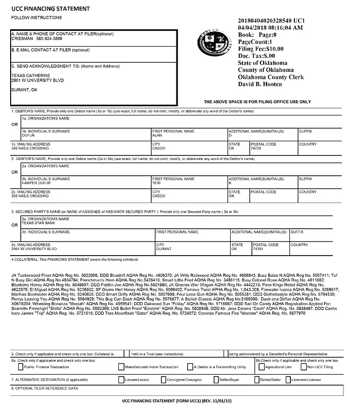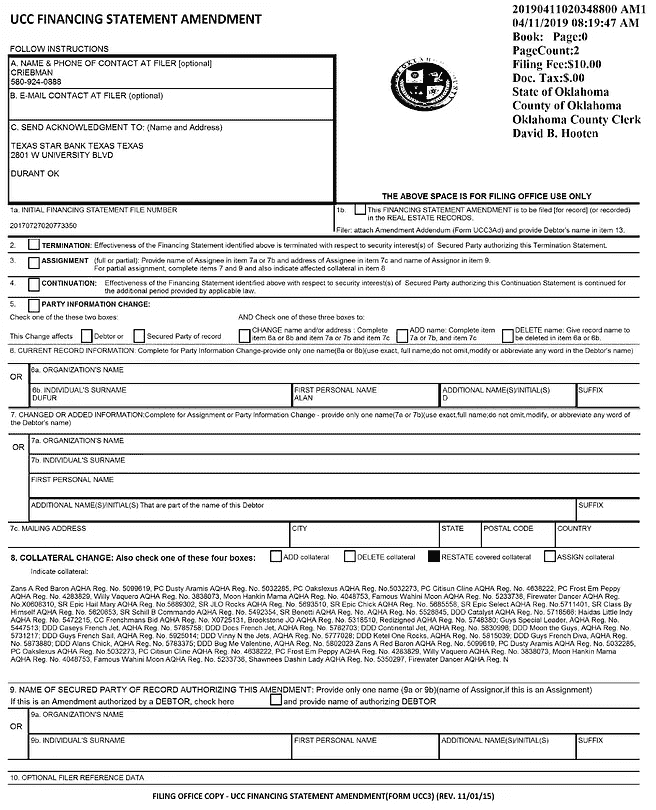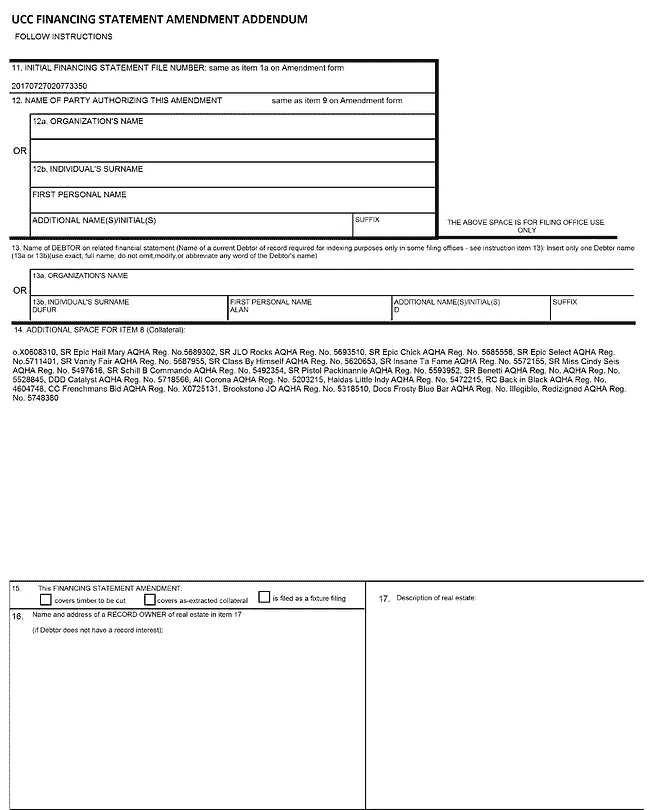

UCC Filing noting names and registration numbers of horses owned (borrowed against) by Teri and Alan Dufur. Source: State of Oklahoma.

## BancorpSouth Bank 的业绩

对 BXS 和一些同行(持有 150-250 亿美元资产)过去一年的价值波动进行随机抽样调查，结果令人担忧。数据显示，BXS 的价值就像这些马的谷物和干草一样缺乏。

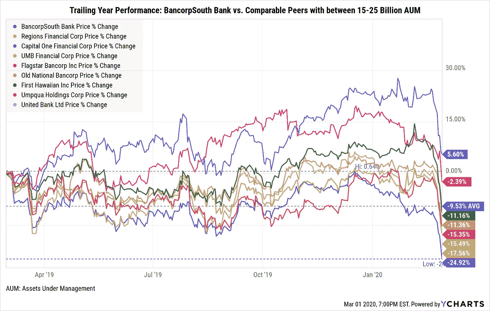

## 德州明星的收购

相比之下，这些银行看起来非常不同，它们的估值也相差甚远。因此,《德克萨斯之星》的股东们得到了丰厚的回报。然而，这一收购可能破坏了许多小城镇的关系，也可能支撑了一些高风险的贷款。

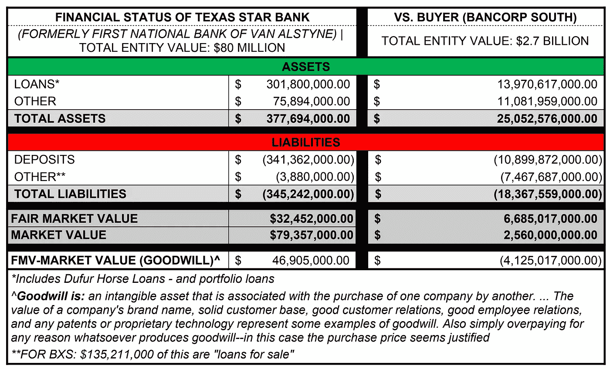

Information gleaned from BXS’s 10-K filing released on 2/27/20

俄克拉荷马州 UCC 的[文件](https://www.oklahomacounty.org/296/Registrar-of-Deeds-UCC-Search)列出了十几项针对杜福尔夫妇和相关实体的其他贷款，但唯一一家(在数据库中)批准这对夫妇以马为抵押的贷款的银行是德克萨斯之星。

德州之星已经为杜福尔拥有的实体提供了至少三笔贷款，比如下面看到的高效燃料解决方案有限责任公司的贷款，以及应用能源解决方案公司的贷款。

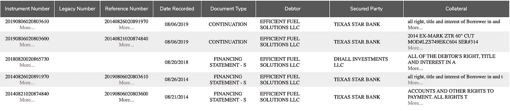

Loans by Texas Star to Dufur-owned Efficient Fuel Solutions LLC. Source: State of Oklahoma.

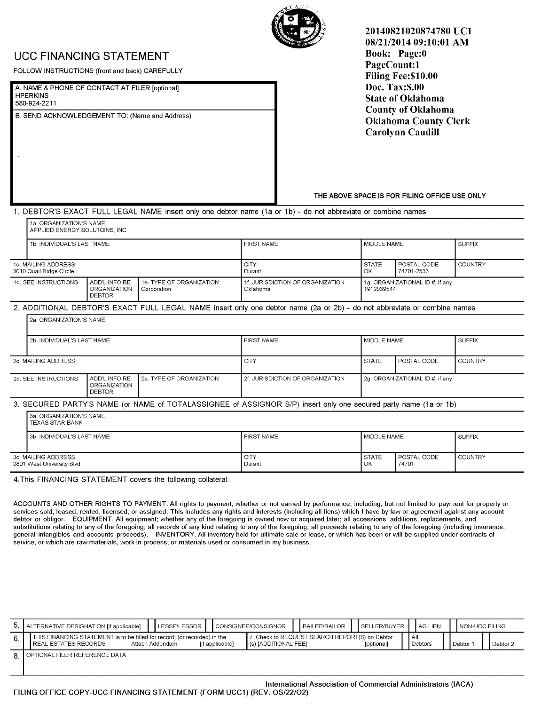

Applied Energy Solutions Inc.’s Receivables Loan. Source: State of Oklahoma.

*(根据备案文件，杜福尔及其相关实体似乎以数十家关联企业和个人资产的名义进行了杠杆贷款，这些资产涉及包括一架飞机在内的不同抵押品；但是，那架飞机是 2019 年 12 月卖出的，* [*据 flightaware.com*](https://flightaware.com/resources/registration/N211SG)*。)*

从更宏观的角度来看，同一份文件显示，德州之星发放的许多贷款涉及风险更高的抵押品或“组合贷款”。

上周，BancorpSouth Bank 向联邦存款保险公司(FDIC)发布了年度投资者备案文件(又称“10-K 表格”)。在文件中，这家大银行表示，它计划评估其新收购的资产和抵押品。具体而言，它指出:

> “自 2019 年 9 月 1 日起，本公司完成了对 Van Alstyne Financial Corporation 及其全资子公司 Texas Star Bank(统称为“Texas Star”)的收购，据此，Texas Star 与本公司合并。Texas Star 在德克萨斯州的 Collin 和 Grayson 县经营着七家提供全面服务的银行办事处，在俄克拉荷马州的 Durant 经营着一家贷款生产办事处。根据最终协议的条款，该公司发行了约 2，100，000 股该公司的普通股，外加 2140 万美元的现金用于购买 Texas Star 的所有已发行股票。有关收购德州之星的更多信息，请参见本报告其他地方包含的公司合并财务报表附注 2。”

然后他们继续说，*现在，在*收购之后，他们会看看抵押品。具体而言，该文件称:

> 由于公司对合并后活动的评估以及正确记录收购资产和负债所需的大量信息收集和管理审查流程，公司**认为其对德克萨斯之星资产和负债的估价是临时的**，因为管理层继续**识别和评估关于这些资产**和负债的性质的信息，以进行相关的估价假设和使用的方法。"

在通过电话提出的置评请求中，杜兰特分公司的一名员工表示他们无可奉告；然而，她允许我给杜兰特分部的总裁留个口信。这条信息还没有被回复。

我还与一位从事农业金融，特别是保险方面的秘密消息人士和专家进行了交谈。他指出，“从根本上说，在银行业，这些小的本土银行正在努力维持运营，以满足所有的联邦法规等等，如多德-弗兰克法案。然而，对于小公司来说，他们必须加入老大哥，不幸的是，加入老大哥意味着它无法轻松提供组合贷款，而当地社区，包括农民、饲料商店和机械商店都依赖组合贷款蓬勃发展。”

这位专家补充道，“经营一个农场所需的资本投资是巨大的！而他们*需要*这些小额组合贷款。可悲的是，在这种情况下，似乎杜福尔斯只是一个“烟雾和镜子”的操作，鸡是回家休息。”然而，消息人士补充说，后一种意见当然是“*知情的猜测。”*

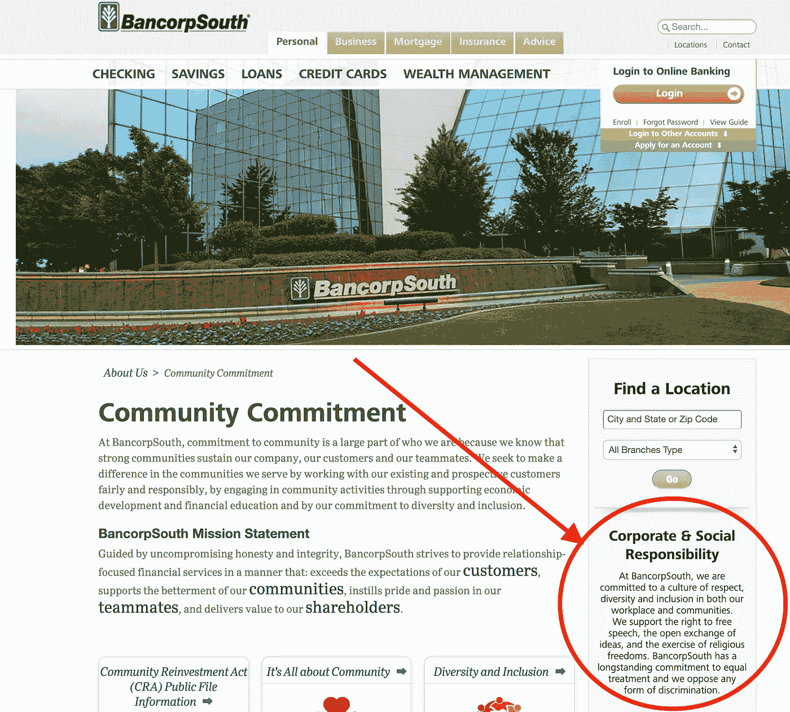

BancorpSouth 的网站上有一份“企业和社会责任”声明，内容如下:

> “在 BancorpSouth，我们致力于在工作场所和社区营造尊重、多元化和包容的文化。我们支持言论自由、公开交流思想和行使宗教自由的权利。BancorpSouth 长期致力于平等对待，我们反对任何形式的歧视。”

尚不清楚“平等待遇”是否适用于动物。尽管如此，如果这确实是 BancorpSouth 的抵押品:那么这家大型城镇银行想办法给这些马提供一些食物，可能符合其投资者的最大利益(他们依赖抵押品，因此 BXS 股票保持其价值)。