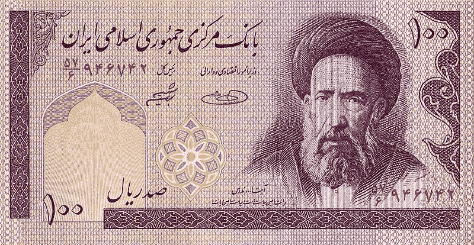

# 比特币在伊朗和第三次世界大战中有什么作用吗？

> 原文：<https://medium.datadriveninvestor.com/does-bitcoin-have-any-part-in-iran-and-world-war-3-8e094a35ea10?source=collection_archive---------5----------------------->

Iran Rial / Fiat Currency

目前，比特币价格低于 8000 美元。这一最新数据显示了加密货币资产的强劲收益，但这与伊朗将军卡西姆·索莱曼尼被杀有什么关系吗？

法定货币面临通货膨胀，这适用于所有世界货币，对于一些市场分析师来说，突然飙升是为了确保人们不会因为国家经济突然出现问题而贬值。

> 比特币不面临通胀问题。像伊朗里亚尔和美元这样的法定货币。
> 
> 战争会导致高通货膨胀，因此，投资者必须采取措施，使他们的投资组合免受通货膨胀的影响。——【https://www.gold-eagle.com/article/war-and-inflation 

传统上，黄金和其他稀缺资产会是许多投资者对冲的对象，然而，随着比特币等加密货币的出现，市场和人们有了更多的选择，比特币也参与了进来吗？老实说，这将取决于你如何看待比特币及其相关性。

询问 [UniDAX 交易所](https://www.unidax.com/index/en_US/index.html)团队，他们的意见是比特币和 10%、20%甚至 50%的价值变化在其历史上频繁发生，许多指标构成了整体变化。

 [## Azbit 旨在连接传统金融和加密货币|数据驱动的投资者

### Azbit 是下一个提供交易平台的加密项目，该平台提供保证金和算法交易。一样多…

www.datadriveninvestor.com](https://www.datadriveninvestor.com/2019/03/20/azbit-aims-to-connect-traditional-finance-and-cryptocurrency/) 

对于伊朗来说，比特币可能是一种抵御通胀问题的可行方法，因为它可以保护他们的财富免受当地里亚尔可能出现的问题的影响。然而，也必须指出，比特币和所有其他加密货币一样，价值会不断下跌和上涨，原因很难解释。

当被问及即将到来的可能性时，加密领域的顶级人物和银河数码公司的首席执行官迈克尔·诺沃格拉茨说:

> “我对伊朗的形势分析得越多”，黄金和比特币的前景就越乐观。
> 
> “中东不太稳定，”诺沃格拉茨在推特上说。“等于更大的波动。”

如果任何国家之间爆发战争，资产风险和法定通货膨胀只是开始，比特币是一个安全的赌注，还是传统的黄金类型投资将继续占据主导地位？

只有时间能证明一切。

[**全篇在此。**](https://blog.desiairdrops.com/will-war-cause-a-ripple-effect-for-bitcoin-and-other-world-currency/)