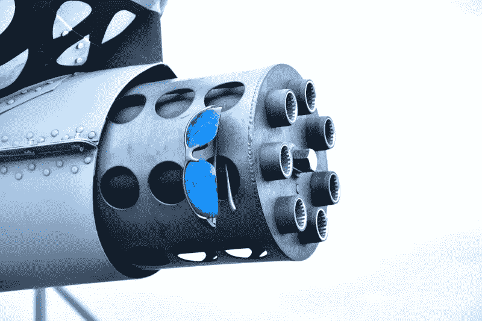

# 无休止的战争在通用动力公司有报酬吗？—市场疯人院

> 原文：<https://medium.datadriveninvestor.com/does-endless-war-pay-at-general-dynamics-market-mad-house-1a753e71289d?source=collection_archive---------10----------------------->

美国在中东和其他地方无休止的战争可能会给通用动力公司的投资者带来回报。

通用动力公司为美国军方制造各种武器系统和弹药。例如，通用动力[声称](https://www.gd-ots.com/)是美军炮弹的主要生产商。

通用动力公司制造的重型[武器](https://www.gd-ots.com/armaments/)包括用于战斗机和直升机的加特林机枪、用于直升机的机枪、用于坦克和其他车辆的加农炮、Hydra070 系列非制导火箭和海军火炮。通用动力公司制造的轻武器包括:机枪、榴弹发射器和步兵用的加特林机枪。

通用动力公司制造的车辆包括 M-1 艾布拉姆斯坦克、Stryker 战车和 AJAX 轻型装甲战车。通用动力公司的另一个产品是轻型战术车辆 Flyer 系列。

 [## 数据驱动投资的兴起|数据驱动投资者

### 当 JCPenney 报告其 2015 年 2Q 的财务结果时，市场感到非常震惊。美国零售巨头…

www.datadriveninvestor.com](https://www.datadriveninvestor.com/2019/02/28/the-rise-of-data-driven-investing/) 

因此，目前美国军队在中东战场上使用的大部分武器都是由通用动力公司制造的。例如，通用动力公司制造了美国飞机在阿富汗、叙利亚和伊拉克用于打击 ISIS 和其他恐怖分子的加特林机枪和火箭。

# 通用动力公司是否从战争中获利？

理论上，每当美国军事单位需要佳能、炮弹或枪管时，通用动力公司就能赚钱。因此，对于那些愿意投资军火公司的人来说，通用动力可能是一项价值投资。

此外，在现代美国，战争似乎是一项长期增长的业务。事实上，美国军队已经在阿富汗战斗了 18 年，在伊拉克战斗了 16 年。此外，美国军队已经在利比亚和叙利亚打了几年仗。

此外，通用动力公司还向好战的美国盟友如沙特阿拉伯提供武器、车辆和军火。沙特阿拉伯正在也门打仗。

# 通用动力公司会从未来战争中赚钱吗？

有利的是，通用动力公司制造的武器可以安装在下一代军用车辆上。

例如，无人机需要使用加特林机枪、火箭和机枪来杀人。机器人坦克和步行机器人仍然需要加特林机枪、加农炮、火箭发射器、榴弹发射器和机枪来杀死敌人。

因此，如果人工智能(AI)和机器人打下一场战争，通用动力公司仍然可以赚钱。我认为这种情况比大多数人愿意承认的可能性要大得多。

解释一下，人工智能和机器人仍然需要大炮、加特林机枪、榴弹发射器、火箭和机枪才能在战场上发挥作用。通用动力公司仍将提供人工智能在未来战场上发射的武器和弹药。

# 通用动力公司赚钱了吗？

目前，通用动力公司正在从战争中赚钱。

通用动力公司报告称，截至 2019 年 9 月 30 日，该公司季度收入为 97.61 亿美元，季度毛利为 17.88 亿美元。此外，通用动力的收入和毛利都在增长。

毛利从 2019 年 6 月 30 日的 16.86 亿美元增长，收入从 6 月的 95.55 亿美元增长。有趣的是，斯托克罗[估计](https://stockrow.com/GD/financials/income/quarterly)通用动力公司在截至 2019 年 6 月 30 日的季度收入增长率为 7.33%。

通用动力公司也从战争中获得现金。事实上，通用动力公司报告的营业现金流为 10.91 亿美元，9 月 30 日的期末现金流为 2.72 亿美元。因此，你可以通过向五角大楼提供军火来赚钱。

然而，通用动力公司并没有保留太多的现金。通用动力公司在 2019 年 9 月 30 日只有 9.74 亿美元的现金和短期投资。我认为通用动力公司没有多少现金，因为制造所有这些武器、弹药和车辆需要昂贵的基础设施。

# 通用动力是价值投资吗？

愤世嫉俗者会怀疑**通用动力**是否是一项价值投资，因为无休止的战争似乎是美国的新外交政策。此外，恐怖分子似乎竭尽全力挑起更多的战争。

因此，通用动力公司可以在未来几年从战争中赚钱。除非人性改变，常识流行病袭击华盛顿特区，否则在可预见的未来，美国永远的战争可能会持续下去。

尽管战争无休无止，但我并不认为通用动力是一项价值投资，因为市场先生高估了它。我在通用动力公司没有看到任何理由证明市场先生在 2019 年 1 月 3 日支付的 179.76 美元的股价是合理的。

总体而言，2019 年 1 月 3 日，每股通用动力公司股票向投资者提供的股息收益率为 2.29%，年化股息为 4.08 美元，派息率为 34.24%。因此，通用动力是一支有效的股票。

# 通用动力公司的投资者从无休止的战争中获利

如果你希望收益股在未来几年易于增长并赚钱，通用动力可能是一个不错的选择。然而，那些投资通用动力的人需要意识到，他们投资的是一家制造杀人产品的公司。

不幸的是，永远的战争在通用动力公司会有回报。那些想要阻止美国无休止战争的人需要考察通用动力公司；并且明白一些公司正从永无止境的战争中获利。

*原载于 2020 年 1 月 3 日*[*【https://marketmadhouse.com】*](https://marketmadhouse.com/does-endless-war-pay-at-general-dynamics/)*。*