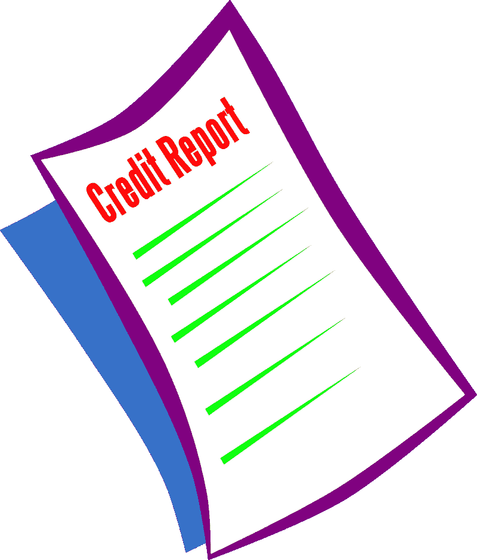

# Equifax 靠信用报告赚钱吗？—市场疯人院

> 原文：<https://medium.datadriveninvestor.com/does-equifax-make-money-from-credit-reports-market-mad-house-93bfa89e27b3?source=collection_archive---------18----------------------->

有趣的是，信用报告机构 Equifax Inc .(纽约证券交易所代码:EFX) 是一只成长型股票。

为了解释这一点，斯托克罗[估计](https://stockrow.com/EFX/financials/income/quarterly)在截至 2019 年 12 月 31 日的季度，Equifax 的收入增长率为 8.44%。此外，在 2019 年 9 月 30 日至 12 月 31 日期间，Equifax 的季度收入从 8.75 亿美元增长到 9.05 亿美元。

此外，同期 Equifax 的季度毛利从 5.012 亿美元增长到 5.229 亿美元。然而，同期 Equifax 的运营收入从 1.216 亿美元降至 4700 万美元。因此，Equifax 报告 2019 年 12 月 31 日的净收入为 910 万美元，低于三个月前的 8110 万美元。

# Equifax 赚多少钱？

因此，Equifax 产生了更多的收入，但从业务中获得的利润却更少。然而，Equifax 正在产生更多的现金。

例如，在截至 2019 年 12 月 31 日的季度，Equifax 的运营现金流从-1.649 亿美元上升至 2.307 亿美元。重要的是，同期 Equifax 的期末现金流从 3170 万美元上升至 2.338 亿美元。

此外，Equifax 的融资现金流从 2019 年 9 月 30 日的 2.966 亿美元降至 2019 年 12 月 31 日的 1.315 亿美元。我认为现金流显示 Equifax 在上个季度借了较少的钱。

 [## 算法交易的机器学习|数据驱动的投资者

### 当你的一个朋友在脸书上传你的新海滩照，平台建议给你的脸加上标签，这是…

www.datadriveninvestor.com](https://www.datadriveninvestor.com/2019/01/30/machine-learning-for-stock-market-investing/) 

因此，Equifax 的现金和短期投资从 2019 年 9 月 30 日的 1.675 亿美元上升至 2019 年 12 月 31 日的 4.013 亿美元。因此，Equifax 从其业务中获得了更多的现金。

# Equifax 有什么价值？

维基百科[声称](https://en.wikipedia.org/wiki/Equifax)，Equifax 声称 2017 年为全球超过 8 亿人和 8800 万家企业提供信用报告。

然而，美国消费者金融保护局(CFPB)在 2012 年至 2017 年期间收到了超过 57，000 起关于 Equifax 的投诉， *Fast Company* [声称](https://www.fastcompany.com/40469235/the-dizzying-number-of-cfpb-complaints-against-equifax-since-2012-should-infuriate-you)。此外， *Fast Company* 估计 CFPB 在此期间每天收到 31 起针对 Equifax 的投诉。

因此， **Equifax(纽约证券交易所代码:EFX)** 及其服务的价值都是值得怀疑的。值得注意的是，Equifax 出售的数据的准确性和实用性可能很差。此外，有人指控 Equifax 的安全性很差。

事实上，美国美国联邦贸易委员会[报道](https://www.ftc.gov/enforcement/cases-proceedings/refunds/equifax-data-breach-settlement)称，在 2022 年 1 月的和解中，Equifax 同意向受数据泄露影响的客户支付高达 4.25 亿美元至 1.47 亿美元。据英国广播公司[报道](https://www.bbc.com/news/world-us-canada-51449778)，美国司法部长威廉·巴尔指控中国军方在 2017 年入侵了 Equifax，窃取了数千万美国、加拿大和英国消费者的数据。

# 市场先生对 Equifax 定价过高

因此，我认为市场先生在 2020 年 2 月 28 日将 **Equifax Inc .(纽约证券交易所代码:EFX)** 的价格定得过高，为每股 142.04 美元。

然而，Equifax 是一只不错的股息股票，将于 2020 年 3 月 3 日支付 39₵季度股息。此外，Dividend.com 在 2020 年 2 月 28 日向 Equifax 支付了 1.08%的股息收益率、27.16%的派息率和 1.56 美元的年化派息。

我认为投资者需要避免 Equifax，因为那里有更好更便宜的股息股票。其中一些股票包括 **Kroger(纽约证券交易所:KR)** ，**苹果(纳斯达克:AAPL)** ， **BNYMellon(纽约证券交易所:BK)**，**微软(纳斯达克:MSFT)** ，**富国银行(纽约证券交易所:WFC)** 和**美国银行(纽约证券交易所:BAC)** 。

# Equifax 是一只糟糕的股票

归根结底，我认为 Equifax 是一只可怕的股票，因为它的产品；信用报告是扯淡。为了解释，信用报告试图通过公布贷款或账单支付记录来预测贷款违约率。

不幸的是，信用报告记录往往是不准确的。令人难以置信的是，信用报告不跟踪个人收入。事实上，Equifax 可以给一个没钱没工作的美国人一个“良好的信用评级”。与此同时，一个亿万富翁可能会有“糟糕的信用评级”。

记住，2007 年抵押贷款危机中臭名昭著的“忍者”贷款。Equifax 等公司给了许多忍者借款人“良好的信用评级”。因此，Equifax 让欺诈者可以轻松地向没钱的人发放抵押贷款，从而加剧了抵押贷款危机。

因此，信用报告并不能预测个人偿还债务的能力。聪明的投资者会远离那些出售可疑产品和服务的公司，比如, **Equifax(纽约证券交易所:EFX)** 。

*原载于 2020 年 2 月 28 日*[*https://marketmadhouse.com*](https://marketmadhouse.com/does-equifax-make-money-from-credit-reports/)*。*