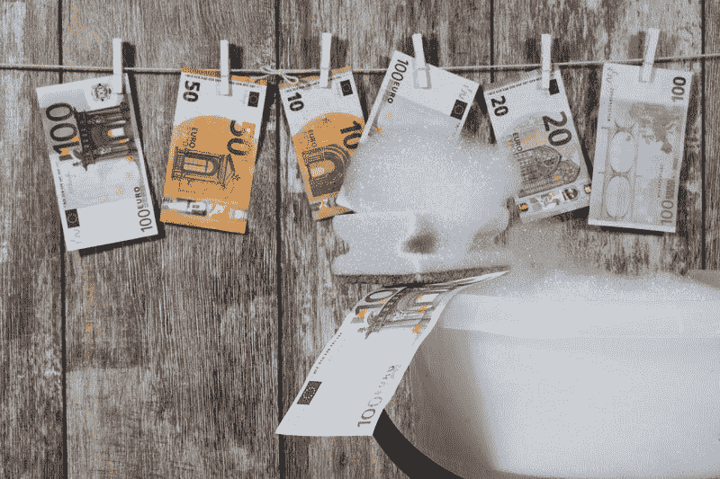
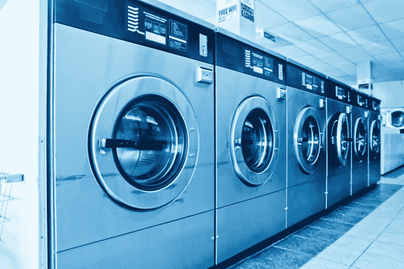
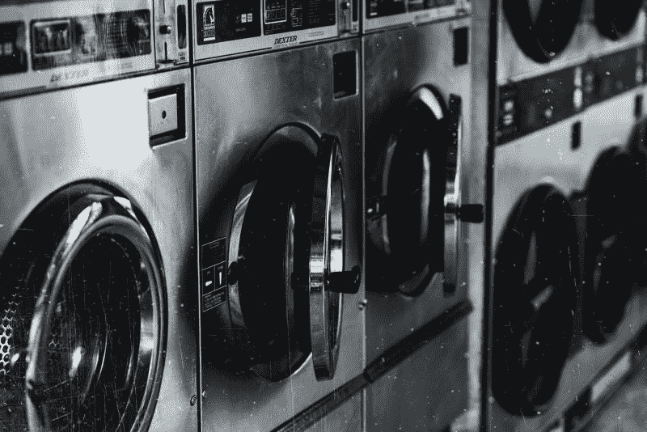
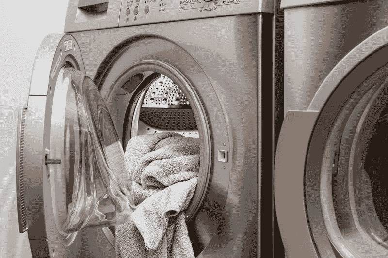
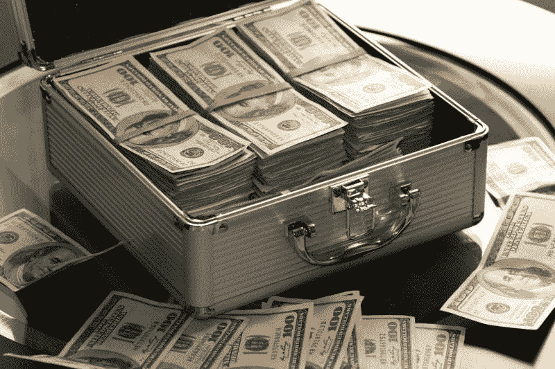
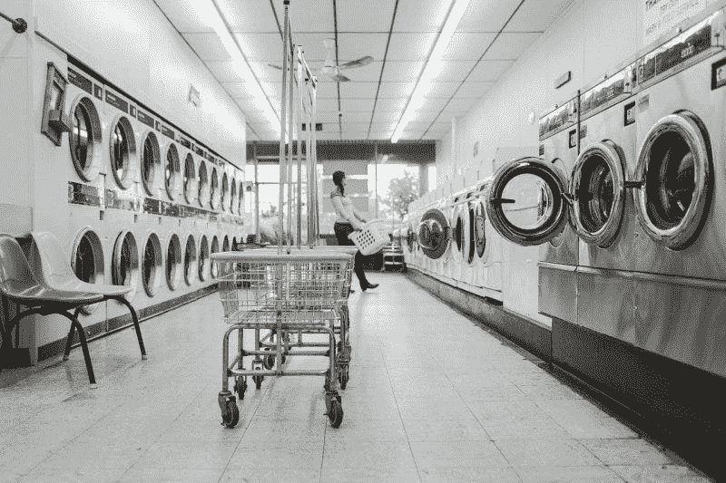

# 在德意志银行洗黑钱有报酬吗？—市场疯人院

> 原文：<https://medium.datadriveninvestor.com/does-money-laundering-pay-at-deutsche-bank-market-mad-house-896a7b5f21c6?source=collection_archive---------21----------------------->

道德败坏、胃口很大的价值投资者可以在德意志银行投资洗钱。

最近针对**德意志银行**的洗钱活动包括:

T4 与所谓的性侵犯者杰弗里·爱泼斯坦有着千丝万缕的联系，并且未能监控外国客户的活动。据有组织犯罪和腐败报告项目(OCCRP)报道，今年 7 月，纽约州金融服务局因这些指控对德意志银行罚款 1 . 5 亿美元。

从 2007 年到 2015 年的八年间，德意志银行为丹麦爱沙尼亚银行的 1638844 笔交易清算了超过 2670 亿美元。其中，丹斯克通过德意志银行从俄罗斯和其他前苏联国家转移了至少 1500 亿美元的付款，”纽约州金融服务部门同意令声称。

《卫报》声称，eutsche 银行是一个名为“全球自助洗衣店”的大规模洗钱计划的一部分。《卫报》声称，2010 年至 2014 年间，全球自助洗衣店为俄罗斯罪犯洗钱高达 800 亿美元。

D eutsche 银行欺诈洗钱行为如此之大，以至于**美洲银行(NYSE:BAC**)；BuzzFeed 新闻声称，几乎没有一个道德行为的堡垒提交了关于其某些交易的可疑活动报告(SAR)。

BuzzFeed News 称，2013 年 3 月至 2014 年 4 月间，Khanani 洗钱组织通过德意志银行转移了 5000 万美元的黑钱。卡纳尼声称的客户包括塔利班、真主党和墨西哥贩毒集团。

# 投资德意志银行洗钱

然而，价值投资者可以将**德意志银行**视为便宜货，因为市场先生在 2020 年 10 月 2 日以 8.52 美元的价格购买了其股票。

此外，德意志银行的股票很稳定。德意志银行 2020 年初的股价为每股 8.33 美元，2020 年 2 月 14 日触及 11.04 美元的高点。然而，德意志银行的股价在 2020 年 3 月 16 日跌至 5.48 美元。

此外，**德意志银行(DB)** 于 2019 年 5 月 28 日支付了 12.3₵的年度股息。2020 年 9 月 30 日，Dividend.com 向德意志银行支付了 1.53%的股息收益率(T3)。

# 德意志银行是在通过洗钱赚钱吗？

**德意志银行股份公司(Deutsche Bank AG)**是一只廉价的分红股票，赚了一些钱。

例如，德意志银行报告 2020 年 6 月 30 日的营业收入为 3.7107 亿美元，毛利为 69.83 亿美元。此外，德意志银行的毛利从 2019 年 6 月 30 日的 69.72 亿美元上升。

引人注目的是，德意志银行的营业收入从 2019 年 6 月 30 日的 10.65 亿美元降至 2020 年 6 月 30 日的 3.7107 亿美元。与此同时，德意志银行的共同净收入从 2019 年 6 月 30 日的 4.3053 亿美元降至 2020 年 6 月 30 日的 5616 万美元。

 [## 为什么大多数人在日内交易中亏损(以及如何不成为他们中的一员)|数据驱动的投资者

### 日内交易很难，大多数人都赔钱。我确实有。事实上，我曾经在一个单一的损失更多的钱…

www.datadriveninvestor.com](https://www.datadriveninvestor.com/2020/09/23/why-most-people-lose-money-day-trading-and-how-to-not-be-one-of-them/) 

# 德意志银行收入缩水

我认为德意志银行的收入表明洗钱是一种糟糕的商业模式。

事实上，德意志银行的收入在过去一年里大幅缩水。**德意志银行(DB)**2019 年 6 月 30 日报告收入 105.4 亿美元。2020 年 6 月 30 日，收入降至 85.53 亿美元。

值得注意的是，Stockrow 估计，截至 2020 年 6 月 30 日，德意志银行的收入增长将萎缩 27.11%。截至 2019 年 9 月 30 日，德意志银行的收入减少了 4.42%。

因此，冠状病毒和丑闻似乎正在影响德意志银行的收入。

# 德意志银行产生多少现金？

德意志银行可以产生大量的现金。例如，德意志银行报告 2020 年 6 月 30 日的运营现金流为 266.62 亿美元。

此外，德意志银行报告，截至 2020 年 6 月 30 日，投资现金流为 61.58 亿美元，期末现金流为 1735.09 亿美元。德意志银行的期末现金流较 2020 年 6 月 30 日的 1721.57 亿美元略有增长。

过去一年，德意志银行的现金和短期投资大幅下降。截至 2019 年 9 月 30 日，德意志银行拥有 9527.09 亿美元的现金和短期投资。2020 年 6 月 30 日，这一数字降至 3 821.77 亿美元。

此外，截至 2020 年 6 月 30 日，德意志银行的总资产为 1.549 万亿美元。这一数字从 2019 年 9 月 30 日的 1.669 万亿美元下降。

我认为德意志银行是萎缩行业中的一家萎缩公司。我认为政治压力可能会扼杀或阻碍德意志银行的国际银行业务。然而，我认为对这种类型的银行业务仍有强劲的需求。

# 德意志银行是什么？

德意志银行是一家历史悠久的德国投资银行，自 1873 年开始在美国运营。

德意志银行是 2001 年第一家在纽约证券交易所上市的德国银行。有趣的是，[德意志银行](https://www.db.com/usa/content/en/company.html)声称是唯一一家在华尔街有实体存在的投资银行。德意志银行的美国总部位于曼哈顿华尔街 60 号。

德意志银行在 58 个国家开展业务，是德国最大的银行之一。[德意志银行的国际私人银行](https://www.deutsche-bank.de/pk/lp/international.html)是德国领先的私人银行，也是欧元区领先的私人银行之一。

德意志银行私人国际银行声称为来自欧洲和亚洲 1200 家分行的 500 万客户提供服务。它还声称为意大利、西班牙、比利时和印度的 340 万客户提供服务。这家私人国际银行声称拥有€2500 亿英镑的资产，每年为€创造 30 亿英镑的收入。

# 德意志银行不断增长的业务

国际私人银行服务于高净值个人、企业和富裕家庭。高净值个人是一个不断增长的市场。

[Statista 估计](https://www.deutsche-bank.de/pk/lp/international.html)2019 年欧洲有 522 万高净值人士，北美有 630 万高净值人士，2019 年亚太地区有 653 万。这些数字高于 2016 年欧洲的 450 万、北美的 515 万以及亚太地区的 551 万。

因此，德意志银行有一项产生现金的业务，对这项业务的需求正在增长。然而，我认为洗钱指控的法律、道德和政治问题使德意志银行成为一项高风险投资。我建议普通投资者远离德意志银行，直到它整顿自己的行为。

在那之前，还有其他更安全的国际银行，包括巴菲特最喜欢的**(纽约证券交易所代码:BK)** 。

*原载于 2020 年 10 月 2 日 https://marketmadhouse.com***。**

## *访问专家视图— [订阅 DDI 英特尔](https://datadriveninvestor.com/ddi-intel)*