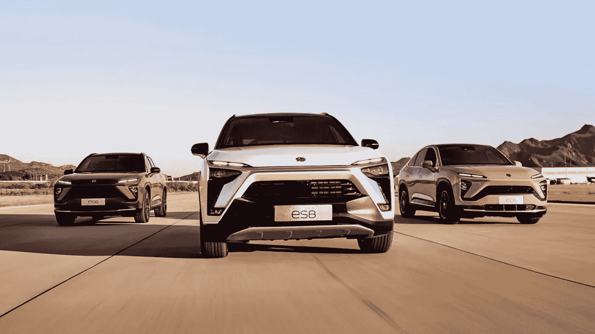
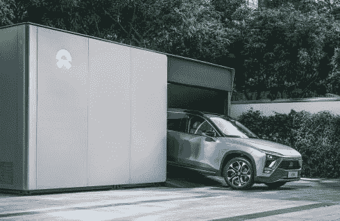
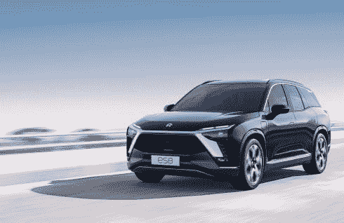
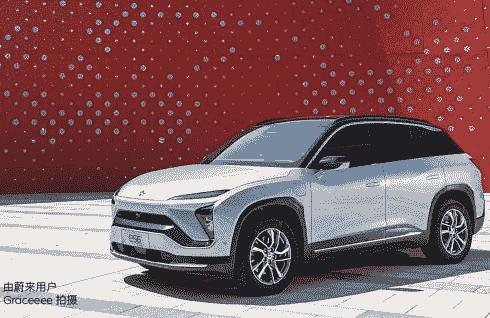
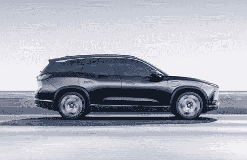
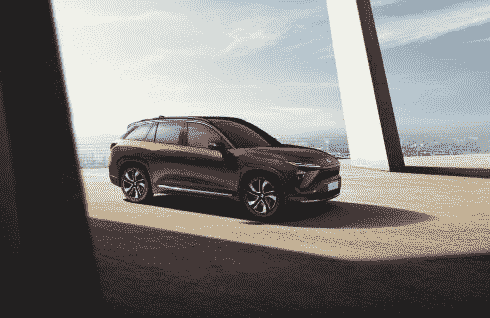
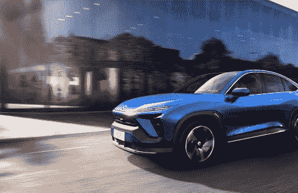

# NIO (NIO)靠电动车赚钱吗？—市场疯人院

> 原文：<https://medium.datadriveninvestor.com/does-nio-nio-make-money-from-electric-vehicles-market-mad-house-3e2747811de4?source=collection_archive---------27----------------------->

中国电动汽车制造商 NIO 是全球增长最快的股票。令人惊讶的是，NIO 的股价从 2020 年 1 月 2 日的 3.72 美元增长到 2020 年 11 月 27 日的 54 美元，再到 2020 年 12 月 3 日的 45.35 美元。

人们购买 **NIO(纽约证券交易所代码:NIO)** 是因为它类似于**特斯拉汽车(TSLA)** ，世界上最有价值的汽车制造商。2020 年，特斯拉的股票价值从 2020 年 1 月 2 日的 86.05 美元增长到 2020 年 12 月 3 日的 593.38 美元。

值得注意的是， [NIO 的汽车阵容](https://www.nio.com/)类似于特斯拉的。例如，NIO 的 ES8 和 ES6 跨界车类似于特斯拉的 Model Y 和 Model X 运动型多功能车(SUV)。相反，我认为 NIO 的车辆看起来比特斯拉的更传统

# NIO 与特斯拉

与**特斯拉(TSLA)** 类似，NIO 正在推出无人驾驶汽车技术。例如，KrASIA 声称，NIO 重新推出了 Level 4，这是其本土的自动驾驶项目。NIO 和**英特尔(INTC)** Mobileye 自动驾驶汽车子公司正在开发 Level 4。

然而，我没有看到任何证据表明 NIO 在道路上有任何可以与特斯拉的 Auto Pilot 自动驾驶系统相媲美的东西。事实上， *Electrek* 声称特斯拉将很快发布[全自动驾驶测试版](https://electrek.co/2020/11/19/tesla-release-full-self-driving-beta-update/)更新。

[全自动驾驶测试版](https://electrek.co/2020/10/22/tesla-full-self-driving-beta-first-look-insane/)允许车辆在城市街道上转弯，并链接到特斯拉的 Navigate on Auto Pilot 功能-完全自动驾驶系统， *Electrek* 声称。因此，特斯拉可能拥有世界上最先进的自动驾驶汽车技术。特斯拉可能接近全自动驾驶汽车。

我认为全自动驾驶汽车可以产生大量的金钱。例如，他们可以将特斯拉 Auto Pilot 用于自动驾驶出租车、送货车以及挖掘和采矿机器。

特斯拉已经证明它可以交付大量的车辆。Statista 估计特斯拉在 2019 年交付了[36.7 万至 36.8 万辆汽车](https://electrek.co/2020/10/22/tesla-full-self-driving-beta-first-look-insane/)。相比之下，NIO 在 2020 年第三季度交付了 12，206 辆汽车，2020 年第二季度交付了 10，331 辆汽车，2020 年第一季度交付了 3，838 辆汽车，2019 年第四季度交付了 8，224 辆汽车。*

# 为什么投资者喜欢 NIO

因此，特斯拉是一家久经考验的汽车制造商，而 NIO 是一家已经制造了几千辆汽车的初创公司。然而，NIO 比**特斯拉(TSLA)** 便宜。

我认为人们购买 **NIO (NIO)** 有三个原因。第一，NIO 远比特斯拉便宜。第二，NIO 是一家中国公司。我认为许多人正在把他们的钱转移到中国，因为中华人民共和国似乎比美国更安全。

值得注意的是，Worldometers 估计，2020 年 11 月 27 日，美国报告了 135，341 例新冠状病毒病例， [270，734 例冠状病毒死亡](https://www.worldometers.info/coronavirus/)。相比之下，中华人民共和国在同一天报告了 1179 例新的新冠肺炎病例和 4634 例冠状病毒死亡。因此，对许多投资者来说，中国的未来似乎比美国更光明。

第三，NIO 不是福特(Ford)和丰田(T7)这样的传统汽车制造商。因此，NIO 没有传统汽车制造商的问题，如工会合同、生产污染性气体和柴油车辆的历史、庞大的工厂以及无人购买的传统车型。

NIO 的大部分阵容是运动型多功能车(SUV)或跨界车。我觉得连 NIO 的 EC6 轿车看起来都像跨界车。

事实上，埃德蒙兹将福特 F 系列、Ram 和雪佛兰 Silverado 皮卡列为美国最畅销的汽车。丰田 RAV4 和本田 CR-V 跨界车完成了埃德蒙兹五大卖家名单。

 [## 为市场注入资金——FAANG 继续依靠永久牛市能源|数据驱动的投资者

### FAANG 股票在 FDA 对 COVID 等离子治疗紧急放行的消息下拉高了市场。经过一周的…

www.datadriveninvestor.com](https://www.datadriveninvestor.com/2020/08/24/injection-for-the-market-faang-continues-to-ride-that-perma-bull-energy/) 

# NIO 能用电池即服务(BaaS)赚钱吗？

NIO 正在试验一个有趣的商业计划，他们称之为电池即服务。

BaaS 背后的想法是通过单独租赁和维修车辆来降低电动汽车的价格。在 BaaS 中，驾驶员拥有车辆，NIO 拥有并租赁电池。

此外，NIO 还提供电池交换站。在电池更换站，NIO 的技术人员将空电池换成充满电的电池。因此，你可以开着没电的电池，几分钟后开着充满电的电池离开。希望换电池会比充电更快。

给电动汽车充电可能需要半个小时或更长时间。在汽车充电站闲逛，除了从自动售货机买汽水之外无事可做，可能会很无聊。注意，我不知道电池交换会有多流行，因为我认为大多数电动车车主会在睡觉时在家里给车充电，或者在工作时在办公室给车充电。因此，只有少数长途司机需要更换电池。

NIO 声称 BaaS 可以将其汽车价格降低 12.8 万英镑(19461.76 美元)。NIO 将 BaaS 描述为每月 980 英镑(149 美元)至 1480 英镑(225.09 美元)的订阅计划。作为订阅的交换，NIO 所有者将收到由 NIO 提供服务的最新型号的电池。

这项计划的一个好处是 NIO 可以销售其他品牌汽车的电池。另一个优势是 NIO 可以取代危险的旧锂电池，让它们快速上路。锂电池老化后会过热并着火。

最后，NIO 可以产生 float，因为如果车主想为他们的汽车购买电池，他们必须支付 BaaS 订阅费。

# NIO 到底是什么？

NIO 是一家总部位于上海的公司，在中国合肥经济技术开发区拥有一家汽车工厂。NIO 还在北京、加州圣何塞和英国牛津设有研发中心。NIO 在慕尼黑有一个全球设计中心。

目前，NIO 在中国提供三款电动跨界车，EC6、ES8 和 ES6。NIO 依靠政府补贴来推动销售。

假设 NIO 计划在全球范围内销售汽车。然而，我没有看到任何证据表明 NIO 车辆可以在中华人民共和国之外获得。因此，我认为 NIO 的全球足迹的说法是空话。

NIO 于 2020 年 11 月 6 日推出了一款具有灵活升级计划的 [100 千瓦时(kWh)电池](https://marketmadhouse.com/does-nio-nio-make-money-from-electric-vehicles/%C2%A5%20980)。一份新闻稿称，该电池将提供热传播预防、高度集成的设计、全天候管理和双向云 BMS。

购买 100 千瓦时电池的用户将获得升级电池作为服务订阅。电池即服务订阅可以包括免费电池更换。

# NIO 赚钱吗？

**NIO (NIO)** 赔钱。该公司报告 2019 年毛利为负 1.722 亿美元，营业收入为负 15.91 亿美元。

然而，Stockrow 估计 NIO 的[收入在 2020 年的增长率为 56.08%](https://stockrow.com/NIO/financials/income/annual) 。NIO 报告称，2019 年的年收入为 12.4 亿美元。

NIO 消耗了大量现金。NIO 报告称，2019 年的年度运营现金流为负 12.53 亿美元。然而，NIO 报告的年度期末现金流为 1.4219 亿美元。

**NIO(NIO)**2019 年底数值不大。该公司于 2019 年 12 月 31 日拥有 1.5173 亿美元的现金和短期投资，总资产为 20.95 亿美元。

# NIO 是一项糟糕的投资

我的结论是 NIO 是一项糟糕的投资，因为它赔钱，没有什么价值。我建议那些希望投资组合中有电动汽车制造商的投资者购买**福特。**

[**【福特(F)**](https://marketmadhouse.com/is-ford-f-the-best-way-to-invest-in-electric-vehicles/)计划三款电动汽车，2020 年 9 月 30 日拥有 448.31 亿美元现金和短期投资。福特当天公布的总资产为 2599.43 亿美元。

更重要的是，市场先生在 2020 年 12 月 3 日支付了 9.21 美元购买福特股票。此外，福特将于 2020 年 1 月 29 日支付 15₵季度股息。

我的结论是，当竞争对手赚钱并支付股息时，NIO 是一项糟糕的投资。聪明的投资者会避开 NIO (NIO)，因为我觉得它没有价值。

*[https://IR . nio . com/static-files/39d 3112 f-3c B4-4ed 5-aade-b040 b 368719 a](https://ir.nio.com/static-files/39d3112f-3cb4-4ed5-aade-b040b368719a)

*原载于 2020 年 12 月 3 日 https://marketmadhouse.com***。**

## *访问专家视图— [订阅 DDI 英特尔](https://datadriveninvestor.com/ddi-intel)*