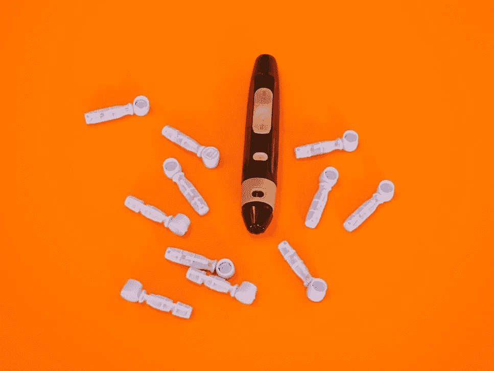

# SENS 对投资者有意义吗？

> 原文：<https://medium.datadriveninvestor.com/does-sens-make-sense-for-investors-5a6af8dd3a9d?source=collection_archive---------0----------------------->

Image via [Unsplash- Diabetesmagazijn.nl](https://images.unsplash.com/photo-1599814516385-5eb0a11888d4?ixid=MXwxMjA3fDB8MHxwaG90by1wYWdlfHx8fGVufDB8fHw%3D&ixlib=rb-1.2.1&auto=format&fit=crop&w=967&q=80)

## 这家葡萄糖监测植入物生产商将令人印象深刻的产品开发和最近精明的融资相结合，将自己定位为糖尿病领域的主要参与者

医疗保健股是一条连续不断的高速公路，公司努力开发并向市场推出一系列令人眼花缭乱的产品，旨在治疗我们的许多疾病。通常，投资者只有很短的时间来识别他们认为方向正确的产品和公司。确定这些股票是否值得投资，需要仔细观察，并确定它们对投资组合是否有意义。最近出现在许多雷达上的一只这样的股票是 SENS (Senseonic Holdings，Inc .)，但在过去一个月股价上涨超过 600%后，它们是否仍有投资者所期待的上涨空间？

[Senseonics Holdings，Inc.](http://SENS) 总部位于马里兰州，从事为糖尿病患者设计、开发和商业化植入式连续血糖监测系统。其主要产品是 Eversense 品牌，这是一种葡萄糖监控设备，包括传感器、智能发射器和移动应用程序。

根据 Senseonic 的[网站](https://www.eversensediabetes.com/eversense-cgm-system)，“Eversense 通过皮下传感器、可移动和可充电的智能发射器以及实时糖尿病监测和管理的便捷应用程序，提供长达 90 天的连续血糖监测。”

截至 2018 年，美国疾病预防控制中心[估计](https://www.cdc.gov/diabetes/pdfs/data/statistics/national-diabetes-statistics-report.pdf)约 8.2%的美国人口患有某种形式的糖尿病，Staista.com[称](https://www.statista.com/statistics/271464/percentage-of-diabetics-worldwide/#:~:text=Around%209.3%20percent%20of%20the,chronic%20high%20blood%20sugar%20levels.)全球约 9.3%的人口患有糖尿病。由于这些人中的许多人必须每天或定期用手指棒检查他们的血糖水平(刺破手指以获得血滴用于血糖仪读数)，这种相对非侵入性技术水平的发展受到了热烈欢迎。它不仅有望提供准确的结果和数据管理，而且还可以与手机应用程序接口，以便更容易地协调和跟踪饮食、锻炼和其他可能影响血糖的活动。

SENS 的 90 天设备早在 2018 年就获得了美国食品和药物管理局的批准，但现在他们正在为一个寿命为 180 天或 6 个月的更新版本寻求批准。批准申请早在 2020 年秋季就已提交，但由于新冠肺炎疫情，FDA 的延迟已将预期的审查日期推迟到 2021 年年中。特别是，大量旨在对抗 Covid 的产品和药物涌入 FDA，鉴于当前的危机，这些产品和药物受到了优先考虑。

自去年 6 月以来，股价一直在 0.36 美元至 0.45 美元的区间内波动，他们即将推出新产品的消息开始让投资者兴奋起来。从 12 月下旬开始，SENS [的股价](https://finance.yahoo.com/quote/SENS?p=SENS#eyJpbnRlcnZhbCI6ImRheSIsInBlcmlvZGljaXR5IjoxLCJ0aW1lVW5pdCI6bnVsbCwiY2FuZGxlV2lkdGgiOjgsImZsaXBwZWQiOmZhbHNlLCJ2b2x1bWVVbmRlcmxheSI6dHJ1ZSwiYWRqIjp0cnVlLCJjcm9zc2hhaXIiOnRydWUsImNoYXJ0VHlwZSI6ImxpbmUiLCJleHRlbmRlZCI6ZmFsc2UsIm1hcmtldFNlc3Npb25zIjp7fSwiYWdncmVnYXRpb25UeXBlIjoib2hsYyIsImNoYXJ0U2NhbGUiOiJsaW5lYXIiLCJzdHVkaWVzIjp7IuKAjHZvbCB1bmRy4oCMIjp7InR5cGUiOiJ2b2wgdW5kciIsImlucHV0cyI6eyJpZCI6IuKAjHZvbCB1bmRy4oCMIiwiZGlzcGxheSI6IuKAjHZvbCB1bmRy4oCMIn0sIm91dHB1dHMiOnsiVXAgVm9sdW1lIjoiIzAwYjA2MSIsIkRvd24gVm9sdW1lIjoiI2ZmMzMzYSJ9LCJwYW5lbCI6ImNoYXJ0IiwicGFyYW1ldGVycyI6eyJ3aWR0aEZhY3RvciI6MC40NSwiY2hhcnROYW1lIjoiY2hhcnQifX19LCJwYW5lbHMiOnsiY2hhcnQiOnsicGVyY2VudCI6MSwiZGlzcGxheSI6IlNFTlMiLCJjaGFydE5hbWUiOiJjaGFydCIsImluZGV4IjowLCJ5QXhpcyI6eyJuYW1lIjoiY2hhcnQiLCJwb3NpdGlvbiI6bnVsbH0sInlheGlzTEhTIjpbXSwieWF4aXNSSFMiOlsiY2hhcnQiLCLigIx2b2wgdW5kcuKAjCJdfX0sInNldFNwYW4iOnt9LCJsaW5lV2lkdGgiOjIsInN0cmlwZWRCYWNrZ3JvdW5kIjp0cnVlLCJldmVudHMiOnRydWUsImNvbG9yIjoiIzAwODFmMiIsInN0cmlwZWRCYWNrZ3JvdWQiOnRydWUsImV2ZW50TWFwIjp7ImNvcnBvcmF0ZSI6eyJkaXZzIjp0cnVlLCJzcGxpdHMiOnRydWV9LCJzaWdEZXYiOnt9fSwic3ltYm9scyI6W3sic3ltYm9sIjoiU0VOUyIsInN5bWJvbE9iamVjdCI6eyJzeW1ib2wiOiJTRU5TIiwicXVvdGVUeXBlIjoiRVFVSVRZIiwiZXhjaGFuZ2VUaW1lWm9uZSI6IkFtZXJpY2EvTmV3X1lvcmsifSwicGVyaW9kaWNpdHkiOjEsImludGVydmFsIjoiZGF5IiwidGltZVVuaXQiOm51bGwsInNldFNwYW4iOnt9fV19)开始上涨，高达 3.90 美元，市值成倍增长。不出所料，价格的快速增长导致公司[宣布](https://money.yahoo.com/senseonics-holdings-announces-50-0-032200538.html)于 2021 年 1 月 17 日直接发行 5000 万美元的普通股，这使得股价下跌，但保持了强劲的底部。

1 月 21 日下午，另一个令人惊讶的 5000 万美元的发行被宣布。然而，这一次，情况有点不同。H.C. Wainwright 公司同意以每股 1.925 美元的价格购买 25，974，026 股普通股。这笔交易预计将为 SENS 注入另外 5000 万美元。不仅如此，他们还获得了以公开发行价格额外购买 3，896，103 股股票的选择权。

当天晚些时候，[宣布](https://finance.yahoo.com/news/senseonics-holdings-increases-previously-announced-051800440.html)同一个承销商 H.C. Wainwright 同意以之前商定的价格将购买量增加到 51，948，052 股。他们还获得了 30 天的期权，以 1.925 美元的价格增加 7，792，207 股股票，总购买价值约为 1 亿美元。

尽管是一只低价股，SENS 显然吸引了[机构投资者](https://finance.yahoo.com/quote/SENS/holders/)的注意。在最近与 H.C. Wainwright 的交易之前，略低于 25%的股票和 50%的流通股由机构买家持有。当大公司买进时，可以肯定的是，有什么东西吸引了他们的眼球，因此他们押注于它的成功。如果 180 天的设备(已经在欧洲使用)被美国糖尿病协会批准，这可能是一个尚未实现的重要催化剂。

在 2020 年之前的几年里，SENS 已经看到其[收入](https://finance.yahoo.com/quote/SENS/financials/)每年都有显著增长，但同时也在投资开发和营销他们的专有产品。他们的总债务急剧上升，但希望在未来几年内扭转这种局面。最近推出的产品令人印象深刻地延长了他们的跑道，使他们在推出 180 天设备时更加轻松。他们还在研究一种 365 天的设备，因此他们独特产品的持续扩张给未来留下了诱人的上升空间。

最近的季度收益好坏参半，因为在过去的六个季度(到 2020 年第三季度)，SENS 两次超出预期，但其他时间都低于预期，包括 2020 年第三季度。回到他们不得不花费的所有钱，这也有助于他们实现盈利，但当他们到达将其 180 天设备推向市场的最后阶段时，可能会开始看到阳光。

如果不被他们的财务状况吓到，很容易变得无趣。然而，对他们产品的每个方面来说，每样东西的重要性都是一笔不小的开支。随着他们继续制造适用于世界大部分地区的被高度吹捧的设备，他们的命运有能力迅速改变。随着快速增长的机构支持和不断扩大的资金储备，他们可以在依靠产品销售之前保持联系，他们的未来继续看起来很光明，尽管他们的股票已经上涨了很多。

进入周末， [SENS 的股价](https://finance.yahoo.com/quote/SENS?p=SENS&.tsrc=fin-srch)位于 2.62 美元，比 2020 年 12 月 22 日上涨了 609%。随着大规模发行的股份稀释完成，价格在跌至 2%低点后已经开始回升。随着他们的财务状况现在看起来更乐观，重点将是最终确定，营销和销售他们的革命性 Eversense 产品。

尽管他们最近的股价大幅上涨，SENS 定位于继续保持潜在的显著增长。在投资者研究它们时，它们股价的快速上涨不应成为一种威慑，因为它们的精明操作和尖端技术似乎是一种有利可图的组合，因此它们的价格可能有很大的空间继续飙升。

*免责声明:作者不是财务顾问或专家。本文表达的观点仅用于一般教育目的和娱乐。它们不以任何方式为任何个人或任何特定的证券或投资产品提供特定的意见或建议。个人投资者对自己的资金和投资决策负责。作者在文章所讨论的文章中占有很小的地位。*