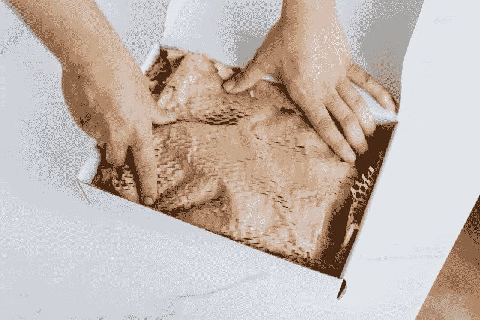

# Shopify(商店)赚钱吗？—市场疯人院

> 原文：<https://medium.datadriveninvestor.com/does-shopify-shop-make-money-market-mad-house-568c8026b61f?source=collection_archive---------22----------------------->

Shopify(商店)是当前的热门话题。2020 年，Shopify 的股价从 2020 年 1 月 2 日的 407.81 美元上涨至 2020 年 8 月 26 日的 1090.87 美元。

市场先生喜欢 **Shopify(纽约证券交易所代码:SHOP)** ，因为这个加拿大电子商务平台和**沃尔玛(纽约证券交易所代码:WMT)** 在 6 月达成了一项交易。TechCrunch 声称 Shopify 在 6 月份为沃尔玛的小企业市场带来了 3000 名新卖家。

此外， [Marketplace Pulse 估计，自 2020 年 6 月 15 日以来，超过 5000 名新卖家](https://www.marketplacepulse.com/articles/walmart-doubles-marketplace-size-in-a-year)加入了沃尔玛的市场。 *Marketplace Pulse* 估计在 2020 年 1 月至 6 月期间，超过 15，000 名新卖家加入了沃尔玛市场。因此， *Marketplace Pulse* 声称，2020 年沃尔玛市场每月增加 1400 名新卖家，是沃尔玛市场卖家数量的三倍。

# Shopify 每股值 1091 美元吗？

Shopify Inc. (NYSE: SHOP) 是一个让任何人都可以创建在线商店的平台。2020 年，Shopify 的增长呈爆发式增长。

例如，据 PYMNTS.com 报道，Shopify 声称，2020 年 3 月 13 日至 3 月 24 日期间，Shopify 新商店的数量增长了 62%。然而，你可以将 Shopify 的增长归功于标准计划的 90 天免费试用期，以及允许所有 Shopify 商家接受礼品卡支付等功能。

此外，Shopify 声称，在截至 2020 年 3 月 13 日的六周内，其年同比商品总量增长了 45%。然而，Shopify 承认，2020 年 3 月 13 日至 4 月 24 日期间，其 GMV 销售点(POS)下降了 71%。

# Shopify 赚钱吗？

因此，Shopify 有能力大规模增长和大规模崩溃，但它赚钱吗？

Shopify 赚了点小钱。例如，Shopify 报告 2020 年 6 月 30 日的季度营业收入为 28，000 美元。然而，这一数字比 2020 年 3 月 31 日的 7323 万澳元的季度运营亏损有所增长。

令人印象深刻的是，Shopify 的季度收入从 2020 年 3 月 31 日的 4.7 亿美元增长到 2020 年 6 月 30 日的 7.1434 亿美元。相比之下，Shopify 的季度毛利同期从 2.5695 亿美元增长至 3.7503 亿美元。

此外，Shopfiy 的季度共同净收入从 2020 年 3 月的-3143 万美元增长到 2020 年 6 月的 3600 万美元。因此，Shopify 五个季度以来首次公布了收入。然而，Shopify 赚的钱很少。

# Shopify 产生了多少现金？

我喜欢亚马逊(NASDAQ: AMZN) ,因为百货店能产生大量现金。另一方面，Shopify 产生的现金很少。

例如，Shopify 报告 2020 年 6 月 30 日的季度运营现金流为 1.6519 亿美元。经营现金流从 2020 年 3 月 31 日的-8495 万美元上升至 2020 年 12 月 31 日的 5289 万美元。

与亚马逊类似，Shopify 借入了巨额资金。例如，Shopify 报告 2020 年 6 月 30 日的季度融资现金流为 14.79 亿美元。这一数字比 2020 年 3 月 31 日的 1 943 万美元有所增加。融资现金流代表 Shopify 通过出售债务或借款筹集的资金。

Shopify 报告称，截至 2020 年 6 月 30 日，季度末现金流为 9.13 亿美元。季度期末现金从 2020 年 3 月 31 日的 9.6936 亿美元下降到 2019 年 12 月 31 日的-4.7461 亿美元。

# Shopify(商店)和亚马逊有一些相似之处

**Shopify(商店)**在 2020 年 6 月 30 日有 40 亿美元的现金和短期投资。这一数字从 2020 年 3 月 31 日的 23.61 亿美元和 2019 年 1 月 31 日的 24.55 亿美元有所增长。因此，Shopify 可以像亚马逊一样积累大量现金。

引人注目的是，亚马逊在 2020 年 6 月 30 日拥有 713.91 亿美元，高于 2020 年 3 月 31 日的 492.92 亿美元和 2019 年 12 月 31 日的 550.21 亿美元。所以，Shopify 和**亚马逊**有些相似之处。

我认为投资者购买 Shopify 是因为它类似于亚马逊。然而，Shopify 的价值是亚马逊的零头。特别是，Shopify 缺乏亚马逊庞大的履行基础设施和亚马逊网络服务。

 [## 如何不做傻钱|数据驱动的投资者

### 为什么要相信一个标题，说我知道如何区分傻瓜和聪明的钱？因为我一直都是，并且从…

www.datadriveninvestor.com](https://www.datadriveninvestor.com/2020/08/19/how-not-to-be-dumb-money/) 

# Shopify 经历了令人难以置信的收入增长

Shopify 的收入正在大幅增长。事实上， [Stockrow 估计 Shopify 的收入在截至 2020 年 6 月 30 日的季度增长了 97.34%](https://stockrow.com/SHOP/financials/income/quarterly) 。

相反，Shopify 上一季度收入增长 46.65%，2020 年最后一个季度增长 46.91%。因此，Shopify 提供了与亚马逊(NASDAQ: AMZN) 相同的惊人增长。

相比之下，Stockrow 认为亚马逊在截至 2020 年 6 月 30 日的季度收入增长率为 40.23%。亚马逊的收入增长率从 2020 年 3 月 31 日的 26.39%和 2019 年 12 月 31 日的 20.80%上升。Spotity 和亚马逊都在疫情经历了令人难以置信的增长。

我认为巨大的收入增长是吸引市场先生购物的原因。Shopify 在一个据称由亚马逊(Amazon)主导的电子商务市场中实现了爆炸性增长。

# Shopify 会有什么未来？

我认为，如果 Shopify 能够将其他主要零售商加入其平台，它可能会有一个光明的未来。

**沃尔玛(WMT)**； *TechCrunch* 称，2020 年 6 月，其在线市场上有超过 [5 万名卖家](https://techcrunch.com/2020/07/27/walmart-marketplace-seller-additions-surge-following-shopify-deal-up-3x-from-january/)。因此，增加其他零售商可以扩大 Shopify 的销售和收入。

我认为有许多零售商可以从 Shopify 联盟中受益。这些零售商包括:[**【way fair(NYSE:W)**](https://marketmadhouse.com/is-wayfair-in-trouble/)**[**【Overstock.com(NASDAQ:OSTK)**](https://marketmadhouse.com/overstock-com-good-investment/)**【百思买(BBY)**[**The TJX Companies(NYSE:TJX)**](https://marketmadhouse.com/will-the-tjx-companies-survive-coronavirus/)**【梅西百货(NYSE:M)****Target(NYSE:TGT)、诺德斯特龙(JWN)、苹果(AAPL)、大批量****

**我认为 Shopify 的主要需求是与拥有履行和分销基础设施的公司合作。例如，梅西百货(Macy's)或克罗格(Kroger)等拥有巨大实体足迹的零售商。此外，BestBuy 等拥有强大实体客户服务能力的公司可以增强 Shopify。**

****

**例如，百思买可以为通过 Shopify 销售的电子产品提供服务，并处理退货事宜。这种联盟的一个原因是为了区分 Shopify 和亚马逊。BestBuy 或 Nordstrom 合作的另一个原因是吸引高收入的购物者。**

# **Shopify 需要履行吗？**

**Shopify 的一个奇怪的伙伴关系可能会增强其能力，这就是与购物中心运营商的合作，如西蒙房地产集团(纽约证券交易所代码:SPG)。**

**西蒙(Simon)和亚马逊(Amazon)合作，将死去的 JP Penney 商店转变为亚马逊履行中心。而且，西蒙和**布鲁克菲尔德地产合伙公司(NASDAQ:BPY)**；另一家购物中心运营商正考虑收购破产的 JC Penney。**

**例如，Shopify 可以与 Simon 或 Brookfield 合作，将空无一人的购物中心或死气沉沉的百货商店转变为履行中心。或者 Shopify 可以联合 Simon and Brookfield 收购 JC Penney，开发一个新品牌与亚马逊竞争。**

****

**西蒙或布鲁克菲尔德联盟的一个优势是为退货和提货提供实体店。另一个用途是为选择提货的顾客出售打折商品。**

**最后一个选择可能是一家实体零售商加入 Shopify、Simon 和 Brookfield 的行列，竞购 JC Penney。可能的合作伙伴包括沃尔玛、百思买、Overstock.com、梅西百货、TJX、克罗格和美国柯尔百货公司。尤其是 TJX，它将旧百货商店转变为折扣百货商店。**

# **Shopify 是一项糟糕的投资**

**尽管前景光明，我认为 Shopify(商店)是一项糟糕的投资。Shopify 是一项可怕的投资，因为 2020 年 8 月 26 日,“市场先生”将它的股票定价高到了 1090.87 美元。**

**我认为 Shopify 的财务数据中没有任何东西可以证明 1021.12 美元的价格是合理的。我建议所有投资者避开 Shopify，因为它的股票处于泡沫之中，将会崩溃。**

**相反，我认为 Shopify 本身是一家优秀的公司，将会生存下来并赚到大量的钱。观看 Shopify 并考虑将其用于电子商务，但不要投资 Shopify。**

**你需要避开 Shopify，因为我预测它的股票会暴跌。我建议投资者等到崩盘后再买铺。**

***原载于 2020 年 8 月 26 日*[*【https://marketmadhouse.com】*](https://marketmadhouse.com/does-shopify-shop-make-money/)*。***

****访问专家视图—** [**订阅 DDI 英特尔**](https://datadriveninvestor.com/ddi-intel)**