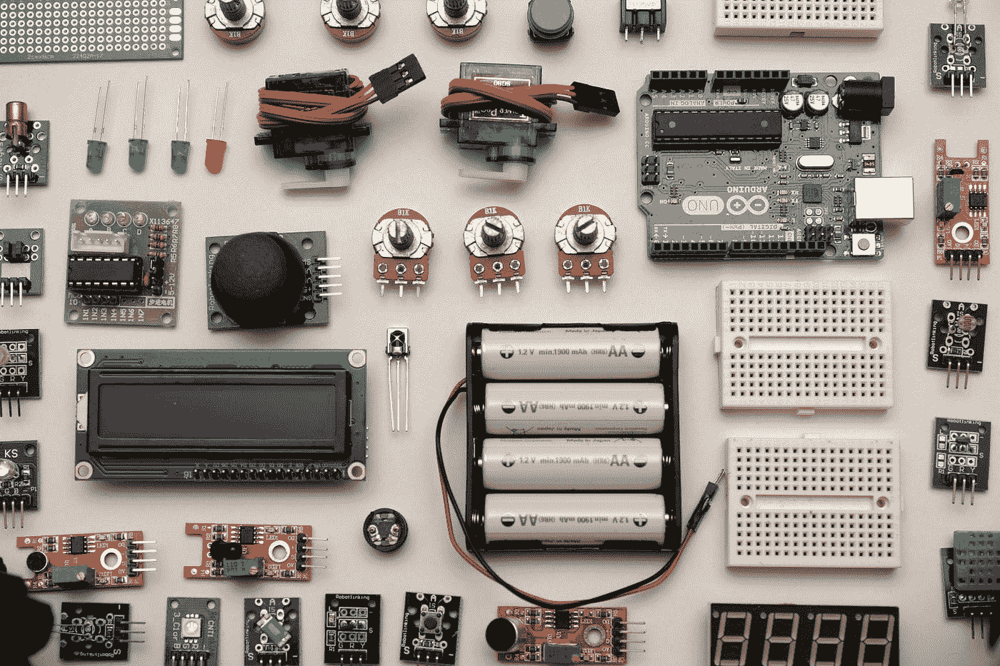

# 如果我们想发展物联网产业，就需要重新设计物联网平台体验

> 原文：<https://medium.datadriveninvestor.com/does-the-customer-need-an-iot-platform-10c52286586d?source=collection_archive---------4----------------------->

## 物联网

## 扩展物联网时的 3 个主要客户难点

Photo by [Robin Glauser](https://unsplash.com/@nahakiole?utm_source=medium&utm_medium=referral) on [Unsplash](https://unsplash.com?utm_source=medium&utm_medium=referral)

在过去的 3 年里，我在会议、活动和其他渠道上与物联网公司进行了深入的交流。随着时间的推移，一些模式出现了:

*   **物联网是关于数据的，而不是事物**
*   **治理和安全是关键**
*   **您需要购买物联网平台。“我们的”)**

物联网平台是物联网活动的最新中心。

什么是物联网平台？它是做什么的？是给谁的？

对于“物联网公司”来说，这些都是有明确答案的基本问题，但对于“物联网客户”来说，答案就不那么明确了。

# 什么是物联网公司？

让我们称它为一个设计、构建和运营物联网解决方案的企业，以在内部提供价值或作为解决方案出售给其他人。

物联网公司是物联网世界的主要焦点。传感器、网关、通信协议、物联网平台、设备管理、安全等等都在各地的会议上展出。这些都是帮助物联网公司取得成功的工具和系统。

> 但是，围栏另一端的物联网客户呢？

# 什么是物联网客户？

让我们称之为一项通过消费物联网产品和服务来实现业务目标的业务。

在大多数情况下，物联网客户不会设计传感器或网关。物联网客户从物联网公司购买解决方案来解决问题。

这些解决方案通常针对已知的用例，并且范围有限。一些常见的例子有建筑管理系统(BMS)、实时定位系统(RTLS)和状态监控系统(CM)。

**这些解决方案旨在尽可能接近交钥匙**，这意味着客户通常不提供传感器、网关或平台。

相反，物联网公司通过软件即服务(SaaS)门户网站**向客户提供所有这些，客户可以在该门户网站上使用物联网数据来提供业务价值。**

这通常与持续的专业服务相结合，以支持客户设施中所有闪亮的新硬件。

> 物联网解决方案通常被设计成尽可能接近独立，因此物联网公司具有更少的依赖性和更快的实施速度。

这导致了以下难点，使物联网难以为客户扩展:

# 痛点 1:基础架构冗余

Photo by [Jim Witkowski](https://unsplash.com/@jcw?utm_source=medium&utm_medium=referral) on [Unsplash](https://unsplash.com?utm_source=medium&utm_medium=referral)

由于上述原因，物联网客户拥有一个基础设施，该基础设施是根据个人使用案例在孤岛中购买、配置和使用的。

> 许多客户的环境中有重叠的物联网解决方案，它们可以有效地完成同样的事情。

我们谈论的是**项目资助的基础设施**——这是 IT 领域的一个矛盾说法。

一些虚构的例子:

*   RTLS 系统不会和 BMS 系统对话。
*   资产上的 BLE 信标不会被墙上的 BLE 接收器听到，因为它们是不同物联网公司不同解决方案的一部分。
*   在同一个房间中有 5 个物联网解决方案测量环境温度。他们五个都有持续的 SaaS 费用，在下一次热浪期间给我发短信，但对“高温”有不同的阈值。

# 难点 2:平台冗余

Photo by [Markus Spiske](https://unsplash.com/@markusspiske?utm_source=medium&utm_medium=referral) on [Unsplash](https://unsplash.com?utm_source=medium&utm_medium=referral)

物联网领域的任何第一痛点都将由令人垂涎的“物联网平台”来回答。在这里，您可以集中管理所有这些设备，并将来自所有传感器的数据接收到一个位置！这两者都很重要，但这里有一个问题:

> 许多物联网公司已经将此作为其物联网解决方案的一部分提供给其物联网客户。

供应商提供的 SaaS 门户(应该)已经为您提供了设备管理、RESTful API 令牌和实时数据流来完成这些工作。

问题是有两种流行的物联网公司限制了物联网客户减少平台冗余的能力:

## #1 —面临身份危机的物联网公司。

这些供应商没有完全理解他们在客户物联网战略中的影响力，并坚持将解决方案局限于特定的使用案例。在某些情况下，这些公司甚至不提供 API，仍然使用“生成报告”这样的短语。

## #2 —希望拥有整个 enchilada 的物联网公司

在这种情况下，客户应该围绕该公司通常有限的物联网解决方案来构建他们的整个物联网战略。

# 难点 3:数据冗余

Photo by [imgix](https://unsplash.com/@imgix?utm_source=medium&utm_medium=referral) on [Unsplash](https://unsplash.com?utm_source=medium&utm_medium=referral)

一些物联网客户建立了一个云平台，用于数据接收、标准化和存储。然后，这将成为应用和分析中使用的物联网数据的内部一站式商店。但这也引入了另一个问题:

> 拥有自己的物联网数据云平台的物联网客户要为同一个数据点支付多次费用。

想象一条在每个十字路口都有收费站的道路。硬件供应商收取 SaaS 费用，内部云收取接收/转换/存储费用，以及 SaaS 应用接收/存储费用。

最终，物联网客户可能会为相同的数据点支付 3 倍或更多的费用。这不是很好的扩展。

对于物联网客户的架构团队来说，在向他们的业务线推销时，这也是一个棘手的问题。

我们只需支付一次，为什么要支付三次？

这就是为什么 paint point #2 如此流行，尽管物联网数据的云平台已经广泛可用。

# 客户的物联网平台

那么，客户需要物联网平台吗？这将因具体情况而异。

> 对于许多物联网客户来说，设计良好的云数据管道足以接收、转换和存储物联网数据。

但是，我们如何解决纵向和横向冗余能力的冲击呢？

**物联网公司需要明白，它们是企业客户更大的物联网生态系统的一部分。**

这意味着尽可能遵循开放标准，以最大化基础设施重用。

这也意味着，如果其他一些物联网公司的网关安装在任何地方，它们就可以充当传感器数据到这些公司云的通道。

**物联网客户还需要认识到，虽然物联网很容易投入，但作为一个基础设施组合进行管理和扩展却是出了名的困难。**

如果有人告诉你不是这样，那他是在卖给你一个工具，而不是一个整体的解决方案。