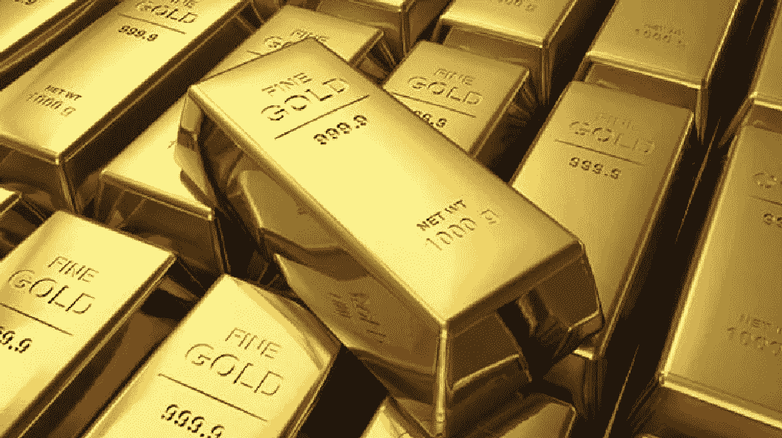
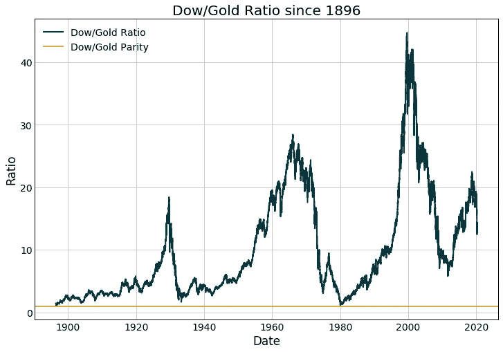
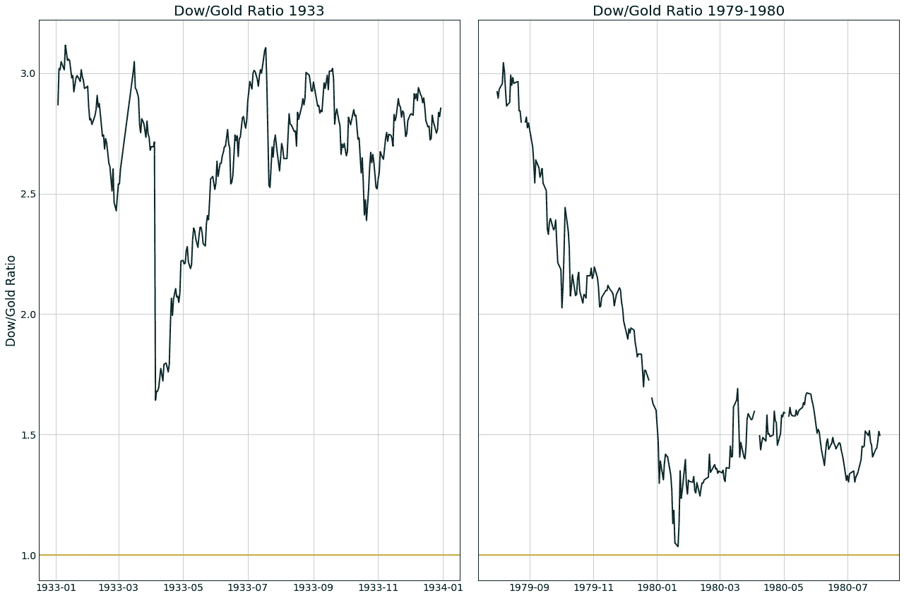
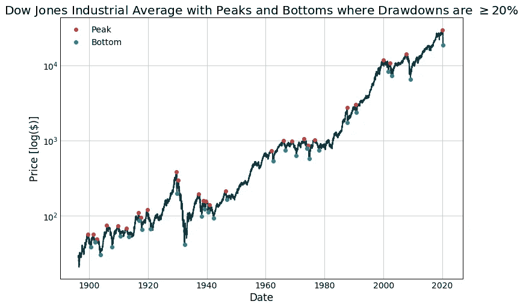
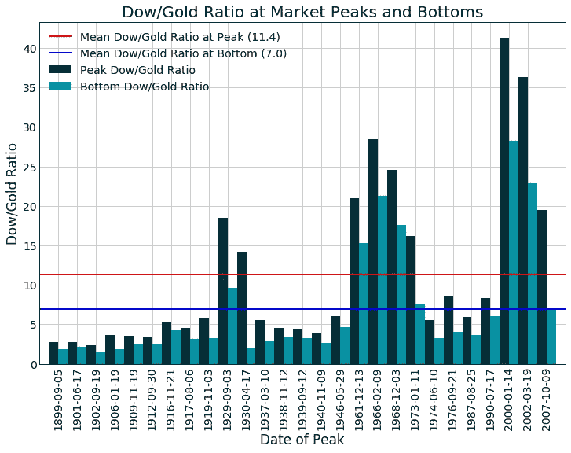
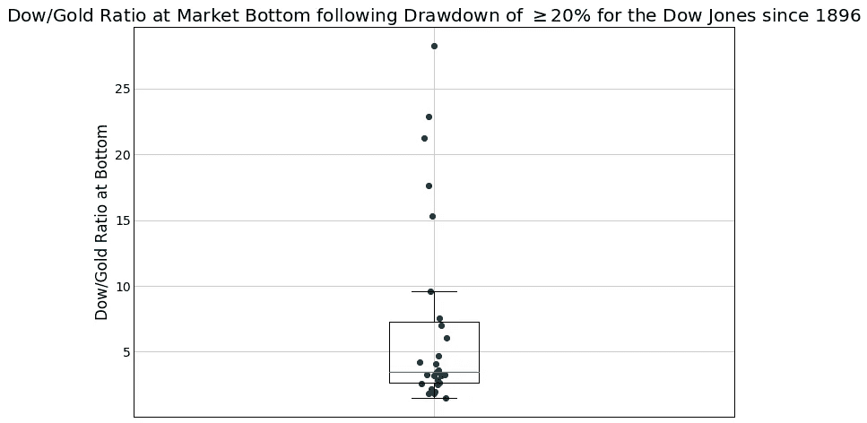
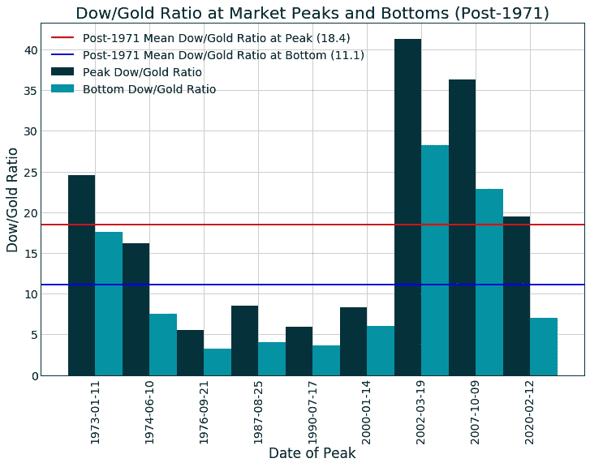
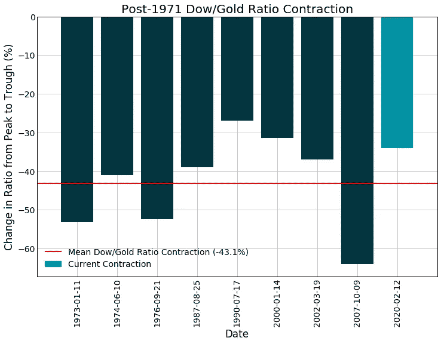

# 黄金价格是市场触底的信号吗？

> 原文：<https://medium.datadriveninvestor.com/does-the-gold-price-signal-a-market-bottom-550db3f79440?source=collection_archive---------6----------------------->

## 道指/黄金比率背后的数据

在有记录以来最快的抛售之后，过去一周股市出现反弹。一场辩论正在激烈进行，我们看到了底线吗？或者这个市场还有更远的路要走？

著名投资者和作家彼得·希夫(Peter Schiff)曾公开声明(这里的、[这里的](https://www.foxbusiness.com/markets/hyperinflation-coronavirus-buy-gold-peter-schiff)、[这里的](https://www.sovereignman.com/podcast/107-peter-schiff-and-i-talk-stagflation-50-trillion-debts-and-more-27557/))他预计，当“道琼斯工业平均指数下跌 1 盎司黄金时，这个市场将触底”，他指出了在大萧条期间以及之后为这个预测创造的历史先例。这是由于市场崩溃和大规模通货膨胀，这要归功于美联储和国会提供了前所未有的货币和财政刺激，将这些价格推得更近。

尽管希夫有把握，但从历史上看，道指/黄金比并不能为市场提供太多的洞察或找到底部。

 [## 投资区块链之前，有三个简单的问题(也是一个困难的问题)|数据…

### 了解区块链是再好不过的了。不同货币之间的增长率，比如…

www.datadriveninvestor.com](https://www.datadriveninvestor.com/2020/03/12/three-simple-questions-and-one-difficult-one-to-ask-before-investing-in-a-blockchain/) 

# 道指/黄金比率的历史

道琼斯指数可以追溯到 1896 年，这给了我们大量的数据进行比较。在 1933 年罗斯福贬值(以及随后罗斯福根据他的幸运数字篡改价格)之前，黄金被固定在每盎司 20.67 美元，然后根据布雷顿森林协议被设定在每盎司 35 美元。1971 年，尼克松关闭了固定汇率，允许黄金对美元自由浮动。

看看 124 年的图表，我们可以看到这个比率在 1896 年接近 1 (~1.05)，当时道琼斯指数在 21 美元左右(黄金为 20.67 美元/盎司)，在 1980 年道琼斯指数在 860 美元左右，黄金在 820-850 美元之间。

1933 年，当这一比率降至 1.7 左右时，即使是大萧条时期的下跌也没有将其推低至如此低的水平。

公平地说，在大萧条期间，黄金价格受到操纵——所以我们没有一个准确的晴雨表可以依靠。考虑到当时的货币问题，如果允许黄金自由涨跌，黄金价格很可能会超过 DJIA 的价格。

最好的比较是 1980 年，希夫也提到了这一点，当时这个比率在很短一段时间内实际上是 1。这发生在 20 世纪 70 年代末所谓的“滞胀”时期之后，当时前 10 年的印钞导致通货膨胀，两伊战争导致石油产量大幅下降，加剧了经济动荡。

# 预测市场底部

尽管道指/黄金比率不经常达到 1——即使在极端情况下——我们也许可以用它作为底部的信号。下面，我们有自 1896 年以来下跌 20%(广泛用于衡量“熊市”)或更多的所有峰值和底部。

Plotted on log-scale to ensure visibility of pre-1980 dates.

在这里，我们可以看看我们上面强调的市场峰值和底部，并获得这些日期的道指/黄金比率，看看是否有任何一致的水平，可能预示着市场即将崩溃或见底。

不幸的是，从上面的情节中没有出现真正清晰的模式。平均底部是 7 的比率，但这个值的标准偏差是 7.2，这意味着我们有一个广泛的结果。我们可以通过使用盒须图从另一个角度来看待这个问题:

Box-and-whiskers plot showing the Dow/Gold ratio at all market bottoms for the past 124 years.

如上所述，与黄金的关系在 1971 年后发生了变化。排除之前的市场顶部和底部，我们仍然没有看到道指/黄金比率水平的一致模式。

在这里，我们的平均值在底部增加到 11.1(作为参考，截至 2020 年 3 月 29 日写作时，该比率为 13.6)，但我们的标准差也增加到 8.8。

到目前为止，这看起来不像是一个我们可以权衡的一致指标。

## 道指/黄金比率的变化

让我们给它最后一次机会，也许这不是道指/黄金比率的绝对水平，而是比率的百分比变化将标志着市场底部。也许如果它相对于峰值收缩了一定的量，那么我们已经触底了。

在这种情况下，从市场顶部到底部，道指/黄金比率平均收缩了 43.1%(不包括当前的收缩)。到目前为止，我们大致处于最近几次崩溃的范围内，但这一次，看起来不像是一个可靠的指标。

# 道指/黄金比率的经济逻辑

这些数据似乎不支持用道指/黄金比率来预测市场底部，而且，我也看不出这背后有什么经济逻辑。

为什么认为美国 30 家最大公司的价格平均权重应该相当于市场崩盘时 1 盎司黄金的价格？这些股票的价格，进而整个指数，是这些公司未来收益的未来预期、投机热情和美元快速贬值的复杂函数。这些价值等于 S & P 500 去年达到 2，790 个里程碑的价格似乎没有任何意义:这恰好是纽约和洛杉矶之间以英里为单位的驾驶距离。

我大体上同意希夫的投资策略:投资黄金，在估值过高、杠杆率过高的美国市场之外寻找价值。未来几年，黄金相对于美元可能会大幅升值，[有助于保护你的购买力。](https://medium.com/swlh/how-much-does-your-cash-cost-1110a7437abb)

这并不是说希夫的道指/黄金比率预测将被证明是错误的——[他指出了 2008 年的崩盘](https://www.youtube.com/watch?v=sgRGBNekFIw)——但如果这一特定平价水平得到满足，这将是一个令人高兴的巧合。这不是某些经济规律的结果，当然也不是你可以用来把握市场时机的东西。