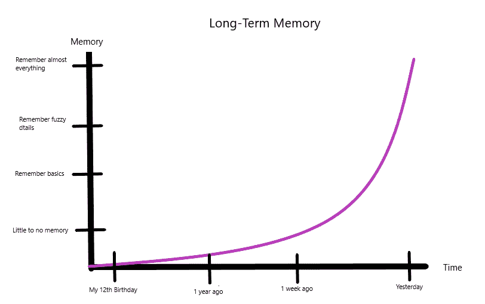
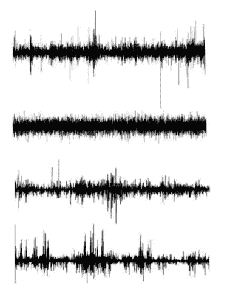

# 股市还记得吗？

> 原文：<https://medium.datadriveninvestor.com/does-the-stock-market-remember-e37f44beef7a?source=collection_archive---------18----------------------->

Photo by [Fredy Jacob](https://unsplash.com/@thefredyjacob?utm_source=unsplash&utm_medium=referral&utm_content=creditCopyText) on [Unsplash](https://unsplash.com/s/photos/memory?utm_source=unsplash&utm_medium=referral&utm_content=creditCopyText)

波动是一件美好的事情。无论在哪里研究，它的行为都是一样的。即使有足够的证据证明这一点，许多市场参与者认为这种行为并不适用于金融领域。随机漫步理论可能是对波动性和市场运作方式的最大违反。

 [## 投资区块链前要问的三个简单问题(也是一个困难的问题)|数据…

### 现在是了解区块链的最佳时机。不同货币之间的增长率，比如…

www.datadriveninvestor.com](https://www.datadriveninvestor.com/2020/03/12/three-simple-questions-and-one-difficult-one-to-ask-before-investing-in-a-blockchain/) 

你记得你昨天做了什么吗？上周呢？你的 12 岁生日呢？我清楚地记得昨天，但不是很清楚。上周变得有点模糊，我的 12 岁生日是一个记忆黑洞。

由此，我们可以推断出我的长期记忆是这样的。

这种类型的长期记忆已经在年轮生长、金融市场和尼罗河洪水中观察到。长期记忆是波动行为的关键组成部分。

长期记忆意味着过去影响未来。随机漫步理论的关键在于每一天都是独立的，没有过去的记忆。一个简单的游戏将证明这一点。

在这个游戏中，你的工作是猜测哪些图形代表市场波动，哪些图形不代表。答案一分钟后给出(禁止偷看！).

Benoit Mandelbrot: The Misbehavior of Markets

如果你说 1 和 3 是真的，那你就对了。第二张图是使用随机游走理论创建的模型，突出了有缺陷的独立性假设。第四个是假的，但看起来非常真实。这是因为它使用了长期记忆的假设。

真实图表和精确模型的定义特征是波动事件如何聚集在一起，以及平静期如何持续。波动引发波动，平静引发平静。

在随机漫步中，投资的结果纯粹是运气。如果市场的波动性看起来像第二张图，这将是正确的。事实上，市场记得过去。市场记得昨天的就业报告、上周的美联储决定以及 1930 年代的大萧条。这些事件中的每一个都以指数递减的效果影响着今天。

如果我们在知道过去影响现在的情况下创建策略，我们就可以创建一个市场可能会做什么的准确表示。虽然我们永远无法确切知道市场会做什么，但这个模型帮助我们往往是正确的。