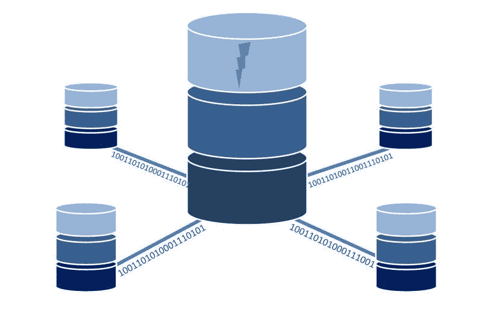

# Veeva 系统公司赚钱吗？—市场疯人院

> 原文：<https://medium.datadriveninvestor.com/does-veeva-systems-inc-make-money-market-mad-house-ed2ed6f84587?source=collection_archive---------21----------------------->

有趣的是，疫情冠状病毒正在推高制药和科技股的价格。典型的例子: **Veeva 系统公司(纽约证券交易所代码:VEEV)。**

Veeva 的股价从 2020 年 1 月 2 日的 143.40 美元上涨至 2020 年 9 月 25 日的 273.96 美元。值得注意的是，Veeva 的股价在 2020 年 9 月 1 日达到了 294.08 美元的高点。

Veeva 的股价如此之高，我不得不怀疑制药和科技股是否存在泡沫。具体来说，Veeva 为制药行业提供云计算解决方案和应用。

# Veeva 系统公司赚钱了吗？

我认为制药股存在泡沫，因为 **Veeva Systems (VEEV)** 在 2020 年 7 月 31 日报告的季度收入为 3.5368 亿美元。

此外，Veeva Systems 报告 2020 年 7 月 31 日的季度营业收入为 9008 万美元。此外，2020 年 7 月 31 日，Veeva 报告季度毛利为 2.5648 亿美元。此外，Veeva 报告 2020 年 7 月 31 日的季度共同净收入为 9355 万美元。

我认为 Veeva 的收入和收益太低，不足以支撑 270.57 美元的股价。然而，Veeva 正经历着令人难以置信的增长率。Stockrow 估计，在截至 2020 年 7 月 31 日的季度中，Veeva 的收入增长率为 35.52%。此外，截至 2020 年 4 月 30 日，Veeva 的收入增长率为 37.73%。

# 医药股存在泡沫吗？

我认为 **Veeva (VEEV)** 正在冒泡，因为它赚钱少但增长快。这听起来类似于世纪之交的网络泡沫股票。记住，网络股票增长很快，但是他们的股票价值增长更快。

此外，许多 dot.com 股票出售一个想法，如在互联网上出售宠物食品(不，不是嚼不烂，而是臭名昭著的[Pets.com](https://en.wikipedia.org/wiki/Pets.com))。同样，Veeva 也为制药行业销售云计算解决方案。

早在 1999 年，投资者喜欢通过互联网销售宠物食品的想法。今天，投资者喜欢用云来制造药品的想法。其他投资喜欢从冠状病毒疫苗中赚钱的想法。

不幸的是，今天的冠状病毒疫苗是纯理论产品。就像 1999 年网上宠物食品零售商还是纯理论产品一样。

 [## 面向企业转型的 AWS:顶级云架构师的秘密|数据驱动型投资者

### “您使用云实现企业转型的方法是什么？”是人们一直问我的问题，自从我…

www.datadriveninvestor.com](https://www.datadriveninvestor.com/2020/07/15/aws-for-enterprise-transformation-secrets-of-top-cloud-architects/) 

# 什么是 Veeva 系统公司(VEEV)？

**Veeva Systems (VEEV)** 拥有一个制药公司使用的平台。例如，Veeva 声称制造商用其 Veeva 客户关系管理(CRM)软件推出了 [81%的新药](https://en.wikipedia.org/wiki/Pets.com)。

此外，Veeva 声称其 Vault eTMF 软件将处理[审判主文件](https://en.wikipedia.org/wiki/Trial_master_file) (TMFs)所需的时间减少了 40%。解释一下，TMF 包含政府监管机构用于批准新药的所有文件。此外，Veeva 声称其 Veeva OpenData 应用程序将数据更改解决速度提高了 90%。

此外，Veeva 声称超过 900 个组织，包括 Genetech、葛兰素史克、阿斯利康、拜耳、Teva Pharmaceuticals、Lilly、Merck、Sobi 和 Biogen 使用其技术。Veeva 的服务包括临床数据管理、咨询服务、Veeva 商业云、研究站点解决方案、保险库安全和临床操作。

一些有趣的 Veeva 服务包括环境管理即服务(EMaaS)、转型咨询和管理员培训。

# Veeva 系统能产生多少现金？

Veeva 系统公司(纽约证券交易所代码:VEEV) 制造小额现金。例如，Veeva 报告 2020 年 7 月 31 日的季度终了现金流为 7315 万美元。

该季度末现金流从 2020 年 4 月 30 日的 7.2384 亿美元下降，但从 2020 年 1 月 31 日的负 4.1399 亿美元上升。相比之下，季度经营现金流从 2020 年 1 月 31 日的 3911 万美元上升至 2020 年 4 月 30 日的 2.8217 亿美元。

Veeva 可以借钱为其运营融资。为了解释这一点，Veeva 在 2020 年 7 月 31 日报告了 903 万美元的季度融资现金流。该季度融资现金流从 2020 年 1 月 31 日的 212 万美元。

因此，Veeva Systems 在 2020 年 7 月 31 日有 14.95 亿美元的现金和短期投资。Veeva 在 2020 年 1 月 31 日有 10.87 亿美元现金和短期投资，在 2020 年 4 月 30 日有 13.81 亿美元现金和短期投资。

# Veeva 系统有什么价值？

2020 年 7 月 31 日，Veeva Systems 的总资产为 25.16 亿美元。因此， **Veeva(纽约证券交易所代码:VEEV)** 价值有限。此外，Veeva 不支付股息，因此没有安全边际。

我认为市场先生对 Veeva 的估价纯粹是炒作。事实上，在 Veeva 的财务数据中，我看不出任何东西可以证明 273.96 美元的股价是合理的。

我认为 Veeva 和许多其他制药公司都存在泡沫。我预测制药股泡沫将会破裂和崩溃。当泡沫破裂时，Veeva 可能是一只值得购买的股票。在那之前，我认为投资者需要避开 Veeva，因为我认为它会崩溃。

*原载于 2020 年 9 月 25 日*[*【https://marketmadhouse.com】*](https://marketmadhouse.com/does-veeva-systems-inc-make-money/)*。*

## 访问专家视图— [订阅 DDI 英特尔](https://datadriveninvestor.com/ddi-intel)