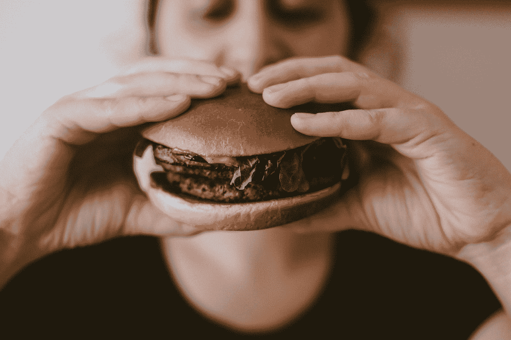

# 狗肉 vs 牛肉:这种虚伪要走多远？

> 原文：<https://medium.datadriveninvestor.com/dog-meat-vs-cow-meat-how-far-is-this-hypocrisy-going-to-go-49acbaa08f87?source=collection_archive---------6----------------------->

## 因为谁愿意和认知失调生活在一起

Photo by [Szabo Viktor](https://unsplash.com/@vmxhu?utm_source=medium&utm_medium=referral) on [Unsplash](https://unsplash.com?utm_source=medium&utm_medium=referral)

> “如果你不挑战你从未学习过的信念，你就永远不会质疑自己，所以我希望每个学生在他们生命的某个时刻都有机会拥有他们生命中最核心的东西，一些对他们生命如此重要的东西，如果他们失去了它，他们就不会再觉得自己是人，不会被证明是错的……认识到在你问问题之前假设真相、假设答案，会让你一事无成。”劳伦斯·克劳斯教授

克劳斯教授说得很好，我希望每一个人都经历过这样一种解放的前景，那就是你生命的核心被证明是错误的。

在我生命的头二十年里，吃肉是我生活的核心。一天又一天，我过着这样的生活，忘记了自己在这个不人道的马戏团中扮演的角色，忘记了我用自己的钱包支付的难以想象的无尽痛苦。

正是通过挑战我的信念，我最终解放了自己。

## 歌手的问题…

我想提出的第一个哲学观点来自彼得·辛格的开创性著作《动物解放的 T2》。辛格提出了以下问题， ***“我们追求人类平等的道德原则是什么？”***

我们始终如一地将人权应用于所有人，我们拥有这些人权的原因是**我们认识到道德价值不依赖于道德上无关的概念，如种族、性别、性或宗教。**

我们对人类的平等对待是因为人类内部的平等吗？当然不是。哲学家亚历克斯·奥康纳提出了这一点，他说“*人类是不平等的，他们不一样，我们都有不同的肤色、文化和比例。但是反种族主义并不是否认这些差异的存在。反种族主义就是说我们承认这些差异，但我们说这些差异在道德上无关紧要。这些差异不会对我们在道德伦理框架中考虑它们的方式产生任何道德差异”*

因此，我们不必否认猪或牛与人有无数不同之处，但是这些动物在感受痛苦或与孩子建立情感联系的能力方面确实与我们相似，例如，这些是我们用来赋予人类道德价值的道德相关特征。

一致性是道德发展的基石——检查我们的生活以发现不一致之处，应该总是会有一种解脱感，因为如果人们愿意睁开眼睛看到它，它为我们提供了道德发展和进步的机会。

> “问问你自己，在其他什么道德问题上，你会允许我们在动物权利问题上所允许的同样的借口——味觉享受、社会分裂、方便等等。在其他什么道德问题上，我们甚至允许这些回答被认真对待。这是我们这个时代最大的道德危机”——亚历克斯·奥康纳

## 选择特征

作为个体，我们擅长选择特征，我们相信这些特征将人类与非人类动物区分开来，从而证明治疗上的差异是合理的。

如果你是那些个体中的一员，我希望你拿出你的逻辑并与之保持一致，通过**拿出那些非人类动物所没有的特性/特征，如果一个人没有，我们会像对待动物一样对待那个人。**

举例来说，如果我和我的一个朋友交谈，他认为我们可以用我们的方式折磨牛的原因是*它们不像人类一样拥有自然选择的力量赋予我们的同样的意识。*

好吧，如果这就是原因，那么让我们始终如一地应用它——拿一个人来说，去掉他们的自我意识。这个人的所有其他方面保持不变，因为他们仍然能感觉到疼痛等。这可以在一个认知受损的孩子身上看到，他的自我意识减弱，或者和那头牛的自我意识一样。

**现在问问你自己，你同意折磨他们吗**？我不会屈服

> “问题不是，他们能推理吗？他们也不会说话吗？但是，他们能受苦吗？”—功利主义之父杰里米·边沁

所以重申一下，不吃肉并不意味着你看不到牛和人之间的区别。奶牛在很多方面都不像我们。他们不如我们聪明，他们不能欣赏莎士比亚的作品，甚至不能投票。

尽管有这些不同，那头牛和我们一样经历着痛苦和折磨，它也能和我们一样在它孩子的脸上处理痛苦，最值得注意的是，那头牛和我们一样渴望生活和避免痛苦。

所以，让我们停止把注意力的带宽集中在道德上不相关的特征上…

## 你的钱去哪了？

**我想让你想象一下，对这些奶牛、小鸡、猪等来说，一个“动物地狱”会是什么样子？**

现在，你相信这个动物地狱和这些有知觉的动物今天所处的环境有很大的不同吗？

现在，超市货架上的那块肉和作为其背景故事一部分的无休止的痛苦之间存在着令人担忧的脱节。让我告诉你几个令人震惊的行为，就在我们的眼皮底下，这个国家每天都在发生。

*   活着的雄性小鸡被放在传送带上，这只能被描述为大型研磨机，纯粹是因为它们对鸡蛋工业毫无用处。谁知道刀片旋转多少次才能最终杀死它们，希望不要太多。
*   被关在拥挤的猪圈里的猪最终会通过在遥远的乡下发现的野蛮的毒气室看到他们意识的停止，这些毒气室试图隐藏和掩盖猪的尖叫，因为它们的肺需要氧气来维持它们的生命。
*   母奶牛出生后就与它们的幼崽分离，这是一种情感上令人痛苦的经历，就像发生在人类身上一样。当这些母奶牛精疲力尽，生理上无法再产奶时，它们就会被送去屠宰。至于雄牛，它们的寿命显然要短得多。

这些动物是有意识的、有知觉的、社会性的生物。就像我们紧紧抱在怀里，视如己出的猫狗一样。

这些动物经历快乐和痛苦，以及一大堆复杂的积极和消极情绪。问问你自己，对于我们人类——地球上众多物种中的一员——来说，这是过我们生活的最佳方式吗？我们不仅允许这些行为发生，而且每天都在资助它们，创造出这种虐待狂的需求。

**一旦你开始审视自己在这个世界上的地位，不再是无限制的动物主人，而是作为一个动物自己，**——他/她的生活方式也是尽量减少痛苦和折磨，你将别无选择，只能停止或至少开始停止食用和使用动物产品。

在这种无法忍受的痛苦程度下，你所要做的就是选择菜单上的其他东西来结束这种无法想象的残酷程度。

**选择感同身受，而不是残酷无知。**