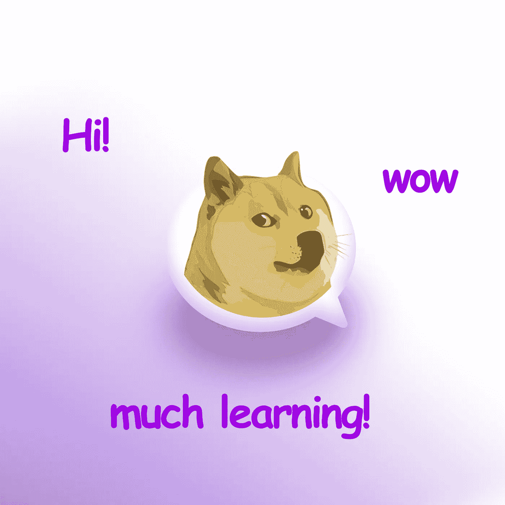

# DOGE-coin 是完美的入门级加密货币。

> 原文：<https://medium.datadriveninvestor.com/doge-coin-is-the-perfect-entry-level-3c153dfa8e24?source=collection_archive---------13----------------------->

## 正方形 9

## 今年，精通密码将变得至关重要。

这是我周一帖子的快速跟进。但是不仅仅是设计师应该理解加密——我认为它适用于每个人。慢慢地，不管我们喜不喜欢，它都成了我们的未来。

但是就像每一个吸引资金的新技术一样，诈骗比合法的项目要多。那么，你如何在不损失你一生积蓄的情况下了解这个世界是如何运转的呢？

# 简单。买一枚金币。

现在，尽管埃隆·马斯克发了这么多推文，它仍然是 0.05 美元——也就是 5 美分。

这个数额的钱应该是世界上大多数人可以管理的损失，而不会掉一滴眼泪。

但是，购买一个并看看如何在钱包之间转移它，将有助于你理解这个世界是如何运作的——而没有失去一切的风险。

因为它是一枚玩笑硬币，它背后没有任何邪恶的计划。又便宜又“为民”。这对任何人来说都是完美的入门。

只是请不要投入超过你能失去的。大多数国内投资者都会亏损。这应该是学习，而不是梦想蓝宝。

干杯！