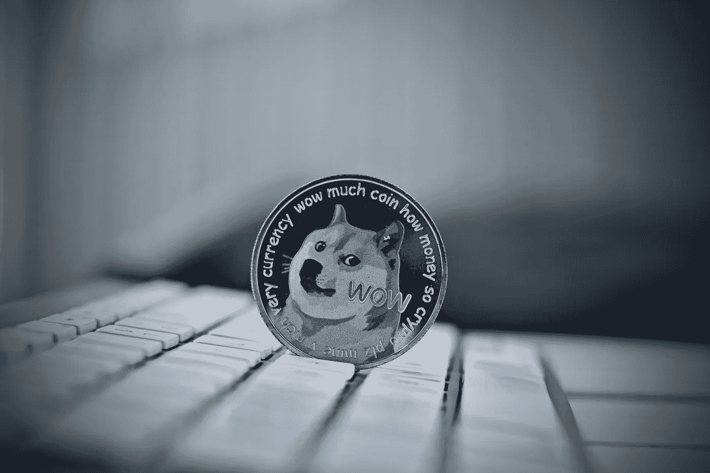
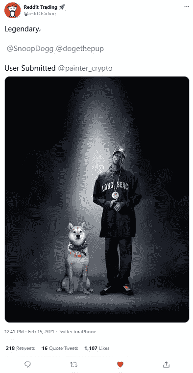
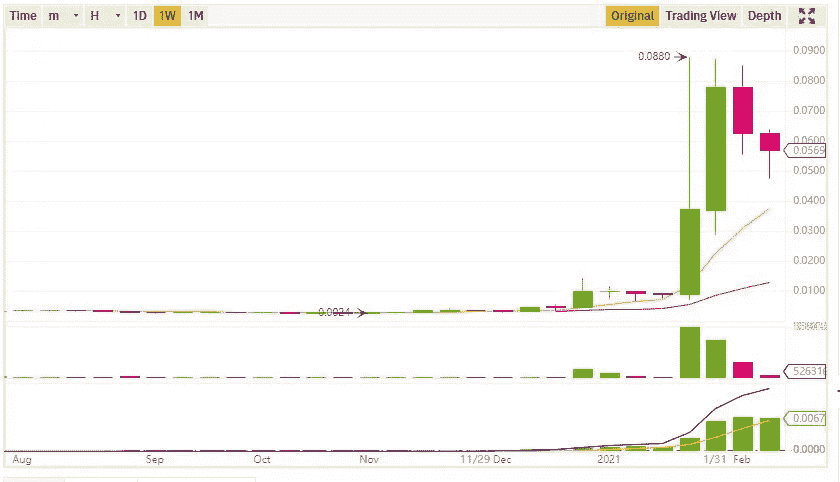
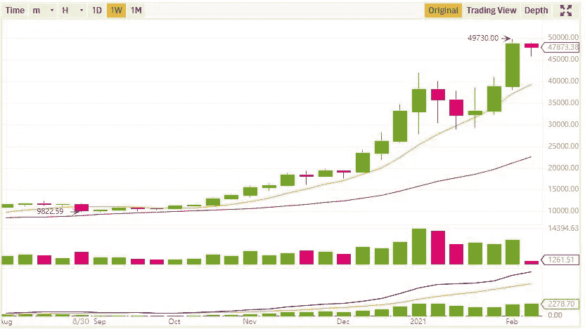
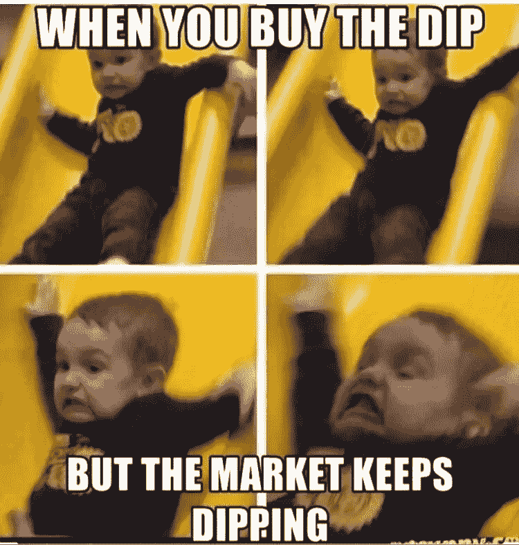
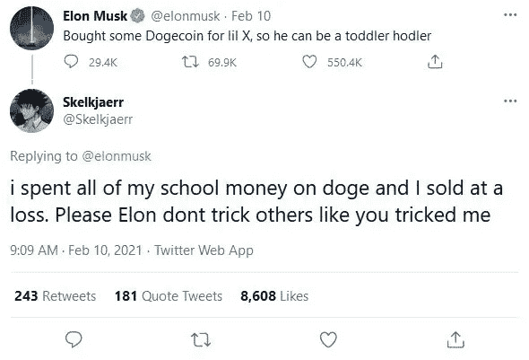

# Dogecoin 实时讲述了我们金融绝望的故事

> 原文：<https://medium.datadriveninvestor.com/dogecoin-tells-the-story-of-our-financial-despair-in-real-time-bad6377a6a7a?source=collection_archive---------1----------------------->

## 不要摇这只狗。

[Adrian Today](https://www.shutterstock.com/image-photo/digital-currency-physical-metal-dogecoin-coin-1073435141)

他们认为这会让他们变得富有。

他们中的一些人仍然在做。

世界各地成千上万陷入财务困境的朝圣者急于从今年的加密热潮中获利，他们将自己的积蓄投入到一个软件工程师在一个慵懒的下午设计的笑话硬币中。直到 2021 年金融狂潮来袭，dogecoin 基本上一文不值。

甚至像我这样几年前就听说过 doge 的人也已经忘记了。这枚硬币是互联网的遗物，就像 MySpace 和 Geocities 一样。

现在这是一个实时发生的警示故事。

尾巴在摇着狗。

字面上。

# Dogecoin 是一个等待(再次)发生的骗局。

Dogecoin 就等着被用作从穷人、没受过教育的人或者只是毫无经验的人身上获利的工具。

加密货币*已经*卷入了一个由一个名叫亚历克斯·格林的连环强奸犯经营的骗局，他在 2014 年通过一个叫 Moolah 的应用程序从 doge 那里筹集了一笔财富。然后他试图带着钱消失。现在他在监狱里，属于他的地方。

历史不会再等待重演了。

自从亚历克斯·格林以来，有人*总是*试图在 dogecoin 上运行某种骗局，要么窃取提示，要么只是抬高价格来吸引新手交易者，然后抛售。

因此，神秘力量在过去几个月里购买了大量 doge，试图制造稀缺，这不应该让任何人感到震惊。一个团体甚至雇佣了一个名叫酱爆弟弟的说唱歌手在一月份为他们做视频广告。如果 Soulja 看起来很眼熟，你可能会因为他参加 Fyre Festival 而认出他，该节日吸引了数百名有影响力的人参加一个没有表演者或浴室的岛上派对。

骗子就像僵尸一样。

他们不断回来。

# 名人开始使劲抽 doge。

有一些关于名人的东西似乎让他们想把无用的垃圾推给我们其他人。无论是 goop 还是减肥应用，他们似乎都无法享受他们已经获得的财富。他们必须哄骗绝望的、没有受过教育的人给他们更多的钱。因此，埃隆·马斯克加入了 doge 党，用源源不断的迷因推高了价格。更多的名人跳上了船。

甚至史努比·道格也出现了:

即使是现在，也没人知道他们是正式认可这项资产，还是只是在开玩笑。事实证明，这才是重点。社交媒体上的一切都是笑话，除非不是。

很多人开始上当。

他们将马斯克讽刺性的推文解读为秘密信息。他们认为百万富翁和亿万富翁在他们耳边窃窃私语，说总督将接管世界。因此，他们开始把积蓄投入其中，害怕错过又一次把钱变成利润的机会。

# Doge 占领了互联网。

到了超级碗的时候，互联网对一只小狗的关注超过了实际的赛场。该社区的 Reddit 页面吸引了超过 100 万名订户，其中大多数是无法停止发布“HODL！”之类消息的新手和“我有钻石手！”有帖子问初学者类似这样的问题，“我如何购买 doge！？！?"

那些之前甚至对加密货币没有表现出足够兴趣来批评它的人现在突然将数千美元投入到他们几乎不理解的东西中。他们中的一些人实际上是在等待工资结算，这样他们就可以买更多的东西。

他们不知道他们将面临什么。目前，他们的情况看起来并不好。根据我在币安看到的图表，以下是总督的每周展望:

看到那些向下的红色直线了吗？

那就是*不好的*。

比较 doge 和比特币的趋势:

财务自由的承诺可以关闭你的大脑，所以许多新的 doge hodlers 不看图表。他们不会考虑*该买哪个*密码，或者他们是否应该买。

他们只知道世界首富和世界最著名的说唱歌手鼓励他们无中生有，这就是美国方式。他们所要做的就是买几千美元的 doge，然后坐下来发布迷因。

他们让这看起来很容易。

# 每个人都得了疯牛病。

对总督的兴奋仍在继续。广告牌开始在全国各地涌现，Redditors 也热衷于张贴它们。美国消费者新闻与商业频道在 doge 迅速上升到十大加密货币中做了一点。故事出现在金融新闻媒体上。

人们变得疯狂。

许多在 Reddit 上发帖的新手投资者都不知道较小的替代硬币可以在一天内上下波动多达 30%。事实上，许多人就是这样通过观察趋势并操纵它们来从这些货币中赚钱的。

那样你可以赚上千。一点都不难。你只需要一个大的银行账户，和大量的空闲时间。

大多数人不会。他们在情感上依恋他们的金钱，这在今天的经济中是有道理的。他们没有耐心等待令人不安的暴跌。他们只是*认为*他们知道，直到紧急情况出现，他们意识到他们所有的现金都被绑在密码里。

这是个问题。

# 事情开始变得不稳定。

没多久就看清楚了是怎么回事。Doge 吸引了成千上万的新来者，他们有着商人的渴望，却没有知识和资源。

doge coin 的最初创造者试图警告他们，但他的帖子消失了。

道格·霍德勒开始有这样的感觉:

正如你所料，dogecoin 的价格在飙升后开始波动。人们恐慌是有原因的。他们中的一些人使用退休储蓄或大学学费。没过多久，他们就开始发布绝望的信息，比如“停止销售！我真的需要这个！!"

随着价格的持续上涨和下跌，他们中的很多人犯了典型的新手恐慌性抛售的错误。

像这样的孩子损失了数千美元:

数百名愤世嫉俗的投资者回复了这类推文，堆积了大量令人欣喜的判断和嘲笑。

有些特别苛刻:

那些评判新手投资者的人实践了他们自己的一种道德幼稚。他们似乎没有意识到他们直接从这些新来者身上获利，甚至掠夺他们。

他们在吹嘘它。

当你更多地了解这样做的人，尤其是他们的价值体系时，这并不奇怪:

当然，不道德的特朗普支持者会是经典的抽送方案背后的人。这对他们来说是完美的行为。

这就是他们的英雄所做的。

他们就像他一样。

# 很容易判断绝望的人。

我们中的大多数人都会对当下米姆股票上涨期间展现出来的无知嗤之以鼻。我自己也曾就此开过玩笑和冷嘲热讽，只是看到一些人把我当回事。

所以我不得不开始更加小心。我们忘记了真正的绝望会让我们做出什么。

它会驱使你做出违背自身利益的行为。

当涉及到金钱和健康时，美国的 T2 总是鼓励神奇的思考。我们总是一头扎进下一个泡沫，确信这一次一切都会迎刃而解。与此同时，我们责怪人们落入我们为他们设置的陷阱。

我们似乎从来没有问过像埃隆·马斯克这样的人有什么责任，或者*他*是否应该表现出更多的自我意识和克制。相反，他经常表现得像个 14 岁的孩子。关于多吉的话题，只有当记者向他施压时，他才承认自己“主要是在开玩笑”第二天，他又做了同样的事情。

他就是不明白。

影响力越大，责任越大。

如果世界上最富有的人能停下来一分钟，反思一下他的地位对弱势群体的影响，那该多好。也许他可以收敛一下他的推特习惯，至少在涉及到玩弄普通人的财务状况时。

当然，他很可能不会。