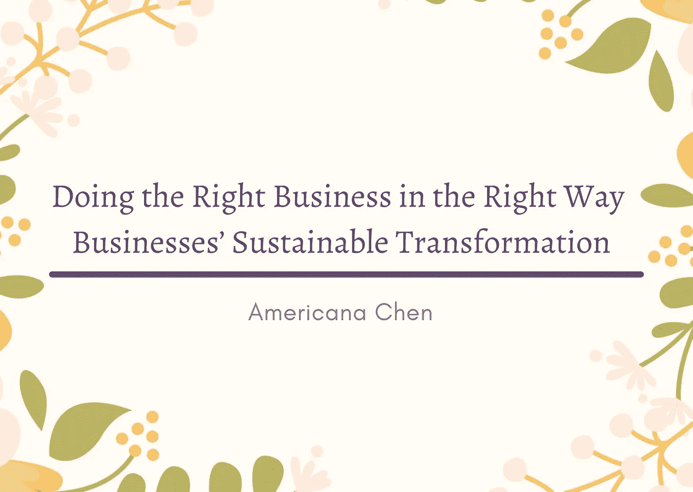

# 以正确的方式做正确的事情:企业的可持续转型

> 原文：<https://medium.datadriveninvestor.com/doing-the-right-business-in-the-right-way-businesses-sustainable-transformation-c4a3824482f0?source=collection_archive---------26----------------------->

2020 年对企业来说是决定性的一年，因为他们面临着全球范围的封锁和运营限制——无数企业无法承受来自疫情的压力。

## 然而，无论何时，只要有挑战，就有机会。

政府、消费者和整个社会越来越意识到可持续性问题，这可能是企业的一个关键转折点。企业能否适应这种“新常态”,能否满足各利益相关方对 ESG 的期望，将决定它们在未来十年竞争市场中的地位。

商业是经济增长的核心。虽然消费者行为也是推动可持续发展的一个决定性因素，**企业生产的产品及其生产方式仍然是经济产出的基本驱动力，也不可避免地是不可持续做法的最大来源。**

SOURCE: Unsplash

意识到企业在经济可持续发展中发挥的关键作用，消费者和监管机构通过推动企业实践的可持续转变，对企业施加了越来越大的压力。

**那么，企业为什么以及如何实现可持续转型？**有机会参加由国际可持续发展研究所主办的 [**可持续发展峰会**](https://www.facebook.com/watch/InstituteISD/) 让我看到了一些思考可持续业务转型的独特视角，在本文中，我将分享我的一些见解。

# 可持续转型的动机

**社会正在经历一场范式转变，传统的商业运营标准和态度也在发生变化。**如今，企业在反映其生产过程时，必须了解法规变化和消费者的期望。企业不像过去那样，仅仅为了降低成本，就想建造一个屋顶上有巨大烟囱的工厂。

**消费者对可持续发展相关问题越来越敏感，企业必须做出相应的反应，以满足顾客的期望**。

## 需求不再是一个量化的指标，而是一个定性的指标。因此，经历可持续转型不再是大公司的奢侈品，而是所有企业的必要过程。

伴随这一挑战而来的是巨大的商机。能够适应绿色商业模式的企业看到了更多的客户参与、品牌忠诚度，以及在适应监管变化方面更大的灵活性。专注于绿色技术和绿色制造的企业现在可以利用其独特的竞争优势，在市场中建立更好的地位。

> “我们的消费者对社会和环境问题非常敏感……在过去的十年里，我们在这些问题上与他们积极接触，他们作为消费者已经变得非常了解这些问题。他们特别询问有关环境政策、工人权利和产品安全的信息。"
> 
> ***—***Adriatica(意大利最大的零售商)合作社的董事 Walter Dondi

## 然而，说起来总是比做起来容易。

尽管越来越多的企业已经意识到转型的紧迫性和必要性。世界自然基金会雨林行动网络关于主要公司在减少毁林方面表现的年度记分卡报告明显显示，在接受调查的 173 家公司中，只有 15 家表现良好并“领先”。公司不能只关注他们的生产过程；需要全面应用绿色技术，从材料采购到回收，再到识别消费者行为、定价、营销等方面的变化。总有地方可以开始。

# 企业应该如何反思他们的可持续发展承诺？

## 1.重新思考风险管理流程

企业没有必要通过外包专家 ESG 顾问来建立一个全新的 ESG 部门，以启动其转型过程。相反，企业可以采取风险管理的观点。在评估他们的生产过程时，企业应该考虑两个问题:

*   **社会风险在哪？**
*   **环境风险在哪？**

每个问题都需要在生产过程的不同部分进行评估。例如，如果你的生产过程中有一个阶段严重依赖于农业，那么你应该警惕该阶段潜在的环境风险，并因此制定具体解决这一问题的策略。**一种结构化的集中方法可确保所有组件都符合标准并经过仔细检查。**

## 2.绘制您的价值链

你的价值链是什么？价值链显示了企业如何在生产的每个阶段增加产品的价值。当开始评估你的价值链时，企业需要更多地了解在每个阶段与之合作的各方。在价值链的每个阶段，企业应该能够**识别不同的供应商**。企业关注供应商的**可持续发展承诺至关重要。**企业需要问自己**是否所有的供应商都符合他们自己的可持续发展目标，他们是否致力于追求可持续发展目标。**

## 3.释放伙伴关系的力量

除了意识到控制其内部风险管理流程之外，企业与外部合作伙伴**合作也是极其重要的。外部合作伙伴可以包括政府、非政府组织、当地社区、压力团体和全球社区，这取决于每个企业特定的发展阶段和商业模式。**因此，每个企业都需要后退一步，利用他们对自己业务的了解，思考他们如何运营，并确定他们在每个运营阶段需要与哪些外部合作伙伴互动。**在我之前的文章《[成功的业务可持续转型的关键——与外部利益相关者合作》中，我详细阐述了企业应该如何与每个外部利益相关者互动，以确保高效和成功的可持续转型进程。](https://www.enlightmentblog.com/post/key-in-successful-business-sustainable-transformation-engaging-external-stakeholders)**

> “在我看来，未来成功的公司将是那些整合商业和员工个人价值观的公司。最优秀的人希望在一个他们共享价值观、他们的行动有价值、他们的观点有意义的公司里做对社会有贡献的工作。"
> 
> ***耶鲁安·范德维尔(壳牌公司常务董事委员会)***

# 结束语

步入一个全新的时代，价值创造不再仅仅由股东的价值来定义。**商业价值现在在于它对所有利益相关者的影响，包括环境和生态系统。**来自客户、监管机构和社区的问题已经将企业推到了可持续转型的边缘，我认为可持续转型不应仅仅被视为一种挑战。

## 通过审计和跟踪 ESG 绩效，公司可以确定要采取的具体行动，以通过创新和有效的方法提高效率、改善利益相关者关系并管理公司风险。