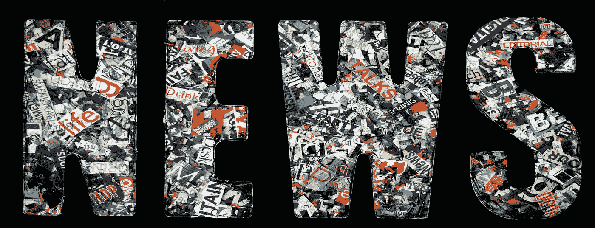
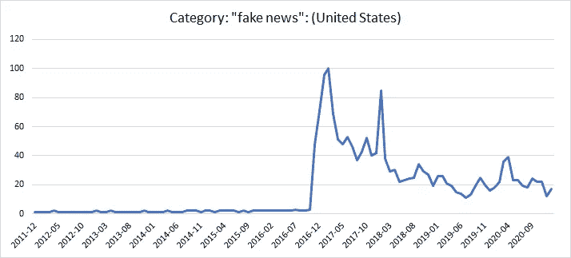
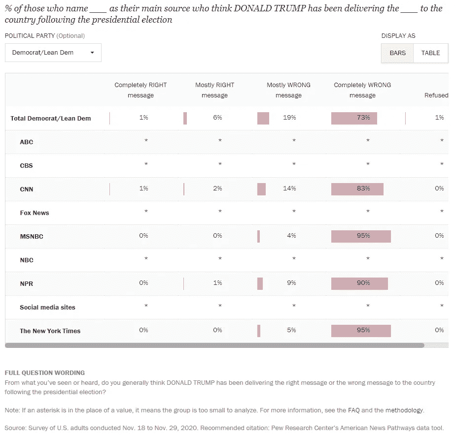

# 新闻自由是一种幻觉

> 原文：<https://medium.datadriveninvestor.com/dominate-the-media-control-the-narrative-create-an-illusion-and-the-world-is-yours-d6f3abab1bf6?source=collection_archive---------5----------------------->

[Charles Taylor via Adobe Stock](https://stock.adobe.com/au/contributor/17182/charles-taylor?load_type=author&prev_url=detail)

## 媒体的公司所有权正在操纵叙事，扼杀民主，这可能是故意的。

四年的无能、腐败、混乱、阴谋、内乱、操纵和令人憎恶的领导，7400 万人投票支持更多。种族主义、恐惧、身份政治和无视特朗普的失败赢得了大量选票，但不可否认的是，散布虚假信息是最大的赢家。对国会大厦的围攻不仅仅是发脾气；成千上万的人真的认为选举被偷走了。

对来自网站、机器人、地方和国家电视、广播、媒体和政治家的信息的协同攻击，但谁是幕后黑手，为什么？任何理智的人都知道，特朗普不是试图从虐待狂政治和富裕恋童癖的国际阴谋集团中拯救儿童的英雄。除了特朗普的自我，谁会从特朗普的总统任期中受益，摧毁民主是计划吗，或者动乱值得回报吗？

政客们很久以前就埋下了不信任的种子；有无数战争可以证明这一点，但特朗普 2016 年的竞选活动培养了对生活的不信任和对新闻业的彻底怀疑；那是新的。特朗普从字面上和象征性地创造了“假新闻”一词。

[Google Trends: Fake New](https://trends.google.com/trends/explore?date=2010-12-17%202021-01-17&geo=US&q=%22fake%20news%22)

今天，缺乏责任感是意料之中的，是可以接受的，质量控制也没有受到质疑。川普不准确的推文淡化了疫情，促使私营企业承担起政府的角色。至少有人担心他们会对飙升的死亡人数负责。

在美国乃至全球范围内，统一、同步的术语出现在社交媒体上。重构叙事的计划议程主导着在线新闻、政治言论、广播和电视网络。令人毛骨悚然的是，一群人被设计来重复和传播不准确的信息。

[Sinclair’s Soldiers in Trump’s War on Media — Deadspin](https://www.youtube.com/watch?v=_fHfgU8oMSo)

在特朗普 2017 年 1 月 20 日就职典礼的当天，他发布了他的第一个[封口令](https://gizmodo.com/national-parks-service-owns-trump-on-twitter-one-last-t-1791442451)。一天后，斯派塞(还记得他吗？)声明媒体错误地报道了就职典礼人群的规模，第二天 Kellyanne 引入了“替代事实”一词。在特朗普当选总统的第一周，他向媒体宣战，发布了多项封口令，称赞福克斯，同时声称 CNN、NYT 和 WP 是“假新闻”，逮捕并指控了六名记者，并结束了对举报者的保护。第一周。

新闻媒体是自我监管的，像任何企业一样，主要目标是盈利，取悦股东，最后是服务公众，但情况并非总是如此。新闻业是一项公共服务，但在 1996 年，大企业花费数十亿美元推翻了相关规定，联邦通信委员会(FCC)决定忽略其保护公众免受媒体垄断的职责。

广播多样性和所有权在 21 年间大幅下降。解除对 1996 年电信法案的管制以增加竞争和消费者的选择，让我们的家园向自由市场的垃圾敞开大门。取消消费者保护法创造了一个利润驱动的行业，错误信息和宣传的道路铺平了。今天，[六家公司](https://techstartups.com/2020/09/18/6-corporations-control-90-media-america-illusion-choice-objectivity-2020/#:~:text=As%20of%20September%202020%2C%20the,Fox%20News)%2C%20and%20Viacom.)拥有 90%的媒体。

**我们现在的过去:**

[**1996 年解除电信管制法案**](https://www.fcc.gov/general/telecommunications-act-1996)

> 这项新法律的目标是让任何人都可以进入任何通信行业——让任何通信行业在任何市场与任何其他行业竞争。1996 年的电信法案有可能改变我们工作、生活和学习的方式。它将影响电话服务——本地和长途电话、有线电视节目和其他视频服务、广播服务以及向学校提供的服务。

**1996 年 Nexstar 广播集团**

> 1996 年，广播行业先驱、Nexstar 董事长兼首席执行官 Perry A. Sook 收购了宾夕法尼亚州斯克兰顿市的电台 WYOU，创立了 Nexstar，并开始为 20 多年后成为美国最大的本地广播电视和媒体公司奠定基础。
> 
> 在 2019 年完成对 Tribune Media 的收购后，Nexstar 成为美国最大的本地电视广播和数字媒体公司，在 116 个市场拥有 198 个全电力拥有或服务的电视台，覆盖约 63%的美国电视家庭。— [Nexstar 广播集团](https://www.nexstar.tv/history/)

**辛克莱广播集团**

> 1996 年—1996 年《电信法案》的通过是行业变革的最大催化剂之一，它规定了一些放松管制的措施，并允许公司进行收购。在成立后的 10 年内，辛克莱成为美国最大的商业电视广播公司。
> 
> 在 88 个市场拥有、运营 190 家电视台和/或为其提供服务；是国内领先的本地新闻提供商；拥有多个全国性网络；并拥有所有主要广播网络的电视台。Sinclair 的内容通过多种平台交付；(…)无线、多频道视频节目发行商和数字平台。——[辛克莱广播集团](https://sbgi.net/history/1990s/)

**1996 年福克斯新闻频道频道**

> 自 1996 年 10 月 7 日开始运营——福克斯新闻频道(FNC)是一个 24 小时全方位新闻服务，提供突发新闻以及政治和商业新闻。作为有线电视的头号网络，FNC 已经连续 18 年成为收视率最高的电视新闻频道。福克斯公司旗下的 FNC 拥有近 9000 万个家庭，在有线新闻领域占据主导地位，经常进入该类型的十大节目。— [福克斯新闻频道频道](https://en.wikipedia.org/wiki/Fox_News)

世界新闻自由指数对 180 个国家的新闻自由进行评估和排名。在过去四年中，美国排名在 41 到 49 之间，到 2020 年，东加勒比国家组织排名 44，美国 45，巴布亚新几内亚 46。对于认为新闻自由非常重要的 80%的美国人来说，这看起来并不好。

皮尤研究中心美国新闻途径在六年间通过调查 15，134 名参与者收集了美国新闻习惯的数据。共和党和民主党的大量数据显示:

**84%的共和党人**宣称福克斯新闻频道是他们的主要新闻来源，认为川普在 2020 年竞选活动中的信息完全正确或基本正确。

[Pew Research Center American News Pathways](https://www.pewresearch.org/pathways-2020/ELECTTRUMPMSSG/main_source_of_election_news/republican_lean_rep)

**0%的民主党人**将福克斯新闻频道作为他们的主要来源，并认为川普在 2020 年竞选活动中的信息完全错误或基本错误。

[Pew Research Center American News Pathways](https://www.pewresearch.org/pathways-2020/ELECTTRUMPMSSG/main_source_of_election_news/democrat_lean_dem)

但是沉住气，民主党人！美国有线电视新闻网、MSNBC、NPR、NYT 和福克斯新闻频道都遵循同样的自律问责标准。美国有线电视新闻网和 MSNBC 被媒体垄断，一个富裕的家庭拥有和经营 NYT，唯一独立的非营利上市公司是 NPR。它依靠赠款、企业赞助和订阅费来为其运作提供资金，但它也不能免受偏见和胁迫。

福克斯新闻频道以其保守的宣传信息而闻名，而在光谱的另一端，CNN 和 MSNBC 也发表了相当多的自由言论，但这些网络只是一长串言论的开始。广播公司的所有者有一个政治议程，他们不隐藏也不需要隐藏。Sinclair 强迫其众多的地方电视台运行“亲特朗普”和右翼政治意识形态，大多数观众不知道这些电视台属于 Sinclair，因为它们的品牌没有显示出来。

辛克莱没有为了国家的利益而分享右翼意识形态。它的新闻正在帮助美国民主的不稳定，它的目的可能比贪婪和极端偏见更邪恶。历史学家南希·麦克莱恩偶然发现的[锁链中的民主](https://www.penguinrandomhouse.com/books/533763/democracy-in-chains-by-nancy-maclean/)揭露了新自由主义者通过缝合公众的不信任来瓦解民主政府的议程，到目前为止，一小部分新自由主义者正在获胜。

通过假设把这些点放在一起是不够的，但是麦克莱恩证明找到证据不是不可能的。媒体垄断花费数十亿美元解除管制的电信法，1996 年，但媒体背后的新自由主义议程摧毁我们的民主吗？我害怕答案。