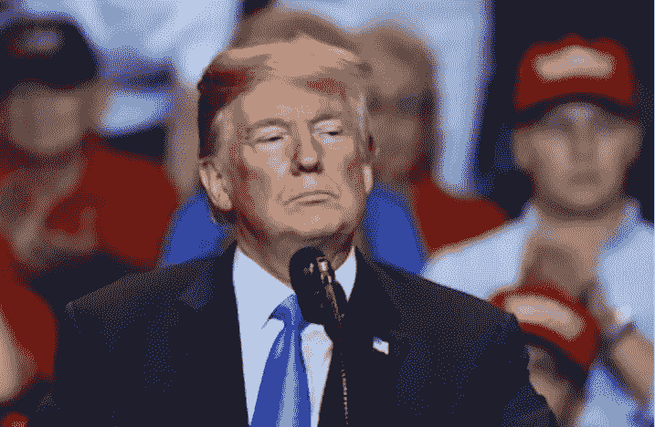

# 唐纳德·特朗普不是女王妈妈

> 原文：<https://medium.datadriveninvestor.com/donald-trump-is-no-queen-mum-4d1d38eb9fe2?source=collection_archive---------11----------------------->

## 共和党必须交出总统。

Image courtesy of Evan El-Amin/Shutterstock.com

讽刺可能比我们所有人都长寿。今天，沃尔玛宣布[顾客现在被要求](https://www.cnn.com/2020/07/15/business/walmart-masks/index.html)在他们的店里戴口罩。

当沃尔玛为美国人民做的比他们的总统还多时，总统该走了。

我知道我们两个政党在意识形态上有分歧。我明白我永远不会同意共和党的议程。

 [## 不是数据驱动的政治辩论投资者

### 《纽约时报》在 2020 年 6 月 3 日在线发表了阿肯色州参议员汤姆…

www.datadriveninvestor.com](https://www.datadriveninvestor.com/2020/06/08/the-political-debate-that-has-not-been/) 

然而，被要求处理来自我自己政府的假消息让我筋疲力尽。这是对信任的令人不寒而栗的背叛。

当然，任何美国公民都不应该在疫情期间反对[的虚假声明。](https://www.theguardian.com/us-news/2020/apr/14/trump-coronavirus-alerts-disinformation-timeline)病毒不是政治问题。

然而，我们在这里。认为美国人可以在危机面前团结一致的想法突然变得天真了。对于我们这些经历过 9/11 的人来说，难以置信的是我们已经瓦解到目前的状态。

被要求相信唐纳德·川普有能力领导我们的国家度过[新冠肺炎·疫情](https://www.who.int/emergencies/diseases/novel-coronavirus-2019)是荒谬的。我们无法熬过他剩余的任期。

这样一个短语可能被认为是夸张的；我认为不是。佛罗里达有破纪录的新感染人数。从灾难性的春天回来后，纽约发布了针对 22 个高感染率州的旅游建议。

仅仅是跟踪新闻和吸收总统所说的话，工作量是非常大的。他昨天的发布会简直无法形容；共和党对他的盲目忠诚令人震惊。一次又一次，我想知道为什么这么多人认为他们的事业比国家的命运更重要。

川普没有领导反对疫情的斗争，而是领导了反对真理的斗争。共和党领导层的沉默是可耻的。

领导者的第一步也是最基本的一步是以身作则。在危机时刻尤其如此。我想起二战时王太后说的话，当时她自己也是女王。当被问及她的孩子是否会离开英国时，她回答道:

*除非我离开，否则孩子们不会离开。除非他们的父亲离开，否则我不会离开，国王在任何情况下都不会离开这个国家。*

Image of statues of Elizabeth the Queen Mother and King George VI courtesy Chris Dorney/Shutterstock.com

如果你想知道为什么英国皇室仍然存在，你可以打赌这些话与此有很大关系。

唐纳德·特朗普不是女王妈妈。他花了四个月的时间才在公共场合戴上口罩。这是[任何处在他位置上的人都必须做的最基本的动作](https://www.politico.com/news/2020/07/14/trump-urges-americans-to-wear-masks-361836)。他玩忽职守是新冠肺炎失控的原因之一。

他是个坏影响。过去的几天告诉我们这一点。

周一，总统转发了一位上了年纪的游戏节目主持人的阴谋论。这条推文声称大多数医生都在对我们撒谎。

特朗普甚至没有足够的判断力知道转发[查克·伍尔里](https://en.wikipedia.org/wiki/Chuck_Woolery)看起来很糟糕。总统不知道更好的是告诉他的精神敏锐。当退休的游戏节目主持人提出的阴谋论得到白宫的认可时，我认为可以有把握地说，该走了。

昨天，在一个可怕的举动中，白宫宣布从疾病预防控制中心剥夺新冠肺炎数据的控制权。这是一个毫无理性可言的举动；除非，也许你想操纵数据。

这辆车的刹车坏了。它会崩溃是必然的。白宫没有足够的责任去积累这些数据。

我们的情况很简单。没有总统，我们面临着严重的危机。他花费精力否认这一点。

共和党人必须深入挖掘，迫使他下台。我不在乎他是否辞职，或者他们开始推进第 25 修正案。共和党必须召开会议，并制定一项战略来摆脱特朗普。

是时候看看他们是否像他们希望我们相信的那样忠于国家了。我们目前的情况是站不住脚的。

**进入专家视角—** [**订阅 DDI 英特尔**](https://datadriveninvestor.com/ddi-intel)