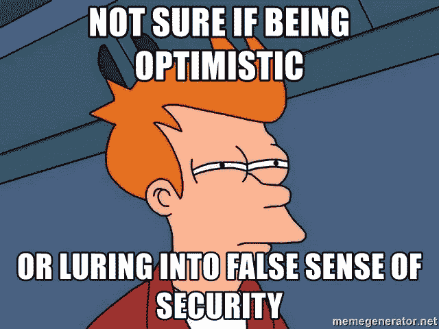

# 不要让自己陷入一种虚假的安全感，否则你会失去工作或伴侣

> 原文：<https://medium.datadriveninvestor.com/dont-allow-yourself-to-lull-in-a-false-sense-of-security-or-you-ll-lose-your-job-or-partner-97dce6fcd6e6?source=collection_archive---------2----------------------->

*不要等到有人威胁到你的地盘*

## 对于我们大多数人来说，一个普通的工作日场景应该是这样的:

舒服地坐在办公椅上，喝着我们的第三杯咖啡，第 12293 次滚动浏览社交媒体，查看同事的新八卦，玩 CandyCrush，看 Youtube 视频，直到我们无聊透顶。

除了工作，我们在做**所有的事情**。显然，不是每个人都有这种激动人心的办公室生活，但我想很多人都有。如果不是，我无法解释为什么在许多公司，高效工作是一个如此重要的问题。

无论如何，我不会写效率，但两周前，我在办公室里让一名负责我们公司互联网业务的员工**把任务**交给我。我问他是因为他被要求完成那个项目已经有几个月了。

反应可想而知。*“你为什么需要这些文件？我本来打算做的，只是没时间？”他显然受到了压力和威胁。*

我走出房间，立即想到了这个问题: ***“你为什么不在别人威胁你要做这件事之前好好做好自己的工作？”***

没错，这个问题让我想到了我们很多人在工作和恋爱中都会遇到的一个问题:

是对工作和/或伴侣的态度让我们半心半意地对待工作和感情。

这看起来像什么？

## **在我们的工作中:**

*   我们可以双手被绑着做我们的工作，因为我们非常了解我们的工作；我们在自动驾驶仪上做一切事情，在某种意义上是自动的。
*   我们完成了大部分的任务，没有过多的思考，也没有意识到。我们这样做是因为我们习惯于这样做。
*   有时候，我们 9/5 的工作变得很无聊，因为我们对自己的职业了解太多(不是全部)。我们把它看作是普通而不特殊的东西。
*   我们感觉不到想要**改变**任何事情的冲动，发展或**了解更多关于某个/新话题的**，这可以**增强我们对工作中一些重要方面的理解**。
*   我们**不会挑战**自己，也不会走出我们**的舒适区**，尽管我们知道**的舒适扼杀了潜力和机会**。

## 至于我们的关系:

*   我们对待我们的长期伴侣**就像我们的手被束缚住了，我们的眼睛**被蒙住了**。我们在这里也处于自动驾驶状态。**
*   **我们失去了发现伴侣精神和身体差异的能力。**
*   **我们没有付出足够的努力来维持健康平衡的关系。**
*   **有时候，我们和伴侣一起做的事情变得很无聊，因为我们经常去**同样的地方、** **见同样的人、**等等。所以，我们不要尝试**新奇刺激的**事物。**
*   **我们看不出了解我们伴侣的不同方面有什么意义。我们认为我们了解他们的一切(他们的缺点、优点和弱点)。就好像我们不需要**知道其他的**。**
*   **然而最有害的事情是，我们把我们的伴侣视为理所当然，这甚至不需要解释，因为我们都知道把某事/某人视为理所当然会导致什么。**

## **但当有人威胁到“你的地盘”时会发生什么？**

**当我们部门的**新同事**做同样的工作，我们已经受够了，**比我们**强，我们该如何反应？**

**当某个男生/女生和我们的*【无聊】*伴侣**调情时，我们会有什么反应？****

## **我们的占有欲很强！**

**这就像一个**的警钟** : *“嘿，懒虫，有人要拿走你的东西了！”***

**如果有人**危及**’*我们的领土*，就好像我们已经把**脏窗户**擦干净了。它**清除了我们的视野**。**

****

**就像猫鼬 GIF 一样，我们焦虑地环顾四周，问自己:**

*   ****危险**来自哪里？**
*   ****谁**是谁？**
*   ****s(他)想要什么**？**
*   **我是不是陷入了**困境**？**
*   **我会失去工作/伴侣吗？**
*   **我是不是对自己过于自信了？**

**我们变得更加**意识到**我们的**环境、处境和我们的行为。如果你愿意，我们可以从不同的角度来看。****

**不再只是 **9/5 工作**和**无聊的关系**；你可能是问题的一部分**的可能性也开始发挥作用。****

**这是一个简单的解释,一旦有人比你做得更好、更热情，或者和你的伴侣调情，你就开始问这个问题:**

# ****她(他)在我的工作或我的伴侣身上看到了什么我没有看到的东西？****

## **那我们应该怎么做才能不丢掉工作/关系呢？**

**这里的关键词是**承诺！****

**忠于你的工作和你的伴侣！**

**承诺的含义是**无论如何都要奉献**。即使你的工作或关系有时很无聊，没有挑战性，也要努力做到最好。**

**此外:**

1.  ****不要**自我放纵**！永远争取更好的关系，更好的工作。****
2.  ****不要等到有人**威胁到*你的地盘！总是努力在你的工作和人际关系中茁壮成长。*******
3.  ****不要把你的工作/伴侣看作是你已经**了解得足够多的事情。你总能学到新的方面和方面。******
4.  ******永远不要**太**自满！有很多人比你更有野心，也更有魅力。你最好小心点！******

****最重要的是，永远不要让自己陷入一种虚假的安全感。****

****正如迈克尔·米德说得好:*“虚假的安全感是唯一存在的一种。”*****

****虚假的安全感总是意味着虚假的自我感和环境感！****

****通过 100%的投入来保持你的窗户干净和你的眼睛睁开！****

****感谢阅读。:-)****

****哈蒂斯****