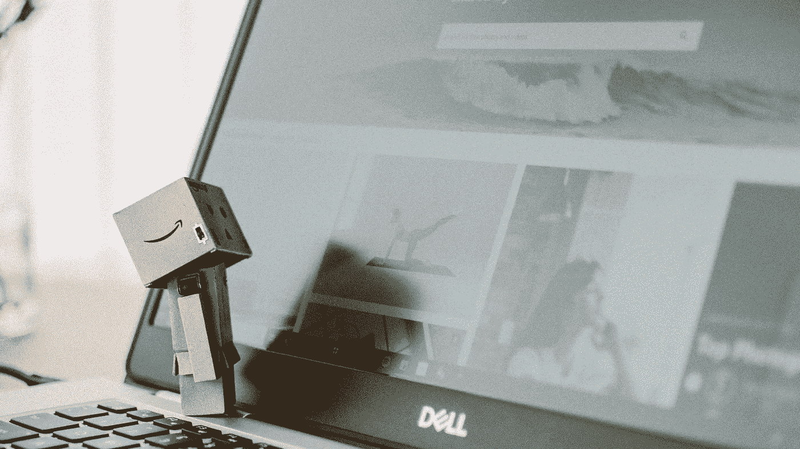

# 不要害怕稀释

> 原文：<https://medium.datadriveninvestor.com/dont-be-afraid-of-the-dilution-cd5da252bcf7?source=collection_archive---------16----------------------->

## 阅读 3 分钟——思考一天

## 高科技初创企业的一个永恒话题

Canva Pro Image

总是同样的故事。一位“放入任何你想要的领域”的科学家发现了一项震撼社会的火箭科学突破——改变游戏规则的创新发明。

她得到了技术转移部门的帮助，组建了一个可靠的创始人团队，他们通过了潜在的致命讨论，即如何在他们之间分割在现阶段毫无价值的 100%股权。

为什么致命？我看到团队在划分股权时失败了，在开始的时候没有真正的价值。是—零值。没什么。没有。不要。

一个想法、一个公司外壳和一个尚未完成任何事情的团队

> 一文不值

一毛钱也没有。

很多团队在这个谈判过程中熄火；只有少数存活下来。

他们开始运作并很快发现，我们需要钱来继续推动发展。朋友、家人、大学预算和公共基金已经被掠夺一空，所以应该转向真正的投资者。

这些投资者会问一些常见的问题:

*   你需要多少钱？
*   我们能得到多少股权？

标准的问题，然而，叹息和抱怨开始了。

> 邪恶的投资者想要夺走我们宝贵的股权

我们不再拥有 100%的股份，只拥有 70%的股份。这应该在哪里结束？下一个投资者想要更多，很快我们将只拥有我们酷公司 11.1%的股权。让我们不要拿钱，让我们挨饿，多受一点苦。

你不相信我的话？我经常和初创公司的创始人进行这样的谈话，在讨论中消除他们对损失的恐惧。

如果你想创办一家公司，但不是亿万富翁，接受投资者会向你索要股份的现实。也没关系。

一个亲首席财务官将把财务故事放在一起，这将推动价值向北，而你的股权比例将向南。团队中有这样一位专业人士，你最终将获得 10 %- 20%的股份，估值将比最初高出“无限”倍。

记得吗？你的公司在成立一分钟后的价值是——一文不值。

如果对我的话还有疑问，看看亚马逊及其创始人兼长期首席执行官杰夫·贝索斯的故事:

杰夫·贝索斯在 1994 年用自己的钱和父母的一些钱创建了亚马逊。互联网上说，他后来开了 60 次会，又进了 100 万美元，购买了亚马逊 20%的股份。

凯鹏华盈以 800 万美元加入了首轮融资，该公司于 1997 年首次公开募股，股价为 18 美元。

通过谷歌快速搜索，没有太多关于这几轮细节的信息，但我们知道的是，2020 年杰夫·贝索斯持有亚马逊 11.1%的股份，这使他在 2020 年 8 月成为 2000 亿美元的人，当时亚马逊的股价达到了历史最高水平。

下一次，我亲爱的创始人，当你害怕稀释时，想想杰夫·贝索斯——2000 亿美元的人。

 [## 物联网与集群报告(下)|数据驱动的投资者

### 就竞争力而言，基本上有五个行业将从物联网技术中受益最多:-工业…

www.datadriveninvestor.com](https://www.datadriveninvestor.com/2020/05/23/internet-of-things-and-clusit-report-part-ii/) 

自 1999 年以来，我是各行各业公司的执行官、顾问和教练。我专攻企业发展和金融，从种子轮到 IPO 级别，从 2006 年开始专注于生命科学。

[**加入我的邮件列表，保持联系！**](https://mailchi.mp/5a50875fb5ea/newsletter)

# 来自互联网的故事:

 [## 杰夫·贝佐斯

### 1994 年，杰夫·贝索斯在西雅图的车库里创建了电子商务巨头亚马逊。他以首席执行官的身份运营该公司，并拥有 11.1%的股份…

www.forbes.com](https://www.forbes.com/profile/jeff-bezos/?sh=28cc2b31b238)  [## “亚马逊”并不是杰夫·贝索斯公司的原名，还有其他 14 个鲜为人知的事实

### 自公司成立初期以来，亚马逊及其首席执行官杰夫·贝索斯已经走过了漫长的道路。从一个书商开始…

www.businessinsider.com](https://www.businessinsider.com/jeff-bezos-amazon-history-facts-2017-4?r=DE&IR=T)  [## 亚马逊创业故事-可资助

### 简介这个创业故事的主角是亚马逊的创新创始人杰弗里·贝佐斯(Jeffrey P. Bezos)。该公司，现在…

www.fundable.com](https://www.fundable.com/learn/startup-stories/amazon)  [## 凯鹏华盈|创造历史

### 凯鹏华盈承诺尊重和保护您的隐私；如有任何疑问，请联系 sbiglieri@kpcb.com

www.kleinerperkins.com](https://www.kleinerperkins.com/)  [## 杰夫·贝索斯不得不召开 60 次会议为亚马逊筹集 100 万美元，将 20%的股份让给早期投资者

### Amazon.com 差点没能走出大门，年轻的杰夫·贝索斯遇到了一个普通的企业家…

www.geekwire.com](https://www.geekwire.com/2013/jeff-bezos-60-meetings-raise-1m-amazoncom-giving-20-early-investors/) 

## 获得专家观点— [订阅 DDI 英特尔](https://datadriveninvestor.com/ddi-intel)