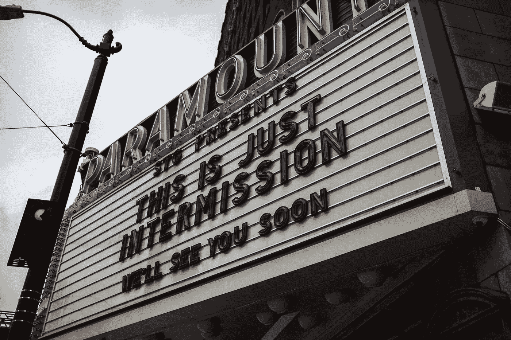
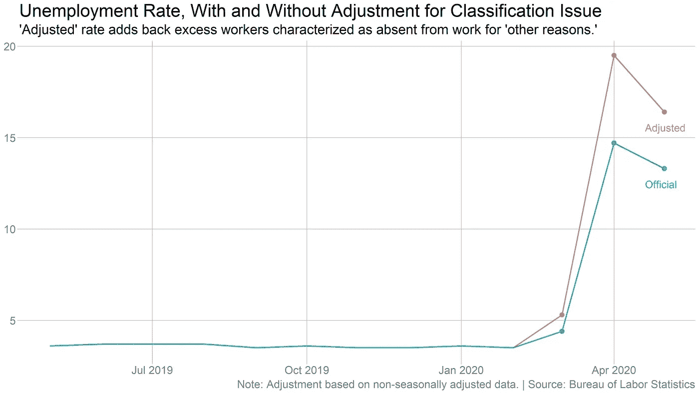
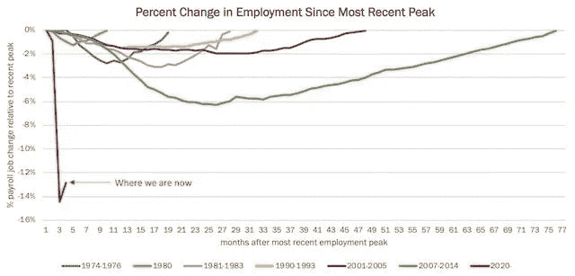

# 不要相信炒作:就业数据比他们告诉你的要糟糕得多

> 原文：<https://medium.datadriveninvestor.com/dont-believe-the-hype-the-jobs-numbers-are-a-lot-worse-than-they-re-telling-you-5cc465cd33cb?source=collection_archive---------4----------------------->

## 失业数字有一个合适的术语。剧透:这不是 V 型复苏

Photo by [Nick Bolton](https://unsplash.com/@nickrbolton?utm_source=unsplash&utm_medium=referral&utm_content=creditCopyText) on [Unsplash](https://unsplash.com/@msweems/likes?utm_source=unsplash&utm_medium=referral&utm_content=creditCopyText)

80 年代初，我在美国南方腹地的一家投资银行工作。从一开始，对我的系统最大的冲击就是语言。我不是说诅咒本身，但是有一种粗俗的，有时是粗鲁的方言是交易所特有的。

那时候，“性骚扰”不在词典中——术语“多样性”也不存在。

作为交易大厅里唯一的新手和唯一的黑人，我在工作场所听到的一些事情让我惊讶不已。幸运的是(或者不是)，交易大厅现在在政治上更加正确。

 [## 危机？风投适应的 3 种方式|数据驱动的投资者

### 当我写这篇文章的时候，一场全球性的危机正在发生。这不是第一次，也不会是最后一次。很多事情已经…

www.datadriveninvestor.com](https://www.datadriveninvestor.com/2020/03/22/crisis-3-ways-vcs-adapt/) 

因此，当我看到金融专家和股市对 5 月份就业报告的反应时，一个我多年没有想到的短语立即跃入我的脑海:

*死猫反弹。*

现在，在你取消关注，取消订阅，或者因为我在政治上不正确而取消我之前，让我解释一下。

我不反对猫。我的两只救援猫中的一只此刻正越过我的肩膀盯着我，好像在评判我重复这个术语。我坚信你不会和[的猫](https://www.netflix.com/title/81031373?s=i&trkid=13747225)乱搞。

在我的评估中，我不是一个人。奥巴马经济顾问委员会前主席奥斯坦·古尔斯比也有同样的想法。

死猫反弹是一个交易术语，用来描述股票或整个股票市场的小规模、短暂的反弹。

为了给爱猫者一个不那么令人不安的心理画面，相反，想象你自己从十层楼的屋顶上扔下一个篮球。

当球碰到人行道时，它会反弹，但不会弹到屋顶。也许它能弹到三楼那么高，但有一点是肯定的，它永远也不会回到十楼。

当我看就业报告时，它告诉我这就是我们的经济正在发生的情况。死猫反弹。

我从事这项工作已经有一段时间了，但我从未见过这样的报告。根据 BLS 劳工统计局的最新数据，该国在 5 月份增加了 250 万份工作，这是有史以来最大的增幅。

失业率从四月份的 14.7%下降到 13.3%。大多数经济学家预计失业率会上升到 20%。

正如你所料，股市上涨是因为这些数字超出了预期。根据吉姆·克莱默和他在美国消费者新闻与商业频道的同事的说法，失业数字是衰退结束的证据——三个月后的*。这会是 V 型复苏的开始吗？他们问。不出所料，特朗普总统更过分了。*

*考虑到 14%的失业率比 2008 年金融危机期间的任何时候都要高，这一切都令人难以置信。*

*现在，我不是经济学家，但我花了一个职业生涯来分析这样的经济报告。另外，我能阅读。所以让我这样总结我对啦啦队专家的看法:*

*总统错了。吉姆·克莱默错了。他们都错了。大错特错。大错特错。*

***电视评论员没有阅读细则***

*当 BLS 发布经济报告时，由于随着时间的推移额外数据的积累，它们通常包含对上月的修正。*

*BLS 5 月发布的版本包含了对 4 月的重大修订。从 2 月 16 日到 3 月 14 日，在停工开始之前，经济损失了 140 万个工作岗位。这些有机失业是会议、旅行等取消的结果。随着人们主动停止走出家门。*

*黑人失业率跃升至 16.8%，为十多年来的最高水平，而拉美裔人的失业率甚至更高，为 17.6%。但这里有一个金融媒体最重要的疏忽:*

*5 月份的就业报告在底部有一个特别的注释，提到了一个“错误分类错误”。结果是:在政府关门期间，数百万本应“暂时失业”的人却被错误地归类为有工作，但却因“其他原因”而“缺勤”。*

*《华盛顿邮报》的经济记者希瑟·朗这样解释 BLS 声明的结果:*

> *“特别说明说，如果没有发生这种“错误分类错误”，那么“整体失业率将比报告的高 3 个百分点”，这意味着 5 月份的失业率将为 16.3%，但如果采用相同的标准，这仍将比 4 月份超过 19%的失业率有所改善……“其他原因”类别通常用于度假、担任陪审员或休假照顾孩子或亲属的人。这些是员工决定休假的典型情况。但在疫情这种不寻常的情况下，“其他原因”这一类别适用于一些呆在家里等着被召回的人*

*因此，如果不是几个月来一直存在的错误，上个月的失业率应该在 16.3%左右，4 月份大约为 19%。*

**

*这不是特朗普篡改数字。BLS 需要成千上万的人来汇总就业数据，而在疫情时期，这要困难得多。我敢肯定，BLS 的人们正在努力工作，试图跟上大规模的失业。*

*为了让你了解这些政府工作人员面对的是什么，我最近在小企业管理局采访的一个人告诉我，在关闭的前两周，他们收到的救济申请比该机构 65 年来 T2 收到的还多。他们一周七天，每天工作 12 小时。*

*特朗普忙着发推特和打高尔夫，没时间做那种工作。*

* [## 为什么史蒂夫·姆努钦不想谈论乔布斯

### 共和党决心保护公司和股票市场。即使这会杀了我们。

link.medium.com](https://link.medium.com/2PBz2cH776) 

## 不是找工作的问题；这是为了保住工作

一个月新增 250 万个就业岗位，非常优秀。但是请记住，4 月份，美国失去了近 2100 万个工作岗位。即使在 14%，我们仍然有历史上最高的失业率之一。经济将需要每月增加这么多的工作岗位*持续近一年*才能回到我们一月份的水平。

此外，大部分工作来自接受工资保护计划(PPP)的小企业，这些小企业带回了休假工人。即使数据好于预期，仍有超过 1500 万工人被临时解雇。

由于跨几个州的分阶段重新开放，企业将以一小部分能力运营。这意味着很多这样的重新雇佣可能不会持续很久。超过一半的重新雇佣是在餐饮业——这正是我担心的。

原因如下:餐馆通常需要以 75%的容量运营才能维持运营，但大多数重新开业最多只允许 50%的容量。这些企业还能撑多久才会裁员或退出？

顺便说一下，当有人试图让你相信快乐的日子又回来了时，你可以拿出一张方便的图表:

Job changes since the most recent employment peak. Source: Bureau of Labor Statistics, Washington Post.

我不想悲观，但我们还没有脱离险境。一点也不。但是我最近写了一篇关于芝加哥大学贝克尔·弗里德曼研究所的预测，截止到 4 月 25 日，由于冠状病毒导致的 42%的工作岗位将会永久消失。

所以不要相信炒作。这不过是众所周知的死猫反弹。* 

*如果你喜欢政治和经济，加上偶尔的幽默，你可能会喜欢我的时事通讯。您可以在此注册:*

* [## 熟练工。

### 一个岛上的人发来的关于经济和政治的时事通讯。

thejourneyman.substack.com](https://thejourneyman.substack.com/welcome)*