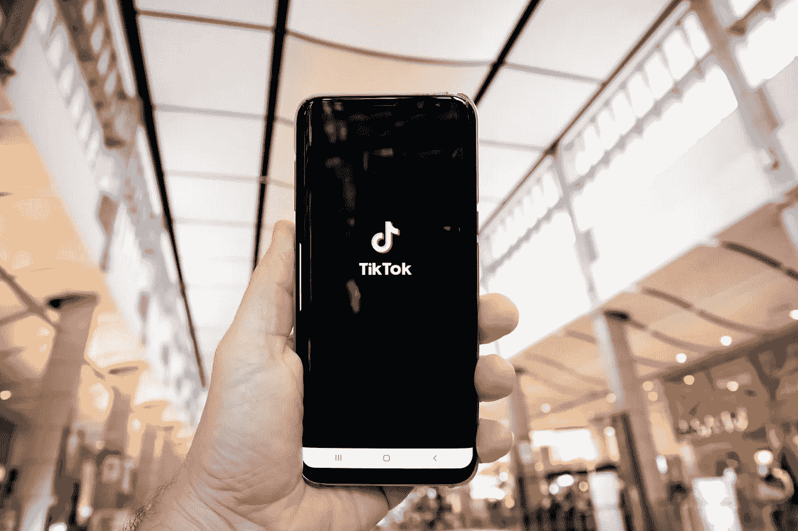

# 不要眨眼，否则你会错过的

> 原文：<https://medium.datadriveninvestor.com/dont-blink-or-you-ll-miss-it-df720eb2fcb6?source=collection_archive---------32----------------------->

## 快速移动的短暂内容在市场上涌现

Photo by Olivier Bergeron on Unsplash

想要在数字营销人员中引发一场争论吗？无缘无故地增加一个新的社交媒体功能。

六名专家聚集在一起，相互挠头，因为他们对 Twitter 引入车队的反应——这些推文过了一天蜉蝣的生活，然后永远消失。

这不要与脸书和 LinkedIn 的故事、抖音和 Instagram 的卷轴混淆。

另一方面，也许他们应该感到困惑。一个又一个独特的社交媒体平台正屈服于一种同质化的弊病。在猴子看、猴子做的最新例子中，罪魁祸首是“短暂的内容”。

正如数据科学家和商业分析师 [Grad Zimunya](https://twitter.com/graduatezm) 解释的那样，“短暂内容是指 24 小时后就会消失的内容。脸书、WhatsApp、Instagram 等网站上的报道就是例子。短暂的内容非常重要，因为人们对它的反应和反应非常快。”

 [## 重新审视内容

### 及时是所有社交媒体渠道的最佳实践

medium.com](https://medium.com/datadriveninvestor/take-a-fresh-look-at-content-1d08cb6763c) 

故事功能导致了现在你看到它，现在你看不到它，这提出了一个问题，所有的社交媒体平台都需要有故事吗？

“当然不，他们不需要这么做，”市场营销和网页设计专家[詹姆斯·恩乔罗格](https://twitter.com/njorogetm)说。“这应该留给 Instagram 和那个平台，对，SnapChat。

“不要误解我，”他在非洲推特聊天中说。“这些故事是营销的好途径，但我觉得用户被内容淹没了。”

# **两面思考**

DigiPath Africa 的创始人兼首席执行官和数字营销专家 Melanie Namulwany Hapisu 陷入了两难境地，他们能够就更短暂的内容的需求与双方展开辩论。

“如果大多数或所有社交媒体用户都很好地使用，那么肯定可以从使用故事中获得很多价值，”她说。“想想你可以通过故事接触到多少潜在的人，因为这些故事是人们登录后首先看到的东西。

Namulwany Hapisu 说:“想想短篇小说如何让顾客踏上旅程，你可以在这么短的时间内多快地传递你的信息。”"你喜欢消费什么:故事还是真实的社交媒体帖子？"

 [## 我们讲述自己最精彩的故事

### 讲故事赋予你的品牌个性

medium.com](https://medium.com/datadriveninvestor/we-tell-our-own-best-stories-8a07ec5ab760) 

然后她看到了不利的一面。

Namulwany Hapisu 说:“所有人现在对他们的故事所做的就是销售——这并不是错的——但这并不是你对故事所做的一切。”“目前，故事就像一个疯狂的市场，阻止消费者甚至看故事。

“我期待能够看到关于有多少人跳过你的故事的报告，”她说。“这将是一个有趣的跟踪指标，因为我自己也在做很多这样的工作。”

Athi Geleba 是南非共和国总统数字通信的负责人，这给了她一个不同的视角。

“故事问题感觉像是 Twitter 车队功能的一个分支，这将彻底改变我们使用这个平台的方式，”她说。“现在还为时过早，但我还不认为这些故事适用于 Twitter 这样的平台。

“Twitter 已经打上了对话和互动的烙印，并使自己与众不同，”Geleba 说。“其用户对内容的消费与脸书和 Instagram 不同。他们也消费不同的内容。我们希望我们的平台都变成一个东西吗？”

# **必然转瞬即逝**

另一方面，她理解对诱惑的抗拒。

“我们开始在不同的平台上复制相同的内容，”格勒巴说。“然而，随着我们看到用户在不同平台上发布短暂内容的数量激增，Twitter 忍不住参与进来，这是显而易见的。”

商业与娱乐的交叉尤其让传播专家[科洛·肯尼斯·卡迪里](https://twitter.com/KoloKennethK)感到恼火。

“所有的社交媒体都应该有短暂的内容，因为先驱 SnapChat 确实成功扩大了用户群体，”他说。“我不希望专业媒体模仿社交媒体。是的，我不明白为什么 LinkedIn 有故事。”

 [## 发挥创造力，改变世界

### 视觉叙事和社交媒体联合起来创造不同

medium.com](https://medium.com/datadriveninvestor/be-creative-and-change-the-world-55288cce7184) 

保险公司和数字营销商 Matovu Jovin Jenkins 承认短暂内容的加入将会增强图形展示。

“视觉内容正变得比以往任何时候都更加强大，”他说。“我们使用手机越多，通过图像和视频分享日常生活的欲望就越强烈。这在 Twitter 和 LinkedIn 等平台上是不可能的。

詹金斯说:“所有的社交媒体平台都不应该有故事，但如果你看看数字存在参与的最终目标，平台所有者似乎认为他们也需要这样的功能。”

特殊场合可能最适合短暂的内容。

“在节日期间，由于活动有限，这是一件大事，”Zimunya 说。“用户对短暂内容的参与也在增加。

“短暂的内容也是一个很好的方式，让人们了解你发生了什么，”他说。“这是因为一些内容在赛季结束后可能不需要在线。”

# **沉迷于点击**

Njoroge 看到了优势，因为短暂的内容是“负担得起的，真实的，并迎合了人类想要即席，简短和甜蜜的东西的本性。看着人们发现自己在点击那些吸引人的按钮，也是令人兴奋的。”

内容的短暂出现促使数字专家在他们的营销中发挥创造力。

“发布只会持续 24 小时的销售，”Namulwany Hapisu 说。“一旦故事或舰队过期，就完了。确保你让你的消费者体验到错过的恐惧。利用倒计时功能，让人们分享和保存它。”

 [## 错过便宜货是很大的动力

### 一点点恐惧会大大吸引焦虑的顾客

medium.com](https://medium.com/datadriveninvestor/missing-out-on-bargains-is-great-motivation-f46be50c1108) 

随着故事、车队和卷轴进入舞台，社交媒体应用的体验正在发生变化。

“我有一个更简单的方法从我的网络中获得更新，只需浏览这些故事，”Zimunya 说。“通常，清晨和一天结束时，我只是在吃饭或做其他事情时让故事继续。”

Namulwany Hapisu 发现这些变化是一种后天习得的口味。

“起初，我不喜欢故事，”她说。“感觉所有平台都在慢慢地互相抄袭。现在感觉他们之间好像没什么区别。这甚至让我重新考虑我在一些平台上的存在。

“使用故事有一些好处，”Namulwany Hapisu 说。“与普通的帖子相比，你有更多的方式吸引观众，比如通过投票和提问。”

# **吸引线索和销售**

或许 Twitter 用户将获得与其他平台类似的回报。

“故事已经成为 Instagram 上使用最多的功能，”格勒巴说。“这是用户首先关注的。整个练习的目的是产生销售线索和促进销售。脸书和 Instagram 都允许品牌在他们的故事中添加链接，并为自有平台带来流量。

“这也意味着数字已经成为营销人员和沟通者的核心技能，”她说。“随着技术进步的快速步伐，我们必须不断适应新的数字渠道，紧跟潮流，并利用这些渠道来促进信息的获取。”

 [## 参与建立受众和利润

### 重要的是追随者的质量，而不是数量

blog.markgrowth.com](https://blog.markgrowth.com/engagement-builds-audience-and-profit-3849952ddbaf) 

这就利用了更注重实践的用户。

“短命内容的部分吸引力在于它利用了社交网站的一个主要吸引力:内容创作，”格勒巴说。“用户不仅仅是被动地消费内容。他们正在积极创造自己的。我们都是影响者。

“短暂的内容创造了一种紧迫感，提高了饲料的质量和自毁，”她说。“您不必担心删除不良内容。你不必整天滚动寻找新内容，因为它就在你的订阅源上。”

卡迪里花了很长时间才适应最初的社交媒体魔术。

“作为 SnapChat 的早期用户，它的内容在一段时间后‘消失’确实看起来很奇怪，所有者可以保存它们供以后使用，”他说。“当这个毕业到 WhatsApp，后来到 insta gram——保留了保存故事的能力——我觉得很酷。

“有些内容在短时间内是完美的，”卡迪里说。“人类自然而然地走向下一个趋势。“马克·扎克伯格产品”一直保持着垄断地位，直到 Twitter 和 LinkedIn 的介入，这很奇怪。"

# **越来越人性化**

随着其他平台的变化，短命内容在 YouTube 上的首次亮相还会远吗？

詹金斯说:“它表现在两个方面:首先是作为个人用户，然后是作为数字营销人员。”“就后者而言，它使视觉内容的制作变得更加简单，更容易吸引各种受众，并以更人性化的方式吸引潜在客户。

“在大多数人觉得舒服的地方找到观众的想法很棘手，”他说。“这是因为他们改变了专注于传统时间线和新闻源的叙事方式。”

 [## 超级营销从一个故事开始

### 观点通过来回的对话而改变

blog.markgrowth.com](https://blog.markgrowth.com/supercharged-marketing-starts-with-a-story-b1b785142721) 

像所有的营销策略一样，短暂的内容有局限也有优势。

“有更多的参与，它提高了忠诚度，增加了内容量，”Zimunya 说。“同样，你的观众可能会失去兴趣——来得容易去得也快。您的影响可能会更低，因为内容连接的时间更少。这是不可持续的，因为你必须每天发布和创建内容，或者重复。”

快速简单的内容最吸引 Namulwany Hapisu:

*   投票:快速获得你的追随者的意见。
*   问题:因为你可能有更多的空闲时间，做一个问答，并获得一个与你的追随者互动的机会。
*   音乐:节日和音乐相伴而生。在你的故事中加入音乐。
*   测验:如果可以的话，玩一点。围绕你的品牌进行一些令人兴奋的测验，并赠送礼物。

# **方便约会**

Namulwany Hapisu 说:“大多数用户观看短暂的内容，因为这是他们登录订阅源时看到的第一样东西。“看故事比浏览你的订阅源更容易。这让你有机会以不同的方式参与进来，并帮助你避免感到无聊。

“短暂的内容能提高参与度，”她说。“你可以用不同的方式吸引用户，而不仅仅是一种方式，比如向上滑动、立即购物等等。它扩大了你的影响范围，尤其是如果它是可分享的。大多数人都想分享美好的事物，尤其是那些不会持续太久的东西。”

新发现的灵活性给创作者一种艺术释放。

“你可以发布更多的内容，”Namulwany Hapisu 说。“你不必把自己局限在一个岗位上。你可以做很多，但当然不能太多。”

 [## 常青树发芽新生命

### 接受旧的内容，让它重生

medium.com](https://medium.com/datadriveninvestor/evergreens-sprout-new-life-c41810f6b654) 

这导致短暂的内容过于短暂，正如她指出的限制:

*   故事的简短本质可能会有局限性，尤其是当你想说很多的时候。你可能需要写不止一篇文章。
*   太多人在用了。竞争更激烈了。我们现在都必须为脱颖而出而战。
*   它们只运行了 24 小时。如果你的一些追随者没有准时上线，他们可能会错过它。
*   它们只能在社交媒体上使用，这意味着你需要使用这种类型的内容来推动其他平台(如网站)的流量。

# **消失得无影无踪**

转瞬即逝的内容来得快去得也快，它往往会自我清理。

“作为营销人员，你可以提供令人耳目一新的新内容，”卡迪里说。“作为广告客户和影响者，你能够清理你的平台。

“缺点是你的内容只能接触到有限的受众，”他说。“曝光率和知名度可能与设计产品的投资不相称。一旦内容过期，用户就没有时间再去关注它，失去了行动的机会。”

故事、车队、TikToks 和卷轴在个人品牌和企业中都有一席之地。

“这是一种在观众面前展示你的品牌和品牌信息的简单方式，”Zimunya 说。“为了提高品牌知名度，并以有趣的方式更新您的受众，这是商业和个人品牌的内容。”

 [## 如果你过度自动化，不要以为这是针对你个人的

### 营销人员应用技术来提高生产力

blog.markgrowth.com](https://blog.markgrowth.com/dont-take-it-personal-if-you-overdo-automation-1f9fc5534f5c) 

创作者必须防止制作没有人情味的橡皮图章。

“品牌必须确保它们短暂的内容足够人性化，”Njoroge 说。“人们去这个世界的故事和舰队中娱乐和兴奋。如果他们注意到你只做核心广告，他们会避开你，你的工作就白费了。'

那些有丰富想象力和讲故事技巧的人会得到奖励。

“我们都喜欢故事，人们*喜欢*故事，”詹金斯说。“品牌可以利用数字形式的故事来获得优势。利用人性最基本的一面:人与人联系，而不是品牌。

“为了让商业和个人品牌与客户建立联系，他们需要用这样的内容展示他们个人的一面，”他说。“我们的目标是创建一个能引起受众共鸣的品牌。要做到这一点，你的品牌或业务讲述一个视觉故事是很重要的。”

# **对于那些小的以及大的**

小企业在短暂的内容市场中扮演着同样重要的角色。

Njoroge 说:“他们必须无畏而积极地追求在抖音的[商业](https://twitter.com/TikTokBusiness/)和其他短暂的内容媒体上基本上未被捕获的利基市场。“所有小企业需要的是真实、幽默，甚至有点调皮。世界是他们的。”

 [## 社会成功不是一件有趣的事情

### 无论大小，每个品牌都应该在网上占有一席之地

blog.markgrowth.com](https://blog.markgrowth.com/social-success-is-no-funny-business-d34bb6e8660b) 

Namulwany Hapisu 说，这些是小企业利用资本的最佳方式:

*   带追随者到幕后。
*   做快速产品演示和指南。
*   为新产品做广告。
*   开展快闪销售和限量优惠。
*   进行问答环节。
*   扩大范围，因为您可以选择将其添加到 Instagram 上的探索订阅源。
*   创建新的内容，而不仅仅是静态的帖子。
*   使用卷轴在 15 秒内教育和增加你的观众的价值。

“我们边走边学，”Namulwany Hapisu 说。“所有这些新功能只是让品牌为吸引消费者的注意力而竞争。在一些平台上，所有或大多数品牌都被遗漏了。”

随着短暂内容的出现，接收端的用户将受益最大。

“为消费者创造价值，”格勒巴说。“以有意义的方式为他们的生活做出贡献。在 60 秒的时间内，全球在线消费金额达到 390 万美元，脸书广告的平均浏览时间不到三秒。你必须抓住注意力并保持住。迅速产生影响。

“给你的网站贴上标签，增加流量，扩大覆盖范围，”她说。“利用位置和标签来扩大你的活动，接触到不关注你的账户的用户。做人吧。人们想要人类的参与和真实性，而不是推销。去现场直播。把消费者带在身边。”

# **记住基础知识**

尽管短暂的内容存在和消亡都很快，但标准的在线指南仍然适用。

“社交媒体的诀窍在于创造力和原创性，”卡迪里说。“如果小型企业能够理解与受众互动的最佳方式，他们就可以利用行动号召来影响他们的底线。

“利用趋势也很棒，”他说。“许多用户基于热门话题使用社交媒体。然而，自发性是好的。像病毒一样传播开来并引起制造商疯狂销售的蔓越莓汁视频就是一个例子。

 [## 流行巨星告诉一切

### 在社交媒体上迅速传播是一件值得欢迎的事情

medium.com](https://medium.com/datadriveninvestor/trending-superstar-tells-all-97499a0c2aa9) 

他还引用了汉堡王的《交通堵塞》作为另一个开发内容的例子，内容不一定是关于品牌，而是关于产品。

詹金斯详细列举了小企业通过短命内容脱颖而出的许多方法。

“小品牌应该是正宗的，”他说。“故事剥去了传统营销的抛光层，为你的业务提供了一个诚实、透明的视角。让你的追随者感觉他们是一个特殊俱乐部的一部分，他们与你的品牌有一种纽带，而这是他们与你的竞争对手所没有的。

詹金斯说:“用故事告诉你的追随者，并把他们推向正确的方向去参加比赛。”“使用#赠品、#竞赛和#竞争这样的标签可以让你的故事被不关注你的人发现，从而增加你的影响力。”

# **通过互动引起注意**

消费者将倾向于与创造互动的品牌建立联系。

詹金斯说:“小企业可以在他们的故事中使用民意调查作为一种很好的方式来推动与追随者的互动。”“他们可以用它们来进行市场研究、客户反馈，或者只是为了了解他们的受众，找点乐子。

“这对于建立社区和鼓励客户互动来说是一个非常好的功能，”他说。“表现出他们关心顾客的意见，并到场回答顾客的问题，将品牌定位为可靠、人性化和亲切的品牌。你会惊讶于人们想知道什么，你会从中获得多少产品创意。"

 [## 人情味助推优秀品牌走向巅峰

### 消费者的购买行为与情绪息息相关

medium.com](https://medium.com/datadriveninvestor/human-touch-boosts-outstanding-brands-to-the-top-5b71cd610e73) 

Jenkins 提出了更多营销可能性:

*   进行收购。你是否有当地有影响力的人或最喜欢的客户，可以将你的账户交给他们？在他们与你的品牌互动一天的时候，给他们你账户的钥匙，在他们进行的过程中增加故事内容。
*   推销。有你想要公开感谢的忠实客户和追随者吗，或者有你看过的想要强调的帖子吗？试试大声喊出来。指定一个“大声喊出来日”，并在一天中建立一系列的大声喊出来日，或者只是在每天的基础上加上它们。
*   对趋势做出反应。有一个影响你所在行业的重大公告。你的追随者会想知道你对此的看法。Stories 为您提供了一种快速传递信息的可靠方式。
*   操作指南。食谱、产品演示、育儿建议、自己动手指南和生活窍门是围绕你的品牌建立忠诚度并给你的观众带来价值的绝佳方式。你付出的价值越多，越多人会回到你身边。
*   优惠。由于 24 小时窗口，使用故事的最受欢迎的方法之一是用持续一天的闪电优惠来制造兴奋。
*   产品发布会。在发布前的几天里，用每天的故事进行宣传。然后全力以赴，在发布日进行大量更新。耐克是在产品发布前大肆宣传的大师。小企业也可以这样做。

# **挖掘影响者**

无论是故事、车队、TikToks 还是卷轴，这都是通过影响者营销来赚钱的土地。

“作为短暂内容平台上的影响者，这里的人每篇帖子可以赚到 3 万美元，”Njoroge 说。“比如说，这些人有 3000 万粉丝。这就是诀窍。然而，你可以开拓自己的市场。相关品牌甚至会在追随者更少的情况下猎头你。”

 [## 权力影响者照亮影响者营销

### 营销人员在成为有影响力的人方面受到了错误的教育

blog.markgrowth.com](https://blog.markgrowth.com/power-influencer-shines-light-on-influencer-marketing-6837a2d597dc) 

Namulwany Hapisu 推荐通过 Instagram markets 进行植入式广告。

“与品牌合作展示他们的产品，”她说。“做品牌赞助，特别是如果你能把你的内容做成一个系列，比如你允许品牌赞助的某个节目的第一集。

“任何人都可以做到这一点，只要你知道你能给品牌带来什么价值，”Namulwany Hapisu 说。“你可以通过给他们写信或加入与有影响力的人合作的应用程序来直接锁定他们，甚至是那些没有多少粉丝的人。我是一个叫做[wowozi](https://twitter.com/wowzi_ke/)的组织的成员

对于那些已经在他们的时间线上赚钱的内容，卡迪里认为，来自短暂内容的收入应该不是问题。

“你已经证明了你的观众会花时间观看你的短暂内容，”他说。“你的影响力会卖掉它。如果你有一群狂热的追随者，并且你的观众对你的影响力表现出积极的情绪，你可以将这一点融入到你的服务和价格卡中。”

# **更多赚钱的可能性**

Jenkins 赞同这种方法，并进一步推进了货币化:

*   使用影响者。货币化来自于扩大你的互动规模，当你是一个小公司或成长中的公司时，这可能很难做到。影响者营销是定价最低的营销渠道之一。把它作为一个品牌来挖掘。
*   测量并调整。当你试图赚钱时，一定要根据需要衡量和调整你的表现。短暂的内容就像液体一样。昨天管用的，明天未必管用。
*   生成可发现的内容。赚钱的最好方法之一是让你的服务或产品在平台中被发现。可发现的内容出现在 Explore 选项卡中，该选项卡用于向感兴趣的用户显示相关帖子。
*   举办一场比赛。竞赛可以成为一种有价值的货币化策略。向最好的品牌学习。创建使用特定标签的高针对性竞赛。
*   投放广告。这些广告采用与标准故事相同的格式，有助于互动体验。每个广告长达 15 秒，由视频或单张照片组成。这些广告是促进销售的理想选择。

 [## 窃取将你的品牌货币化的秘密

### 通过利用您所知道的知识，让您的业务面向未来

blog.markgrowth.com](https://blog.markgrowth.com/steal-the-secrets-to-monetizing-your-brand-449d3b0509c8) 

总的来说，营销人员和有影响力的人提到了许多已经掌握了故事、车队、TikToks 和卷轴使用的品牌和人员:

*   [Kenyans.co.ke](https://twitter.com/Kenyans/)
*   [KWS](https://twitter.com/kwskenya/) 或肯亚野生动物服务
*   [KCB 集团](https://twitter.com/KCBGroup/)
*   [Safaricom PLC](https://twitter.com/SafaricomPLC/)
*   博尼法斯·姆旺吉
*   [艾哈迈德·穆罕默德](https://twitter.com/Asmali77/)
*   [Denri 非洲](https://twitter.com/DenriAfrica/)
*   珍妮特·马楚卡
*   让·万迪米
*   阿齐亚德·纳森亚

卡迪里补充了一句鼓励的话:“如果你掌握了害怕错过人类的心理，你会在短暂的内容上做得很好。”

**关于作者**

吉姆·卡扎曼是拉戈金融服务公司的经理，曾在空军和联邦政府的公共事务部门工作。你可以在[推特](https://twitter.com/JKatzaman)、[脸书](https://www.facebook.com/jim.katzaman)和 [LinkedIn](https://www.linkedin.com/in/jim-katzaman-33641b21/) 上和他联系。

## 访问专家视图— [订阅 DDI 英特尔](https://datadriveninvestor.com/ddi-intel)