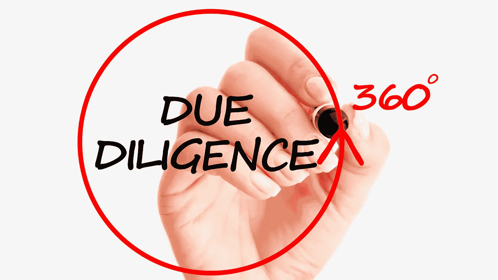

# 不要听信谣言。永远做你的 DD

> 原文：<https://medium.datadriveninvestor.com/dont-buy-on-rumors-always-do-your-dd-fa04378b7528?source=collection_archive---------37----------------------->

## 跟随华尔街投注进行投注…

Photo credit: Canva Pro Image

….但是如果你想投资，去别的地方找你的建议吧。

就这么简单。我喜欢 Reddit 集团 wallstreetbets。当我有一天心情不好的时候，我会去那里，让我的那份欢笑得到保证。

在禁闭期间，我几乎每天都在那里尽可能地大笑，因为快乐真的可以增强杀死病毒的免疫系统。

保持健康的免疫系统是我对抗击冠状病毒的贡献。

但是当谈到投资建议时，我不会关注一些在线聊天群——尤其是那些不停发布下流信息的。

每当我从一个我以前没见过的老熟人那里得到一个“快速致富的秘密提示”时，我会消失一段时间，在我继续说话之前对这个提示进行尽职调查。

# 什么是尽职调查？

这是大投资公司用来表达他们在投资前彻底调查每家公司的术语。

基金经理组建了一个由公司技术专家、税务专家、商业和法律专家组成的团队。

这些信息被发送到一家公司，作为监控目的的特别行动，以找到尽可能多的情报来证明投资案例的合理性。

大多数时候，行军命令是:

> 为我们不投资公司找尽可能多的理由。

团队通常会把公司的一切都翻个底朝天，并寻找业务的弱点。

一家风险基金每年都会看到，在数百个机会中，只有 3-5 项投资通过了尽职调查。

# 为什么你应该总是做你的 DD

是的，我明白——你不会管理一个投资数十亿的基金。

为什么要做 DD？

不管你投资 1 万美元还是 10 亿美元，投资原则都是一样的。

只投资那些你认为在 5 -10 年后能获得 10 倍回报的业务。

最终，我们想用钱来赚钱，并通过这样做来创造一个更好的世界。

这就是为什么 DD 在任何情况下都有意义的原因。是的，当然，作为散户，你不能雇佣尽职调查团队。

但最有可能的是，作为一个散户，你只投资上市公司，以降低你的投资风险。

有利的一面是，当公司上市时，很多信息都会被公布，因此可以很容易地在网上完成 DD。怎么会？让我展示给你看。

# 使用公司网站

在我作为散户投资一家公司之前，至少我会查看公司网站，看看自己是否了解商业模式。

[Gamestop](https://news.gamestop.com/fact-sheet-0) 很简单:

> 他们卖游戏和装备

我认为这种商业模式已经过时了，因为现在大多数游戏都是以数字形式销售的。根据 2018 年的统计数据，83%的游戏是在线发行的。

在网站上，我查看[资产负债表、损益表和现金流量表](https://news.gamestop.com/financial-information/sec-filings)。

在 Gamestop，收入下降，烧钱，造成亏损。

这样的商业模式是不可持续的。

[最新的企业新闻](https://news.gamestop.com/home)引起了我的注意:

Gamestop 雇佣了两名来自亚马逊和 Chewy.com 的新执行董事会成员。

这很有希望，但首席执行官或其他董事会成员没有提出新的商业模式想法。

它仍然是一个垂死的企业，尽管股东结构是健全的:

*   贝莱德
*   瑞安·科恩——chewy.com 公司的创始人，该公司以数十亿美元的价格出售
*   先锋
*   忠诚

然而，没有新的商业模式。

# 聊天群

第二步是查看在线聊天群，了解更多关于这种情绪的信息。

Reddit 绝对是一个像 GameStop 这样的 Meme 股票的去处，很容易研究出这只股票被许多年轻的散户投资者用来赌博。

我喜欢的另一个团体是 Seekingalpha.com，它展示了很多关于公司的研究。

在这里，这种情绪基本上是一种垂死的商业模式，被卖空者和零售商用来赌博，目前还没有新的模式。

# 我的总结

从短期来看，在股票市场上玩赌场游戏并跟上华尔街的赌注和卖空者是有用的。它可以很有趣，只要清楚这是赌博。

长期来看，由于最近的董事会成员变动，这是一项高风险的周转投资。它押注于新的高管会提出一种新的商业模式并加以执行，这可能会也可能不会带来新的业务增长。

时间跨度至少为 5-10 年。

就我个人而言，我不会向这样的公司投入大量资金。

在你随大流之前，因为有人说买或卖，坐下来做至少半天的研究。

当一个公司的价值随着时间的推移而增加时，你早晚投资 4 个小时都没关系。想想亚马逊自 1997 年首次公开募股以来令人难以置信的 200，000%的增值。

但它可以免除你因为盲目追随一位大师，把所有鸡蛋都放在一个高风险的篮子里，而失去所有钱的痛苦。

**更多关于理财素养的故事:** [**点击此处**](https://christian-soschner.medium.com/17-great-stories-on-financial-literacy-4c7cbe5dbb10)

自 1999 年以来，我是各行各业公司的执行官、顾问和教练。我专攻企业发展和金融，从种子轮到 IPO 级别，从 2006 年开始专注于生命科学。

[**加入我的邮件列表保持联系！**](https://mailchi.mp/5a50875fb5ea/newsletter)

*本文仅供参考。不应将其视为财务或法律建议。在做任何重大财务决定之前，先咨询财务专家。*