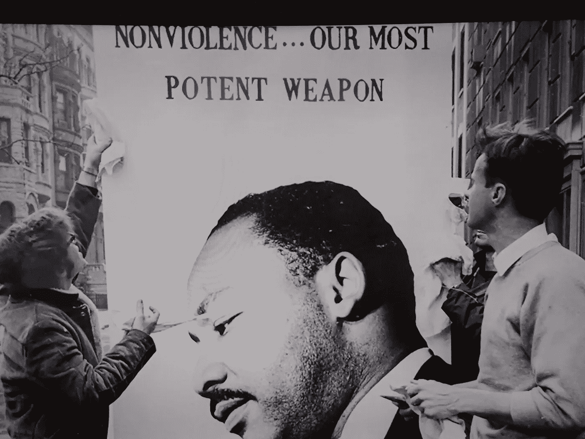

# 不要称之为“解除对警察的资助”，而要称之为“投资”

> 原文：<https://medium.datadriveninvestor.com/dont-call-it-defund-the-police-call-it-invest-in-4d7b9950d96e?source=collection_archive---------9----------------------->

如果我们明智地投资我们的税金，我们会看到更好的结果

Photo by Christyl Rivers archives

## 投资

我的弟弟在国民警卫队服役，他拒绝接受一些命令。我哥哥死了。他们两人都成了今天的话题。

新闻里到处都是“解散警察”这句话我听到的每一条新闻都要停下来解释这是什么意思。

许多人希望有训练有素、受过降级教育的专业人士介入，比如说，一个为了避免酒后驾车而昏倒的人在温迪快餐店被发现。

简而言之，当人们感觉受到逮捕或死亡的威胁时，他们更有可能做出有害的选择。

有些人真的想废除警察。他们的愤怒是有道理的。

但是大多数时候“撤销警察”只是意味着让我们有更好的警察。在我看来，这作为一个短语更有意义。当一个短语混乱到人们需要解释时，它非常非常容易被误解。它甚至可以被武器化，作为反对培养更好警察的论据。

 [## 保护主义、政治和经济动荡|数据驱动的投资者

### 美国股市昨日出现 400 多点的大幅反转，为未来的事情发出了警告信号。市场…

www.datadriveninvestor.com](https://www.datadriveninvestor.com/2018/06/28/protectionism-politics-economic-turmoil/) 

我们的想法是不要把我们所有的税收投入到军事化中。相反，这意味着投资于教育、医疗和社会服务。这意味着训练官员做得更好。这意味着教他们降级技术。这意味着更好地招募女性和各种肤色的人。这意味着，我们要投资确保警察知道他们需要有一种“保护”的心态，而不是一种战士的心态。这也意味着他们为你我工作。

## 政治毒害一切

在反对的一方，已经有声明说古怪的自由主义者想让你毫无防备。这里的语言太关键了，让人觉得。我们试图向世界传达的信息是，人们不应该毫无防备，而事实上应该有更大的保护。“保护和服务”这一概念本身可能更适合这一信息。

在政治体系的最右翼，有语言大师给我们提供了听起来非常积极的短语，如“爱国者法案”、“排干沼泽”或“让美国伟大”。这些口号都不是他们所说的那样，但是所使用的语言对于那些想听到积极信息的人来说是非常有说服力的。他们的信息，无论多么误导，都是有效的。

想想“毒品之战”这句话。是的，我知道它很古老，但它背后的思想至今仍在回荡。这从来不是一场针对受保护的制药巨头的战争，这些巨头大量使用鸦片制剂和止痛药导致了致命的后果。这些成瘾导致的死亡人数远远超过了像大麻这样的“危险”毒品，大麻被视为“入门”毒品。

我们反毒品战争的最终结果是大规模监禁，尤其是对有色人种。我的亲哥哥在大麻合法之前就在科罗拉多卖大麻。他在联邦监狱服刑七年。他在监狱做每天 2 美元的工作时遭遇了一场可怕的事故。由于严重烧伤，他被空运出去，但后来死亡。我认为他身上的内部伤痕就像他身体烧伤的部分一样致命。

## 让我们有真正的改变

如果我们继续使用“解除警察的资金”这个短语，而不是找到一个更清楚地说明所有问题的短语，我担心我们会把事情搞砸。

马丁·路德·金发起了一场非暴力反对种族主义的运动。大多数美国人所要求的就是警察少使用暴力。像扼颈这样的致命战术是没有道理的。当警察被视为全副武装、全副武装的军事化力量时，他们更有可能遭遇恐惧、愤怒、不可预测的行动和怨恨。

相反，让我们的警察社区成员不武装到牙齿，而是训练有素的大使谁出现帮助。

**访问专家视图—** [**订阅 DDI 英特尔**](https://datadriveninvestor.com/ddi-intel)