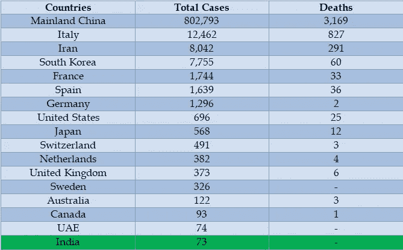
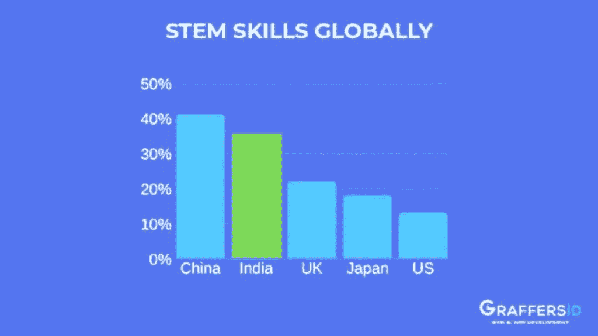
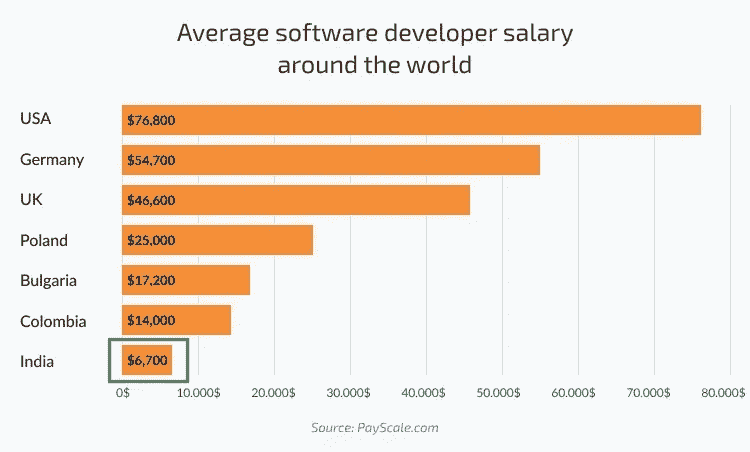

# 不要让 Corona 阻碍你的开发计划:在印度雇佣临时的远程开发人员

> 原文：<https://medium.datadriveninvestor.com/dont-let-corona-hinder-your-development-plan-hire-temporary-remote-developers-in-india-d40bf51d20c?source=collection_archive---------12----------------------->

2020 年 3 月 11 日星期三，世界卫生组织宣布迅速传播的冠状病毒爆发为疫情。世卫组织承认，这种病毒有可能在全球所有国家传播。

根据世卫组织总干事的说法，情况将会恶化，感染病例数、死亡人数和受影响国家的数量将会攀升。

该病毒现已在全球 100 多个国家传播，感染了 12 万人，其中 4000 多人死亡。

这种呼吸道疾病的爆发也对世界经济构成威胁。这种病毒正在旅游、能源和金融市场蔓延。这些公司正在关闭办公室，限制全球航空旅行，并要求受影响地区的员工在家工作。

 [## 2019 年最值得学习的编码语言|数据驱动的投资者

### 在我读大学的那几年，我跳过了很多次夜游去学习 Java，希望有一天它能帮助我在…

www.datadriveninvestor.com](https://www.datadriveninvestor.com/2019/02/21/best-coding-languages-to-learn-in-2019/) 

由于疫情在世界各地迅速增加，许多国家和地区对疫情最严重地区的公民或游客实施隔离和禁止入境。

在美国、意大利、英国、澳大利亚、中国、韩国、日本和香港等国家，新型冠状病毒感染和死亡人数正在急剧上升。这迫使世界各地的政府、学校和公司采取更有效的措施来控制病毒的传播。这些举措正促使企业加速在家工作的趋势。

主要科技公司正在采取隔离，取消旅行和制定政策来遏制冠状病毒病例的上升。这种疫情的爆发导致各种创业组织暂停他们的开发项目，因为主要国家的技术人员都在家工作。不仅如此，初创公司的创始人还发现，在美国、澳大利亚和英国等国家雇佣发展合作伙伴是有风险的，这些国家感染病毒的人数正以惊人的速度增长。

**以下是主要国家的电晕案例数量**

# 世界一线城市和主要科技公司如何打这场仗？

中国、美国、英国、澳大利亚和阿联酋等主要的网络开发外包市场正在采用在家工作的方式，以防止这些地区的案件增加。世界各地的一线城市已经关闭了大学、学校、商场等公共场所以及工作场所，以控制疾病的传播。

作为全球公认的微博和社交网络服务，作为对新冠肺炎的回应，Twitter 已经强制要求全球员工在家工作。本月早些时候，Twitter 强烈鼓励在家工作，但在世卫组织正式宣布新冠肺炎是疫情之后，该公司已经迫使在家工作。

除了 Twitter，其他大型科技公司，即苹果、微软、谷歌、亚马逊和 Lyft 也向各地区的员工发布了类似的指导。除此之外，由于全球卫生紧急状况，像 MWC 和 E3 这样的全球会议也被取消或部分转移到网上。

# 这对早期创业有什么挑战？

在这种情况下，员工被要求在家工作，隔离在世界各地盛行，对于初创企业来说，开发新的应用程序或网络产品变得极具挑战性。这可能是在市场上推出你的产品的最佳时机，特别是如果你正在计划一款可以在人们旅行受限的现状下缓解生活的数字产品。然而，开发团队中相互依赖的所有成员的不可用性会导致沟通不畅，这可能会导致新开发项目中的问题。

# 有什么选择呢？

幸运的是，在印度这样的国家，疾病的传播得到了控制，迄今为止没有因新冠肺炎而死亡的病例，对于最初计划在 2020 年启动创业的热情企业家来说，仍有一线希望。印度正在采取一切预防措施来阻止疾病的传播。所有与受感染者接触过的人都被隔离，他们的健康状况在全国每个受影响地区都受到持续监测。

作为一项预防措施，印度政府还禁止签证有效期至 2020 年 4 月 15 日。该国还宣布，所有来自或曾访问过中国、大韩民国、意大利、伊朗、法国、西班牙和德国的入境旅客都应接受检疫。政府的严格政策和预防措施将疾病的传播限制在 11 个州和 73 人，其中 17 人是外国人。

因此，印度是少数几个严格控制新冠肺炎传播的国家之一。这清楚地表明，目前，印度可以成为你发展需要的可靠伙伴。此外，印度的国会议员甚至没有一个新冠肺炎病例，并且安全地管理着所有的商业、学校和企业。到目前为止，州政府采取的预防措施已经控制住了感染，希望将来也能控制住。

# 使印度成为外包开发项目的最佳选择的其他因素是什么？

根据最近的预测，到 2022 年，全球近 80%的业务流程外包将由印度公司提供。全球各大公司计划在印度建立离岸开发中心的原因有很多。让我们来看看其中的一些:

**熟练人力资源的可用性:**

调查显示，印度每年有近 310 万大学毕业生。预计到 2020 年底，印度将拥有大约 220 万熟练 It 专业人员。这些 IT 专业人员会说英语，这是一大优势。

**隐私法规和数据安全:**

印度有严格的隐私监管和数据安全政策。《2000 年信息技术法》主要强调这两个因素。根据该法，如果违反法律，公司和相关人员将受到经济处罚和监禁。

**政府政策:**

印度有严格的 IT 相关政策来支持运营并产生最大收益。有关于投资和税收的政策；经济特区单位的服务税减免和其他类似的福利旨在促进该国的 IT 服务。

**价格弹性:**

根据 NASSCOM 的报告，外包给印度可以节省大约 60%的成本。这背后的原因是印度国内市场与其他国家的成本差异。公司可以通过外包节省工资和其他员工福利。

**基础设施可用性:**

印度的主要城市都有最先进的建筑。此外，印度的 IT 公司确保他们与客户有一个不间断的沟通渠道。

**有利时区:**

这个时区使得印度成为世界主要国家有利的外包选择。这里最好的部分是整个世界只有一个时区，即 GMT+5:30，这很不寻常。

*   印度领先欧洲 3 小时 30 分钟
*   印度比美国早 9 小时 30 分钟
*   新加坡比印度早 2 小时 30 分钟
*   澳大利亚比印度早 4 小时 30 分钟

时间也是公司的一个竞争优势，这些公司正在处理电话会议，并希望召开电话会议。

**下定决心在印度雇佣 IT 开发资源？以下是印度顶尖的 IT 公司，你可以考虑联系:**

**SeekNEO**

SeekNEO IT Solutions 是一家高级设计机构，位于班加罗尔，利用最新技术为客户提供最佳结果。公司致力于为客户提供网页设计与开发、软件开发和应用程序开发解决方案。

*   **地点:**班加罗尔
*   **团队规模:**25–40 人
*   **擅长:**软件开发、网页开发、网络营销
*   **服务过的公司:** Topgear 健身、Pepper Grand、活力日出、JK 物流
*   **客户群:**澳大利亚、美国、欧洲
*   **联系人:**info@seekneo.com

[**涂鸦者**](https://graffersid.com/)

总部位于印多尔的 Graffersid 正在向初创公司提供复杂的 IT 解决方案以及指导和咨询服务。该公司的 web 和应用程序开发专家专业团队为多个业务领域的客户提供尖端的 IT 解决方案。该公司以开发产品而闻名，这些产品得到了 Y Combinator、谷歌孵化美国公司和 BlueChilli 澳大利亚公司等知名公司的资助。如果你有一个创业的想法，但没有找到实现它的方法，或者你正在寻找海外发展，寻找可以给你持续支持的资源，那么[今天就和专家谈谈](https://graffersid.com/contact/)。

*   **地点:**印多尔
*   团队规模:30-50 人
*   **擅长:**网页设计&开发、App 开发、电子商务开发
*   **任职公司:**奎、卡戈洛、雅培、图里斯、图里斯
*   **客户群:**美国、英国、加拿大、迪拜、澳大利亚、新加坡和印度
*   **联系人:**hello@graffersid.com

目前，Graffersid 正在向其合作伙伴提供为期至少 3 个月的短期服务，这些合作伙伴正在寻找 web 或应用程序开发人员。

**Pi 技术:**

Pi Technologies 是一家总部位于印度的 IT 公司，致力于为客户提供各种技术进步的独特解决方案。Pi Technologies 的团队可以为您提供有效的网页设计和开发解决方案。该公司还专门提供应用程序开发服务。

*   地点:印多尔
*   **团队规模:**15–20 人
*   **擅长:**网页设计、网页开发、ERP 软件
*   **服务过的公司:** Edulogic，Market Social，Powermach Pumps，Console Dude
*   **客户群:**美国和印度
*   **联系人:**[info@pitechnologies.org](mailto:info@pitechnologies.org)

**Nexevo 技术公司**

总部设在班加罗尔的 Nexevo Technologies 公司建立了具有鼓舞人心的设计、引人入胜的写作和令人惊叹的功能的网站。Nexevo Technologies 的团队为客户提供定制的 web 和应用程序开发解决方案。该公司利用未来派技术，并与自我衍生的战略。

*   **地点:**班加罗尔
*   **团队规模:**30–40 人
*   **擅长:**网页开发和手机应用开发
*   **服务的公司:**美国、法国、澳大利亚、阿联酋和加拿大
*   **客户群:**亚洲心脏研究所、Skiva、Master Mind Books
*   **联系人:** info@nexevo.in

**关注我的网络**

总部位于德里的 Mind My Web 再次成为提供网页设计和开发以及电子商务开发解决方案的顶级 IT 公司之一。该公司的技术专家和营销人员团队通过开发符合标准的产品来帮助企业取得成功。

*   **地点:**德里
*   **团队规模:**25–30 人
*   **擅长:**网页开发、WordPress 开发、移动开发
*   **服务过的公司:** The Chopras，Art for Concern，My Chef Book，Medtalks
*   **客户群:**美国和印度
*   **联系人:**info@mindmyweb.com

*原载于 2020 年 3 月 13 日 https://graffersid.com**[*。*](https://graffersid.com/blogs/hire-temporary-remote-developers-in-india/)*