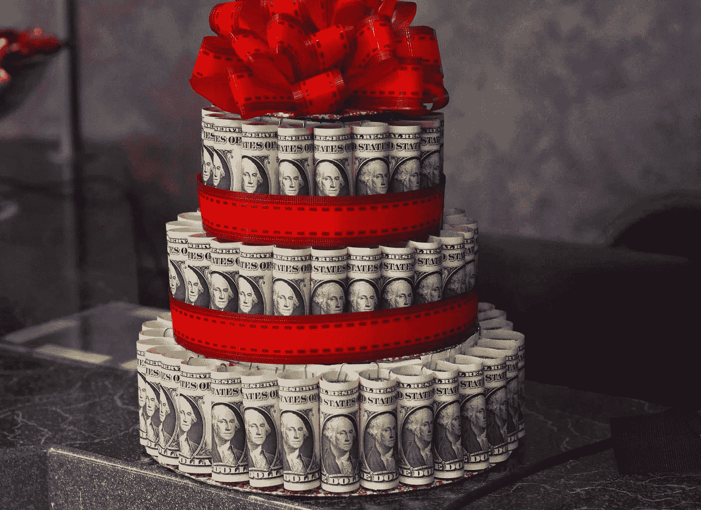
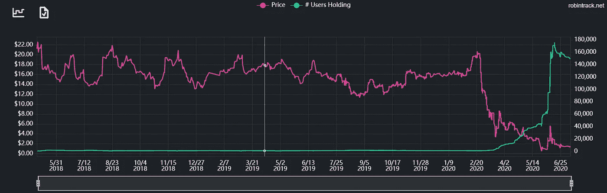
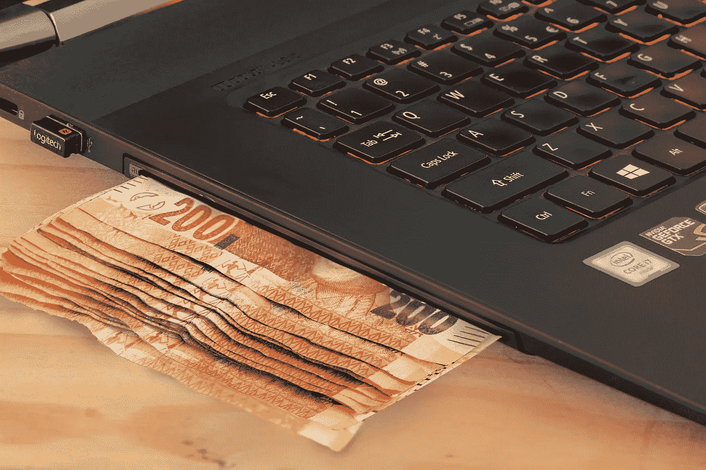
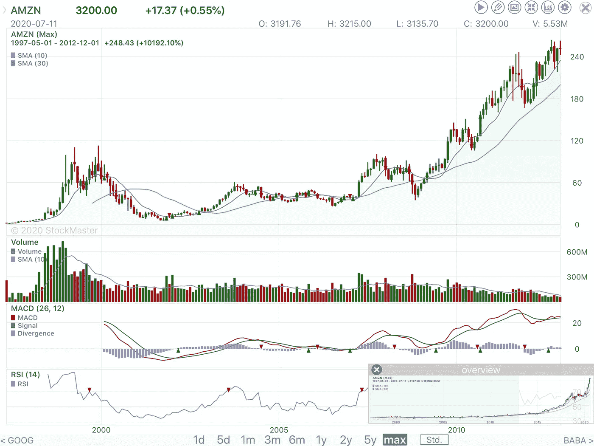
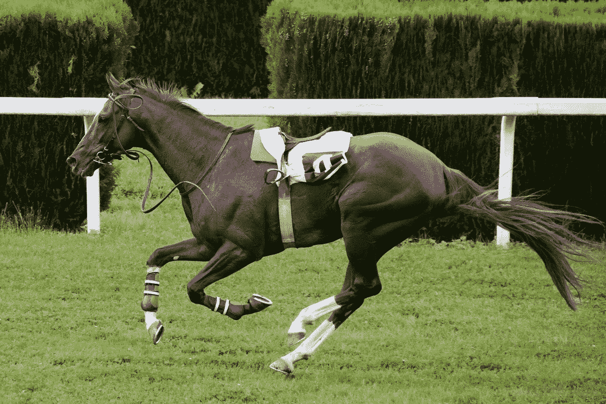

# 不要让“赫兹效应”引诱你进行不合时宜的投资

> 原文：<https://medium.datadriveninvestor.com/dont-let-the-hertz-effect-lure-you-into-a-badly-timed-investment-767680afdd46?source=collection_archive---------8----------------------->

## 在 2020 年牛市陷阱的顶峰附近买入将是一个你不会忘记的错误

Ooooohhhhh!!! Looks pretty sweet!— Pixabay

投资者可能犯的最大的新手错误之一是，因为股价飙升而买入定价过高的股票。老实说，我明白被一项愚蠢的投资所诱惑是多么容易。我自己也不止一次犯同样的错误。

这是一个很容易犯的错误。如果你真的不知道如何给一只股票估值或者你真的没有时间去研究一只股票，那么就很容易下结论；

> 为什么不买特斯拉或者亚马逊？我知道这些公司的名字，股票价格上涨很快。每个人都赚了很多钱，而我没有。它不可能被高估——成千上万的投资者怎么会错？“也许估值不再重要了……”

再说一次，追逐一只定价过高的股票是新投资者容易犯的一个非常典型的错误，但这些天这个问题被我称为…

# “赫兹效应”

*‘当一个没有经验的投资者将钱投入一只即将破产的股票，或一家即将成为僵尸的公司，以为这只股票很快就会反弹，但却开始亏损，于是这只股票被迅速卖出，所得资金被用来购买一只价格严重过高、具有强劲正势头的股票，……结果却是***【一败涂地】。*..’*

## ***艾德法则二:**不要买破产的公司，也不要买僵尸的股票，或者即将成为僵尸的公司。只会给你带来悲伤和尴尬。*

# *赫兹怎么了？*

**

*在经营了大半个世纪后，赫兹于 2020 年 5 月 22 日申请破产，理由是疫情导致收入和未来预订量急剧下降。*

*像许多因突然意识到北美已被新的神秘病毒渗透而受到打击的股票一样，许多散户投资者开始涌入这只股票。这些早期投资者预测，经济将迅速重新开放，随后出现 V 型复苏。*

*在最初的价格反弹后，该股继续走低，而持有 HTZ 的罗宾汉账户继续以反比稳步增长。*

*2020 年 5 月 25 日— **HTZ** 股价突然下跌至 0.65 美元，而仅仅三个月前，该公司股价还在 20 美元以上。截至 6 月 15 日，持有这只股票的 Robinhood 账户数量激增，从大约 40，000 个账户增加到超过 170，000 个账户——请记住，该公司已于 5 月 22 日申请破产(见上图)。*

*6 月 9 日，散户投资者，几乎肯定还有算法交易系统和动量投资者的共同作用，暂时将该股推高至 5.56 美元。现实摆在眼前，HTZ 在几天内直线下跌。积累这种股票的罗宾汉账户继续增加。截至本文撰写之时，该股股价为 1.48 美元，仅过了几个月，罗宾汉的账户就开始急剧减少。*

**

*Image by [Steve Buissinne](https://pixabay.com/users/stevepb-282134/?utm_source=link-attribution&utm_medium=referral&utm_campaign=image&utm_content=2301933) from [Pixabay](https://pixabay.com/?utm_source=link-attribution&utm_medium=referral&utm_campaign=image&utm_content=2301933)*

# ***赫兹效应**如何影响投资者*

*没有经验的投资者正确地不想为昂贵的科技股支付过高的价格，而是寻找尚未开始从疫情复苏的受打击的股票。尽管押注经济快速复苏有风险，但从长期来看，这可能是比追逐价格过高的科技股聪明得多的投资策略。然而，投资者很快意识到，他们的经济复苏投资战略并没有获得价值，而技术类股却在快速上涨。*

*缺乏经验的投资者突然想到，他们应该在几周前购买亚马逊或特斯拉，因为几周后这些股票已经呈指数上涨，而备受打击的经济复苏股票却没有任何进展，甚至更糟的是价格下跌。*

*在做了一些粗略的计算以确定已经损失了多少潜在的交易利润后，这位没有经验的投资者抛售了福特、通用电气、美国航空、加勒比海游轮公司……并用所得购买一个技术名称，而不考虑估值。*

*女士们、先生们，赫兹效应将让数百万散户投资者落泪，数万人破产[或更糟的](https://youtu.be/vjyLQCo12NM)。*

**

*Image by [StockSnap](https://pixabay.com/users/StockSnap-894430/?utm_source=link-attribution&utm_medium=referral&utm_campaign=image&utm_content=2566201) from [Pixabay](https://pixabay.com/?utm_source=link-attribution&utm_medium=referral&utm_campaign=image&utm_content=2566201)*

*埃德的规则 4:不要追逐股票代码。任何积极势头极其强劲的投资都可能突然逆转，毫无征兆。如果你以很高的估值购买了一只股票，你可能会在很多年里亏本。*

*几个月来，我一直在通过媒体解释，为什么我们正处于一个巨大的牛市陷阱之中，为什么特别是缺乏经验的投资者需要警惕实体经济中发生的事情，而不要陷入“股市不是经济”或“这次不一样”的咒语。然而，我认为大多数没有经验的投资者并没有真正意识到不合时宜的购买会造成多大的损失。例如，…*

# *亚马孙*

*从 1999 年科技泡沫的顶峰到大约两年后的低谷，亚马逊每股从 80 多美元跌至远低于 10 美元。如果一个投资者在互联网泡沫期间犯了一个不幸的错误，在亚马逊股价接近峰值时买入了它，那么这个投资者将不得不等待近十年，直到 2007 年至 2008 年才能在股价大幅上涨之前收回投资。你能等 5 年或更长时间吗？我不能。*

**

*Amazon historical stock price — 1997 to present*

*另一方面，如果一个投资者在强劲的牛市期间抑制住购买亚马逊的冲动，而是等到 2001 年夏天，价格就会跌至远低于每股 10 美元。仅持有亚马逊股票 3 年就产生了 3 倍以上的回报。从 2001 年到 2008 年，持有亚马逊给投资者带来了大约 10 倍的投资回报。*

*虽然市场的短期时机通常会导致糟糕的结果，但很明显，在市场峰值附近买入对投资者来说绝对是毁灭性的。我非常担心，如果缺乏经验的投资者从马鞍上摔下来，一旦这个泡沫突然破裂，有多少年轻投资者会像 1999 年互联网泡沫破灭后那样，多年不投资股市？*

**

*That’s a tough saddle to get back into! — Image by [annca](https://pixabay.com/users/annca-1564471/?utm_source=link-attribution&utm_medium=referral&utm_campaign=image&utm_content=1577291) from [Pixabay](https://pixabay.com/?utm_source=link-attribution&utm_medium=referral&utm_campaign=image&utm_content=1577291)*

# *缺乏经验的投资者也倾向于交易过于频繁*

*缺乏耐心也不利于缺乏经验的投资者，并导致人们陷入赫兹效应。如果你是那些购买了航空公司股票、石油股票或游轮股票的投资者之一，认为经济会很快复苏，我认为你可能在短期内犯了一个错误。*

*然而，在更长的时间范围内(可能是一年或两年)，当疫情已经过去，经济可以再次完全开放时，这些股票的价格几乎肯定会再次快速上涨。如果你没有在你的投资组合中投入太多，并且你有一个很长的时间范围，你可能想坚持你的疫情反弹投资。如果结果是你的钱在一两年内翻了一倍，我会认为这是一个出乎意料的投资决定。比在历史高点买入科技股聪明得多。*

*埃德的规则 5:如果你相信一个股票故事，并有充分的理由购买它，你必须准备坚持你的投资决定至少几年。*

# *结论*

1.  *不要买破产的公司，也不要买僵尸的股票，或者即将成为僵尸的公司。只会给你带来悲伤和尴尬。*
2.  *不要追逐股票代码。任何积极势头极其强劲的投资都可能突然逆转，毫无征兆。如果你以很高的估值购买了一只股票，你可能会在很多年里亏本。*
3.  *如果你相信一个股票故事，并有很好的理由购买它，你必须准备坚持你的投资决定至少几年。*

*赫兹效应可能是新的，但它是真实的，而且会变得更糟，它会愚弄许多投资者。我建议你[计算你的投资需求](https://medium.com/datadriveninvestor/keep-calm-and-carry-on-investing-during-a-stock-market-bubble-35f29daf316c)，为购买你想买的股票提出合理的理由，然后坚持你的投资决定。*

*股市赚钱需要时间，需要不可动摇的承诺。如果你没有至少两年的时间跨度，你就没有理由购买股票。让我更坦白地说，如果你的投资期限不到两年，那你就不是在投资，而是在赌博。*

*退一步，放松，做出清晰的投资决定。不要让“赫兹效应”诱使你进行不合时宜的投资。*

# *披露——当我发表这篇文章时，我持有大约 95%的现金。在做出任何投资决定之前，请寻求专业建议。*