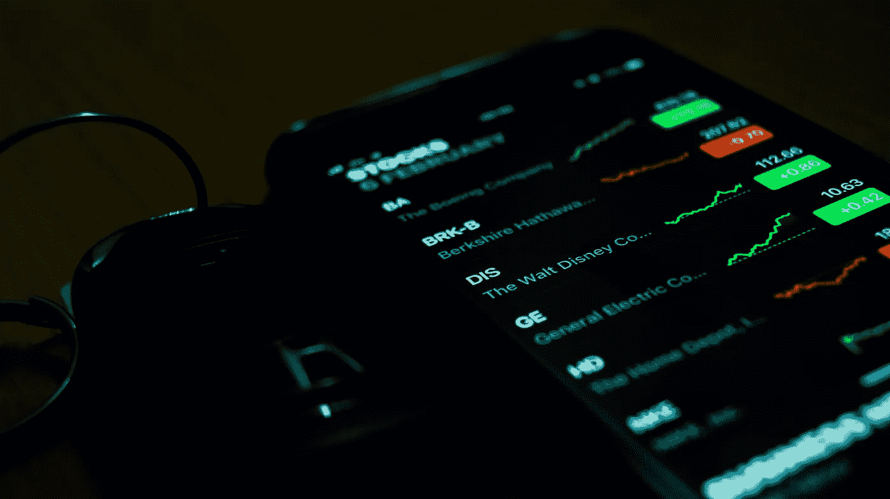

# 不要让股票炒作影响了你的判断

> 原文：<https://medium.datadriveninvestor.com/dont-let-the-stocks-hype-cloud-your-judgement-8bd0a89cb37d?source=collection_archive---------33----------------------->

[Ishant Mishra](https://unsplash.com/@ishant_mishra54) | [Unsplash](https://unsplash.com/photos/UXEJDX4SqdE)

## 大卫对战歌利亚

虽然 Reddit 热潮仍令华尔街不安，但重要的是要记住，一生一次的事件不应决定你对投资方式的态度。鼓舞人心的 2021 年版本翻拍了大卫与歌利亚的故事，根据穿连帽衫的家伙与穿西装的专业人士重新想象，这绝对是出乎意料的，但仍然很符合圣经。它的长期效果仍是一个问题，但它不应该动摇未来的后起之秀投资者远离计算决策。

市场已经看到[波动性增加](https://www.cnbc.com/2021/02/01/volatility-surges-as-stocks-fall-and-analyst-says-its-a-warning-sign.html)，当前的形势让许多传统投资者困惑和摸不着头脑。机构投资者与散户投资者之间的战斗仍在继续，似乎已经形成了一个新的先例，即“小人物”站出来为自己辩护，对抗他们的“恶霸”——对冲基金。考虑到这一点，很容易迷失投资的真正本质，以及如何让自己处于有利位置。未来的投资者永远不要忘记几个关键的提醒。

## 投资它——如果你能失去它

新手最大的错误是向电子钱包或经纪账户注入大量资金，希望获得巨额收益。事实是:永远不要投资超过你愿意和/或能承受的损失。当你开仓时，准备好和钱说再见。远离一时冲动的交易决定，不要把你一生的积蓄都投资在一时冲动上。

## 研究一下你想投资什么

知道你正在进入什么，知道你正在投资什么。做好你的调查，好好把握你将投入宝贵资金的公司。他们的记录如何？他们最近的新闻报道怎么样？他们未来的前景怎么样？这些都是你在做投资决定前应该问的基本问题。

## 仅仅因为你能——并不意味着你应该

你有钱吗？太好了！但是，不要仅仅因为你有资本就投资。你想让你的钱赚更多的钱。这可以理解。当你知道你有现金的时候，寻找一个快速交易的机会是很诱人的，但是找到一个好的投资需要时间，找到一个好的进场点也需要时间。

## 理解杠杆意味着什么

你总是看到***“2X，5X，20X”***等等。但这意味着什么呢？杠杆交易，也称为保证金交易，是一种允许交易者建立比其自有资本大得多的头寸的系统。**杠杆**意味着你可以用比你投入多 2/5/20 倍的钱交易，但风险也大 2/5/20 倍。然而，你不会得到 2/5/20 倍的钱，这只是自动的。你只是用他们的钱，并支付佣金。不管你的头寸是赢是输，他们的钱都是一样的。在投资失败的情况下，止损应该到位以限制资金损失。经纪公司通常会发出边际呼吁，以保护投资价值不会下跌太多。

## 理解什么是卖空

卖空行为是指个人借入股票出售给其他人，以便在未来以更低的价格买回这些股票，并保留差价，只有在股价下跌的情况下才这样做。这恰恰引发了 Reddit 热潮以及卖空 GameStop (GME)股票的对冲基金和不断投资 GameStop 以提高其股价的散户投资者之间的巨大力量变化。

## 不要害怕拥抱

除非你即将成为日内交易者，否则在你的桌子上放上 4 个显示器，跟踪市场的每一次下跌，至少几个月内不要平仓。长期投资被认为更安全、更值得。根据一家公司的表现，根据其季度收益、即将开展的项目和媒体报道，其股票价格的变化可能需要几个月的时间才会发生。

## 错误是不可避免的——要习惯它

你会犯错误。每个人都这样。投资不是非黑即白的宗教。当你知道你做了一笔糟糕的交易时，不要害怕在亏损时平仓。一只股票可能需要更长的时间才能恢复，在某些情况下可能永远也不会。相反，与其以后遭受更大的损失，不如现在就接受小损失。

## 学习—学习—学习

最后，最有帮助的提示，坚持学习永远是个好主意。永远不会有一个时候，你会知道关于投资的一切。关注新闻，了解不同的行业。了解市场走向。研究即将到来的技术，找出社会的发展方向。

总而言之，你积累的知识越多，你在做出深思熟虑的投资决策时就会变得越好、越自信。