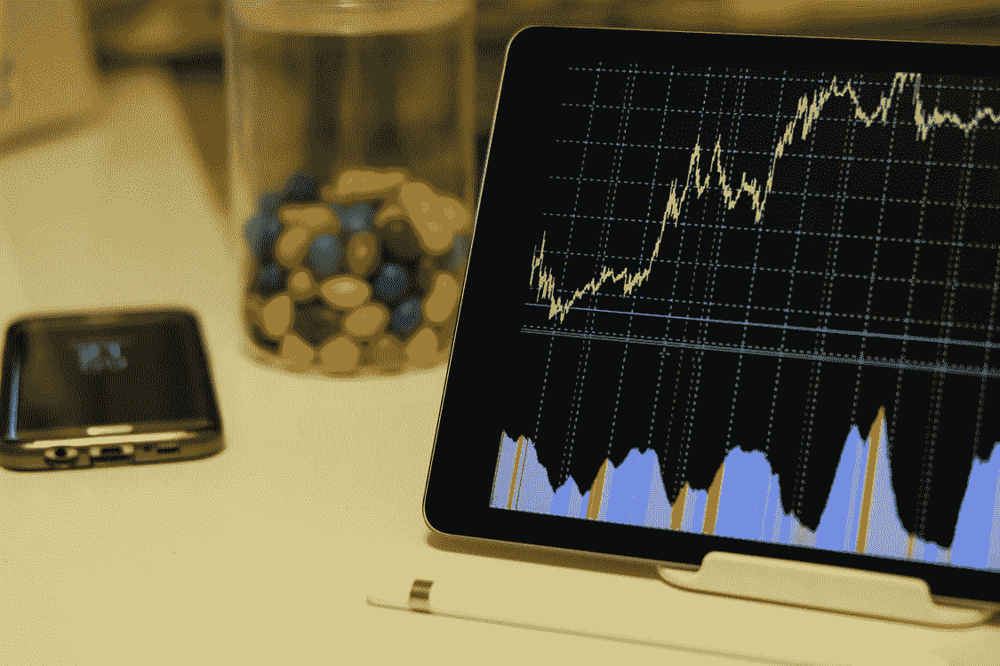

# 在股市繁荣时期，不要犯这五个错误

> 原文：<https://medium.datadriveninvestor.com/dont-make-these-five-mistakes-during-stock-market-booms-d7f84d3949a7?source=collection_archive---------16----------------------->

## 当股市不断创新高时，投资者会犯的 5 个错误

Photo by [Burak K](https://www.pexels.com/@weekendplayer?utm_content=attributionCopyText&utm_medium=referral&utm_source=pexels) from [Pexels](https://www.pexels.com/photo/space-grey-ipad-air-with-graph-on-brown-wooden-table-187041/?utm_content=attributionCopyText&utm_medium=referral&utm_source=pexels)

> 问问自己，你是投资者还是交易者？如果交易员是你的答案，你可以马上离开，因为下面将要讨论的事情不会引起交易的共鸣，它们只是从长期投资的角度来看。

在股票市场不断创出新高的时候，许多投资者过于兴奋或过于担心，犯下了一些日后会后悔的重大错误。

以下是我通过阅读《富爸爸》、《穷爸爸》和《聪明的投资者》等书籍以及许多与网络投资相关的文章而了解到的 5 个主要错误，如果你想成为一名成功的投资者并最终致富，你必须避免这些错误。

## 变得如此乐观，以至于你改变了自己的风险预测

大多数投资者在繁荣时期增加了他们的股票配置，因此改变了他们的风险状况，保守派变得温和，温和派变得激进。

他们没有意识到市场会在未来自我修正，它总是这样，历史就是证明。一旦市场开始调整，这些投资者就会恐慌，因为他们增加了股票配置，导致他们对股票失去信心。

所以要理智，时刻保持自己的资产配置，让自己未来不后悔自己的决定。

## 仅仅基于最近的过去进行思考

大部分投资者只记得过去两三个月的跨度内发生了什么，而不愿意去想更早的市场发生了什么，甚至在市场试图一次又一次重复同样的事情的时候。

例如，在 2019 年 12 月和 2020 年 1 月，市场正在创造新的记录，没有人想到会发生什么，以便市场纠正，但忘记纠正，2020 年 2 月和 3 月发生的事情，比那要糟糕得多，它让很多投资者破产。

如果你认为没有人预测到新冠肺炎，那么我的朋友，除了一些传奇投资者，没有人预测到互联网泡沫破裂和 2008 年金融危机。

那些在市场高点时保持理性并筹集现金的人现在坐在顶端，因为他们遵循了沃伦巴菲特这个简单的小概念，

> 在别人贪婪的时候恐惧，在别人恐惧的时候贪婪。

Photo by [Burak K](https://www.pexels.com/@weekendplayer?utm_content=attributionCopyText&utm_medium=referral&utm_source=pexels) from [Pexels](https://www.pexels.com/photo/white-android-tablet-turned-on-displaying-a-graph-186464/?utm_content=attributionCopyText&utm_medium=referral&utm_source=pexels)

## 停止啜饮

乍一看，这似乎是一个明智的选择，当市场调整或崩溃时，你会积累现金并进行投资。但是，你知道市场什么时候会崩溃吗？号码

让我们以印度股票市场的指数 Nifty 50 为例。一旦突破 11，000 点大关，就开始被认为是高的，有些人甚至在 10，500 点或 10，700 点后开始认为是高的。但是你看，它现在已经站在 13000 点的关口，而且现在被认为会升得更高。

即使在 13000 点，也需要 20%的修正才能回到 10400 点。

所以停止啜饮不是一个好主意，因为没有人知道未来会发生什么。是的，如果市场高得难以想象，你可以通过 SIP 降低你的投资额，同时筹集一些现金，但不要停止 SIP。

毕竟，这些 sip 会逐渐增加你在共同基金或股票中的资金积累，从而带来更好的复利收益。

如果你知道这只股票在未来会有好的表现，无论是在高点还是在低点，永远不要停止啜饮，因为你在这只股票高点的投资可以通过在低点投资来平均化。

 [## 收盘，但没有雪茄-股票市场目标在停滞的 COVID 救济中创新高|数据驱动…

### 专家聊天程序:一个协作市场，在这里人们可以和能够解决他们问题的专家聊天。是……

www.datadriveninvestor.com](https://www.datadriveninvestor.com/2020/08/18/close-but-no-cigar-stock-market-targets-record-highs-amidst-stalled-covid-relief/) 

> 为了创造更多财富，你能做的最重要的事情就是保持投资，如果你不保持投资，你就不会从复利中获益。

## 一次性投资

Photo by [Alexander Mils](https://www.pexels.com/@alexandermils?utm_content=attributionCopyText&utm_medium=referral&utm_source=pexels) from [Pexels](https://www.pexels.com/photo/person-holding-100-us-dollar-banknotes-2068975/?utm_content=attributionCopyText&utm_medium=referral&utm_source=pexels)

这种类型的错误一般是新手犯的，他们最近只看到了股市的高点，并在市场顶峰时大举投资，希望快速致富，因为他们从未看到股市的低点。

在市场高峰时大举投资，往往会导致市场下跌时出现负回报，这导致从未见过股市这一面的新手陷入恐慌。其结果是，他们停止投资，如果他们不在低点投资，降低投资时的市场平均点位，需要很长时间才能恢复，有时甚至需要数年。

如果你想在高峰时期投资，因为我们都知道，我们无法预见未来，通过 SIP 投资，这样，如果你开始投资之旅后几个月下跌，你的钱不会全部投资在高峰时期。

## 投资于股价处于 52 周低点的公司

大多数寻找低成本股票的投资者投资于以非常低的价格交易的公司。

也许，如果他们的基本面是正确的，并且没有引起大投资者的注意，它可以为你创造财富，但大多数时候情况并非如此。

你看，在这样一个乐观的市场中，所有公司都在上涨(可能不是从根本上，但在股市图表中)，投资任何一家公司都会在短期内给你带来良好的回报，因此该公司的交易处于 52 周低点肯定有原因。

所以也许这家公司不值得交易，这就是为什么它被以如此低的价格交易，如果你不太懂选股，最好避开他们。

因此，当股市不断创出新高时，投资者通常会犯这些错误。虽然在屏幕上看起来很明显，但实现它们需要很大的勇气。但是一旦你避免了这些错误，所有的勇气都会得到回报。

> **还有一件非常重要的事情…**
> 我不是财务顾问，以上所有的错误都是我从我读过的书籍和文章中获得的信息，以及我所看到的发生在我认识的一些人身上的事情的结果。在修改投资计划之前，请自行研究或咨询您的财务顾问。

感谢阅读！！

## 获得专家视图— [订阅 DDI 英特尔](https://datadriveninvestor.com/ddi-intel)