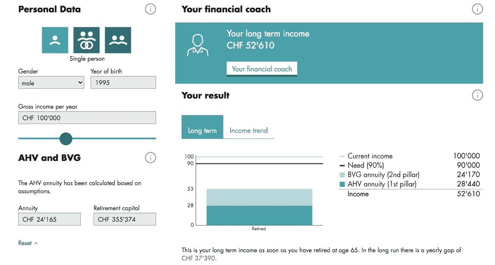
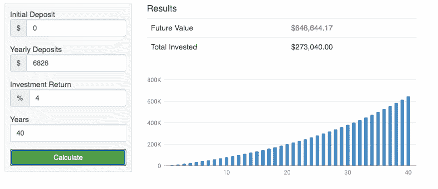
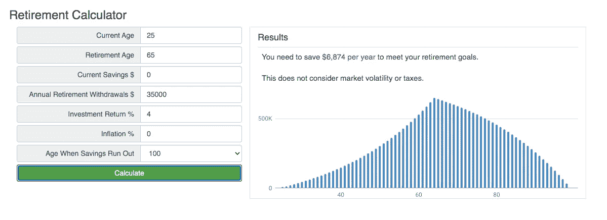

# 不要为你的退休犯这个错误

> 原文：<https://medium.datadriveninvestor.com/dont-make-this-mistake-for-your-retirement-e8f0efda98a3?source=collection_archive---------8----------------------->

## 你想退休后生活水平低一点吗？如果没有，你应该开始用 pillar3a 为退休做打算。您是否希望削减不必要的成本，并使支柱 3a 投资与您的财务目标保持一致？以下是关于 pillar3a 投稿的必备知识。

在阅读本文之前，我建议您对 pillar3a 是什么以及有哪些选择有更多的了解。你可以在这里阅读我的这篇文章: [<如何用你的支柱 3a >](https://medium.com/makingofamillionaire/how-to-create-wealth-with-your-pillar-3a-300cc281554f) 创造财富。然后回来读读这篇文章，这样你就知道为什么它有意义了。

Photo by [Huy Phan](https://unsplash.com/@huyphan2602?utm_source=unsplash&utm_medium=referral&utm_content=creditCopyText) on [Unsplash](https://unsplash.com/s/photos/retire?utm_source=unsplash&utm_medium=referral&utm_content=creditCopyText)

# 为什么缴纳 Pillar3a 会对退休收入产生巨大影响

支柱 3a 是为在公司工作或自营职业的人提供的自愿养老基金缴款。正如你可能已经知道的，当你退休时只有第一和第二支柱养老金，很难维持同样的生活水平。因此，3a 支柱开始发挥作用，为你退休后提供额外的收入。我们来看一个例子，看看有没有 pillar3a 的区别有多大。让我们想象一下，迈耶先生 25 岁开始工作，65 岁退休。40 年后，他的平均年薪是 10 万瑞士法郎。目前，他没有对支柱 3a 做出贡献。

[https://www.helvetia.com/ch/web/en/private-customers/private-pension-and-health/services/pension/retirement-calculator.html](https://www.helvetia.com/ch/web/en/private-customers/private-pension-and-health/services/pension/retirement-calculator.html)

从计算中可以看出，从 10 万瑞士法郎的年收入到 52610 瑞士法郎的退休收入是一个巨大的减少。如果他只能达到过去收入的 90%，差距仍然很大——每年 37，390 瑞士法郎。

*   工作月总收入:8，333 瑞士法郎
*   退休月总收入:4384 瑞士法郎。48%的差距。

有了这个，迈耶先生还能保持他一贯的生活水准吗？显然不是。想象你是梅尔先生或梅尔夫人，你想象你在度假，享受生活吗？或者你会想象自己在家度过时光，努力削减开支？答案显而易见。所以我们来看看 pillar3a 为你做了什么。

如果 Meier 先生每年向 pillar3a 养老基金缴纳 6，826 瑞士法郎。在 40 年的时间里，以 4%的适度回报率(如果他明智地投资于 ETF 和其他金融产品)，这将是 648，644.17 瑞士法郎。这远远超过第一和第二支柱的总和，即 355，374 瑞士法郎。

saving.org

让我们看看你退休后他每年能提取多少钱，他不会比你的钱活得长。下图显示，如果他贡献 6，874 瑞士法郎(接近最高贡献额 3a)，他每年可以从您的投资组合中提取 35，000 瑞士法郎。同样的投资组合，年回报率适中，为 4%。我们假设通货膨胀率为 0%,因为他可以用 1%的通货膨胀率获得 5%的投资回报，或者假设通货膨胀率为 0%,获得 4%的投资回报。当他 100 岁时，他的钱会用完。

saving.org

另一方面，这意味着当迈耶先生从 25 岁开始向 pillar3a 缴款，并且每年都达到最大值，直到他退休。他的年总退休收入将为 87，610 瑞士法郎。每月 7300 瑞士法郎起。我们来对比一下工作的收入。

*   工作月总收入:8，333 瑞士法郎
*   退休月总收入:7300 瑞士法郎。是原工资的 87%。

你能想象退休后靠 87%的工资生活吗？你省下了上班的交通费，省下了外出就餐的费用，省下了干洗衬衫的费用等等。我认为把工作工资的 87%用于退休是非常好的。

 [## 如何在不牺牲孩子或财务的情况下安全理智地离婚|数据驱动…

### 在美国，七月是以孩子为中心的离婚月。作为 cdfaⓡ的专业人士，我可以向你保证，从长远来看…

www.datadriveninvestor.com](https://www.datadriveninvestor.com/2020/07/28/how-to-divorce-safely-and-sanely-without-sacrificing-your-children-or-your-finances/) 

# Pillar3a 的其他优势

支柱 3a 缴款不仅可以用于补贴您的退休收入，还可以节省您的税收，为您购买房地产提供额外的资金。最重要的是，它可以投资于 ETF，从长期来看，它将产生投资回报，扩大你的投资组合，就像我们在上面的例子中看到的那样。

*   **节税:** Pillar3a 供款额可扣税。你不必为那部分收入纳税。
*   **首付用途:**在瑞士购买一手住宅的首付比例为 20%。您的 pillar2 和 pillar3a 最多可支付 10%。
*   **获得投资回报:**如果你不投资，你的 pillar3a 资金将会存在银行账户里，当你退休时，你会得到上例中扣除费用前的 273，040 瑞士法郎。但如果你投资，平均回报率只有 4%，你的投资组合可以增长到 648，644 瑞士法郎。

> 毫无疑问，如果你想保持类似的生活质量，向你的 pillar3 账户缴款是必不可少的。

# 这里是果汁，请问应该在哪里开 pillar3a 账户？

在研究了所有的可能性，并在经济上遭受了错误选择的痛苦之后，我的结论是， [VIAC](https://viac.ch/en/) 是大多数人的最佳选择，他们希望**定期缴款**和**投资低成本的 ETTs** 并从**长期投资**的回报中受益。如果你符合这三个标准，那么就不要再找了。

VIAC 在瑞士的消防社区中特别受欢迎，你可以从贫穷的瑞士人 [< VIAC 评论 2020——瑞士最佳第三支柱>](https://thepoorswiss.com/viac-best-third-pillar/) 和穆斯塔法邮报 [<的评论中读到，VIAC 是瑞士穆斯塔法的(新)最佳第三支柱吗？>T3。](https://www.mustachianpost.com/2018/05/25/is-viac-the-new-best-third-pillar-for-swiss-mustachians/)

VIAC 允许您定期或一次性向 pillar3a 账户存款，并直接通过应用程序监控您的投资组合。您还可以看到费用，这取决于您在投资组合中选择的工具。这个想法非常简单——允许人们投资长期、低成本、广泛多样化的交易所交易基金。ETF 的成本非常低，所以在你开始赚钱之前，你不会亏钱给基金经理。如果你想明白为什么选择 ETF，你得读一读这本书<[**The bogle heads ' s Guide to The Three-Fund Portfolio:一个由三只总市场指数基金组成的简单投资组合如何以较小的风险跑赢大多数投资者**](https://amzn.to/2KTwHwM) **>。**

# 不要错过这个降低费用的方法

读完这篇文章和其他一些文章后，你可能已经明白 VIAC 是 pillar3a 客户的最佳选择。他们最近启用了 5 个好友邀请码，而不是 3 个。如果您使用朋友的邀请码，您和您的朋友在第一个 500 瑞士法郎的有效期内无需支付任何管理费。我喜欢 VIAC 在其 3a 账户中提供低成本 ETF，更好的是他们允许用户减少更多的管理费。他们活出了为用户进行低成本投资的真正精神。

因此，如果你有 VIAC 的“邀请朋友”代码，请在评论中分享，这样我们的读者就可以从中受益。

— — —

我是一个热心的学习者和积极的倾听者。我对营销、技术、个人理财、生产力和企业家精神充满热情。关注我的帐户接收每周文章。

🎧**在这里听我关于事业金钱和企业家精神的播客:**[**https://www.fasttrack.life/**](https://www.fasttrack.life/)

想了解更多关于这个话题的信息吗？

[**<如何用你的支柱 3a 创造财富>**](https://medium.com/makingofamillionaire/how-to-create-wealth-with-your-pillar-3a-300cc281554f)

[**<如何用你创造财富支柱 3b >**](https://medium.com/makingofamillionaire/how-to-create-wealth-with-you-pillar-3b-3c7c61b71d23)

[**智能投资者**](https://amzn.to/2z2GE8t)

[**理财高手游戏:财务自由的 7 个简单步骤**](https://amzn.to/2VUj6vE)

## 访问专家视图— [订阅 DDI 英特尔](https://datadriveninvestor.com/ddi-intel)