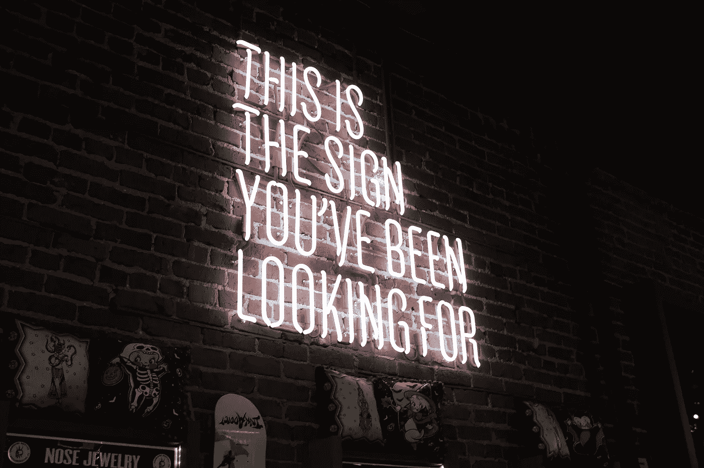

# 在你的 2021 年商业计划中，不要错过这个营销策略

> 原文：<https://medium.datadriveninvestor.com/dont-miss-this-marketing-tactic-in-your-2021-business-plan-238cc0ed3418?source=collection_archive---------21----------------------->

Photo by [William Iven](https://unsplash.com/@firmbee?utm_source=unsplash&utm_medium=referral&utm_content=creditCopyText) on [Unsplash](https://unsplash.com/s/photos/planning-2021?utm_source=unsplash&utm_medium=referral&utm_content=creditCopyText)

我们即将迎来新的一年，为此感谢宇宙。在各种规模的企业中，详细的 2021 计划正在出现。预算正在谈判中。优先级正在被重新排序。这是一个激动人心、充满压力的时代。

在这一点上，你可能已经为你的企业制定了至少 2021 年(1-3 月)的 Q1 计划。如果没有，不要担心——你还有一天时间(如果有点晚，也没什么大不了的)。

谈到规划，我的营销客户都有不同的强度。有些人整个 12 月都在挖地道。其他人有一张带有目标和大纲的单张纸。

但是不管业务规模、预算或目标如何，我总是告诉公司不要睡在一个策略上:

# 内容营销。

一、什么是内容营销？

> **内容营销**是一种战略性的**营销**方法，专注于创造和分发有价值的、相关的和一致的**内容**，以吸引和保留明确定义的受众，并最终推动有利可图的客户行动。(CMI)

在商业中，内容营销有时会让人觉得是事后诸葛亮，但是如果你一直在寻找开始的理由，我可以给你几个。

对于你 2021 年的商业计划来说，内容营销应该是不可协商的最大理由？

## **内容营销低抬，影响巨大。**

让我们进入杂草。真正重要的是，我的大多数客户在决定投资内容营销之前都会问自己一个问题:

它对我的业务有何帮助？

## **1。它将你定位为未来客户的专家**

阅读:更多销售。

当你买东西的时候，你可能会做一些调查。当你的研究显示出高质量的内容时，你的大脑就会像专家一样信任那家公司。当你被认为是某个领域或某个产品的专家时，你的销售额就会增加。瞧啊。

## 2.它将你定位为当前客户的专家

通过内容建立忠诚度，您将:

1.  减少取消。
2.  建立品牌信任。
3.  赢得回头客。

所有这些事情都可以通过一个伟大而简单的内容计划来完成。

 [## 取代你的风投？企业家的 5 条原则|数据驱动的投资者

### 在 Tau Ventures，我们建议所有企业家将融资过程中的勤奋过程视为双向的…

www.datadriveninvestor.com](https://www.datadriveninvestor.com/2020/11/29/replacing-your-vc-5-principles-for-entrepreneurs/) 

## 3.它直接增加了收入

借助正确的内容策略，您将引领您的销售线索(哈！)通过一个易于导航的旅程，鼓励他们使用高质量的信息向您购买。你可以对这种相互的价值交换感觉良好。低俗的销售已经死亡；你只需要人们愿意接受的好内容

## 4.它带来了长尾效应(和更稳定的资金)

我仍然从我在 2018 年写的一篇[媒体文章](https://blog.usejournal.com/marketing-not-working-start-with-this-five-minute-exercise-before-doing-anything-else-1ae4de3bebd2)中获得线索。当人们在寻找高质量的信息时，他们会找到你——如果你了解你的受众。这就引出了我的下一个观点:

## 5.它将改善所有的营销功能

好的内容是 100%基于了解你的受众。这难道不是成为优秀营销人员的首要规则吗？知道。你的。观众！

当你弄清楚什么内容起作用时，你将获得(免费！)洞察你的客户——这会让你成为更好的营销人员。和销售支持人员。和领导者。和客户支持者。

并且……增加你的销售额。

看到了吗？*低升力，高冲击力。*

# 开始行动——这并不像你想象的那么难

Photo by [Danielle MacInnes](https://unsplash.com/@dsmacinnes?utm_source=unsplash&utm_medium=referral&utm_content=creditCopyText) on [Unsplash](https://unsplash.com/s/photos/start?utm_source=unsplash&utm_medium=referral&utm_content=creditCopyText)

交易是这样的:你不需要一个全职的内容战略家或内容作家来开始内容。你可以自己做，只需要一个简单的计划。

我告诉我的客户，每周花三个小时进行内容营销，你会发现这对你的业务产生了巨大的影响。你准备好在 2021 年看到更多的品牌忠诚度、更多的销售线索和更多的销售额了吗？

然后你必须执行一个内容计划。

*在 Hue Content，我为我的客户建立详细的、易于理解的内容和文案计划。如果你有兴趣和我一起工作，计划从 219 美元开始。如果你有兴趣一起工作，请联系 brylarrea@gmail.com！*

*如果你还没有准备好一起工作，但是你有问题或者想加入我的时事通讯以获得更多的内容智慧，请随时联系我们！*

**访问专家视图—** [**订阅 DDI 英特尔**](https://datadriveninvestor.com/ddi-intel)