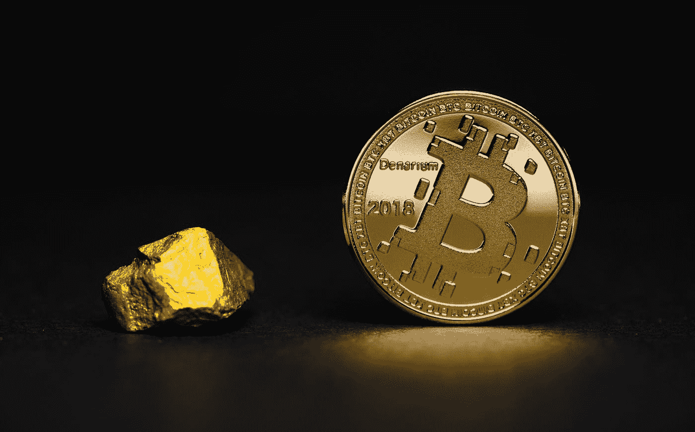

# 别慌，钱会消失的

> 原文：<https://medium.datadriveninvestor.com/dont-panic-but-money-is-gonna-disappear-c6e186a628bb?source=collection_archive---------7----------------------->

## 各国央行是如何拼命赶火车的

Photo by [Moses Vega](https://unsplash.com/@mosesvega?utm_source=medium&utm_medium=referral) on [Unsplash](https://unsplash.com?utm_source=medium&utm_medium=referral)

金钱是两部分之间的协议。

很快，它将被兑换成数字硬币和数字货币。

你已经用手机付款了。现在你用美元来做。很快你就会用加密货币来实现。

你只需要把一些历史观点放在你的头脑中。

几个世纪以前，关于先进技术，事情是相当酷的。

一天，一位才华横溢、年轻而古怪的美国探险家威廉·亨利·弗内斯三世去了赤道以南的一个偏远岛屿，并在那里呆了两个月。弗内斯三世曾学过医学，后转而攻读人类学。

令年轻的威廉惊讶的是，这个遥远的密克罗尼西亚岛名叫雅浦，它有着高度发达的货币体系。几乎不可能不注意到这笔钱，因为它太不寻常了。

钱是由巨大的石头轮子形成的，这些轮子又结实又结实，直径从 30 厘米到 3.5 米不等。在中心有一个洞，洞的大小根据石头的直径而变化，在洞内可以插入一根足够长且结实的棍子，以支撑重量并便于运输。——*——《金钱——未经授权的传记》中的费利克斯·马丁*

这些石头是在 300 英里外的一个岛上开采的，大部分运到了雅浦。

*这枚石头流通币的显著特点*……‘Furness’，*写道，它的主人不需要承担所有权。在达成一笔交易后，暗示一个* ***费*** *的价格太大，不便于运输，它的新主人满意地接受了仅仅是所有权的承认，并且没有表明交换的标记，货币和平地存放在前主人的房子里*

威廉·亨利·弗内斯三世对来自一个与现代世界隔绝的偏远岛屿的先进技术感到惊讶。

当弗内斯对雅浦货币体系的这一方面表示惊讶时，他的向导给他讲了一个更令人吃惊的故事。

> 邻村有一户人家，其财富无人质疑——人人皆知——然而没有人，甚至是这户人家自己，曾经见过或接触过那笔财富；它由一个巨大的飞组成，只有传统上知道它的尺寸。人们普遍认为，从一个岛到另一个岛的运输过程中发生的落水事故并不影响这块石头的购买力。因此，这块石头的购买力仍然有效，就好像它明显地靠在它主人房子的墙上一样。——费利克斯·马丁在《金钱——未经授权的传记》中

创新不是发生在当下的事情。

为了让你认为一切都是理所当然的，必须有人在一把没有的东西中创造出新的创新。

Photo by [Katie Harp](https://unsplash.com/@kharp?utm_source=medium&utm_medium=referral) on [Unsplash](https://unsplash.com?utm_source=medium&utm_medium=referral)

# 财富是充分体验生活的能力

钱只是必需品。这不是一项发明。

当你需要一些你不生产的东西时，你必须找到一个愿意用它来换你有的东西的人。但这并不总是可能的。

这个系统有一个缺陷。

我们必须找到一个人，他正好有我们想要的东西，同时又想要我们拥有的东西。

幸运的是，亚当·斯密在他的《货币的起源和使用》一章**【关于自然和国富论*的调查】中指出:*

> *(……)为了避免这种情况，社会各个时期的所有谨慎的人，在分工最初确立以后，当然都必须努力管理他们的业务，从形式到期限，除了他们自己行业的特定产品之外，还必须管理一定数量的这种或那种商品，他们认为很少有人会拒绝交换他们行业的产品。"*

*许多不同的商品被用于交换。*

*牛、盐、贝壳、干鳕鱼、糖、烟草、皮革，甚至钉子。*

*最有声望的是金银和其他贵金属。它们更容易保存，也可以分成许多部分。*

*然而，货币和当前货币是记录基础信用账户系统和执行基础清算过程的有用符号。*

*然而，流通货币本身并不是货币。*

*货币是信用账户体系及其补偿所代表的流通货币。*

*在现代世界中，我们已经看到了一些货币工程，它们将所有简单的货币补偿体系转变为一个复杂得多的世界，在某种程度上，转变为一个扭曲的蜘蛛网。*

*华尔街是完美的实验室。*

*多年来，华尔街为一个新的游戏场创造了工具，他们称之为衍生品、掉期或期权。*

*对于那些喜欢赌未来的人来说，这是最好的环境。*

> *华尔街和股票投机没有什么新鲜的。过去发生的事情会再次发生，一次又一次。这是因为人类的本性不会改变，而正是人类的情感，牢固地建立在人类本性中，总是阻碍着人类的智慧。这一点我可以肯定。杰西·利弗莫尔*

*一位名叫杰弗里的高中生在一个名为华尔街赌注的在线论坛上公开记录了一连串的好运。*

> *所以我的一个账户里还剩 900 英镑，我决定把它 YOLO 化。杰弗里*

*首字母缩略词 YOLO，代表你只能活一次，是这个论坛的常用词。*

*第二天，他发了一个新帖子，标题是:*

> *我决定用昨天的 4k 再次去 YOLO。*

*另一个昵称为 *thewulfmann* 的论坛用户发帖说:*你知道下一步该做什么。**

*一天后，杰弗里发布了一个新帖子，标题是:*

> *900 到 21k 只用了 10 天。*

*这个 21 岁的年轻人开始成为一名摇滚明星。社区震惊了，论坛疯狂了。但这并没有结束。*

* [## 首次创业的 4 个资金管理技巧|数据驱动的投资者

### 超过 82%的企业倒闭是由于财务管理不善和现金流问题。开始新的…

www.datadriveninvestor.com](https://www.datadriveninvestor.com/2020/10/23/4-money-management-tips-for-first-time-entrepreneurs/) 

第二天，昵称为 World_Chaos 的杰弗里发帖:

> 12 天内 900 到 55000

一个高中生利用股票市场和运气，在不到两周的时间里把几百美元变成了 55，000 美元。

如果你想更惊讶，读读我读过的同一本书，作者是 Jaime Rogozinski，书名是《华尔街赌注:婴儿潮一代如何成为千禧一代世界上最大的赌场》。

但首先要准备好你的胃，因为你会感到抽筋。* **

*Photo by [Aleksi Räisä](https://unsplash.com/@denarium_bitcoin?utm_source=medium&utm_medium=referral) on [Unsplash](https://unsplash.com?utm_source=medium&utm_medium=referral)*

# *货币的未来是数字货币*

*钱不是一个东西，而是一种社会技术。*

*它是一套组织社会的思想和实践。*

*在我们生活的破坏性世界中，加密货币往往是每个社会贸易的未来。*

*12 个月前，世界上几乎每一家央行都表示，加密货币太小，甚至无法被认可，它们不会影响货币政策。*

*8 个月后，我们在这里，所有的中央银行和政府。即使是商业银行，也在研究进入密码世界的最佳途径。*

*在数字世界里，事情不只是发生。事情就这样发生了。*

*[稳定的数字](https://bit.ly/3guIDV4)发展如此之快，以至于来自*现实* *世界*的人们，比如伟大的投资者、银行家、州长和财政部主席都在努力赶上这场数字海啸。*

> *稳定币是一种新的加密货币，试图提供价格稳定，并由储备资产支持。Stablecoins 获得了牵引力，因为它们试图提供两个世界的最佳选择——加密货币支付的即时处理和安全性或隐私，以及法定货币的无波动稳定估值。-投资媒体*

*如果你有像保罗·都铎·琼斯和斯坦利·德鲁肯米勒这样的大鲨鱼，将他们庞大投资组合的 1%投入比特币，那是因为你正在见证资产类别的巨大转变，这是由一些当今最成功的投资者进行的。*

*事情变化非常快。在最近与 Real Vision 的 Raoul Pau 和 Micro-strategy 的首席执行官 Michael Saylor 的访谈中，Michael 说:*

> *如果我真的可以拿走 1 亿美元的黄金，把它非物质化，分成 100 万块，每秒钟绕地球 100 次，会有新的事情发生。*

*你可以在一个周六的下午，在一秒钟之内，在国外交易任何非物质化的货币，只收取很少的费用。*

*金钱正在被非物质化，就像苹果在移动设备上做的那样，谷歌在图书馆和视频上做的那样，脸书在你的社交网络上做的那样，亚马逊在店面上做的那样。*

*如果这些大公司有能力看到将整个行业纳入系统的机会，为什么我们不应该认识到这也会发生在货币系统中呢？*

# *结论*

*我们即将迎来一场新的革命。*

*这次是钱的问题。*

*区块链正在为货币体系的非物质化创造完美的环境。*

*稳定的收入将成为现实。嗯，不是真正的现实。*

*更像是数字现实。*

*但是原则会保持不变。储户和债权人之间必须遵守协议。*

*如果在遥远的雅浦岛上，一块他们称之为“飞”的大石头的新主人满足于仅仅承认其所有权，那么协议就通过了。*

*金钱是两部分之间的协议。*

*我们只是不得不面对现实，实物货币终于消失在一个新的世界。*

*数字世界。*

*谢谢你，*

*努诺*

## *获得专家视图— [订阅 DDI 英特尔](https://datadriveninvestor.com/ddi-intel)*