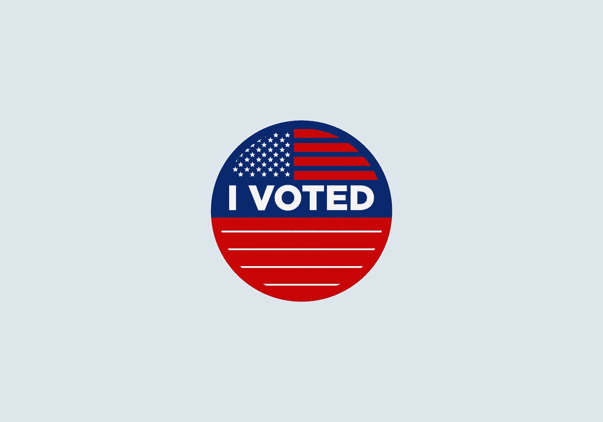
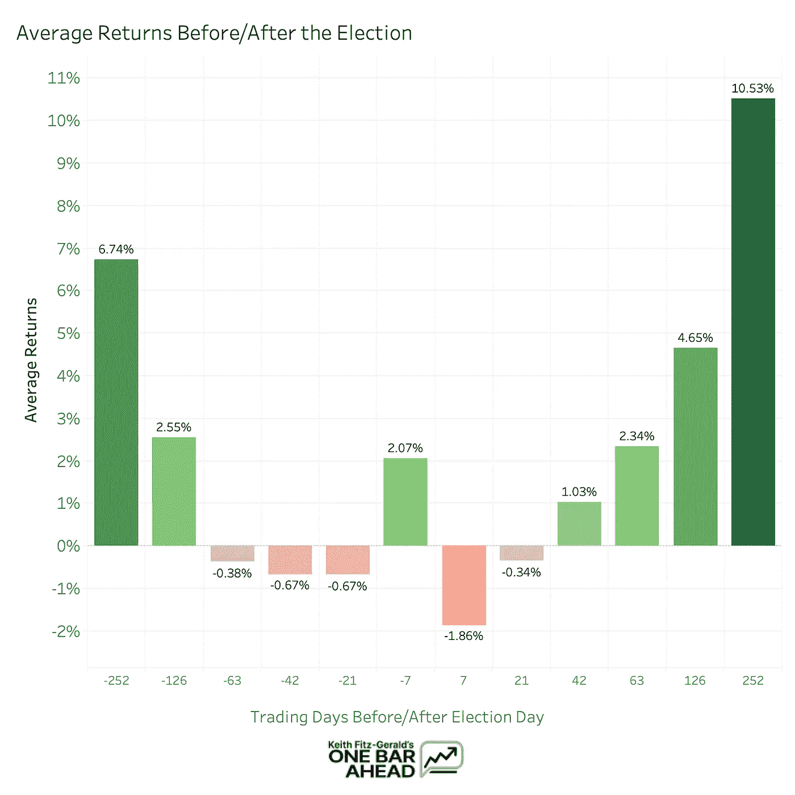

# 不要在选举前恐慌抛售你的投资——读读这个吧

> 原文：<https://medium.datadriveninvestor.com/dont-panic-sell-your-investments-before-the-election-read-this-instead-b404307cc9dd?source=collection_archive---------22----------------------->

Photo by [visuals](https://unsplash.com/@visuals?utm_source=medium&utm_medium=referral) on [Unsplash](https://unsplash.com?utm_source=medium&utm_medium=referral)

不管你怎么说，今年的选举真的很丑陋。

分裂，不连贯的辩论，名单继续下去，有一吨的攻击。

但是今天，我不是在这里谈论政治，而是将重点放在钱上，因为人们对该做什么感到恐慌。

纸上谈兵的分析师声称下跌了 35%，而其他人则认为将持续几十年的下一轮牛市已经开始。这是“我比你更了解”投机的缩影，市场也反映了这一事实。

自 9 月初的高点以来，股市出现了多次大幅波动，许多投资者想知道我们是否处于选举崩溃的早期。

不可否认，很难判断该相信什么，许多人都很担心他们的钱会因为谁最终入主白宫而发生什么。

…包括我自己。

像任何人一样，我真的不喜欢赔钱，我很确定你也不喜欢。

因此，对于今天的任务，我们将尝试解决这个问题，并找出一个可能的解决方案。

准备好了吗？我们走吧。

# 纸上谈兵的分析师忽略了一件事

每个纸上谈兵的分析师都倾向于为他们的分析建立宏大的老案例，他们出名的原因是他们在投资方面经验丰富。

因此，当他们说他们预计市场将大幅下跌时，有点紧张是很自然的。毕竟，他们可能比你更有经验，对吗？

大多数人完全忽略的一件事是股票市场的实际表现。

推测市场*应该*做什么是一回事，但看看市场*实际上*在做什么总是更聪明(也更有利可图)。

换句话说，数据才是最重要的。

在这种情况下，我们特别幸运，因为选举是绝对确定的，而且是周期性的。

Photo by [Chaitanya Tvs](https://unsplash.com/@tvschaitanya?utm_source=medium&utm_medium=referral) on [Unsplash](https://unsplash.com?utm_source=medium&utm_medium=referral)

# 这都是关于周期的

我所说的周期性是指选举以四年为一个周期——这是不言自明的。

当考虑概率时，这是有益的，因为有可能推动市场的长期周期性事件实际上非常罕见。经济数据之类的数据每周都会发布，但在我们这样的普通投资者得到这些数据之前，它们通常已经被市场“定价”了。

因为选举已经进行了这么长时间，我们可以从中提取大量数据，这对我们来说是个好消息！

今天，我们将使用 S&P500 指数的收盘价。

它是整个股票市场的一个很好的代表，因为它就像美国 500 家大公司的集合篮子，如果这些公司中的每一家都上涨，它也会上涨。虽然这些成分会随着时间的推移而变化，但它们始终是市场上流动性最强、持股最广的公司。

*(作为参考，苹果、微软和波音现在都在【】P500 强中，想象一下这样的公司)*

因此，我们将关注选举前后的价格，看看会发生什么。

 [## 将数据隐私转化为你的优势，重建消费者的信任:下一个投资前沿

### 抖音的使用在疫情期间激增，全球大约有 8 亿用户使用该平台…

www.datadriveninvestor.com](https://www.datadriveninvestor.com/2020/09/18/turn-data-privacy-to-your-advantage-and-rebuild-consumers-trust-the-next-investment-frontier/) 

# 数据是怎么说的

哇！我们来分解一下。

# 1.选举前的紧张是真实的

正如我们所看到的，当我们进入选举的第 63 天时，实际上有一个绝对平静的时期。这大约是实际事件发生前的 3 个月，正如我们所看到的，在大日子之前几乎没有什么活动。

# 2.选举前后波动性上升

正如事件发生后 7 天和+7 天的大幅波动所证明的，随着我们越来越接近，似乎有一些相当大的波动。再一次，这是完全可以预料的，因为交易者(和电脑)在思考正在发生/已经发生的事情。

# 3.长期的事实

最重要的是，平均而言，两个优势都显示出非常稳定的收益。

这显示了市场在一段时间内固有的向上偏差，即使是在经济繁荣和萧条时期。

因为+1 年和-1 年几乎总是看涨的，这就证明了一个事实。

> 市场并不真正关心谁在椭圆形办公室。

尽管这令人震惊，也可能违反直觉，但数据已经向我们展示了这一点。

市场不在乎总统是民主党人还是共和党人，不在乎总统的年龄，也不在乎他们有多喜欢股市。

钱总是流动的，不管谁在办公室，钱都会流向用得最好的公司。

Photo by [Alvaro Reyes](https://unsplash.com/@alvarordesign?utm_source=medium&utm_medium=referral) on [Unsplash](https://unsplash.com?utm_source=medium&utm_medium=referral)

# 那么，行动计划是什么？

鉴于我们从上述数据中分析的 3 件事，我们有几个选择来处理我们的钱。而且，就像任何事情一样，这取决于你想变得多激进。

# 选择 1:卖掉所有东西，在选举后重返政坛(简单)

这是三个动作中最无聊的一个，但它让你摆脱了一件事——那就是选举前的紧张。如果你真的想在晚上睡觉，知道你的钱是安全的，不会有任何潜在的崩溃，这个策略可以走很长的路。

只有一个问题。

从统计学上来说，大多数买卖决策都是错误的，这一点也没什么不同。在我写这篇文章的时候(9 月 23 日),市场已经严重下跌，并且有可能很快反弹。也就是说，你可能会错过一些相当可观的收益。

这显然不是最理想的，因为我们想赚钱，对吗？

这让我们想到了第二个选择:

# 选项 2:无论发生什么都继续持有(大多数投资者的最佳选择)

> “继续拿着？！那太蠢了！”

是的——我知道。购买和持有似乎是世界上最无聊的投资方式。

但问题是。

购买并持有实际上相当困难——尤其是其中的“持有”部分。

许多人告诉自己，他们有勇气度过低迷时期，但事实上，他们是第一批卖出的人。这是投资者能做出的最糟糕的反应，也是许多投资者失败的主要原因。

然而，有几个市场真理可以帮助你克服对亏损的恐惧。

最重要的是，股票几乎总是随着时间的推移而上涨。(不，我不只是说“石头只涨不跌。”)除了我们这里的数据集之外，还有大量证据支持这一事实，知道这些非常有价值。

选举后一年，股票平均上涨近 10%！如果这不是继续持有的动力，我不知道什么是。

因此，尽管这看起来很难，但你可以避免试图把握市场时机的错误，而是咬紧牙关坚持到选举结束。

因为你也有机会选择第三个选项:

# 选择 3:利用看跌期权抄底(最高级)

快速免责声明:本节使用了一些关于期权的高级概念，所以如果你不熟悉这些工具，请远离或只使用模拟货币。

第三个策略利用了我们还没有谈到的一个证据:波动性。

波动是件好事，尤其是在出售期权的时候。通常被称为 vega，隐含波动率，或简称为“vol”，期权定价中的这一机制是我们在市场预期大幅波动时可以利用的巨大优势。

具体来说，当 vol 高时，期权合约的价格(溢价)上升。我们可以利用这一特点，因为这意味着你可以卖出看跌期权，赚到钱。

我们卖出看跌期权有两个原因:

首先，我们可以通过出售期权收取溢价，只要你持有期权直到到期，你就可以保留所有这些钱。再加上 11 月期权的期权费将会很高，你已经得到了一些不错的期权费。也就是说，你会得到一大笔钱。

第二，如果你卖出的期权得到执行，你将会以特定的执行价格“卖出”每份期权 100 股。而且，如果你在选择罢工时做了正确的工作，这是你非常愿意为股票支付的价格。(我不会对 strike selection 之类的东西讲得太深，因为这是另一篇文章的一个非常微妙的话题。)

因此，如果我们因卖出看跌期权而获得溢价，并以比当前价格更低的价格买入股票，我们基本上就是在购物中获得报酬。

对我来说似乎是一笔好交易！

现在，请记住，如果你不知道自己在做什么，这是一个非常冒险的举动。如果你的期权真的“进了钱”，确保你有足够的现金购买分配给你的股票。

如果你没有足够的现金，卖出太多不利于你的看跌期权，你将会损失惨重。

无论如何，不要冒超出你绝对愿意支付的风险。

Photo by [Michael Longmire](https://unsplash.com/@f7photo?utm_source=medium&utm_medium=referral) on [Unsplash](https://unsplash.com?utm_source=medium&utm_medium=referral)

# 包扎

因此，我们已经确定了几件事，从选举临近时可能发生的事情开始。会有一些起伏。会有波动。

但最重要的是，股市并不真正关心谁在执政。我们已经确定，从整体来看，市场可能会继续上涨，你不必太担心大规模崩盘。

因此，记住这一点，我希望你有一个从上面列表中选择的策略。或者，如果你对自己有不同的策略，我很乐意在下面的评论中听到它！

感谢您的阅读，祝您投资愉快。

注意:我现在正在开发一些独一无二的股票分析和教育软件。它有一些我在其他地方没有见过的数学知识，所以我非常兴奋地向公众发布它。

如果你有兴趣，可以去 www.onebarahead.com 看看。

**访问专家视图—** [**订阅 DDI 英特尔**](https://datadriveninvestor.com/ddi-intel)