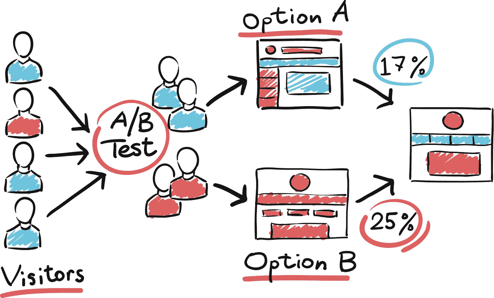
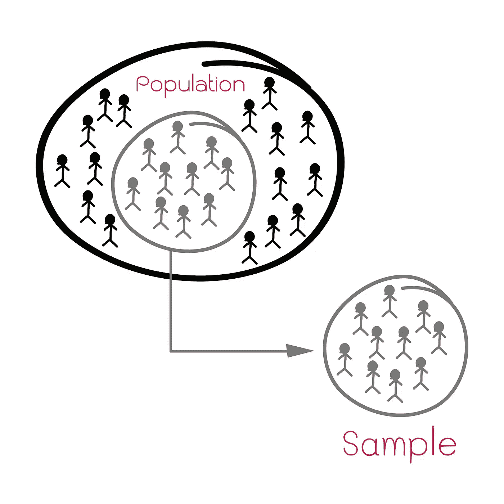
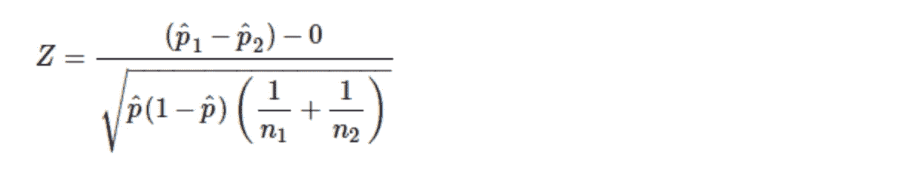
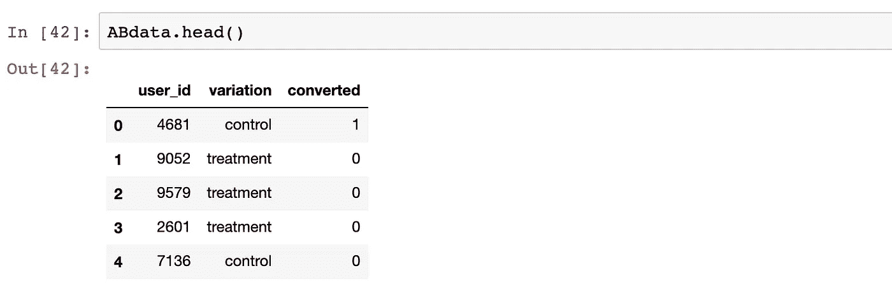
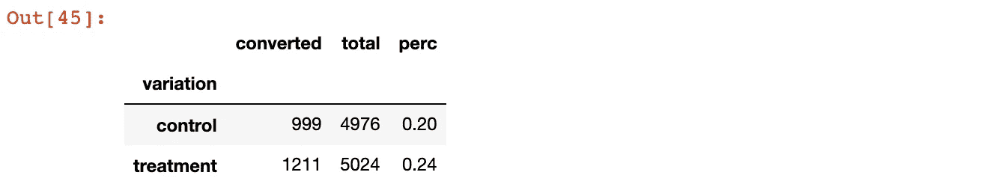
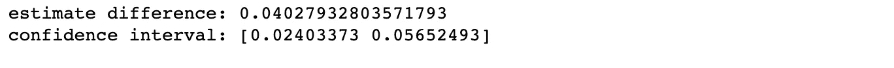
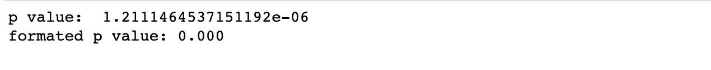

# 不要相信你的直觉！A/B 测试的重要性

> 原文：<https://medium.datadriveninvestor.com/dont-trust-your-gut-80ace85e9747?source=collection_archive---------1----------------------->

## 使用样本数据集和 python 代码进行 A/B 测试的基础

Photo by [https://www.shutterstock.com/g/Rawpixel](https://www.shutterstock.com/g/Rawpixel)

实验和 A/B 测试的概念在网上和许多商业案例研究中都有很好的记录。许多公司，包括像亚马逊和网飞这样的公司，通过将 A/B 测试整合到他们的核心产品设计和商业实践中，已经做得非常好了。

在许多情况下，产品团队会将他们的 A/B 测试的分析交给数据科学团队，甚至外包给第三方服务提供商。但是，当测试的基础没有被很好地理解时，会出现许多陷阱和常见的错误。

 [## 将定义 2020 年就业前景的五大数据科学和机器学习趋势|数据驱动…

### 数据科学和 ML 是 2019 年最受关注的趋势之一，毫无疑问，它们将继续发展…

www.datadriveninvestor.com](https://www.datadriveninvestor.com/2020/02/19/five-data-science-and-machine-learning-trends-that-will-define-job-prospects-in-2020/) 

这篇文章将帮助那些试图理解 A/B 测试基础的人。解释了关键的基础知识，并且贯穿代码教程将帮助用户理解数据需求并突出关键的统计概念。

有大量的统计知识和理论支持假设检验，也称为 A/B 检验。我在最后加入了有用页面的链接，以供进一步阅读，这是给定信息范围的建议。

**第一节**:**A/B 测试理论与基础的回顾**

**第二部分:演示数据集和 python 代码**

如果您需要对工作或研究执行 A/B 测试，您可以采用与此处包含的样本数据集相同的方式构建数据，并运行与包含的代码类似的代码。

# 1.什么是 A/B 测试，我们为什么需要它？

如果做得正确，A/B 测试对希望优化其业务实践并实现增长的组织非常有益。

> **我们为什么要进行 A/B 测试？因为我们对用户的直觉和直觉往往是错误的，被我们自己的偏见所蒙蔽。在我们的业务中实施之前，我们需要验证我们的想法。**

> ***A/B 测试*** *(也称* ***桶测试*** *或* ***分割运行测试*** *)是一种* [*随机实验*](https://en.wikipedia.org/wiki/Randomized_experiment) *带有 A 和 B 两个变量，它包括应用* [*统计假设测试*](https://en.wikipedia.org/wiki/Statistical_hypothesis_testing) *或*A/B 测试是一种比较单个变量的两个版本的方法，通常通过测试受试者对变量 A 和变量 B 的反应，并确定两个变量中哪个更有效(维基百科)。**

Photo by [https://www.shutterstock.com/g/toonstyle](https://www.shutterstock.com/g/toonstyle)

在商业中有很多这样的例子，当用户说一套做一套时，人们根本意识不到他们真实的行为和反应。直接询问用户喜欢哪种产品设计并不一定能提供所需的洞察力。

在一个清晰量化的 A/B 测试中观察用户行为将提供决策所需的证据和支持。

为了成功进行 A/B 测试，我们需要:

1.  将我们的业务问题作为假设来阐述。
2.  确定我们的随机化策略、样本量和感兴趣的测量。

# 理论与统计

A/B 测试是*统计假设测试*的一个例子，我们有一组特定的假设需要测试。

在 A/B 测试中，我们经常假设变体 A 会比变体 B 表现得更好(反之亦然)。然后我们收集数据，观察 A 和 b 的转换率之间是否有统计学上的显著差异。

Photo: [https://www.shutterstock.com/g/Iamnee](https://www.shutterstock.com/g/Iamnee)

对这一点的一个关键理解是，我们正在用我们确实知道的数据(变体 A 或 B 在我们的用户样本测试中的表现)测试我们不知道的东西(变体 A 或 B 在我们的全部用户中的实际表现)。

没有一个测试能提供对未来的完美预测，这就是为什么我们需要将统计假设检验的理论应用到我们观察到的测试结果中。

有很多因素会影响用户对产品变化的反应。不可能测量和量化所有这些因素。这就是为什么你处理的数据样本必须代表你的客户群，并且必须认真应用 T2 随机化的概念。

## **样品代表**

您的示例包含您为 A/B 测试收集的所有用户的数据。您的群体是您的客户群中所有用户的整个群体。

代表性样本是指能够无偏见地反映总体情况的样本。有不同的因素用来评价它是否具有代表性。这些可以包括人口统计因素，如年龄、性别、职业，以及与你的产品相关的其他因素。与时间相关的因素对于许多 A/B 测试都很重要。您收集的数据应该在您的用户使用您的产品的所有时间内按时间、星期几和季节来表示。

改进样本表示的最佳方法之一是延长测试持续时间，从而处理更大的数据集。

## **随机化**

正确的随机化可以消除样本和测试结果中的偏差。当您的样本与您的目标人群有实质性差异时，可能会出现偏差。有我们可以观察和衡量的因素(如性别、年龄、地点)，也有更加无形和难以衡量的因素。

我们应用随机化来确保我们的两个样本组尽可能相等，并确保没有潜在因素影响观察到的测试结果。

我们样本中的每个用户都应该有平等的机会被分配到变体组 A 或者变体组 b。

## **1 型/2 型错误**

抽样和随机化的问题会导致所谓的 1 型和 2 型错误。

*   第一类错误也称为假阳性错误。我们错误地得出结论，A 组用户的转换率不同于 B 组用户的转换率，而事实上转换率并没有显著差异。
*   第二类错误也称为假阴性结果。我们错误地得出结论，这两个组的转换率是相同的，而事实上有显著的差异。

## **无效&替代假设和适当的统计检验**

简单的 A/B 检验本质上是双边比例 z 检验，我们比较两个比例，看它们是否相同或显著不同。

对于这个测试，我们的零假设( **H0** )是两个比例相等，没有差异。我们的另一个假设( **H1** )是这两个比例不相等。

我们的测试统计可以使用以下公式计算:

通常使用 0.05 的 alpha 和 95%的置信水平(建议用户阅读设置 alpha 的最佳值)。

**计算所需样本量**

您需要的样本量与您期望看到的 A 组和 b 组之间转换率的差异大小直接相关。如果您期望看到两组之间的巨大差异，则您不需要大样本量来显示这种群体水平差异的证据。

然而，如果两组之间的差异很小，那么你需要更大的样本量来证明这种差异。

您需要定义几个不同的参数来计算所需的样本量:基线(或预期)转换率、测试的功效(也称为最小可检测差异)以及所选的统计显著性水平。

有很多在线工具可以帮你完成这个任务的数学方程式。这里可以找到一个这样的工具:【https://www.optimizely.com/sample-size-calculator/

# 2.数据要求和示例代码

为了成功地分析 A/B 测试的结果，您需要一个数据集，向您显示每个唯一的用户，以及用户接收到的变化以及他们是否转换。

我准备了一个基本的数据集，展示了运行一个简单的 A/B 测试所需的详细程度。

## **数据要求**

这通常是在业务环境中运行 A/B 测试最具挑战性的部分。企业通常很难根据用户收到的变化来跟踪和存储用户级别的数据。

**您的数据集需要具备以下条件:**

1.  数据存储为用户级别，每个用户都分配有一个唯一的用户 ID
2.  每个用户面临的变化(A 组/B 组)
3.  带有结果的二进制字段(无论用户是否转换)

如果您没有以这种方式存储的用户级数据，很遗憾，您不能进行任何 A/B 测试。

*这里有教程数据集和代码:h*[*ttps://github . com/EmileeSmithDS/ab testing*](https://github.com/EmileeSmithDS/ABTesting)

简单地看一下数据集，我们可以看到它满足了上面列出的数据要求，具有用于变化和转换的用户级数据。

注意，该数据集使用术语“对照组”和“治疗组”，这类似于使用术语“A 组”和“B 组”。

步骤 1:计算合计比例

我们正在进行比例的双面测试。这意味着我们需要知道收到每个变化的客户总数和转换的客户数。

这可以通过计算汇总表来实现:

运行上面的代码得到这个表作为输出

我们的对照组有 4，976 名用户，治疗组有 5，024 名用户。其中，对照组(20%)有 999 例转换，治疗组(24%)有 1，211 例转换。

一些商业利益相关者可能会查看这些测试结果，发现治疗组的转化率高出 4%,并得出结论，治疗组是最佳的产品变更。

这是不正确的。样本数据中的差异并不能预测用户群的真正差异。这就是为什么我们利用统计测试来查看两个样本比例之间是否存在统计上的显著差异。

当您的产品变更向所有用户推广时，基于您的样本数据的差异可能会，也可能不会与真实世界中发生的情况相匹配。

汇总表提供了我们计算测试统计和置信区间所需的值。

# 统计测试和结果

我们决定使用 5%的显著性水平，相应的置信区间为 95%。这是一种常见的方法，但不是一成不变的。

下面的代码可用于计算 z 统计量(本文前面列出的公式)和相应的置信区间。

感兴趣的读者可以在这里查看一个 z 测试使用的公式:【https://en.wikipedia.org/wiki/Test_statistic

运行上面的代码会得到以下输出:

这为我们提供了两个比例之间差异的点估计值和 95%的置信区间。

计算该测试的相关 p 值很有帮助，这可以使用以下代码来完成:

对于我们的 A/B 测试，零假设表明对照组和治疗组之间的转化率没有显著差异。另一个假设是存在显著差异。

一个外部统计测试给了我们一个大约的 p 值。0.000，其小于 0.05 的常规截止值。这使我们能够拒绝零假设，并得出结论:治疗组中记录的较高转换率确实具有统计学显著性，并可能表明我们全部用户中转换率的真实差异。

最后一步是考虑业务环境中的影响大小(估计在 2.4%和 5.7%之间)，以了解这是否是一个有意义的差异，以及对于建议的产品更改来说，这是否是一个可行的 ROI。

# 3.超越简单的 A/B 检验:序贯假设检验

到目前为止，本文关注的是所谓的“固定范围”假设检验。这种测试方法要求研究人员在运行测试之前确定样本大小、alpha 等，然后努力运行完整的测试，而不要过早停下来查看中间结果。过早停止的 A/B 测试与结果中的高 1 型错误率和高水平偏倚有关。

但是，坚持固定水平假设检验的严格协议可能是昂贵和缓慢的。甚至像网飞这样的公司也在为提前停止规则和样本量不够大的问题而斗争。

由于这个原因，已经有了向所谓的顺序测试和控制所谓的错误发现率发展的趋势。这种测试方法已经在临床试验的医学研究中使用，同样的概念现在也应用于商业领域。

> **序贯假设检验**是[样本量](https://en.wikipedia.org/wiki/Sample_size)不预先固定的地方。相反，数据被评估为已收集，并且一旦观察到显著的结果，就根据预定义的[停止规则](https://en.wikipedia.org/wiki/Stopping_rule)停止进一步的采样。因此，与更经典的[假设检验](https://en.wikipedia.org/wiki/Hypothesis_testing)或[估计](https://en.wikipedia.org/wiki/Estimation)相比，有时可以在更早的阶段得出结论，从而降低财务和/或人力成本(维基百科)。

一家名为 Optimizely 的公司在这一领域做了大量工作，并在其网站上提供了大量资源，包括一篇优秀的研究论文，可以在这里找到[www.optimizely.com/resources/stats-engine-whitepaper/](https://www.optimizely.com/resources/stats-engine-whitepaper/)。

更多阅读和参考资料:

 [## A/B 检验统计:非数学家直观指南| CRO

### A/B 测试统计变得简单。该指南将澄清一些更容易混淆的概念，同时为您提供…

conversionsciences.com](https://conversionsciences.com/ab-testing-statistics/)  [## 互联网时代的统计学:Optimizely 新统计引擎背后的故事

### 经典的统计技术，如 t 检验，是优化行业的基石，帮助公司作出…

blog.optimizely.com](https://blog.optimizely.com/2015/01/20/statistics-for-the-internet-age-the-story-behind-optimizelys-new-stats-engine/)  [## 用元分析和最优停止提高网飞的实验效率

### 作者:苏刚和伊恩·约海

netflixtechblog.com](https://netflixtechblog.com/improving-experimentation-efficiency-at-netflix-with-meta-analysis-and-optimal-stopping-d8ec290ae5be)  [## 这都是关于测试的

### 网飞实验平台

netflixtechblog.com](https://netflixtechblog.com/its-all-a-bout-testing-the-netflix-experimentation-platform-4e1ca458c15)  [## Z 检验:定义&双比例 Z 检验

### 分享关于假设检验> Z 检验/双比例 Z 检验什么是 Z 检验？Z 检验是一种假设检验…

www.statisticshowto.com](https://www.statisticshowto.com/z-test/)  [## A/B 测试统计变得简单

### "为什么我需要学习统计学来进行 A/B 测试？"你可能会想知道，尤其是…

www.invespcro.com](https://www.invespcro.com/blog/ab-testing-statistics-made-simple/) 

**进入专家视图—** [**订阅 DDI 英特尔**](https://datadriveninvestor.com/ddi-intel)