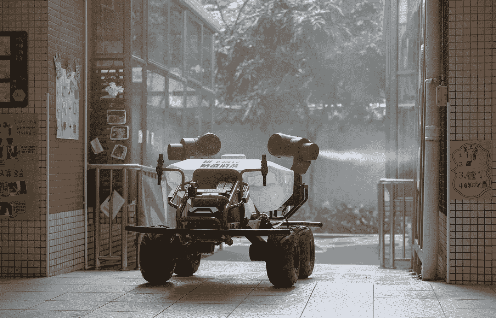
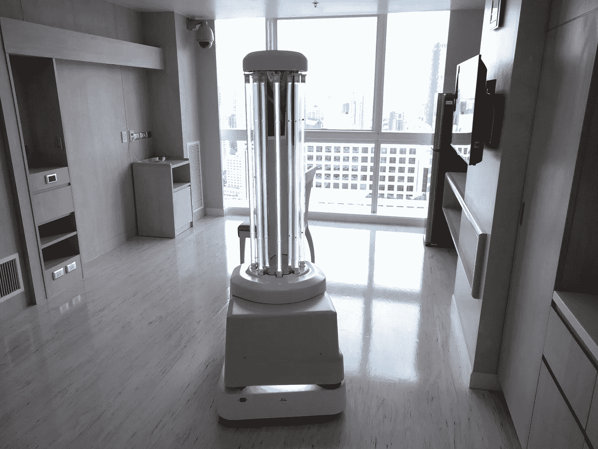
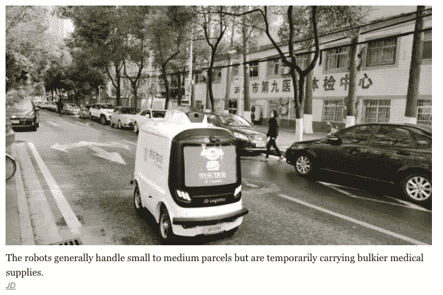

# 不要担心冠状病毒，有一个机器人可以解决这个问题…

> 原文：<https://medium.datadriveninvestor.com/dont-worry-about-coronavirus-there-s-a-bot-for-that-b1b60b4d27cb?source=collection_archive---------17----------------------->

在纽约的前工程师协会，我与 Promobot 的 Oleg Kivokurtsev 进行了交谈，讨论了他最新的服务机器人产品，这些产品正在全球各地的酒店、办公楼和医院中部署。来自 [VentureOut](https://ventureoutny.com/) 的 Fay-Louise Hayden(他的纽约导师)分享了她上个月在时代广场为游客诊断冠状病毒时的经历。我在 VentureOut 的合作小组成员，[尼基·格林伯格](https://www.realestateofthefuture.co/)和[迈克·里兹卡拉](https://www.linkedin.com/in/mikerizkalla/)面面相觑，惊讶不已，紧张地想知道机器人发现了什么。

尽管冠状病毒是对人类适应能力的一次考验，但这是智能机器首次被大量用于对抗疫情病毒。就在本周，中国山西省派出了一支无人探测车队伍，对有已知病例的公寓楼进行消毒。消毒机以每小时安全喷洒 12 英亩土地而自豪。正如陕西省无人机协会副主任侯告诉当地报纸“现在，任何有确诊病例的居民小区都将(由机器人)每天消毒两次。”费勇描述说，改造后的农用杀虫剂漫游者被誉为救命的使者，“我们的住宅区人口密集，占地 2.5 英亩。昨天，两辆坦克来到我们的综合大楼，进入所有建筑物、走廊和庭院进行消毒。结果不错，很方便。”吉林、山东和浙江等其他地区的官员也纷纷效仿，甚至将任务范围扩大到无人机。

三天前，包括无人机和机器人在内的中国最大的自动化农业设备制造商之一 XAG 宣布，它已经设立了一项专项基金，在疫区使用其 XPlanet 无人机和 R80 机器人来“遏制疫情”。新闻稿还称，“共有 370 个专业团队，2600 多架 XAG 农业无人机自愿加入消毒行动，覆盖中国 20 个省份的 9.02 亿平方米。”该声明进一步宣传“一架 XAG 无人机一天可以消毒 600，000-700，000 平方米，这项任务通常需要 100 名工人才能完成。此外，由于能够精确控制输出，它消耗的消毒剂比手持喷雾等传统方法少五分之一。”在无人机无法到达的区域，XAG 将使用其地面 R80 漫游车，该漫游车集成了“360 高速智能喷射喷雾器”，能够“穿越狭窄的空间，自动避开障碍物，并从不同角度对目标区域进行消毒，没有死角。”许多活动人士抱怨说，这种技术也被政府官员用来监视公众和实施军事隔离。Vox [上个月报道](https://www.vox.com/recode/2020/2/27/21156358/surveillance-tech-coronavirus-china-facial-recognition)“中国官员使用无人机追踪人们是否在外出旅行时没有戴口罩或违反其他检疫规定。”

公开交易的机器人基金 [ROBO 全球](https://www.roboglobal.com/)的 Nina Deka 博士解释说，“新冠肺炎正在影响武汉可用的医生供应。远程医疗使医生能够通过互联网进行访问，使病人能够在不同的城市看医生。”她的同事 Jeremie Capron 补充说:“这是一个超过 50 亿美元的市场增长，每年超过 20%。但我们也看到其他机器人应用在医院中的发展:Siasun Robotics 的服务机器人用于在病人进入医疗机构时对他们进行分类。Aethon 制造的自主移动机器人用于医院运送食物、亚麻布、医疗设备等。机器人技术也用于药房自动化，由 Omnicell 这样的公司领导。”就在本周，[机器人报道](https://www.therobotreport.com/coronavirus-fight-china-gets-boost-uvd-disinfection-robots/)援引丹麦 UVD 机器人 ApS 与 Sunay Healthcare Supply 签订了一份转售协议，向中国分销其专有的紫外线室内消毒机器人。Sunay 的首席执行官苏烟感叹道，“通过这项协议，2000 多家医院现在将有机会确保有效的消毒，保护他们的病人和工作人员。”

甚至电子商务物流巨头 JD.com 也自愿派出机械工人对抗冠状病毒。在过去的两个月里，这家中国零售商不仅采取主动措施保护数万名员工，还帮助政府简化了全国范围内的沟通和商品配送。举例来说，“从 1 月 19 日至 22 日，京东向顾客提供了超过 1.26 亿个口罩、31 万瓶消毒剂和 100 万瓶洗手液。”在接下来的几周里，该公司继续向全国各地的慈善机构和医疗机构捐赠 1 亿个口罩和 6 万件其他物品。它还将其云操作平台转换为一个主动的“流行病人口分析系统”，该系统“使用大数据和人工智能来判断感染高危人群的划分。”为了配合这一努力，它启动了无人机和机器人运输队，向被隔离的患者、医院和受感染的市政当局运送重要的医疗用品和其他关键材料。为了不被京东的竞争对手击败，阿里巴巴正在将其 B2B 采购平台转变为医院和地方当局的捐赠网络。在一封致商家的公开信中，该网站申明，“无论你的货物在哪里，我们都会以最快、最安全的方式送到一线医务人员手中。”