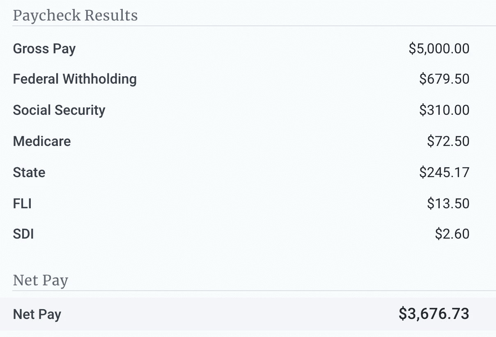

# 当人们说你应该有一个应急基金时，你难道不喜欢吗？

> 原文：<https://medium.datadriveninvestor.com/dont-you-love-it-when-people-say-that-you-should-have-an-emergency-fund-620c316e0732?source=collection_archive---------8----------------------->

## 谢谢，明显队长。

Photo by [Sharon McCutcheon](https://unsplash.com/@sharonmccutcheon?utm_source=medium&utm_medium=referral) on [Unsplash](https://unsplash.com?utm_source=medium&utm_medium=referral)

啊，这又是互联网上最受欢迎的生活方式——羞辱智慧:削减开支，还清债务，确保你有 6 个月的应急基金！

谢谢，明显队长。还不如告诉人们，他们应该去找一个有钱的伴侣，因为在纽约，一份收入是不够的。

“你知道去年那些 4 美元的冰茶花了你 1000 美元吗？这就是为什么你没有为紧急情况做好准备！”是的。当然了。因为一年存 1000 美元完全够建立一个应急基金。事实上，如果我十年不买星巴克，我应该有足够的钱来度过下一个疫情！

> 首先，我们来看看纽约市一个人的典型开支清单。然后，我们再来看一些硬数据。

我现在过得很好，但我的许多朋友都不好。我清楚地记得有一段时间我过得不好，人们一直问我为什么没有应急基金。

嘲笑地摇摇头，告诉人们他们应该为金融危机做好准备，这是麻木不仁的，无益的，也是脱离现实的。也为时已晚。当然，这是正确的，但对许多人来说是不现实的——甚至对高收入者来说也是如此。

 [## 美国到处都是高收入的穷人

### 你挣的薪水不错，但是过着靠薪水过活的生活吗？如果是这样的话，你就是日益壮大的美国人中的一员…

qz.com](https://qz.com/520414/the-high-earning-poor/) 

首先，我们来看看纽约市一个人的典型开支清单。然后，我们再来看一些硬数据。

## 我在纽约布鲁克林区做独家供应商的最低月开销

*   租金:2100 美元
*   学生贷款:515 美元
*   电费:80 美元
*   汽油:15 美元
*   互联网，[实际上我早在](https://medium.com/the-ascent/what-happened-when-i-cancelled-my-home-internet-1bbf834f7c50)就取消了，但现在是不可协商的，因为我在家工作:53 美元
*   食物:400 美元
*   课后费用:175 美元

这是在我大幅削减开支之后。我不再有:

*   我的车:每月 255 美元
*   汽车保险:200 美元
*   日托费用:每月 1600 美元

## 这实际上不是关于我的，所以这里有一些关于其他人的数据:

*   [这个人在纽约每年靠 6 万美元过着舒适的生活](https://www.cnbc.com/2019/03/13/budget-breakdown-of-a-32-year-old-who-gets-by-on-60000-dollars-in-nyc.html)，但是她有两个室友，没有孩子。她还在工作中获得免费食物。
*   名单上的第一个人[和一个未婚夫以及两个室友](https://www.apartmenttherapy.com/we-asked-8-real-new-yorkers-is-a-50-20-30-budget-realistic-243021)住在一起。另一个人每个月什么都不存，却独自生活。另一个有三个室友。
*   18 年的时间攒够了在纽约买房子的首付，有人愿意吗？
*   大约 28%的美国人[根本没有任何储蓄。另外 25%的人存了不到 3 个月的费用。](https://www.bankrate.com/banking/savings/financial-security-june-2019/#:~:text=Nearly%20three%20in%2010%20(28,months'%20worth%20of%20living%20expenses.)

## 不食人间烟火的人看到像我这样的预算，会忍不住给出省钱的建议。

*   **你真的应该搬出纽约。**当然。比方说，住在新泽西会便宜得多。或者康涅狄格州。我曾经幻想搬出纽约。然而，并不是每个人都可以收拾行李就走的。
*   你应该搬出真正的城市。住在城外一小时的地方并不会降低多少费用。
*   你应该找个室友。先不要告诉单亲或者有孩子的家庭要找室友。充其量不太现实。最糟糕的是，这是一个糟糕的理财建议。依靠别人来支付你 2/3 的房租是很棒的，直到一个室友搬家，失业，或者不管什么原因不支付他们的份额。
*   **和父母一起住！哦，是的。“喂，爸妈！你们谁能卖掉自己的房子，申请新的抵押贷款，购买一个更大的房子，让我和我的孩子搬进来？”**
*   买一套更便宜的公寓。我以前也有一个。天花板塌了，公寓淹了三次，我不得不搬家。并非所有的公寓都是安全的或维护良好的。
*   日托真的很贵。就不能找个便宜点的，或者做兼职？是的，日托很贵。如果你要找工作，不管是全职还是兼职，这也是你需要的。据我所知，你不能带孩子来工作。兼职工作不能支付账单。
*   **你不需要车！我完全同意。纽约的许多人没有汽车。**
*   如果你早点还清学生贷款，你会有更多的钱存起来！是的，再次感谢你，船长明显。我正在和其他人一起努力。

我的预算相对来说比较少。像许多其他人一样，我很少在娱乐上花费，我很少挥霍，在我的成年生活中我从来没有度过假。然而，我每月的强制性最低支出总计 3338 美元。在我处理掉我的车和日托费用之前，我每月的强制性最低支出总计约为 5393 美元。这还不包括像汽车油费或偶尔一瓶布洛芬这样的杂费，因为这些东西会累积起来。

## 你知道一个人每个月需要挣多少钱——税前——来建立一个应急基金，而他们的强制性最低生活费用是 3338 美元吗？

Source: [https://www.paycheckcity.com](https://www.paycheckcity.com/calculator/salary/new-york/)

如果一个人每月挣 5000 美元(每年 60000 美元)，并有我这样的支出(老实说，这比纽约市的平均水平要低)，他们每个月可以把大约 300 美元存入储蓄账户。每年，他们会节省 3600 美元。所以……建立一个一个月的应急基金需要一年的时间。建立一个为期六个月的应急基金需要六年的时间。

纽约的大多数人年收入不超过 6 万美元。中等家庭收入为 57，782 美元。这意味着纽约的大多数人将不得不存几年钱到 T2，建立一个应急基金来支付几个月的费用。

 [## 如何在不牺牲孩子或财务的情况下安全理智地离婚|数据驱动…

### 在美国，七月是以孩子为中心的离婚月。作为 cdfaⓡ的专业人士，我可以向你保证，从长远来看…

www.datadriveninvestor.com](https://www.datadriveninvestor.com/2020/07/28/how-to-divorce-safely-and-sanely-without-sacrificing-your-children-or-your-finances/) 

如果你打算告诉人们他们应该有一个应急基金，告诉他们如何赚更多的钱，这样他们就能成功。否则，你的建议是短视的。每个人都同意应急基金是必要的。但你知道还需要什么吗？在你每月实际需要的基础上赚取额外的钱。

如果你想帮助那些在财务上挣扎的人，或者如果你想写一本世界上最好的关于财务成功的电子书并免费提供，以换取人们注册你的邮件列表，你最好准备好个性化的、现实的和可操作的建议。了解你的受众。真正了解你的受众。如果你没有任何有帮助的话要说，因为你实际上并不了解你的听众，也许你应该闭上你的嘴。

Connect on [LinkedIn](http://www.linkedin.com/in/keri-savoca).

**访问专家视图—** [**订阅 DDI 英特尔**](https://datadriveninvestor.com/ddi-intel)