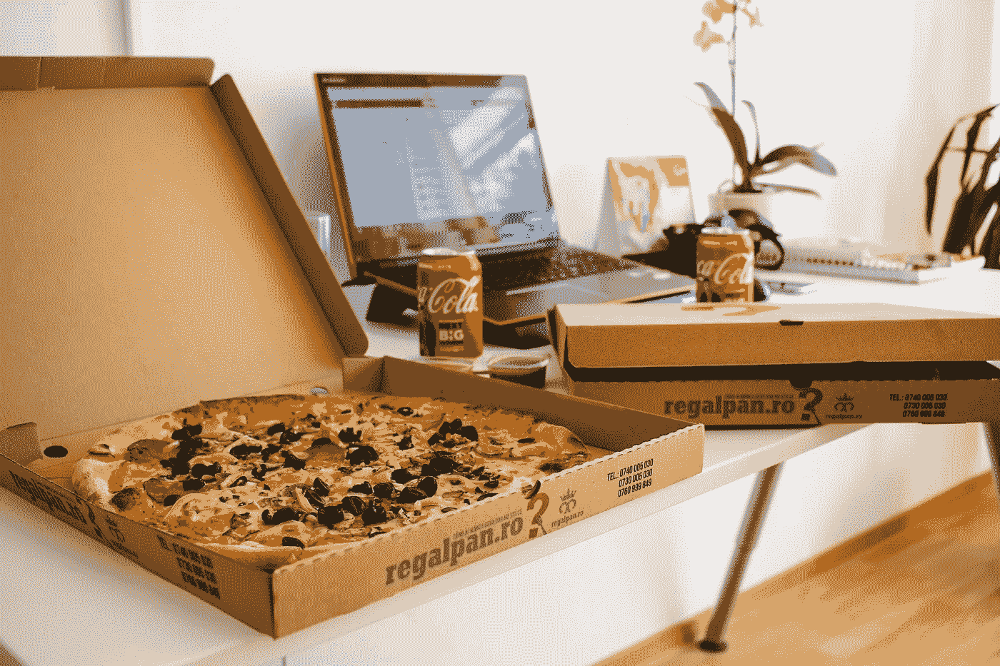

# DoorDash 首次公开募股到达华尔街

> 原文：<https://medium.datadriveninvestor.com/doordash-ipo-delivery-arrives-on-wall-street-b1c7864f673a?source=collection_archive---------25----------------------->

美国最大的食品配送公司 DoorDash 的股票于周三在纽约证券交易所(NYSE)开始交易，代码为 Dash。开盘价为 182 美元，比 102 美元的公开价格高出约 80%，最终收于 189.51 美元。该公司年初的市值为 150 亿美元，公开发行后达到 720 亿美元。

> DoorDash 首席执行官许宏涛表示:“如果我们能够在冰融化之前送货上门，或者在披萨变凉之前送货上门，或者在一小时内送货上门，我们就能实现城市中任何物品的按需送货上门。”。

DoorDash 是一家私人控股公司，成立于 2013 年，总部位于加利福尼亚州旧金山。这家快递公司报告今年第二季度盈利 2300 万美元，但第三季度亏损 4300 万美元。而该公司截至 9 月底的第三季度收入达到 8.79 亿美元，高于去年同期的 2.39 亿美元。该公司为超过 1800 万消费者和 390，000 个商家提供服务，并为超过 100 万名送货人员提供服务。

 [## 收盘，但没有雪茄-股票市场目标在停滞的 COVID 救济中创新高|数据驱动…

### 专家聊天程序:一个协作市场，在这里人们可以和能够解决他们问题的专家聊天。是……

www.datadriveninvestor.com](https://www.datadriveninvestor.com/2020/08/18/close-but-no-cigar-stock-market-targets-record-highs-amidst-stalled-covid-relief/) 

> *“首次公开募股获得的资金将使 DoorDash 扩展到食品杂货和便利店等领域”*——door dash，首席运营官·克里斯托弗·佩恩说。

食品配送行业在很大程度上受益于新冠肺炎疫情。疫情促进了食品配送公司的销售，餐馆关门，更多的人呆在家里订购外卖食品。DoorDash 为美国、加拿大和澳大利亚所有 50 个州的 4000 多个城市的本地和全国性企业提供按需交付和物流服务。另一方面，这家快递公司最近表示，在疫情期间，它降低了最小餐馆的佣金，但费用可能仍是一个问题。

## 访问专家视图— [订阅 DDI 英特尔](https://datadriveninvestor.com/ddi-intel)访问专家视图— [订阅 DDI 英特尔](https://datadriveninvestor.com/ddi-intel)