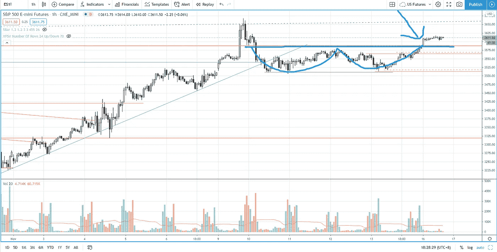

# 价格行为交易中的双底模式——标准普尔 500 日交易

> 原文：<https://medium.datadriveninvestor.com/double-bottom-pattern-explained-in-price-action-trading-s-p-500-day-trading-6abe2ab4ecb6?source=collection_archive---------13----------------------->

在后市部分用成交量价差分析找出如何交易双底形态的价格行为方式。

观看视频，了解 2020 年 11 月 16 日交易时段标准普尔 500 指数期货的**每日市场分析。在这个视频中，你将看到最后一节的市场回顾和三分钟内的交易回顾(包括进场、出场和背后的原理)。展望未来，我将涵盖偏见，要注意的关键水平，我稍后的交易计划。**

## 时间戳

*   [1:33](https://www.youtube.com/watch?v=EBuBpU-_9T8&t=93s) 市场回顾
*   [3:45](https://www.youtube.com/watch?v=EBuBpU-_9T8&t=225s) 贸易回顾
*   [4:38](https://www.youtube.com/watch?v=EBuBpU-_9T8&t=278s) 从角色变化中回撤交易
*   [6:20](https://www.youtube.com/watch?v=EBuBpU-_9T8&t=380s) 滚圆底部
*   [6:40](https://www.youtube.com/watch?v=EBuBpU-_9T8&t=400s) 突破交易
*   [7:45](https://www.youtube.com/watch?v=EBuBpU-_9T8&t=465s) 双底形态交易
*   [9:20](https://www.youtube.com/watch?v=EBuBpU-_9T8&t=560s) 价格行动交易或威科夫分析方法
*   [10:00](https://www.youtube.com/watch?v=EBuBpU-_9T8&t=600s) 推力下降楔缩短
*   [13:30](https://www.youtube.com/watch?v=EBuBpU-_9T8&t=810s) 点和图形目标投影
*   [13:40](https://www.youtube.com/watch?v=EBuBpU-_9T8&t=820s) 当前股市展望

如果你还没有看我的[每日市场分析视频](https://www.youtube.com/watch?v=B_BzQePlcsE)，为了更好地了解市场回顾和交易回顾。

**偏向** —中性(日内交易)；看涨(长期)

**关键点位** —阻力:3660；支持:3587，3500

**潜在设置** —在关键级别寻找潜在反转。

# 资源

**每周市场展望&最佳交易建议**直达您的收件箱:【https://www.tradeprecise.com/】T2

【www.TradingView.com】专业免费制图平台:创建账户→ [制图平台](https://bit.ly/2U2Femd)

**非美国居民？** ( **马来西亚、新加坡**、澳大利亚、新西兰、欧洲等……):[点击此处，存款 2000 元](https://ji.hn/sgtiger)即可获得**免费股票(价值 100++ &美元)老虎经纪**的欢迎礼物

美国居民？[点击此处，当您存入 1500 美元](https://ji.hn/ustradeup)时，就有机会在 TradeUP 上获得一份**免费的 AMZN 股票(价值 3000++美元** ) & **欢迎礼物**

**从媒体获取无限文章** —加入以下:[https://priceactiontrading.medium.com/membership](https://priceactiontrading.medium.com/membership)

# 进一步阅读

 [## 趋势反转交易策略(有效)——标准普尔 500 日交易

### 了解如何使用这种有利可图的趋势反转交易策略，以最小的风险抓住底部。

medium.com](https://medium.com/datadriveninvestor/a-trend-reversal-trading-strategy-that-works-s-p-500-day-trading-193443c731d2)  [## 价格行为交易解释的上升楔形形态——标准普尔 500 日交易

### 找出如何在价格行动交易法中交易上升的楔形形态(有成交量价差的威科夫法…

medium.com](https://medium.com/datadriveninvestor/rising-wedge-pattern-explained-in-price-action-trading-s-p-500-day-trading-7b9e5ee3c02a)  [## 凯西·伍德警告市场即将调整——标准普尔 500 价格走势分析

### 在 2020 年 12 月 18 日对彭博的采访中，方舟投资公司的首席执行官兼首席信息官凯西·伍德警告说…

medium.com](https://medium.com/datadriveninvestor/cathie-wood-warns-market-correction-soon-price-action-analysis-on-s-p-500-7e621e013310) 

Photo by Author — Ming Jong Tey

Photo by Author — Ming Jong Tey

披露:如果您点击本文中的链接进行购买或开立账户，并将所需金额存入推荐的经纪人账户，我们将免费为您赚取佣金。

免责声明:本演示中的信息仅用于教育目的，不应作为投资建议。