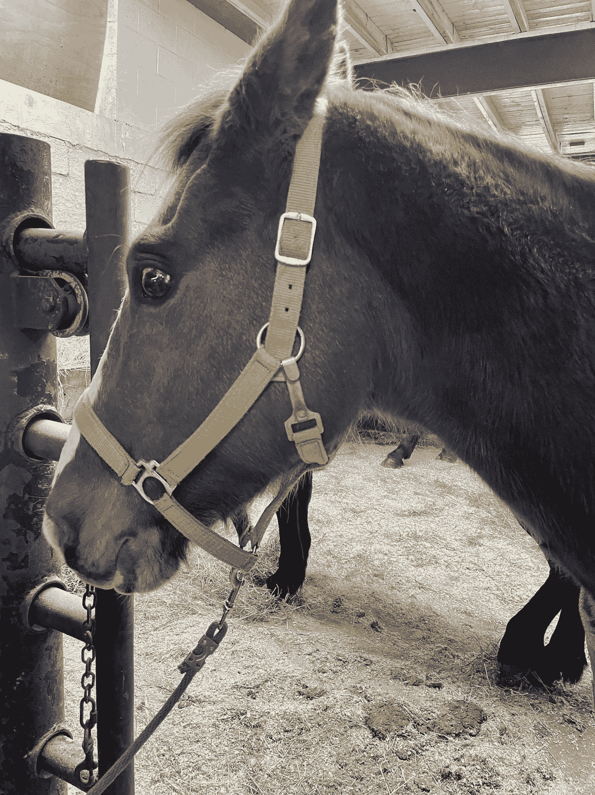
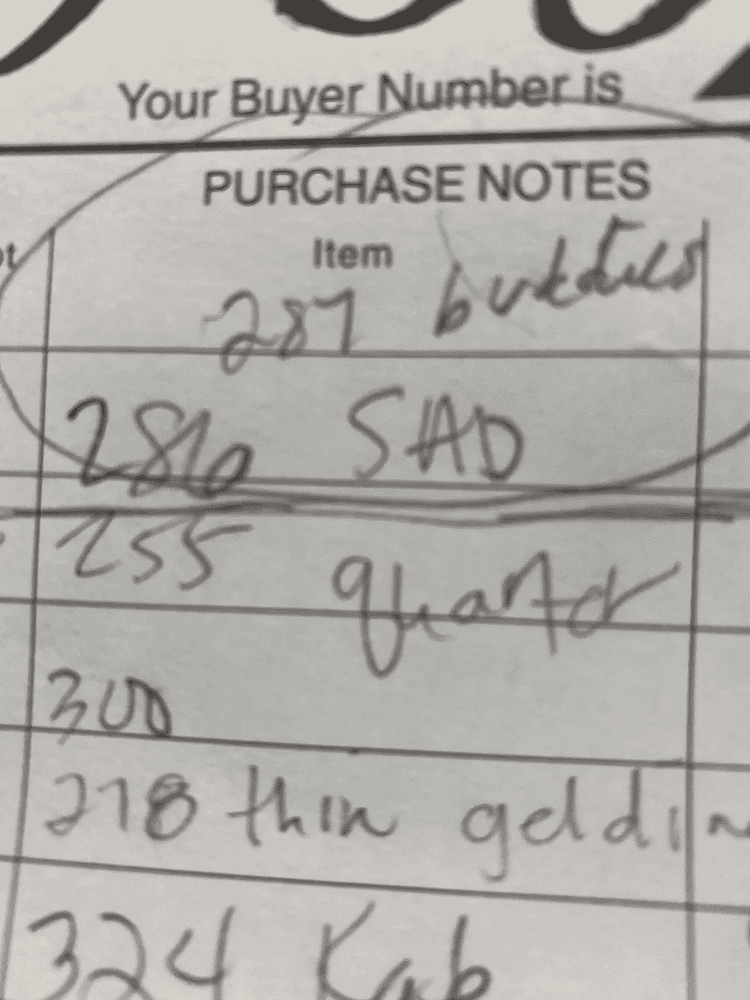
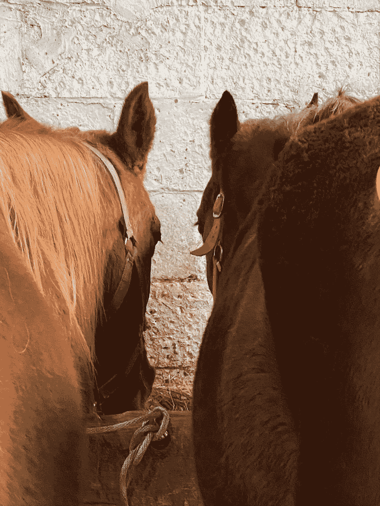
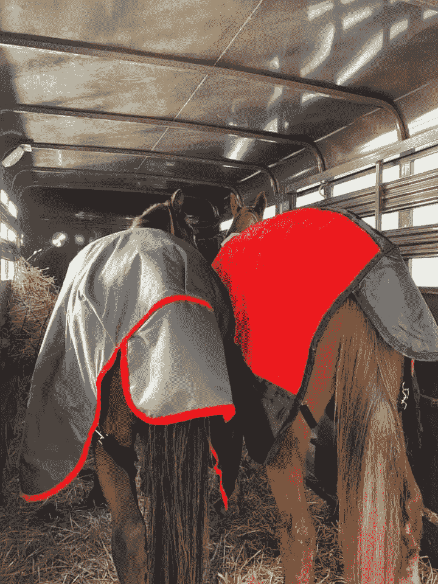

# 双倍的祝福

> 原文：<https://medium.datadriveninvestor.com/double-the-blessings-9110f862217b?source=collection_archive---------20----------------------->

当我从今天的拍卖会上清洗消毒的时候，我从口袋里翻出了这个；我的投标单。这就是当你走过过道并试图选择一匹马出价时，你如何跟踪这些马。他是第一个引起我注意的人。那是他的悲伤。他好像被恐惧和怀疑冻结了。我花了几分钟和他在一起，写下了“286-悲伤”,因为这是我记得他的方式。

我们继续穿过过道，看着其他的马，记下它们的号码，并写下一两个词，给我一些东西来记住它们。然后我们又回到了开始看#286 的地方。就在那时，我注意到他站得离旁边的马很近；他们的头几乎碰到了一起，谁也没有注意到他们面前的干草，只是互相寻求安慰。我写下了“287 —伙伴”。

一旦投标开始，就是决定的时候了。#286 是我的首选，但如果其他人在他之前通过，我将不得不决定是否出价，并可能失去救他的机会。命中注定，我名单上的马没有一匹在他之前通过。他们都在追求相当高的价格，这意味着大多数人会去一个家庭，而不是一个杀手买家。

大约一个小时后，286 号和 287 号一起进入拍卖区。他们通常一次通过一个，所以这次有点不寻常。拍卖师称他们是一对，于是竞价开始了。只有我和杀手买家。没有人想要它们。杀手买家很早就停止了出价(意味着他甚至不是真的想要它们)。我最后一次出价赢了 286 号。然后拍卖师看着我说“都是？”所有的眼睛都盯着我，心跳加速，我必须在一瞬间做出决定。当我看着两匹我一无所知的马，想到所有说不的理由时，我觉得自己在点头说是。

 [## 定义新冠肺炎时代的“生活”|数据驱动的投资者

### 我和妻子即将进行一个月的自我隔离，以避免感染冠状病毒。我们都 70 多了…

www.datadriveninvestor.com](https://www.datadriveninvestor.com/2020/04/23/defining-life-in-the-time-of-covid-19/) 

我听到拍卖人说“好姑娘”，感觉每个人都跟着我一起吐气。我立刻毫不犹豫地意识到这是一个正确的决定。当我们把他们肩并肩地装进拖车去隔离时，他们把他们的头放在一起，我感谢上帝和宇宙，是我让这一刻发生的。🐴✨

跟随[纳兰尼救马](https://www.nalanihr.org/)了解更多类似的故事！

由...所写

# [切里·塔普利](https://cherry-tapley.medium.com/?source=post_sidebar--------------------------post_sidebar-----------)

## 作为纳拉尼马匹救援组织的创始人——[www.Nalanihr.org](http://www.nalanihr.org/)，我有一颗为那些饥饿、被忽视和被遗弃的马匹做些改变的心。

## 获得专家视图— [订阅 DDI 英特尔](https://datadriveninvestor.com/ddi-intel)