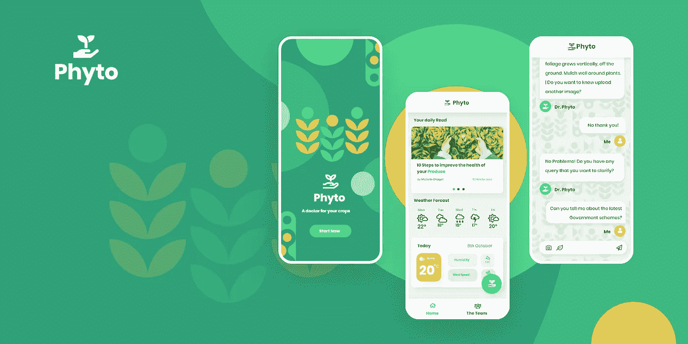
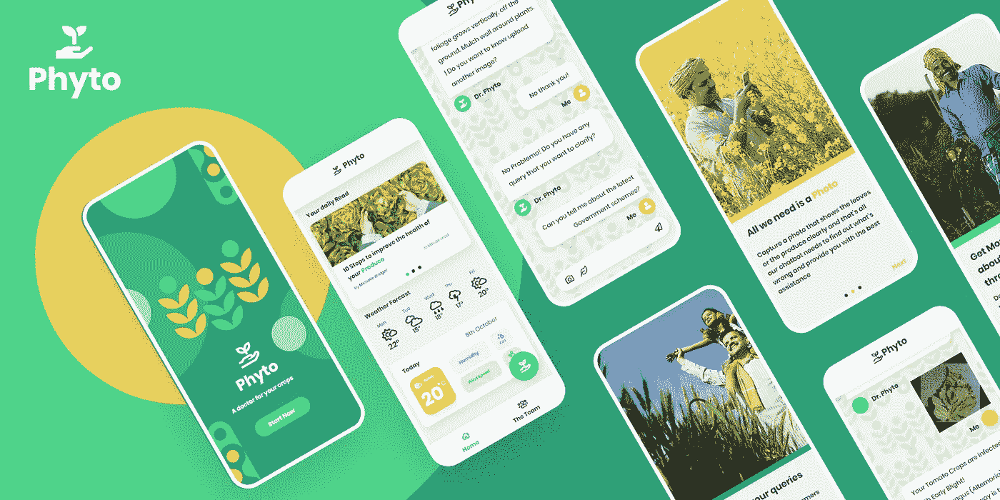
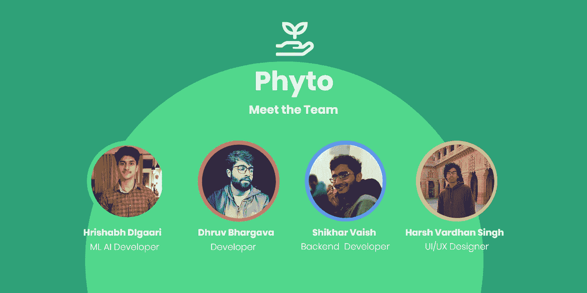

# 我在 2020 年 NLP 峰会黑客马拉松上的经历

> 原文：<https://medium.datadriveninvestor.com/dr-phyto-how-we-became-world-rank-1-77012574a704?source=collection_archive---------13----------------------->



Dr Phyto (Design by [harsh vardhan singh](https://medium.com/u/a8b595a0d6f7?source=post_page-----77012574a704--------------------------------))

## 我的旅程，我的故事

## 以及我们如何成为世界第一

面向快速发展的应用自然语言处理社区的 NLP 峰会于 2020 年 10 月 6 日召开。它是由著名的[约翰·斯诺实验室](https://medium.com/u/3251f80c528f?source=post_page-----77012574a704--------------------------------)组织的。会议四天的主题分别是趋势&最佳实践、开源库、医疗保健中的 NLP 和对话式人工智能。

[NLP 峰会项目](https://www.nlpsummit.org/program/)涉及 30 多场独特的会议和 40 位演讲人，涵盖了当今 NLP 成功应用的各种用例、技术、行业和组织，来自行业领导者，包括:

*   Anacode 公司创始人&首席执行官迦娜·利彭科娃
*   HuggingFace 的首席执行官克莱门特·德朗格
*   诊断机器人公司董事长兼首席技术官基拉·雷丁斯基
*   [Marco Ribeiro](https://www.linkedin.com/in/marcotcr/) ，微软研究，ACL 2020 最佳论文奖作者
*   Primer AI 首席产品架构师 Amy Heineike
*   [凯瑟琳·哈瓦西](https://www.linkedin.com/in/havasi/)，Luminoso 科技公司创始人&首席执行官
*   斯坦福大学的 ML/NLP 研究科学家皮耶罗·莫里诺

其他确认的演讲者来自 Google、Intel、Freshworks、DocuSign、Thomson Reuters、HealthJoy、Basis Technology、IDEXX Labs、Outreach.io 等。

但现在让我们来谈谈这一切是如何开始的。

# 背景故事:一个从未起飞的想法

那是 10 月 4 日，Dhruv Bhargava 告诉我将在 T-2 天后举行的黑客马拉松。从那一刻起，我只是在为峰会做准备。我无意参加黑客马拉松。我的第一反应是我们需要一个团队！不仅如此，我们还需要一个“想法”作为基础。所以我们都决定为团队增加一些价值。我需要一个优秀的 UX/用户界面设计师。对用户的需求和欲望有深刻理解的人。我可以信任的人。所以我明显的选择是[哈什·瓦德汉·辛格](https://medium.com/u/a8b595a0d6f7?source=post_page-----77012574a704--------------------------------)。他给了应用程序的界面一种非凡的感觉(你可以在这篇文章的封面上看到)

接下来是[什卡瓦什](https://medium.com/u/8169618feb60?source=post_page-----77012574a704--------------------------------)。现在，这个家伙是我们对应用程序的设想和它的执行之间的桥梁。他负责创建服务器逻辑、服务器代码的性能、可伸缩性、安全性和合理性。如果没有他的经验和专业知识，这个应用程序将只是 Figma 上的一个原型。

所以团队在船上，我们在为黑客马拉松的想法集思广益。我的目标是保持它的创造性，同时让它服务于一个更高的目标。让它解决一个迫切需要技术创新的社会问题。

最终，我想出了一个围绕精神健康的产品创意。我认为这个主题将是最好的工作，因为世界精神卫生日是在 10 月 10 日(结果应该在同一天公布)。我对这个产品有很多想法。我甚至为一个分类器准备了一个端到端的管道，这个分类器可以集成到项目中。

不幸的是，我们无法推进这一想法。原因超出了本博客的范围，但它相当严重，因为如果我们继续这个想法，我们应该会失去一个重要的团队成员。所以范围缩小到了团队和想法。我选择团队而不是想法，因为团队的力量在于每个成员。每个成员的力量就是团队。我对我的团队有信心。对我来说，想法并不比它们更重要。

## 后备计划:Phyto 博士

我之所以称之为后备计划，是因为我已经围绕这个想法进行了大量的头脑风暴。显然，它最初并不叫 Phyto 博士(“Phyto”来源于单词“fyto”，在希腊语中是“植物”的意思)

所以我们继续这个想法。船上的每个人都同意了。看起来它有很大的潜力。对我来说，这是一个完美的契合，因为这样的想法确实有助于社会，而且它确实在你的脸上尖叫，要求迫切需要技术创新。

在那个时间点，我已经实现了一个端到端的深度学习管道，可以以 96%的准确率区分和分类 38 种不同类别的植物疾病。但仅此而已。我仍然必须根据黑客马拉松的需求来塑造模块(比如实现一个聊天机器人，并使这个管道成为一个可靠的意图来源)

# 为我们的农民创造更美好的未来

农业是印度经济的支柱，然而我们能够赋予和支持当地农民的方式却很有限。我们的愿景是创新农业产业，帮助当地农民提高作物产量。

## 问题是

随着全球变暖、气候变化和水污染的增加，我们可能会面临一个严峻的未来。食物短缺不是我们想添加到列表中的东西！

> TechCrunch 报道称，世界上 40%的农作物因疾病而损失，我们希望成为农业的重大突破，尤其是在较贫穷的国家

当我们听到印度农民主要因为**农作物歉收**、**债务上升**、**新农业技术失败**等而自杀的消息时，这并不罕见。农业的一个障碍是由于不利的天气条件，缺乏农业技术知识，以及在虫害发生时没有在正确的时间点采取正确的行动，导致农作物经常损失。

> "当你的犁是一支铅笔，而你离玉米地有一千英里远时，耕作看起来非常容易。"**——德怀特·戴维·艾森豪威尔**

农民们需要带着树叶样本穿越村庄，前往最近的基桑支持中心，以便从专家那里获得正确的建议，解决他们与作物、肥料和杀虫剂相关的问题。

## 我们的解决方案？

我们的目标是利用人工智能来提高农作物产量，减少食物浪费。希望这项技术可以通过优化农业方法来帮助养活世界上不断增长的人口。

> 因此，我们结合了我们在机器学习、NLP、计算机视觉方面的知识，开发了一个**健壮的聊天机器人:Dr Phyto** 来自动执行繁琐的任务，如*测量作物质量*、*解决农民的基本查询*、*消除在疫情*、*预测天气状况*、*作物疾病检测*等。

这不仅会加速这一过程，还会帮助农民识别出有疾病的植物，并采取相应的必要措施。

## 那么我们的方法是什么？

黑客马拉松于美国东部时间 10 月 11 日下午 2 点在 6ᵗʰ拉开帷幕。我们的目标是创建一个平台，赋予我们的农民权力，并为他们提供知识，使他们能够自给自足。我们对农民日常面临的各种问题和常见疑问进行了研究。在 [***开放政府数据平台***](https://data.gov.in/) *上，我们遇到了很多农民对 **Kisan 呼叫中心(KCC)** 的疑问。*这是我们聊天机器人查询的主要数据集。

这个想法是为了提高农民的意识，解决他们的疑问，同时他们可以坐在自己的农场里，避免在疫情旅行。他们可以通过我们的聊天机器人 Phtyo 博士解决所有的疑问。我们的目的是让他们了解最新的政府计划及其对他们的好处，让他们了解未来 2-3 天的天气预报，以便他们能够相应地做好准备，同时测量作物的质量，寻找可能的虫害，以便在正确的时间点给予他们正确的补救措施。我们强大的计算机视觉模型可以检测出作物的名称以及可能影响作物的疾病。

我们意识到我们的目标受众是农民，他们可能习惯也可能不习惯这样的应用程序，所以我们确保我们的 UX/用户界面不仅要让他们看起来赏心悦目，还要易于理解和导航。

# 向您介绍——皮托博士



The Product

## 设计创新

用户体验是这个项目非常重要的一个方面，因为我们的目标群体在技术方面经验有限。由于时间是我们最大的限制，我们的目标不是创造完美的产品，而是创造一个可靠的系统。使用 [***开放政府数据平台印度***](https://data.gov.in/) 上的可用数据，我们能够分析出农民的大多数查询都与天气状况和最新的政府计划有关。通过用户研究，我们能够确定，在农业发现和有益方法与仍然依赖传统知识的当地农民之间存在沟通差距。

该应用程序从我们的车载屏幕开始，帮助用户轻松进入 Phyto 的体验。主屏幕分为两个部分:

*   一个文章小部件，显示与农业和耕作相关的教育和信息文章。
*   天气微件显示了关于天气状况的全面而深入的数据。

这些部分的目的是鼓励农民打开应用程序，即使他们没有查询。

> 关于**设计创新的综合案例研究**请阅读本文 [**Phyto:黑客马拉松案例研究**](https://uxplanet.org/phyto-a-hackathon-case-study-17a8db01e795) 作者 [harsh vardhan singh](https://medium.com/u/a8b595a0d6f7?source=post_page-----77012574a704--------------------------------) 。

## 技术创新

该项目包括 4 个模块:

*   使用 [**TensorFlow**](https://www.tensorflow.org/) 对作物病害进行分类和检测的端到端计算机视觉流水线
*   在 [**中开发的移动应用程序 Flutter**](https://flutter.dev/) 具有优雅的界面，可以与聊天机器人进行交互，用户可以发送他们的查询以及相关的图像
*   [**谷歌的 Dialogflow**](https://cloud.google.com/dialogflow/docs) 云服务
*   一个 [**Node.js**](https://nodejs.org/en/) 服务器，作为用户查询和谷歌对话流之间的管道

用户需要上传他/她想要诊断的作物叶子的图像。然后，图像经过我们强大的端到端计算机视觉模型，该模型存储在服务器上，并为每种作物及其疾病生成一个唯一的令牌 ID。几个例子如下:

```
'Grape__healthy', , 'Strawberry_Leaf_scorch', 'Strawberry_healthy', 'Tomato_Leaf_Mold'
```

然后，这些令牌通过管道进入我们的 Dialogflow 聊天机器人服务，作为用户输入进行解释。所有这些都封装在 docker 容器中，以便快速部署。此 docker 图像使用 TensorFlow 的官方 docker 图像作为基础图像，以使事情更容易。

在到达聊天机器人时，特定的响应由各自的令牌 id 触发，然后在应用程序的界面上返回给用户。

## 我们的团队



Team Behind Dr Phyto

# 收场白

经过 50 个小时的艰苦工作和不眠之夜，黑客马拉松于美国东部时间 10 月 10 日下午 4 点在 8ᵗʰ落下帷幕。我们对结果没有任何期望，但我们对自己的工作很满意。我们仍然记得我们在打电话，当 Harshvardhan 尖叫道:“我们赢了！”。他的声音里更多的是怀疑，而不是兴奋。但不怪他，我们所有人都非常震惊，尽管我们已经阅读了大约 50 次的祝贺邮件。我们既高兴又惊讶，我们甚至给峰会的一位官员发了短信，以确认这是真的！对我们 4 个人来说，这真是一次美妙的经历。

[](https://www.datadriveninvestor.com/2020/11/19/how-machine-learning-and-artificial-intelligence-changing-the-face-of-ecommerce/) [## 机器学习和人工智能如何改变电子商务的面貌？|数据驱动…

### 电子商务开发公司，现在，整合先进的客户体验到一个新的水平…

www.datadriveninvestor.com](https://www.datadriveninvestor.com/2020/11/19/how-machine-learning-and-artificial-intelligence-changing-the-face-of-ecommerce/) 

**访问专家视图—** [**订阅 DDI 英特尔**](https://datadriveninvestor.com/ddi-intel)