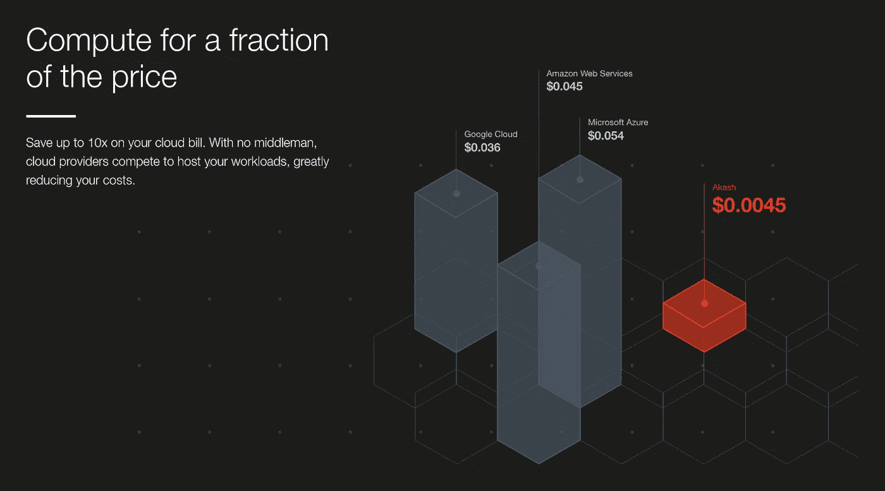
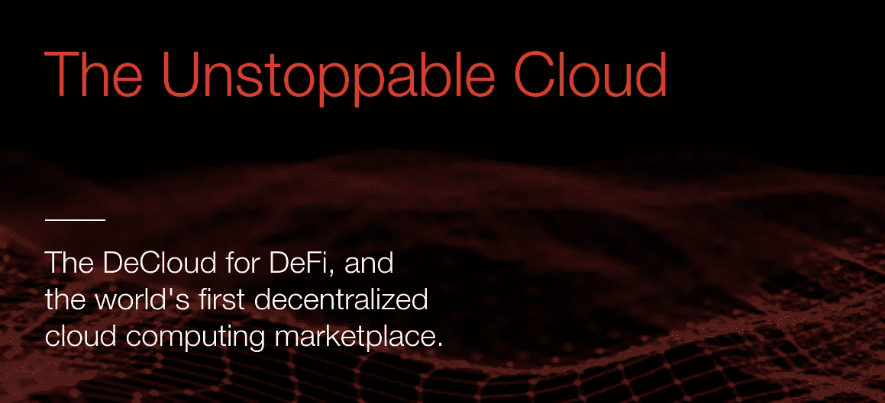

# 大幅降低云成本

> 原文：<https://medium.datadriveninvestor.com/dramatically-reducing-cloud-costs-120e7937ad4?source=collection_archive---------14----------------------->

## 凭借全球首个专为 DeFi 打造的分散式云



**充分披露:**在撰写本文时，我与阿卡什网络或其任何员工没有任何关系。

我仍然记得不久前，当我出现在网络活动中时，人们问我对 crypto/区块链有什么看法，我的标准答案总是:

> 嗯…我真的不太喜欢纯粹的数字游戏…但是，我确实认为区块链的概念本身非常迷人，如果我们能够解决拥塞和互操作性问题，然后将其应用于非货币的现实世界问题，我会全力以赴。

现在，我并不是说我不相信加密，也不是说它可能不是任何人现在可以进行的最佳投资，但事实是，我需要一些不仅仅是数字的东西来赢得我的热情和兴趣。然而，这个行业还没有出现。然而，随着区块链空间的成熟，终于到了有项目值得大书特书的时候了。因此，尽管所有人都在关注加密货币甚至互操作性技术(即 Chainlink 等)最近，我的注意力转向了更令人兴奋的东西，“DeFi 的云，世界上第一个分散的云计算市场”，名为 [Akash](https://akash.network) 。



## 兴奋的原因

那么它是什么，为什么如此令人兴奋？首先，这是因为这些人找到了一种利用区块链的方法来提供一种解决方案，这种解决方案将颠覆我所钟爱的云行业。作为 Akash 的客户，你可以以直接使用 AWS、Azure 或 GCP 的一小部分成本有效地启动 Kubernetes 工作负载，这是一笔大交易。

## 经济学

那么他们是如何做到的呢？想想 Airbnb 的 T1，T2 的优步的 T3，也许更合适的是，T4 的 T5。所有这些公司或者更好的称呼是“平台运营商”，它们的商业模式都是围绕供应方客户(供应商)的过剩资源*(即。房子、汽车和仓库)*可以出租给需求方客户*(即。租赁者、乘车者和有库存要储存的公司)*，这反过来为供应方客户抵消[资本支出](https://www.investopedia.com/terms/c/capitalexpenditure.asp)，甚至为他们产生新的收入流。另一方面，因为出售的是超额成本或沉没成本，所以以市场价的一小部分出租更容易证明是合理的；对于需求方客户来说非常便宜，有足够的空间向平台运营商支付费用，因此有效地创造了各方的双赢。Akash 在计算资源方面也做了同样的事情。它们有效地将多余的计算资源转化为面向容器工作负载的无服务器产品，可供公众租赁。

它目前也有一个基于 [Cosmos SDK](https://tendermint.com/sdk/) 的硬币( [AKT](https://coinmarketcap.com/currencies/akash-network/) )在一些交易所上市。在我看来，Cosmos 是一个非常明智的技术选择，因为在其他原因中，它允许 Akash 的家伙轻松地通过[利害关系证明](https://en.wikipedia.org/wiki/Proof_of_stake)而不是工作证明(采矿)来制作 AKT 硬币，这在我看来是一个更好的模型，也更环保。然后，硬币当然被用作支付其服务的一种形式，但也许更酷的是，他们网络的下一个版本将利用互操作性技术等 Uniswap 来拓宽支付方法，客户将能够使用其他类型的加密货币支付工作量。这一点，加上他们的创新产品，使得他们所谓的:

> 以经济高效、无权限、抗审查和非托管的方式进行云部署

最重要的是，他们正在制造一个非常漂亮的迷你服务器单元，计划在 2021 年底交付，作为供应商，你可以购买它来赚取更多的 Akt，这对那些想成为供应商但没有技术技能的人来说很好。对于我们这些极客来说，这也是完美的，他们会对看起来很酷的硬件和生态系统一起兴奋不已。


## 硬币

对于那些对投资机会而不是项目技术细节更感兴趣的投资者来说，我不是询问的最佳人选，但有些人确实相信 AKT 是投资的选择，如果有人只有 1000 美元投入到一个提供最大回报的硬币中。当然，投资这样一个早期阶段的初创公司也有巨大的风险，所以我鼓励任何人在下结论之前做好自己的尽职调查。

## 好用吗？

是的，当然，他们有清晰的文档给那些想尝试的人，但是当然，它还没有完全准备好，所以目前仍然有一些错误。尽管如此，这个概念非常简单有效。有了适当的环境变量和 wallet 设置，您所要做的就是将描述部署的 deploy.yml 文件放在一起，如下例所示:

```
version: "2.0"services:
  web:
    image: ovrclk/lunie-light
    expose:
      - port: 3000
        as: 80
        to:
          - global: trueprofiles:
  compute:
    web:
      resources:
        cpu:
          units: 0.1
        memory:
          size: 512Mi
        storage:
          size: 512Mi
  placement:
    westcoast:
      attributes:
        organization: ovrclk.com
      signedBy:
        anyOf:
          - "akash1vz375dkt0c60annyp6mkzeejfq0qpyevhseu05"
      pricing:
        web: 
          denom: uakt
          amount: 1000deployment:
  web:
    westcoast:
      profile: web
      count: 1
```

执行以下命令请求租用:

```
akash tx deployment create deploy.yml \
                           --from $KEY_NAME \
                           --node $AKASH_NODE \
                           --chain-id $AKASH_CHAIN_ID \
                           --keyring-backend $KEYRING_BACKEND \
                           -y \
                           --fees 5000uakt
```

等待租约，然后为您的部署获取租约值:

```
akash query market lease list \ 
                         --owner $ACCOUNT_ADDRESS \
                         --node $AKASH_NODE \
                         --state active
```

上传要部署的清单:

```
akash provider send-manifest deploy.yml \
                             --node $AKASH_NODE \
                             --dseq $DSEQ \
                             --oseq $OSEQ \
                             --gseq $GSEQ \
                             --owner $ACCOUNT_ADDRESS \
                             --provider $PROVIDER
```

就是这样！您的应用程序已经启动并正在运行！超级简单对吧？

还有另外两个简单的命令，您可以获得容器的访问信息和日志，但是我将把它们从这里省略掉，因为如果您已经深入了解了它们，很可能您已经阅读了它们的文档，所以我没有必要在这里复述它们。

## 他们离黄金时间还有多远？

从进度来看，不远。目前， [Mainnet2](https://akash.network/blog/akash-decloud-mainnet-2-teaser/) ，他们的下一个版本应该离梦想更近一步，这取决于宇宙中心对星际之门的升级。有鉴于此，他们的团队猜测我们最早在今年 3 月就会对时间线有一个更好的看法。同时，对于那些有兴趣了解在 Akash 上已经被证明有效的东西的人来说，这里有一个必看的 repo，它包含了已经在它上面成功运行的所有部署:

[](https://github.com/ovrclk/awesome-akash) [## ovrclk/awesome-akash

### Awesome Akash 是一个精选的 Awesome 资源列表，人们可以使用它来熟悉 Akash，包括…

github.com](https://github.com/ovrclk/awesome-akash) 

## 未来

我对即将到来的事情非常兴奋。我知道在前进的道路上会有很多挑战和阻力，但我希望他们一次一个地击败他们，这样他们就可以为我们所有人带来这种产品！