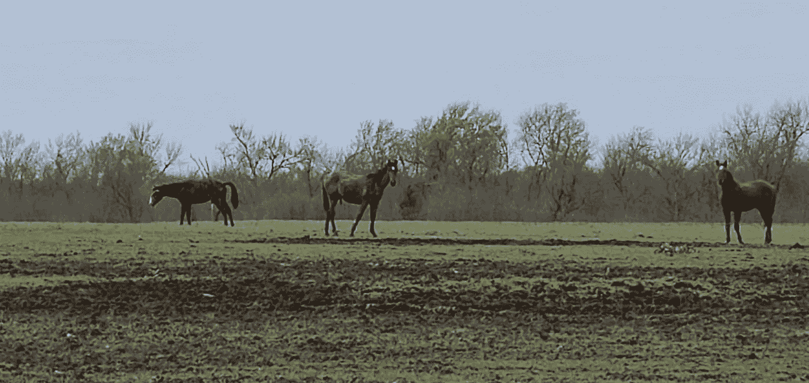
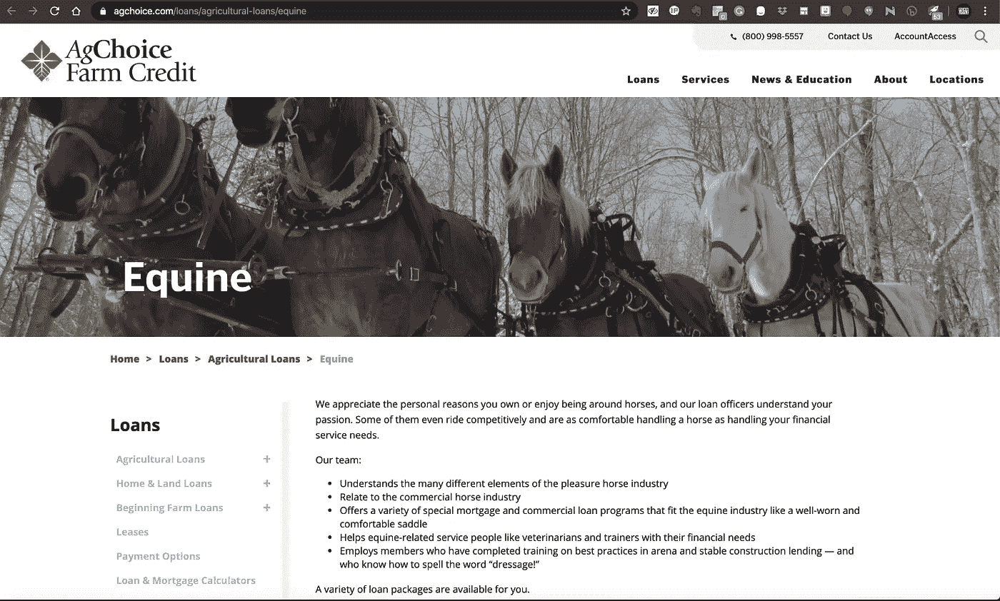
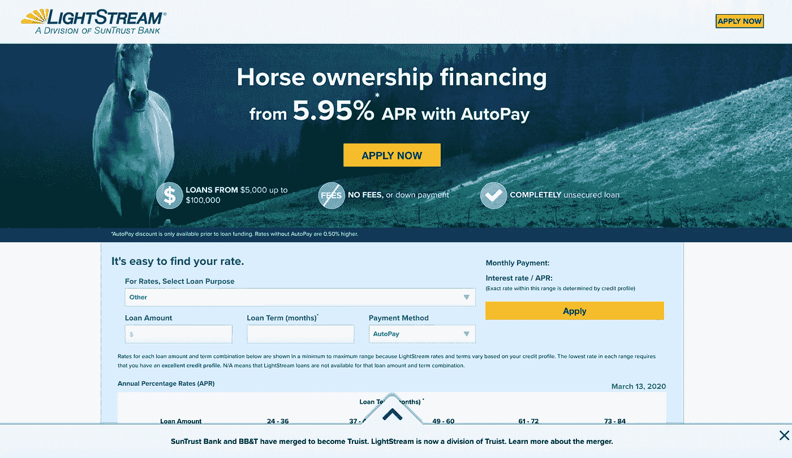
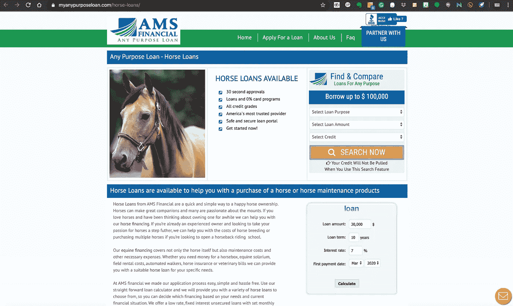
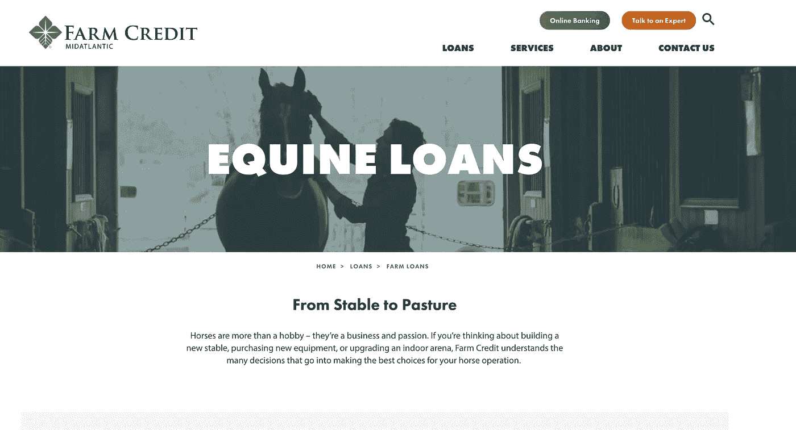
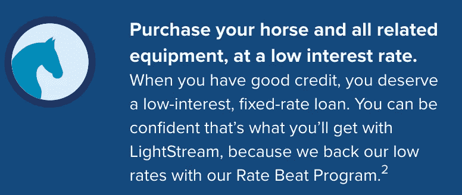
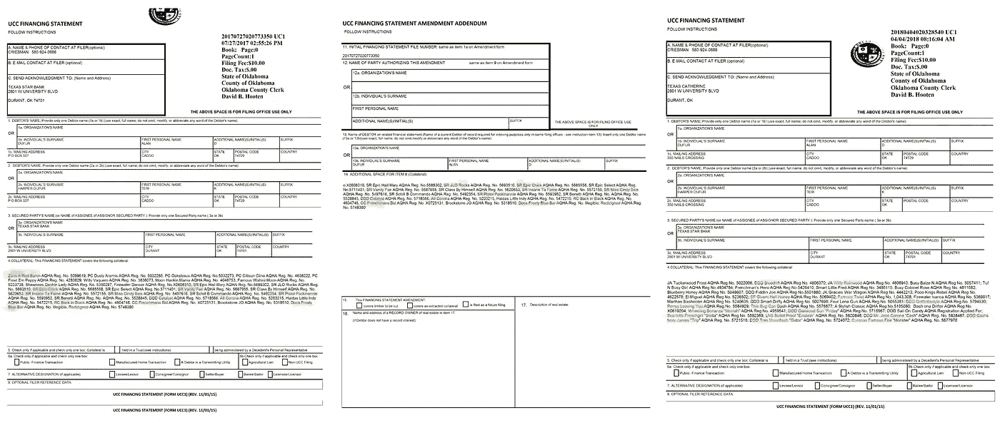
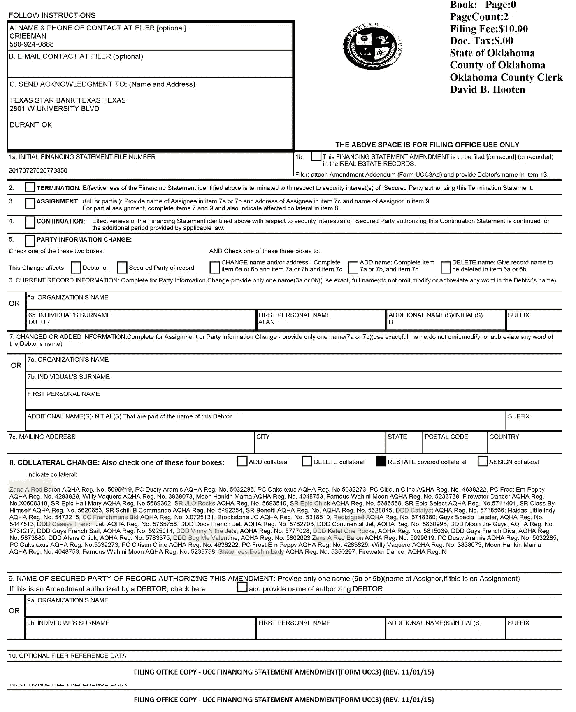
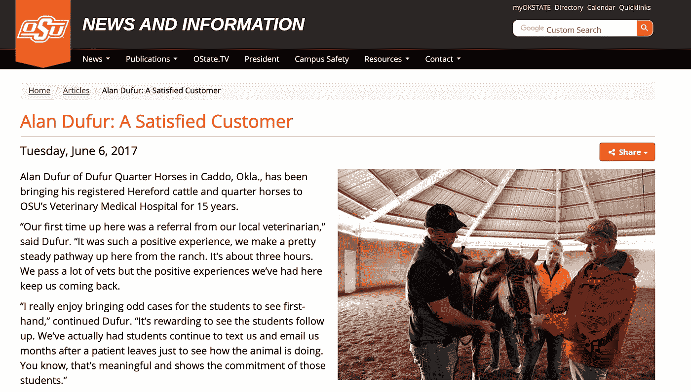

# 无人机任务检查 BancorpSouth Bank 饥饿的四条腿抵押品&更多信息被披露

> 原文：<https://medium.datadriveninvestor.com/drone-mission-inspects-bancorp-southbanks-famished-four-legged-collateral-more-info-is-revealed-3f51c6054b4d?source=collection_archive---------0----------------------->

We inspected the farm thoroughly, and further investigation reveals absolute madness. Source: Author/Drone Inspection

## 据称，该牧场正在利用州立大学项目和其他智能工具，用价值较低的马匹来代替清算抵押品，而银行和监督机构对此一无所知！

**3 月 4 日**[我们报道了一大群](https://medium.com/datadriveninvestor/does-bancorpsouth-bank-have-a-collateralized-horse-obligation-eb94b07a7c03)据称营养不良的“表演”马匹，并检查了小型“德克萨斯之星银行”在出售给他们的新母公司之前是否过度扩展了他们的资本(其中一些由牲畜担保):**Bancorp south Bank(**[**NYSE:BXS**](https://search.yahoo.com/search?p=BXS&fr=yfp-t&fp=1&toggle=1&cop=mss&ei=UTF-8)**)**。BXS 在他们的年度投资者文件中承认，他们没有预先评估德克萨斯之星的资产。然而，他们现在正在这样做。巧合的是，我们也是！

Drone Inspection of Dufur Ranch, March 21st, 2020\. [Source: Author/Youtube.com](https://www.youtube.com/watch?v=xTE1hJZpZTw)

这一切在上周六的一次秘密无人机飞行中达到高潮，这次飞行覆盖了 Dufur 的整个主要财产，只是为了看看 BXS 的抵押品，它和 FDIC 一起，是储户和投资者委托给银行的资金的支持者。据称，大部分被用于“桶赛”，这是一项竞争变得昂贵的运动，因为一位专业培训师称在该学科中训练的马匹的价格“高得离谱”。

此外，这些视频被提供给了牧场的所有者，从而引发了公众的反应，并采访了那个特定牧群的共同所有者: **Terri (Harper) Dufur** 。

此外，我们采访了一位前 Dufur 员工。消息来源称，在几个月前离开之前，公司从现金至上转变为大幅缩减开支。具体来说，消息来源说，

> “从挥霍无度到我们无法理解一个人怎么会有这么多钱，再到……我们都有点被(削减开支)吓呆了。”

由此产生的证据表明，银行存在巨大的不当行为，杜福尔家族精神错乱，美国赛马协会不负责任，绝对没有任何阴谋！

## 马贷款:他们是真实的！而且广泛提供！

信不信由你，找马贷不费吹灰之力。在 Google.com 上简单查询一下，就可以看到一些网站的主页:

Source: [AgChoice Farm Credit](https://www.agchoice.com/loans/agricultural-loans/equine)

Source: [Suntrust Bank’s “Lightstream” lending platform.](https://www.lightstream.com/horse-loan)

来源: [AMS 金融。](https://www.myanypurposeloan.com/horse-loans/)

Source: [AgChoice Farm Credit.](https://www.agchoice.com/loans/agricultural-loans/equine)

这些银行提供非常低的利率，似乎与农场的贷款属于同一类。

Source: Suntrust Bank.

上述广告(Suntrust 的“Lightstream”)的脚注说:

> **披露 2: LightStream 将提供一个比竞争贷款人提供的利率低 0 . 10 个百分点的利率，前提是提供令人满意的证据，证明您在贷款融资前一个工作日东部时间下午 2 点之前，确实被批准与另一个贷款人就 LightStream 提供的相同贷款条款获得更低的利率。**

因此，贷方似乎想要这些贷款——原因我们无法理解。

## 所有的马都去哪里了？

同时，无人机操作员承认观察到“*只有*150-200 匹马。”这与 Dufur 夫人形成了鲜明的对比，她声称，“目前的马存栏量约为 430 头**，计划今年大幅减少马群规模**。国家兽医可以核实他所看到的牛群的大小。”

在公众对二月下旬马匹营养不良的抗议中，杜福尔夫人承认俄克拉荷马州兽医在二月下旬到达，他们“在签发搜查令期间只见过(州兽医)一次。”俄克拉荷马州的顶级动物医生承诺将于 2020 年 3 月 28 日返回，进行“后续”访问。

然而，尽管这些事实上可能是“马”——它们是由债务担保的真正的马吗？债务延伸到了杜福尔家族，最近被 BXS 收购了。

一名前员工说他们不是！

在阅读了 3 月 4 日的文章(其中包括五页 UCC 文件，上面有杜福尔家族抵押的四分之一马的实际注册号码和名单)后，这位特别的消息人士声称，UCC 文件清单上列出的许多马后来都被卖掉了，*还有一些已经死亡。*

## “有些已经去世，有些已经卖掉”

该消息人士称，“在你第一篇文章中展示的(UCC 申报文件)中，有些已经去世，有些已经出售，还有一匹‘黑马’永远属于(别人)。我又问那人，那几匹马卖了，那几匹死了。"。

该消息人士用黄色高亮显示了名单(见下文)，黄色高亮表示“已售出”，紫色高亮表示“已死亡”。还有一大堆黄色！

与此同时，该消息人士承认，当被问及文件时，“杜福尔夫人经常说原始文件在银行，”这相当于一匹马上的头衔。在这种情况下，发布这些“血统”的机构是美国夸特马协会，或得克萨斯州阿马里洛的“AQHA”。

在许多情况下，*其他*马匹登记机构有协议为马匹抵押贷款，如“马夫的[留置权”然而，AQHA 没有任何形式的这种过程。当询问 AQHA 时，他们的代表回答了关于杜福尔行动的每一个可能的问题；然而，他们没有回应为什么他们不把留置权放在由他们的组织发布的马血统上的询问。](https://www.equinelawblog.com/Stablemens-Lien-Laws-What-They-Are)

此外，牧场的一名不愿透露姓名的现任雇员声称，一匹名为“Redizigned”(在多份文件中以紫色突出显示)的四分之一马为杜福尔夫妇赢得了一笔可观的保险支票。来文方认为这是"可疑的"。当然，任何邪恶的保险索赔都会让人回想起 80 年代末和 90 年代初涉及 J.T. Lundy 的 Calumet 农场丑闻和珍贵的纯种马“Alydar”。如果有人记得，那可没什么好下场！

## 银行“持有文件”的意思是:绝对没有！

然而，他们的回应是一封来自 AQHA 公关主任莎拉·戴维孙的电子邮件，提供了以下声明:

> “作为一个男女骑手协会，我们对俄克拉荷马州卡多的一个养马设施中被忽视的马匹的报道感到不安。收到此类消息后，我们立即联系了(1)对此事拥有管辖权,( 2)有权进入马匹设施进行调查的地方当局。几个星期以来，我们联系了当地政府了解他们调查的最新情况。最终，治安部门向我们提供了所附的关于其观察和发现的新闻稿。虽然 AQHA 继续监测局势，但根据治安部的观察和调查结果，我们目前没有对任何人进行不人道待遇的起诉。”

在现实中，如果你找不到你在 AQHA 注册的马的文件，或者如果他们拥有一家银行，这是直截了当的出售发生，而不必从银行的金库获得文件。新的所有者可以填写一个简单的表格与 AQHA 声称所有权-留置权免费。只要去[这个链接并填写](http://AQHA has certain policies regarding lost or damaged registration certificates. And there's a big difference between duplicating and replacing! The main difference is money. And we're all looking for ways to save money these days. Effective January 1, 2018, a replacement certificate requires the old certificate and a $25 fee. A duplicate certificate requires a form, pictures, current membership and a $50 fee. So when can you replace rather than duplicate?)，然后**嘭！你有一个干净的头衔。**

不开玩笑地说，AQHA 的[网站吹嘘](https://www.aqha.com/-/replacement-vs-duplicate-certificate)以下关于马上获得新的、干净的文件的声明:

> “我想起了一个关于需要新证书的故事。一名 AQHA 会员打电话来，询问她需要采取什么步骤来获得新的注册证书。你看，她的狗吃掉了她的马的证书——至少是大部分。(对，是真的！)该客户需要提交更换请求。更正/替换注册证书的步骤如下:
> 
> -不要扔掉剩下的证书。
> 
> -确保你能看到马的注册名称或号码。(如果没有，你需要申请一份副本。)
> 
> -将旧证书的剩余部分邮寄到 AQHA，并收取 25 美元的替换费。包括一个通知告诉 AQHA 证书需要做什么也是一个好主意。
> 
> -当前的 AQHA 会员无需提交证书更换申请。"

事实上，“狗吃了她的马的证书”作为一个官方的补救措施的例子，以获得一匹被抵押的马的干净血统(头衔):是奇特的*(非常可疑)*。

也有两种方法来申请一个新的，干净的标题。这涉及到“替换证书”或“副本证书”，AQHA 网站称**唯一的区别是:“钱”**

## 体外造假？

在所有登记的四分之一马的情况下，体外受精是预期的。如果主人想要繁殖参加比赛的母马，可以使用代理母马或“受体母马”。这使得马的所有者能够维持从获胜中获得的收入，以及从表演马的后代繁殖中获得的收入。

俄克拉荷马州立大学向牧场提供(国家资助的)机会，利用他们的“受体母马”，以便将一匹公马的一个或多个胚胎移植到一匹或多匹“受体母马”身上[在 2017 年 OSU 兽医学院的一篇文章](https://news.okstate.edu/articles/veterinary-medicine/2017/icsi-foals.html)中，杜福尔斯被指名为这些项目中与 OSU 合作的关键合作者。

同年的另一篇[文章，2017](https://news.okstate.edu/articles/veterinary-medicine/2017/alan-dufur-satisfied-customer.html) ，说艾伦·杜福尔是 OSU 兽医学校的一个快乐顾客。

[Source: Oklahoma State University.](https://news.okstate.edu/articles/veterinary-medicine/2017/alan-dufur-satisfied-customer.html)

至于消息来源对此的看法，“我们有一整个牧场都是‘母马’，这些都是(Teri Dufur)繁殖或饲养的母马。我们通常会把它们送回去，但之后(泰瑞)只是保留或收购它们。”这位消息人士补充道，“过去几年我在那里的时候，我们已经收获了 80 或更多的受体母马。”在“生产了一些东西的更好的母马”的情况下，杜福尔行动据称将通过受体母马收获两只或更多的小马驹。

通常，自然地，一匹马只会收获一匹小马驹。然而，有了更好的母马，消息来源补充道，“他们会在一个繁殖季节收获两到三次。”

## “附带”损害

我问消息来源:“这仅仅是为了用新马替换他们出售的马(不考虑价值)，以保持数量稳定，尽管质量与数量相比发生了巨大变化？消息来源回答说，

> "我们一直认为她是个囤积者，但是，这确实说得通，是的."

简单地说，我问消息来源，他们是否只是通过配方母马(指数级)繁殖，只是为了保持一个让债务流动的群体水平？消息人士说:“有道理！”

银行是否关注？目前还不清楚，他们也不会回应置评请求。然而，消息人士回忆说，有一次，“(一个买家)不得不让她的兽医打电话给银行，并向银行解释为什么(从杜福尔购买的马)不值得银行借出 5 万美元来交换这匹马。”

当被问及消息来源认为这匹马的内在价值是多少时，消息来源说:“**可能是一万到一万两千美元。”**

与此同时，自这一问题首次曝光以来，BXS 的股票已经下跌了 10 个点(跌幅约为 28%)。然而，目前还不清楚是什么导致了抛售，特别是因为标准普尔 500 在病毒引发的经济放缓中，已经损失了近 30%的价值。

然而，马是很难安全，自由出售，不可能验证或认证(谢谢 AQHA！):这可能是这些马的市场价格飙升的一个原因！

最后，3 月 28 日，当我要求和州兽医一起参观时，杜福尔夫人承诺，“我们会在参观牧场时给你答复。”最后，杜福尔做出了一个大胆的承诺:

> “是的，我们将全额偿还我们的债务。”

因此，随着它的出现，更多的将被揭示…

— — —

## 作者的披露

1.  我/我们在提及的任何股票中没有头寸，也没有在未来 72 小时内建立任何头寸的计划。这篇文章是我自己写的，它表达了我自己的观点。我没有收到任何报酬(除了来自 Medium)。我和这篇文章中提到的股票的任何公司都没有业务关系。
2.  *我父亲拥有并经营着“贾德小牧场”，他住的地方离杜福尔家的牧场不远。他的业务也是四分之一马业务的重要参与者，特别是生产桶赛马。虽然我与该操作或任何附属实体或个人没有财务关系，但我保证本出版物的公正性。我将进一步承认，该组织的公开文件(类似于此处审查的文件)证明他的经营和其他* [*企业有类似的重债负担*](https://drive.google.com/file/d/1mhtL-juE2SEuLFMlUJwXyxXf6zVSJoRq/view?usp=sharing) *。提供了摘要，并在相同的监管机构存档。*

# **DDI 的披露:**

*本文及其分析仅代表作者观点，与《数据驱动投资者》( DDI)编委会的立场无关。鼓励读者对这一主题和相关主题进行尽职调查和研究。DDI 也没有以任何方式与此话题相关的交易头寸或财务利益。*