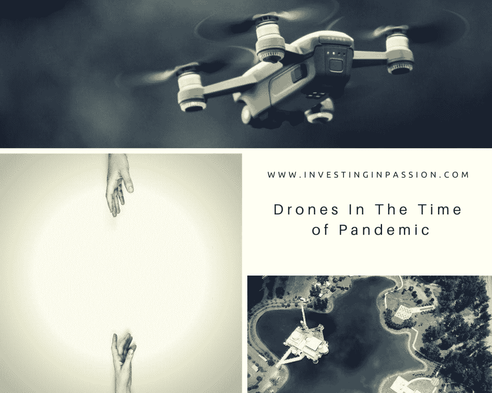
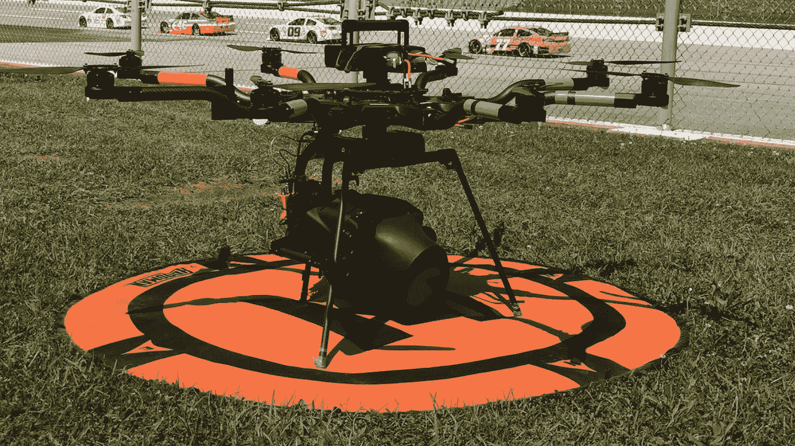
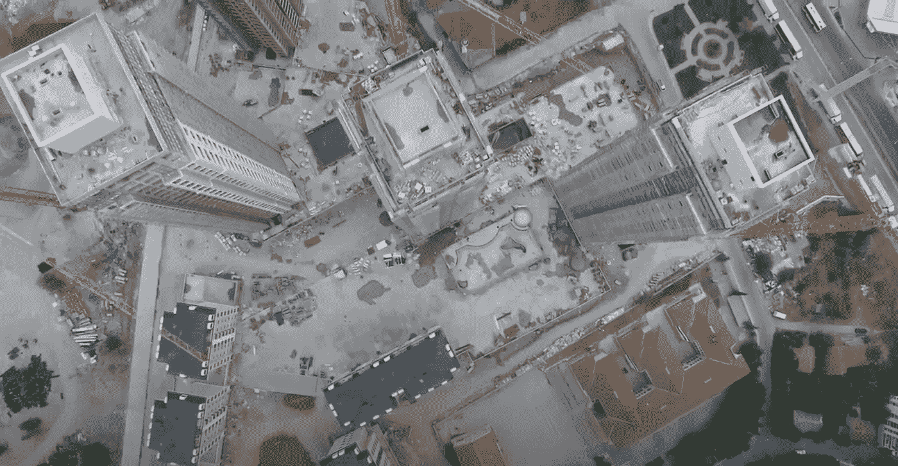
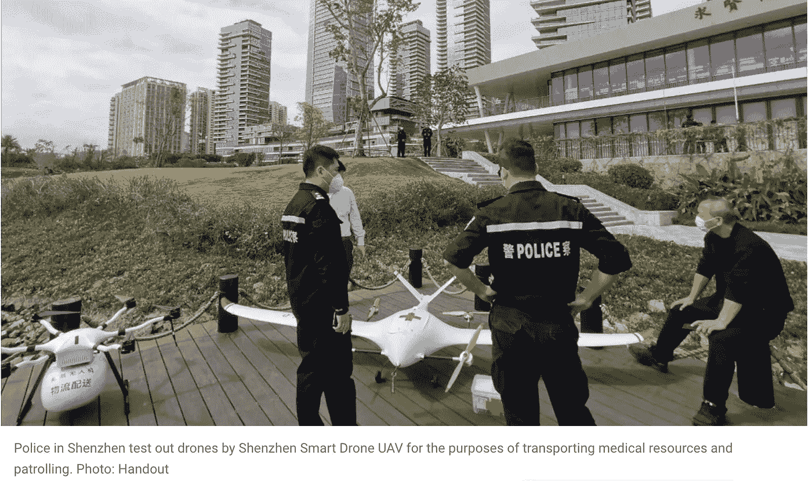
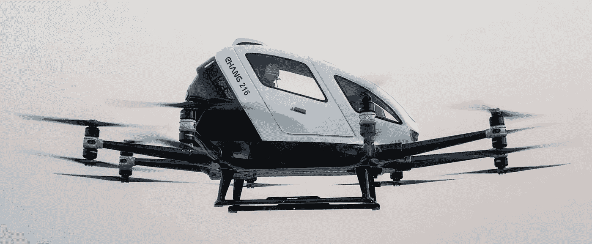
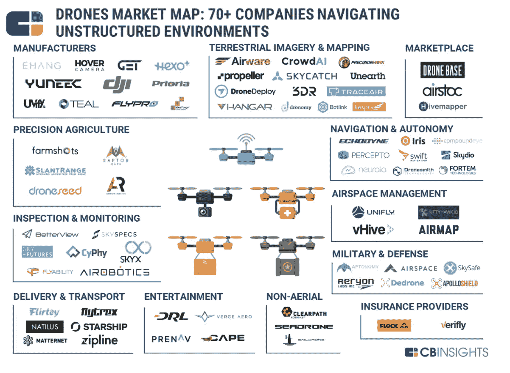
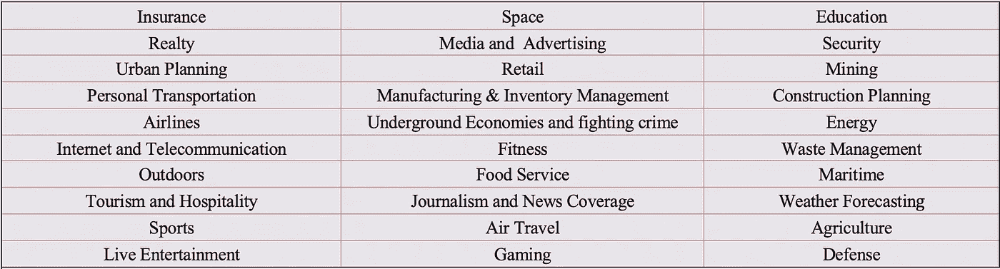

# 疫情时代的无人机发展

> 原文：<https://medium.datadriveninvestor.com/drones-development-in-times-of-pandemic-8bf04542a09d?source=collection_archive---------15----------------------->

当我们无法彼此靠近，需要限制联系和互动时，无人机技术变得至关重要。

无人机*(UAV——无人机)*在很长一段时间内都无法闯入‘热门科技’。它曾多次被归类为*【让我们拭目以待】*，但现在我们已经可以看到它的完成。无人驾驶飞机的空间一直在悄悄地但不断地增长，自从论文保持不变，“将机器送到对人类来说不安全或不高效的地方”以来，用例在最近几天成倍增长。最初，它被用于到达人类无法到达的危险或昂贵的地方 *(* [*飞行能力*](https://www.flyability.com/) *)* ，用环卫无人机清洁建筑物 *(* [*清醒的*](https://www.luciddronetech.com/) [*无人机*](https://www.luciddronetech.com/)*，实时监督和检测作物健康问题并准确评估损失*

* [## 我们为军事人工智能做好准备了吗？数据驱动的投资者

### 今天，算法可能会以迷人的形状出现，例如索菲亚，一个态度可爱、开明的机器人…

www.datadriveninvestor.com](https://www.datadriveninvestor.com/2019/02/21/are-we-ready-for-military-ai/) 

无人机正在拯救生命，限制我们接触病毒和潜在感染，它们在许多不同的方面提供帮助，其中包括:

**医疗无人机送货**

[UPS 无人机送货](https://dronelife.us8.list-manage.com/track/click?u=5cdad320c6921b55059dc6269&id=10a754faa7&e=28a30b0a2c)服务于医院和隔离区。这是在送货服务中采用无人机的又一大步。UPS 与美国领先的无人机服务提供商 DroneUp 合作，并积极帮助提供医疗用品，在正常运输中断时在医院之间运送包裹。

在英国，Skyports [无人机送货](https://dronelife.com/2020/04/15/skyports-drone-delivery-joins-u-k-caa-regulatory-sandbox-to-trial-bvlos-flights/)加入了英国民航局的“监管沙箱”来测试 BVLOS(超视距)飞行。Skyports 专门从事医疗、电子商务和物流领域的端到端无人机送货业务。

**诊断**

[疫情无人机](https://dronelife.com/2020/03/31/this-pandemic-drone-can-see-who-has-a-temperature-or-coughs/)可以看到谁发烧或者咳嗽。[无人机技术](https://dronelife.us8.list-manage.com/track/click?u=5cdad320c6921b55059dc6269&id=15c32b106a&e=28a30b0a2c)现在可以用来(通过热传感器)从 190 英尺的高空识别 COVID 症状。很少有城镇在测试一种可以测量社交距离并从空中探测 COVID19 症状的无人机。
[Draganfly](https://draganfly.com/) 似乎是这个领域的先行者。他们被选中在全球范围内将突破性的[健康诊断技术](https://www.youtube.com/watch?v=ot2jlr3d6ug)集成到自主摄像机和专用无人机上，以对抗冠状病毒和未来的健康突发事件。

令人惊讶的是，这并不是一个全新的用例，这个功能以前就被使用过。伦敦卫生和热带医学学院已经使用带有热成像相机的无人机来跟踪菲律宾巴拉望省的猕猴活动，该地区的疟疾是一个活跃的威胁。

**监控&人群管理**

无人机现在被成功用于监控社交距离。Acecore Technologies 提出了下一级扬声器无人机的想法。带有扬声器系统的无人机正被世界各地的执法机构迅速采用，以提醒社区注意社交距离准则。

**消毒**

全球首款室内[消毒无人机](https://www.medgadget.com/2020/04/worlds-first-indoor-disinfection-drone-ready-to-fight-covid-19.html)近日由 Digital Aerolus 带入生活。他们开发了第一架带有 C 波段紫外线(UVC)灯的室内无人机，专门用于抗击新冠肺炎病毒的传播，消毒率高达 99%。

**广播/司法**

NBC，CNN，FAA [在某些情况下在广播中使用了](https://www.newscaststudio.com/category/tv-news-drones/)无人机。[如果你需要报道突发新闻、正在发生的事情或报道体育、天气或现场事件，Dejero](https://www.dejero.com/) 会有所帮助。他们提供快速、现代、多功能和可靠所需的设备和[技术](https://www.dejero.com/industry/broadcast-and-media)。

**记录你的工作地点**

由于你不能在工作现场监控工作，你现在可以使用无人机来检查进度，看到真实的图片或视频，并与你的客户，承包商分享。由 DroneDeploy 提供支持的 Multivista 是提供建筑照片和视频文档服务的公司之一。

**喷涂**

消毒无人机正在喷洒街道，以阻止新冠肺炎的传播。当地卫生部门已经测试出部署农业喷洒无人机的方法，以更有效地消毒公园、公共汽车等公共场所。无人机里装的是消毒剂，而不是杀虫剂。[中国和西班牙](https://dronedj.com/2020/04/01/spain-first-in-europe-agricultural-drones-covid-19/)将这项技术作为应对新冠肺炎空中消毒的关键工具。这些车辆简单地使用高清变焦镜头、扬声器和化学喷射装置对大面积区域进行消毒

**测量**

中国调整测量，以执行世界上最大的检疫和遏制冠状病毒爆发。[micro multi copter Aero Technology](https://www.scmp.com/business/china-business/article/3064986/china-adapts-surveying-mapping-delivery-drones-task)提供的测绘无人机还配备了扬声器、40 倍变焦镜头、热传感器和泛光灯。这一切都有助于对抗病毒，并有助于实施隔离。

**车辆起降**

你见过最大的无人机是什么？如果你能进去飞，那它还是无人机还是飞机？亿航现在正借出它的电动垂直起降用于医疗救援，并在当前的冠状病毒危机中用作救护车。与普通直升机不同的是，它起飞速度更快，可以在更窄的地方降落，电力效率高，噪音低，非常适合城市环境。

这些只是无人机技术出现的几个例子，在时间非常关键的时候会有所帮助。围绕这项技术有很多法规，应该适当考虑所有人类的安全和隐私，但当前的疫情有助于澄清用例，并认识到快速、即时、安全和有效行动的价值，如果没有无人机的帮助，这些行动是不可能的。

下面是 Droneii.com 整理的疫情无人机应用的一个很好的总结。**。**

**CBInsight 还研究了不同的市场和上市的先锋公司，您可能有兴趣仔细研究一下*(不一定与疫情用例相关)***

最后，如果你还想知道我们可以在其他什么地方使用无人机，[这里有](https://www.cbinsights.com/research/drone-impact-society-uav/)几个他们可以找到有意义和颠覆性应用的类别:

当我们打开思维，让偏见消失，我们可以想到更多无人机可以使用的空间。一些现在看起来不可能的事情最终会变成一个伟大的商业想法和完美的案例，将无人机引入一个新的类别。这就是颠覆性技术如何出现的，从低端或新市场(不存在的地方)的立足点，公司将不会赶上主流客户，直到质量赶上他们的标准。

*受克莱顿·M·克里斯坦森“颠覆性创新”理论及其著作《创新者的困境》的启发*。

最初发表于[www.InvestingInPassion.com](http://www.InvestingInPassion.com)*