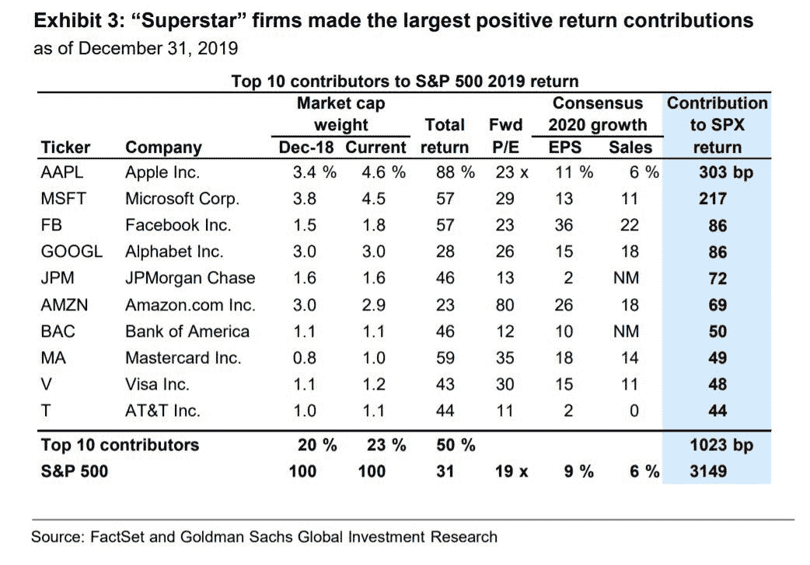

# 政府、企业和个人都深陷债务之中…

> 原文：<https://medium.datadriveninvestor.com/drowning-in-debt-true-of-governments-corporations-and-individuals-688ae6aa8a15?source=collection_archive---------15----------------------->

#视频字节

[https://photos.app.goo.gl/Zsfa9JJvq4MVrdb79](https://photos.app.goo.gl/Zsfa9JJvq4MVrdb79)

https://www.retirebeforedad.com/debt-free-sp-500-companies/[由于股票市场看起来很贵，我们深陷全球债务之中，对全球经济的担忧依然存在。自 2008 年以来，Adobe 的股价已经从大约 16 美元上涨到 351 美元+(](https://www.retirebeforedad.com/debt-free-sp-500-companies/)[https://www . macro trends . net/stocks/charts/ADBE/adobe/stock-price-history](https://www.macrotrends.net/stocks/charts/ADBE/adobe/stock-price-history))标准普尔 500 指数的市盈率为 19 倍，苹果(4.6%)、微软(4.5%)、脸书(1.8%)、谷歌(3%)和亚马逊(2.9%)占标准普尔 500 指数的 17.8%。标准普尔 500 指数中只有 17 家公司拥有净现金，因为公司借入了大量资金进行公司回购，以提高每股收益，因此董事们可以获得奖金。最终这笔债务将需要偿还。冠状病毒会成为外部冲击引发股市调整的催化剂吗？

 [## 现金为王，比我们想象的更强大|数据驱动的投资者

### 2020 年 3 月 12 日，在川普总统宣布新冠肺炎进入国家紧急状态的前夕，纽约时报报道…

www.datadriveninvestor.com](https://www.datadriveninvestor.com/2020/03/26/cash-is-king-more-potent-than-we-think/) 

**访问专家视图—** [**订阅 DDI 英特尔**](https://datadriveninvestor.com/ddi-intel)