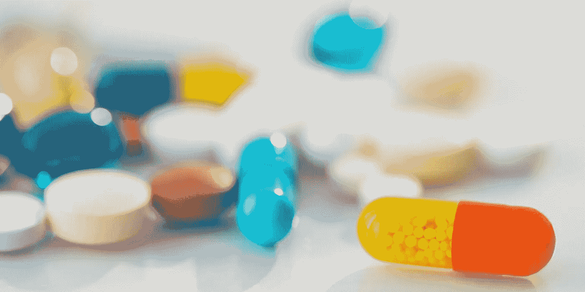
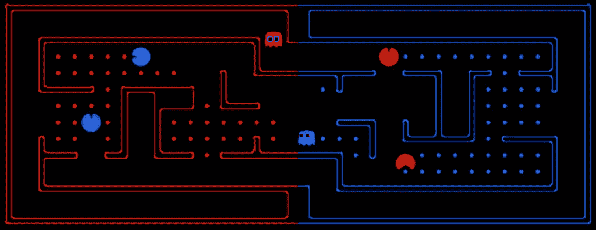
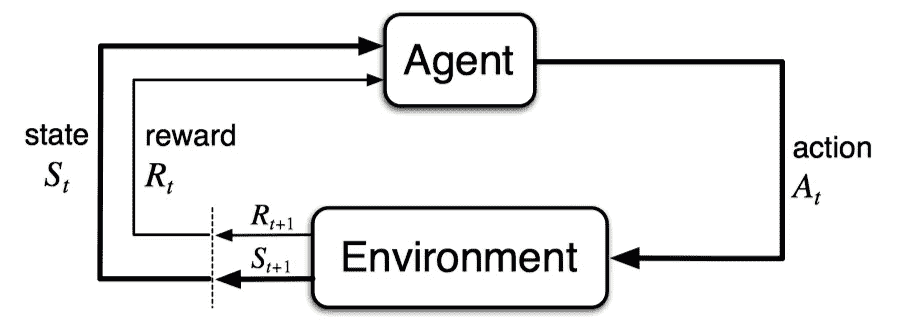
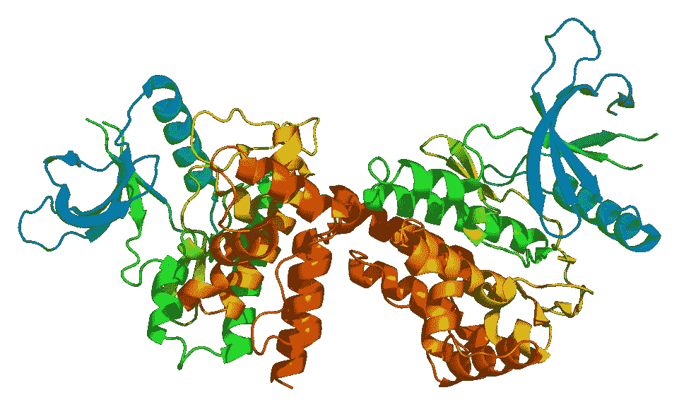
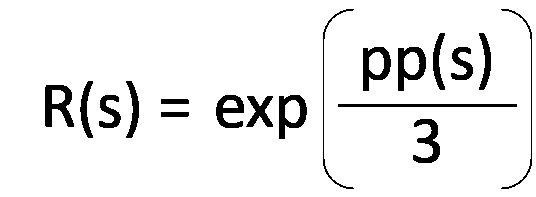
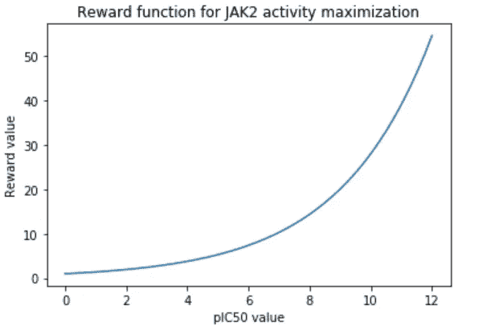
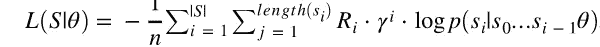
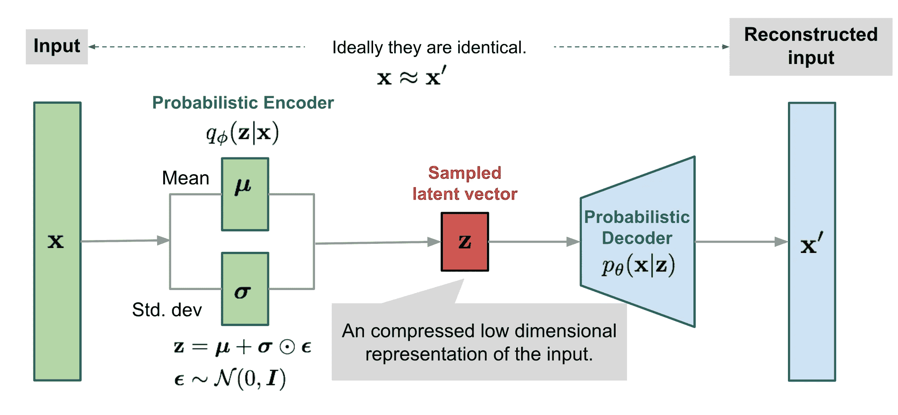
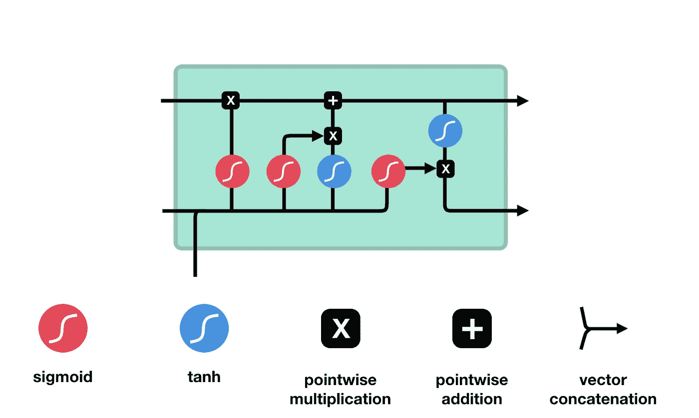

# 使用强化学习使药物设计变得有趣

> 原文：<https://medium.datadriveninvestor.com/drug-design-made-fun-using-reinforcement-learning-212a4f867f33?source=collection_archive---------1----------------------->

## 利用强化学习，通过优化生成的分子来增强基于结构的药物设计模型，以展示所需的特性。

***简要描述:*** *使用本文中解释的强化学习方法，对生成的分子进行优化，使其表现出对 JAK2 的抑制活性，以治疗血液癌症，如 p* 白血病 *vera。这证实了该方法对于设计具有用户期望特性的分子是有效的。*

将一种药物从研究阶段应用到患者身上需要 10 年以上的时间，平均花费 26 亿美元！

计算方法，特别是**人工智能**为加速药物发现提供了一种非常有前途的方法。

然而，目前许多基于机器学习和结构的药物设计方法都有局限性，因为它们 ***无法*有效控制生成分子的特性。**

 [## 金融中的机器学习|数据驱动的投资者

### 在我们讲述一些机器学习金融应用之前，我们先来了解一下什么是机器学习。机器…

www.datadriveninvestor.com](https://www.datadriveninvestor.com/2019/02/08/machine-learning-in-finance/) 

通过将药物设计建模为“动态游戏”，我们可以使用强化学习来生成具有所需属性的分子。想象一下药物设计，但取而代之的是药物被 PacMan 取代。

# 什么是强化学习？

强化学习是机器学习的一种。与监督学习和非监督学习不同，强化学习不从数据中学习，而是从实验中学习。

我们来看看强化学习是如何帮助机器玩吃豆人的。

强化学习归结起来有两个组成部分:

*   代理人=吃豆人
*   批评家=积极的回报和消极的后果

强化学习代理通过尝试不同的动作来学习玩吃豆人。起初，特工“吃豆人”随机移动。

通过尝试不同的随机移动，代理人随着时间的推移慢慢地学习与奖励和结果相关的行动。代理人会因为像吃花生豆这样导致奖励的行为而得到奖励，也会因为像撞鬼这样导致后果的行为而受到惩罚。

吃豆人变得更好的方法是只学习导致奖励的重复动作，而不是导致结果的动作。

重复的训练过程看起来像这样:

1.  代理人 PacMan 被分配了一个⁰的州，这是代理人“玩”的环境。
2.  然后吃豆人采取一个行动，**一个** ⁰并且移动，对于这个具体的例子，它向左移动了 7 个单位。代理现在已经转移到一个新的状态， **S** 。
3.  因为吃豆人吃了 7 颗豆并且还活着，代理人得到奖励+7。

**视觉表现:**

Agent in State 0 — **S**⁰

Agent moves 7 units to the right and is now in state 1 **— S¹**.It gets rewarded 7+.

总结一下:**通过经验，强化学习优化行动，最大化回报，同时最小化负面后果。**

The agent, like humans learns from its mistakes/experience and optimizes its actions to maximize reward, and minimize punishment.

## 药物设计的强化学习

为了将药物设计建模为游戏，以便强化学习可以应用于具有期望特性的分子的**新药物设计**，将两个单独的模型组合在一起— **[1]负责生成新分子的生成模型**，以及 **[2]** **负责预测用户指定的分子特性的(分子)特性预测模型**。

*   在这种情况下，指定的特性是 JAK2 的 pIC-50(最大抑制浓度一半的负对数)值。该值实质上代表了对 JAK2 (janus 激酶 2)的抑制活性的效力。(数值越高=抑制效果越强)

JAK2 is a non-receptor tyrosine kinase.

生成模型[1]充当“强化学习代理”,而属性预测模型[2]充当负责分配奖励或惩罚的“评论家”。评论家根据定义的奖励函数分配一个奖励或惩罚，这个奖励或惩罚是一个数字(正数表示奖励，负数表示惩罚)。

*设计好奖励函数非常重要，因为这可以决定强化学习模型的训练效果。*

在这种情况下，奖励函数被设计成使得代理(生成模型)学习优化生成的分子，使得它们表现出对 JAK2 的有效抑制作用。本质上，奖励函数的目标是诱使代理人最大化 JAK2 的 pIC-50 值。

**定义的奖励函数为:**

总结每个变量所代表的含义:

*   s —代理所处的状态
*   PP——属性预测模型

*属性预测模型接受输入 s，s 是智能体所处的当前状态，或者智能体*****产生的* ***分子为 JAK2*** *输出相应的 pIC-50 值。与较低的 pIC-50 值相比，如果该试剂产生的分子具有较高的 pIC-50 值，则该试剂获得更多奖励。****

**

**The reward function is defined in terms of the property prediction model output given the current state of the agent as input. For more complicated scenarios, the reward function can be defined not only in terms of the current state of the agent, but also take into account previous states, action of the agent, and etc.**

# *培训过程*

*生成和属性预测模型最初使用监督学习方法分别训练。*

*   *生成模型在包含 150 万个分子的 ChEMBL21 数据集上进行训练。*
*   *性质预测模型在 JAK2 活性数据集上训练，该数据集具有来自 ChEMBL 数据库的其相应的 pIC-50(半最大抑制浓度的负对数)值。*

*然后，使用一种称为策略梯度(policy gradient)的强化学习方法(一种策略优化方法)将这两种模型结合起来并一起训练。*

*训练迭代看起来像这样:*

1.  *每当生殖模型产生一个新的分子，它就进入一个新的状态。*
2.  *性质预测模型评估由发生器产生的分子，并输出其对应的特定于 JAK2 的 pIC-50 值。*
3.  *基于 pIC-50 值输出，分配奖励值。*
4.  *生成器使用策略梯度方法基于回报更新其参数。*

## *政策梯度*

*策略是强化学习代理用来选择其动作的概率分布。这是给定代理所处的状态下，代理可以采取的所有可能动作的可能性。*

*更直观地说，**策略是一个代理人用来实现其目标的策略，该目标将被奖励**(或者更正式地说，完成一项任务)。*

*让我们回到吃豆人的例子。让我们来看看两个不同的代理人在吃豆人游戏中获得奖励的策略:*

**

*   *随机代理(无意双关)——随机移动，通过这样做，它真的很幸运，因为它不会碰巧撞上任何鬼魂，并且能够吃掉一堆 PacDots，这样做它会得到奖励*
*   *智能代理——根据奖励高的樱桃或零食的位置，设计它之前想要走的路线*

*一些策略比其他策略更好，并且**强化学习的最终目标是为代理学习最优策略以达到预期目标。***

*简而言之，政策梯度法大致如下:*

1.  *代理从任意策略开始，这意味着代理采取随机的动作*
2.  *代理对其环境中的一些动作进行采样*
3.  *如果代理人最终采取的行动回报比预期的更好，那么我们增加了再次采取这些行动的可能性。*
4.  *如果代理人最终采取的行动回报比预期的更差，那么我们就减少了再次采取这些行动的可能性。*

*   *在这种情况下，由于代理是负责生成 SMILES 字符串格式的分子的生成模型，因此 ***代理可以采取的可能动作 A* 被定义为用于编译 SMILES 字符串的字母表的集合。***
*   ***构成环境的所有可能状态**被定义为**用于定义 SMILES 字符串**的字母表的所有可能组合，直到给定的长度，我们称之为 T(导致训练结束的终端状态)。*

***策略函数**用于输出所有可能动作的概率分布**使用 softmax 函数将策略函数 logits 输出的原始数字转换为 0–1**之间的概率。*所有的概率加起来等于 1(这就是为什么使用 softmax 而不是 sigmoid 激活函数的原因)。**

***策略梯度损失函数定义为:***

**

*   ***R** —采取给定行动后，给定状态下的奖励。*
*   ***y (gamma)** —折扣因子，是一个介于 0 和 1 之间的值。*
*   ****伽玛参数*代表了*未来可以预期得到多少*的回报。** *我们来看 2 个例子:****A****—即时奖励 10，长期奖励 0，****B****—即时奖励 0，长期奖励 30。*选项 A 将有一个*较小的伽马值*，而选项 B 将有一个*较高的伽马值*，因为未来预期会有更多的奖励*。**
*   ***p(si| s0…si-1 θ)** — **给定代理的先前状态，生成模型*(又名代理)*输出**(这是代理的下一个状态的可能性)。*
*   *在强化学习中，我们希望找到能带来最大回报的最优策略。因此，**我们希望最大化策略梯度损失，而不是像在梯度下降中那样最小化。** *政策梯度损失函数中的负号很重要，因为它服务于最大化的目的。**
*   ***使用对数**是因为它们在数值上更加**稳定**，因此性能更好。反向传播也更简单。*

*简单来说，如果所采取的行动的价值比预期的价值更好，那么特定行动的可能性就会增加。下一次，代理将更有可能再次采取该特定操作。相反，如果所采取行动的价值比期望值更差，那么特定行动的概率就会降低。因此，**我们想要最大化损失函数，因为我们想要最大化报酬。***

*现在让我们来看看生成模型和属性预测模型的模型架构。*

## *生成模型*

***生成模型利用变分自动编码器生成 SMILES 格式的有效分子**(简化的分子输入行输入系统)。*

*变分自动编码器使用编码器、解码器方法和概率方法从潜在空间采样以生成新分子。*

**

*变分自动编码器(VAE)不同于普通自动编码器，它的潜在空间是连续的。*

*潜在空间是连续的，因为 VAEs 使用了一种概率方法，其中潜在向量 z 是通过对从输入数据集合的两个向量进行采样来构建的:一个向量表示平均值，另一个向量表示输入数据的标准偏差。*

**

***μ** represents the mean and **σ** represents the standard deviation*

*要了解更多关于利用 VAEs 生成新分子的信息，请查看我写的这篇文章。*

## *房地产预测模型*

*属性预测模型由以下层组成:*

1.  *输入层-将微笑字符串作为输入*
2.  *嵌入图层-用于为输入单词创建矢量，该图层的输出将成为 LSTM 图层的输入。*
3.  *LSTM(长短期记忆)层——一种递归神经网络*
4.  *密集层—规则人工神经网络*
5.  *输出图层-输出 JAK2 的相应 pIC-50 值*

**

*LSTM cell*

*强化学习是设计具有期望特性的分子的有效方法。*

*深度强化学习为加速人工智能领域提供了希望，因为与监督学习方法相比，它能够掌握对环境的更高层次的理解。以下是最近取得的一些显著成就:*

*   *[OpenAI 的 Dactyl](https://www.technologyreview.com/s/611724/artificial-intelligence-driven-robot-hand-spends-a-hundred-years-teaching-itself-to-rotate/)——一个使用强化学习进行虚拟模拟训练的单手机器人学习如何解魔方。*
*   *[OpenAI 的捉迷藏代理](https://www.technologyreview.com/s/614325/open-ai-algorithms-learned-tool-use-and-cooperation-after-hide-and-seek-games/)——open ai 利用强化学习训练代理玩捉迷藏。*
*   *AlphaGo —智能体使用强化学习进行训练，并能够击败世界上最好的围棋选手。*

***参考文献:***

*   *[*深度强化学习进行 de nova 药物设计*](https://advances.sciencemag.org/content/4/7/eaap7885) *(2018)**

# *关键要点:*

*   *利用强化学习，我们可以合理地设计具有所需性质的新型分子，例如对 JAK2 的抑制作用。*
*   *政策梯度是一种强化学习方法。*
*   *生成模型使用变分自动编码器来生成分子，而属性预测模型使用 LSTM 模型(一种递归神经网络)。*

## *走之前，别忘了:*

*   *请访问 Synbiolic 的网站,了解有关该项目的更多信息！*
*   *在 [LinkedIn](https://www.linkedin.com/in/joey-mach-6293b1175/?originalSubdomain=ca) 上和我联系！*